# <center>HomeWork #1</center>

**<center>宋瑞阳, 2120190069</center>**
**<center>2020/3/6</center>**
</br>
**<center><font size="5" color="red">This homework is also available at [HERE.](https://ruiyangsong.github.io/course/bioinfo/HW1/hw1.html)</font></center>**
***
**一、基于本次课所介绍的数据库，搜索新冠状病毒的信息。需要报告的内容有：**
1. 核酸序列
2. 蛋白质序列
3. 蛋白质结构

注：以上信息可能会来自不同的病人，因此若发现有多个样本（病人），请注意区分开，若可能的话，可以考察一下不同样本之间的异同。  
***

<!-- TOC -->

- [<center>HomeWork #1</center>](#centerhomework-1center)
    - [1 Nucleotide sequences](#1-nucleotide-sequences)
        - [1.1 Group 1 (whole genome, same region but different seqs)](#11-group-1-whole-genome-same-region-but-different-seqs)
            - [1.1.1 DNA sequence data](#111-dna-sequence-data)
            - [1.1.2 Multiple Sequence Alignment](#112-multiple-sequence-alignment)
        - [1.2 Group 2 (gene S, same region and same seqs)](#12-group-2-gene-s-same-region-and-same-seqs)
            - [1.2.1 Protein and DNA sequence data](#121-protein-and-dna-sequence-data)
            - [1.2.2 Comparison](#122-comparison)
        - [1.3 Group 3 (gene orf1ab, different region and different seqs)](#13-group-3-gene-orf1ab-different-region-and-different-seqs)
            - [1.3.1 Protein and DNA sequence data](#131-protein-and-dna-sequence-data)
            - [1.3.2 Pairwise Sequence Alignment](#132-pairwise-sequence-alignment)
                - [Conclusion](#conclusion)
    - [2 Related protein structures (at three levels)](#2-related-protein-structures-at-three-levels)
        - [2.1 6lu7](#21-6lu7)
        - [2.2 6vsb](#22-6vsb)
        - [2.3 6lxt](#23-6lxt)
        - [2.4 6lvn](#24-6lvn)
        - [2.5 6vw1](#25-6vw1)
        - [2.6 6vww](#26-6vww)
        - [2.7 6y2e](#27-6y2e)
        - [2.8 6y2f](#28-6y2f)
        - [2.9 6y2g](#29-6y2g)
        - [Structure Alignment](#structure-alignment)
    - [Reference](#reference)

<!-- /TOC -->
***
## 1 Nucleotide sequences
### 1.1 Group 1 (whole genome, same region but different seqs)

|GenBank |BioSample   |Gene Region        |Source|Collection Date |Locality    |
|:----:  |:----:      |:----:             |:----:|:----:          |:----:      |
|[LR757995](https://www.ncbi.nlm.nih.gov/nuccore/LR757995)|[SAMEA6507893](https://www.ncbi.nlm.nih.gov/biosample/SAMEA6507893)|complete           |1..29872|05-Jan-2020	   |China: Wuhan|
|[LR757996](https://www.ncbi.nlm.nih.gov/nuccore/LR757996)|[SAMEA6507892](https://www.ncbi.nlm.nih.gov/biosample/SAMEA6507892)|complete           |1..29868|01-Jan-2020	   |China: Wuhan|
|[LR757998](https://www.ncbi.nlm.nih.gov/nuccore/LR757998)|[SAMEA6507890](https://www.ncbi.nlm.nih.gov/biosample/SAMEA6507890)|complete	          |1..29866|26-Dec-2019	   |China: Wuhan|
||
#### 1.1.1 DNA sequence data
* [LR757995.fasta](./fasta/dna/LR757995.fasta.txt)
* [LR757996.fasta](./fasta/dna/LR757996.fasta.txt)
* [LR757998.fasta](./fasta/dna/LR757998.fasta.txt)
#### 1.1.2 Multiple Sequence Alignment
Result is available from: [MSA](./msa/all_in_one.msa.txt).  
Three seqs are only slightly different at the begining of 5'.
```
LR757995      tttcccaggtaacaaaccaaccaactttcgatctcttgtagatctgttctctaaacgaac	60
LR757996      -----caggtaacaaaccaaccaactttcgatctcttgtagatctgttctctaaacgaac	55
LR757998      ----------aacaaaccaaccaactttcgatctcttgtagatctgttctctaaacgaac	50
                        **************************************************
```
### 1.2 Group 2 (gene S, same region and same seqs)

|GenBank |Isolation Source|Gene Region        |Source|Collection Date |Locality    |
|:----:  |:----:      |:----:             |:----:|:----:          |:----:      |
|[MN938387](https://www.ncbi.nlm.nih.gov/nuccore/MN938387)|nasopharyngeal swab</br>(鼻咽拭子)|S|<1..>107|Jan-2020|China: Shenzhen|
|[MN938388](https://www.ncbi.nlm.nih.gov/nuccore/MN938388)|serum</br>(血清)          |S|<1..>107|Jan-2020|China: Shenzhen|
|[MN938390](https://www.ncbi.nlm.nih.gov/nuccore/MN938390)|throat swab</br>(咽拭子)          |S|<1..>107|Jan-2020|China: Shenzhen|
||
#### 1.2.1 Protein and DNA sequence data
```
/translation="NVYADSFVIRGDEVRQIAPGQTGKIADYNYKLPDD"
ORIGIN      
        1 aatgtctatg cagattcatt tgtaattaga ggtgatgaag tcagacaaat cgctccaggg
       61 caaactggaa agattgctga ttataattat aaattaccag atgattt
```
#### 1.2.2 Comparison
These 3 sequences are exactly same, both dna and protein, even they were sampled from different parts.

### 1.3 Group 3 (gene orf1ab, different region and different seqs)
|GenBank |Isolation Source|Gene Region        |Source|Collection Date |Locality    |GenBank |Isolation Source|Gene Region        |Source|Collection Date |Locality    |
|:----:  |:----:      |:----:             |:----:|:----:          |:----:      |:----:  |:----:      |:----:             |:----:|:----:          |:----:      |
|[MN975263](https://www.ncbi.nlm.nih.gov/nuccore/MN975263)|nasopharyngeal swab</br>(鼻咽拭子)|orf1ab|<1..>287|Jan-2020|China|[MN970003](https://www.ncbi.nlm.nih.gov/nuccore/MN970003)|sputum</br>(唾液)          |orf1ab|<1..>290|08-Jan-2020|Thailand|
|[MN975264](https://www.ncbi.nlm.nih.gov/nuccore/MN975264)|throat swab</br>(咽拭子)         |orf1ab|<1..>287|Jan-2020|China|[MN970004](https://www.ncbi.nlm.nih.gov/nuccore/MN970003)|sputum</br>(唾液)          |orf1ab|<1..>290|13-Jan-2020|Thailand|
|[MN975265](https://www.ncbi.nlm.nih.gov/nuccore/MN975265)|sputum</br>(唾液)          |orf1ab|<1..>287|Jan-2020|China|[LC522350](https://www.ncbi.nlm.nih.gov/nuccore/LC522350)|--|orf1ab|<1..>182|26-Jan-2020|Philippines|
||
<!--
|GenBank |Isolation Source|Gene Region        |Source|Collection Date |Locality    |
|:----:  |:----:      |:----:             |:----:|:----:          |:----:      |
|[MN975263](https://www.ncbi.nlm.nih.gov/nuccore/MN975263)|nasopharyngeal swab</br>(鼻咽拭子)|orf1ab|<1..>287|Jan-2020|China|
|[MN975264](https://www.ncbi.nlm.nih.gov/nuccore/MN975264)|throat swab</br>(咽拭子)         |orf1ab|<1..>287|Jan-2020|China|
|[MN975265](https://www.ncbi.nlm.nih.gov/nuccore/MN975265)|sputum</br>(唾液)          |orf1ab|<1..>287|Jan-2020|China|
|[MN970003](https://www.ncbi.nlm.nih.gov/nuccore/MN970003)|sputum</br>(唾液)          |orf1ab|<1..>290|08-Jan-2020|Thailand|
|[MN970004](https://www.ncbi.nlm.nih.gov/nuccore/MN970003)|sputum</br>(唾液)          |orf1ab|<1..>290|13-Jan-2020|Thailand|
|[LC522350](https://www.ncbi.nlm.nih.gov/nuccore/LC522350)|--|orf1ab|<1..>182|26-Jan-2020|Philippines|
||
-->
#### 1.3.1 Protein and DNA sequence data
**China**
```
/translation="SYEDQDALFAYTKRNVIPTITQMNLKYAISAKNRARTVAGVSICSTMTNRQFHQKLLKSIAATRGATVVIGTSKFYGGWHNMLKTVYSDVENPHL"
ORIGIN      
        1 tgagttatga ggatcaagat gcacttttcg catatacaaa acgtaatgtc atccctacta taactcaaat gaatcttaag tatgccatta gtgcaaagaa tagagctcgc accgtagctg
      121 gtgtctctat ctgtagtact atgaccaata gacagtttca tcaaaaatta ttgaaatcaa tagccgccac tagaggagct actgtagtaa ttggaacaag caaattctat ggtggttggc
      241 acaacatgtt aaaaactgtt tatagtgatg tagaaaaccc tcacctt
```
**Thailand**
```
/translation="KHLIPLMYKGLPWNVVRIKIVQMLSDTLKNLSDRVVFVLWAHGFELTSMKYFVKIGPERTCCLCDRRATCFSTASDTYACWHHSIGFDYVYNPFMI"
ORIGIN      
        1 taaacacctc ataccactta tgtacaaagg acttccttgg aatgtagtgc gtataaagat tgtacaaatg ttaagtgaca cacttaaaaa tctctctgac agagtcgtat ttgtcttatg
      121 ggcacatggc tttgagttga catctatgaa gtattttgtg aaaataggac ctgagcgcac ctgttgtcta tgtgatagac gtgccacatg cttttccact gcttcagaca cttatgcctg
      241 ttggcatcat tctattggat ttgattacgt ctataatccg tttatgattg
```
**Philippines**
```
/translation="RTVAGVSICSTMTNRQFHQKLLKSIAATRGATVVIGTSKFYGGWHNMLKTVYSDVENPHL"
ORIGIN      
        1 tcgcaccgta gctggtgtct ctatctgtag tactatgacc aatagacagt ttcatcaaaa attattgaaa tcaatagccg ccactagagg agctactgta gtaattggaa caagcaaatt
      121 ctatggtggt tggcacaaca tgttaaaaac tgtttatagt gatgtagaaa accctcacct ta
```

#### 1.3.2 Pairwise Sequence Alignment
Do pairwise sequence alignment to explore differences among group3, Only global alignment were considered.  

The summary of alignment results are listed below:  
* China-Thailand with score 28.0 (protein) and score 241.0 (DNA),  
* China-Philippines with score 314.0 (protein) and score 960.5 (DNA),  
* Thailand-Philippines with score 28.0 (protein) and score 394.5 (DNA).  

a. China-Thailand  

**[Protein](./psa/china-thailand-pro.psa.txt)**
```
#=======================================
# Aligned_sequences: 2
# 1: China
# 2: Thailand
# Matrix: EBLOSUM62, Gap_penalty: 10.0, Extend_penalty: 0.5
#
# Length: 111
# Identity:      20/111 (18.0%)
# Similarity:    37/111 (33.3%)
# Gaps:          31/111 (27.9%)
# Score: 28.0
#=======================================
#---------------------------------------
China              1 SYEDQDALFAYTKRNVIP--------TITQMNLKYAIS--AKNRARTVAGVSICS--TMTNRQFHQKL---LKSIAATRGATVVIGTSKFYGGWHNMLKTVYSDVENPHL-     95
                                  :::||        .:.::.:...:|  .||.:..|..|....  .:|:.::..|:   .......|.||.....|..|..||:.:...|  |.||.: 
Thailand           1 -------------KHLIPLMYKGLPWNVVRIKIVQMLSDTLKNLSDRVVFVLWAHGFELTSMKYFVKIGPERTCCLCDRRATCFSTASDTYACWHHSIGFDY--VYNPFMI     96
#---------------------------------------
```

**[DNA](./psa/china-thailand-dna.psa.txt)**
```
#=======================================
# Aligned_sequences: 2
# 1: China
# 2: Thailand
# Matrix: EDNAFULL, Gap_penalty: 10.0, Extend_penalty: 0.5
#
# Length: 375
# Identity:     156/375 (41.6%)
# Similarity:   156/375 (41.6%)
# Gaps:         173/375 (46.1%)
# Score: 241.0
#=======================================
#---------------------------------------
China              1 tgagttatgaggatcaaga------tgcacttttcgcatatacaaa--ac------gtaatgtcatccctactataact----caaatgaatcttaagta     82
                                  |.||.|      ..|||||     ||.||||||  ||      |.|||||..|.|.|| ||.|..|    ||||||    |||||  
Thailand           1 -------------taaacacctcataccactt-----atgtacaaaggacttccttggaatgtagtgcgta-taaagattgtacaaatg----ttaag--     75

China             83 tgccattagtgca---aagaat---------agagctcgcaccgtagctggtgtctctatctgtagta-----------ctatgaccaatagacagtttc    159
                     ||.||      ||   ||.|||         |||| |||                  |||.|||..||           ||.||   |.|.||||   ||
Thailand          76 tgaca------cacttaaaaatctctctgacagag-tcg------------------tatttgtcttatgggcacatggctttg---agttgaca---tc    144

China            160 -atcaaaaattat-tgaaatcaatagccgccact-agaggagctactgt---agtaat-----tggaacaagcaaattc----------------tatgg    232
                      ||.||..|||.| ||||   |||||  |.| || ||.|.|.||..|||   .||.||     ||..|||.|| ..|||                ||||.
Thailand         145 tatgaagtattttgtgaa---aatag--gac-ctgagcgcacctgttgtctatgtgatagacgtgccacatgc-ttttccactgcttcagacacttatgc    237

China            233 tggttggcacaacat------------------gt-taaaaactgtttat-agtgatgtagaaaaccctcacctt    287
                     ..|||||  ||.|||                  || ||.||.|.|||||| |.||                    
Thailand         238 ctgttgg--catcattctattggatttgattacgtctataatccgtttatgattg--------------------    290
#---------------------------------------
```

b. China-Philippines  

**[Protein](./psa/china-philippines-pro.psa.txt)**
```
#=======================================
# Aligned_sequences: 2
# 1: China
# 2: Philippines
# Matrix: EBLOSUM62, Gap_penalty: 10.0, Extend_penalty: 0.5
#
# Length: 95
# Identity:      60/95 (63.2%)
# Similarity:    60/95 (63.2%)
# Gaps:          35/95 (36.8%)
# Score: 314.0
#=======================================
#---------------------------------------
China              1 SYEDQDALFAYTKRNVIPTITQMNLKYAISAKNRARTVAGVSICSTMTNRQFHQKLLKSIAATRGATVVIGTSKFYGGWHNMLKTVYSDVENPHL     95
                                                        ||||||||||||||||||||||||||||||||||||||||||||||||||||||||||||
Philippines        1 -----------------------------------RTVAGVSICSTMTNRQFHQKLLKSIAATRGATVVIGTSKFYGGWHNMLKTVYSDVENPHL     60
#---------------------------------------
```

**[DNA](./psa/china-philippines-dna.psa.txt)**
```
#=======================================
# Aligned_sequences: 2
# 1: China
# 2: Philippines
# Matrix: EBLOSUM62, Gap_penalty: 10.0, Extend_penalty: 0.5
#
# Length: 288
# Identity:     171/288 (59.4%)
# Similarity:   171/288 (59.4%)
# Gaps:         117/288 (40.6%)
# Score: 960.5
#=======================================
#---------------------------------------
China              1 tgagttatgaggatcaagatgcacttttcgcatatacaaaacgtaatgtcatccctactataactcaaatgaatcttaagtatgccattagtgcaaagaa    100
                                                                       
Philippines        1 ----------------------------------------------------------------------------------------------------      0

China            101 tagagctcgcaccgtagctggtgtctctatctgtagtactatgaccaatagacagtttcatcaaaaattattgaaatcaatagccgccactagaggagct    200
                           |||||||||||||||||||||||||||||||||||||||||||||||||||||||||          |||||||||||||||||||||||||||
Philippines        1 ------tcgcaccgtagctggtgtctctatctgtagtactatgaccaatagacagtttcatca----------aaatcaatagccgccactagaggagct     84

China            201 actgtagtaattggaacaagcaaattctatggtggttggcacaacatgttaaaaactgtttatagtgatgtagaaaaccctcacctt-    287
                     ||||||||||||||||||||||||||||||||||||||||||||||||||||||||||||||||||||||||||||||||||||||| 
Philippines       85 actgtagtaattggaacaagcaaattctatggtggttggcacaacatgttaaaaactgtttatagtgatgtagaaaaccctcacctta    172
#---------------------------------------
```

c. Thailand-Philippines  

**[Protein](./psa/thailand-philippines-pro.psa.txt)**
```
#=======================================
# Aligned_sequences: 2
# 1: Thailand
# 2: Philippines
# Matrix: EBLOSUM62, Gap_penalty: 10.0, Extend_penalty: 0.5
#
# Length: 119
# Identity:      14/119 (11.8%)
# Similarity:    18/119 (15.1%)
# Gaps:          82/119 (68.9%)
# Score: 28.0
#=======================================
#---------------------------------------
Thailand           1 KHLIPLMYKGLPWNVVRIKIVQMLSDTLKNLSDRVVFVLWAHGFELTSMKYFVKIGPERTCC---LCD------------------RRATCFSTASDTYACWHHSIGFDY--VYNPFMI     96
                                                                               ||..   :|.                  |.||.....|..|..||:.:...|  |.||.: 
Philippines        1 ----------------------------------------------------------RTVAGVSICSTMTNRQFHQKLLKSIAATRGATVVIGTSKFYGGWHNMLKTVYSDVENPHL-     60
#---------------------------------------
```

**[DNA](./psa/thailand-philippines-dna.psa.txt)**
```
#=======================================
# Aligned_sequences: 2
# 1: Thailand
# 2: Philippines
# Matrix: EBLOSUM62, Gap_penalty: 10.0, Extend_penalty: 0.5
#
# Length: 291
# Identity:     109/291 (37.5%)
# Similarity:   109/291 (37.5%)
# Gaps:         120/291 (41.2%)
# Score: 394.5
#=======================================

#---------------------------------------
Thailand           1 taaacacctcataccacttatgtacaaaggacttccttggaatgtagtgcgtataaagattgtacaaatgttaagtgacacacttaaaaatctctctgac    100
                        .|.|..|.||  .||..|||.      .||..|      ||||||.| |||.|..|.|..|||   |||         .|.|.||||||..|     
Philippines        1 ---tcgcaccgta--gctggtgtc------tctatc------tgtagtac-tatgaccaatagaca---gtt---------tcatcaaaatcaat-----     65

Thailand         101 agagtcgtatttgtcttatgggcacatggctttgagttgacatctatgaagtattttgtgaaaataggacctgagcgcacctgttgtctat-gtgataga    199
                       ||.||       |       |||      |.|||..| |..|  ||.||||.||          |||.|   ..|||..|    ||||| |||.|.|.
Philippines       66 --agccg-------c-------cac------tagaggag-ctac--tgtagtaatt----------ggaac---aagcaaat----tctatggtggttgg    123

Thailand         200 cgtgccacatgcttttccactgcttcagacacttatgcctgttggcatcattctattggatttgattacgtctataatccgtttatgattg    290
                     |  .|.||||| ||....||||.||      .|..|| .|||.|..|.|..||...|..                                
Philippines      124 c--acaacatg-ttaaaaactgttt------atagtg-atgtagaaaaccctcacctta--------------------------------    172
#---------------------------------------
```

##### Conclusion  
The results are significantly different in different countries, while protein sequencing data of China and Philippines are equivalent.  
 * Protein data of Philippines is a subset of protein data provided by China.  
 * DNA data shows slightly different, there are gaps inserted to DNA seq of Philippines, maybe the Introns were cut when sequencing.
## 2 Related protein structures (at three levels)

### 2.1 6lu7

2.1.1 Primary structure  
[6lu7.fasta](./fasta/pro/6lu7.fasta.txt)  
This protein have 2 chains: [A, C].  
Chian_A: 306 residues, Chian_C: 6 residues.
```
>6LU7:A|PDBID|CHAIN|SEQUENCE
SGFRKMAFPSGKVEGCMVQVTCGTTTLNGLWLDDVVYCPRHVICTSEDMLNPNYEDLLIRKSNHNFLVQAGNVQLRVIGHSMQNCVLKLKVDTANPKTPKYKFVRIQPGQTFSVLACYNGSPSGVYQCAMRPNFTIKGSFLNGSCGSVGFNIDYDCVSFC
YMHHMELPTGVHAGTDLEGNFYGPFVDRQTAQAAGTDTTITVNVLAWLYAAVINGDRWFLNRFTTTLNDFNLVAMKYNYEPLTQDHVDILGPLSAQTGIAVLDMCASLKELLQNGMNGRTILGSALLEDEFTPFDVVRQCSGVTFQ
>6LU7:C|PDBID|CHAIN|SEQUENCE
XAVLXX
```

2.1.2 Secondary structure  
* Secondary structures assigned by DSSP (Chain_A):  
24% helical (10 helices; 75 residues), 27% beta sheet (19 strands; 84 residues).
> Refers to: [rcsb online](https://www.rcsb.org/pdb/explore/remediatedSequence.do?structureId=6LU7).


2.1.3 Tertiary structure  
[6lu7.pdb](./pdb/6lu7.pdb.txt)
<!--  -->
<center>
<table><tr>
<td>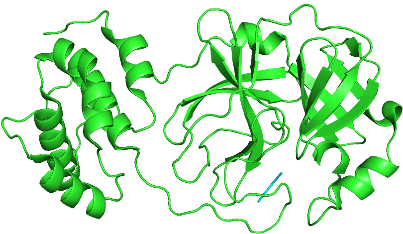</td>
<td>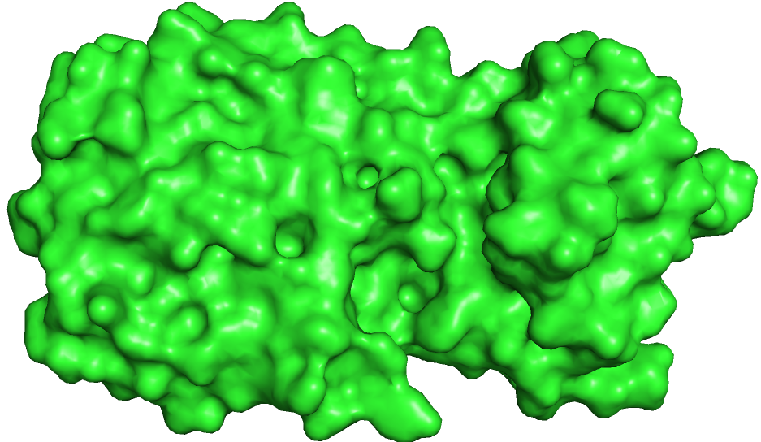</td>
</tr></table>
</center>

> Refers to: [The crystal structure of COVID-19 main protease in complex with an inhibitor N3.](https://www.rcsb.org/structure/6lu7)


### 2.2 6vsb

2.2.1 Primary structure  
[6vsb.fasta](./fasta/pro/6vsb.fasta.txt)  
This protein have 3 chains: [A, B, C].  
Chian_[A, B, C]: 1288 residues.
```
>6VSB:A|PDBID|CHAIN|SEQUENCE
MFVFLVLLPLVSSQCVNLTTRTQLPPAYTNSFTRGVYYPDKVFRSSVLHSTQDLFLPFFSNVTWFHAIHVSGTNGTKRFDNPVLPFNDGVYFASTEKSNIIRGWIFGTTLDSKTQSLLIVNNATNVVIKVCEFQFCNDPFLGVYYHKNNKSWMESEFRVY
SSANNCTFEYVSQPFLMDLEGKQGNFKNLREFVFKNIDGYFKIYSKHTPINLVRDLPQGFSALEPLVDLPIGINITRFQTLLALHRSYLTPGDSSSGWTAGAAAYYVGYLQPRTFLLKYNENGTITDAVDCALDPLSETKCTLKSFTVEKGIYQTSNFRV
QPTESIVRFPNITNLCPFGEVFNATRFASVYAWNRKRISNCVADYSVLYNSASFSTFKCYGVSPTKLNDLCFTNVYADSFVIRGDEVRQIAPGQTGKIADYNYKLPDDFTGCVIAWNSNNLDSKVGGNYNYLYRLFRKSNLKPFERDISTEIYQAGSTPC
NGVEGFNCYFPLQSYGFQPTNGVGYQPYRVVVLSFELLHAPATVCGPKKSTNLVKNKCVNFNFNGLTGTGVLTESNKKFLPFQQFGRDIADTTDAVRDPQTLEILDITPCSFGGVSVITPGTNTSNQVAVLYQDVNCTEVPVAIHADQLTPTWRVYSTGS
NVFQTRAGCLIGAEHVNNSYECDIPIGAGICASYQTQTNSPGSASSVASQSIIAYTMSLGAENSVAYSNNSIAIPTNFTISVTTEILPVSMTKTSVDCTMYICGDSTECSNLLLQYGSFCTQLNRALTGIAVEQDKNTQEVFAQVKQIYKTPPIKDFGGF
NFSQILPDPSKPSKRSFIEDLLFNKVTLADAGFIKQYGDCLGDIAARDLICAQKFNGLTVLPPLLTDEMIAQYTSALLAGTITSGWTFGAGAALQIPFAMQMAYRFNGIGVTQNVLYENQKLIANQFNSAIGKIQDSLSSTASALGKLQDVVNQNAQALN
TLVKQLSSNFGAISSVLNDILSRLDPPEAEVQIDRLITGRLQSLQTYVTQQLIRAAEIRASANLAATKMSECVLGQSKRVDFCGKGYHLMSFPQSAPHGVVFLHVTYVPAQEKNFTTAPAICHDGKAHFPREGVFVSNGTHWFVTQRNFYEPQIITTDNT
FVSGNCDVVIGIVNNTVYDPLQPELDSFKEELDKYFKNHTSPDVDLGDISGINASVVNIQKEIDRLNEVAKNLNESLIDLQELGKYEQGSGYIPEAPRDGQAYVRKDGEWVLLSTFLGRSLEVLFQGPGHHHHHHHHSAWSHPQFEKGGGSGGGGSGGSA
WSHPQFEK
```

2.2.2 Secondary structure  
* Secondary structures assigned by DSSP (Chain_A):  
16% helical (22 helices; 218 residues), 21% beta sheet (68 strands; 282 residues).
> Refers to: [rcsb online](https://www.rcsb.org/pdb/explore/remediatedSequence.do?structureId=6VSB).

2.2.3 Tertiary structure  
[6vsb.pdb](./pdb/6vsb.pdb.txt)
<!--  -->
<center>
<table><tr>
<td>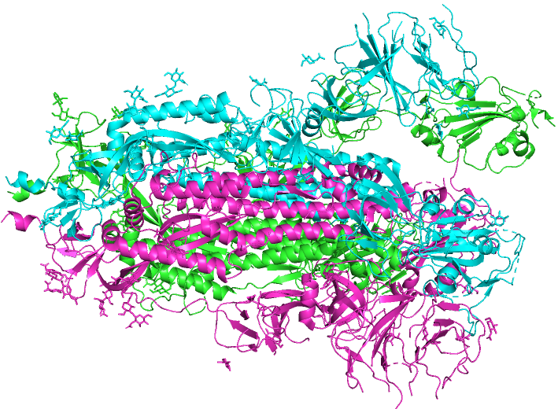</td>
<td>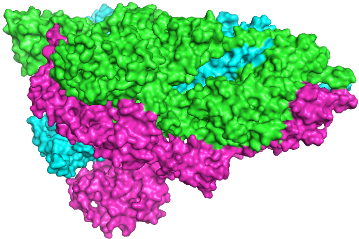</td>
</tr></table>
</center>

> Refers to: [Prefusion 2019-nCoV spike glycoprotein with a single receptor-binding domain up](https://www.rcsb.org/structure/6vsb)


### 2.3 6lxt

2.3.1 Primary structure  
[6lxt.fasta](./fasta/pro/6lxt.fasta.txt)  
This protein have 6 chains: [A, B, C, D, E, F].  
Chian_[A, B, C, D, E, F]: 132 residues.
```
>6LXT:A|PDBID|CHAIN|SEQUENCE
GVTQNVLYENQKLIANQFNSAIGKIQDSLSSTASALGKLQDVVNQNAQALNTLVKQLSSNFGAISSVLNDILSRLDKVESGGRGGPDVDLGDISGINASVVNIQKEIDRLNEVAKNLNESLIDLQELGKYGG
```

2.3.2 Secondary structure  
* Secondary structures assigned by DSSP (Chain_A):  
68% helical (3 helices; 91 residues).
> Refers to: [rcsb online](https://www.rcsb.org/pdb/explore/remediatedSequence.do?structureId=6LXT).

2.3.3 Tertiary structure  
[6lxt.pdb](./pdb/6lxt.pdb.txt)
<!--  -->
<center>
<table><tr>
<td>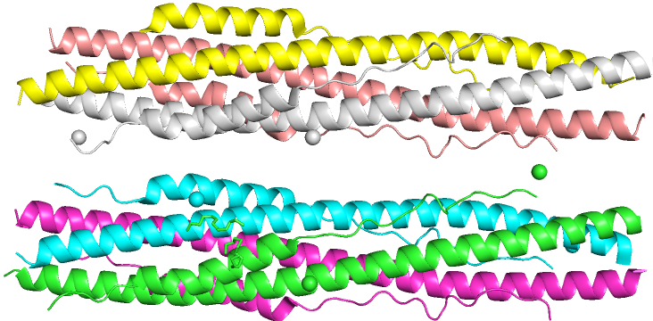</td>
<td>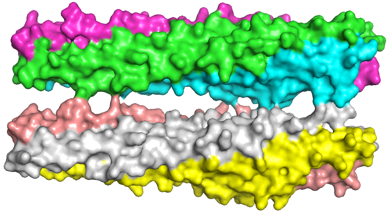</td>
</tr></table>
</center>

> Refers to: [Structure of post fusion core of 2019-nCoV S2 subunit.](https://www.rcsb.org/structure/6lxt)


### 2.4 6lvn

2.4.1 Primary structure  
[6lvn.fasta](./fasta/pro/6lvn.fasta.txt)  
This protein have 4 chains: [A, B, C, D].  
Chian_[A, B, C, D]: 36 residues.
```
>6LVN:A|PDBID|CHAIN|SEQUENCE
DISGINASVVNIQKEIDRLNEVAKNLNESLIDLQEL
```

2.4.2 Secondary structure  

* Secondary structures assigned by DSSP (Chain_A):  
88% helical (1 helices; 32 residues).
> Refers to: [rcsb online](https://www.rcsb.org/pdb/explore/remediatedSequence.do?structureId=6LVN).

2.4.3 Tertiary structure  
[6lvn.pdb](./pdb/6lvn.pdb.txt)
<!--  -->
<center>
<table><tr>
<td>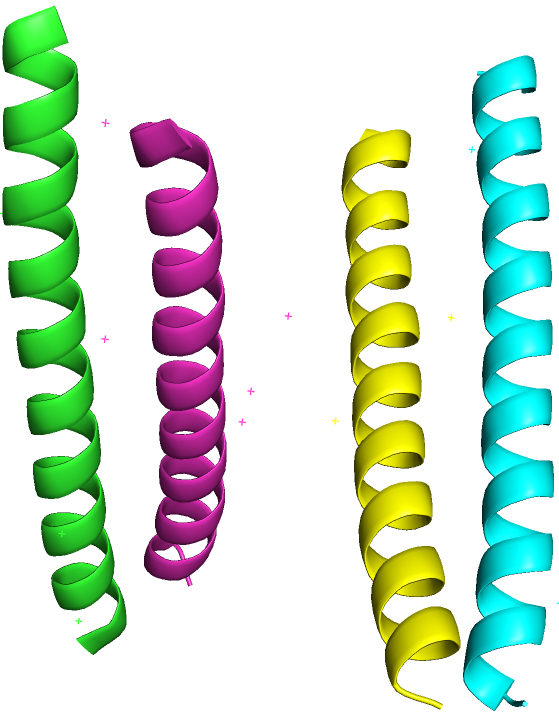</td>
<td>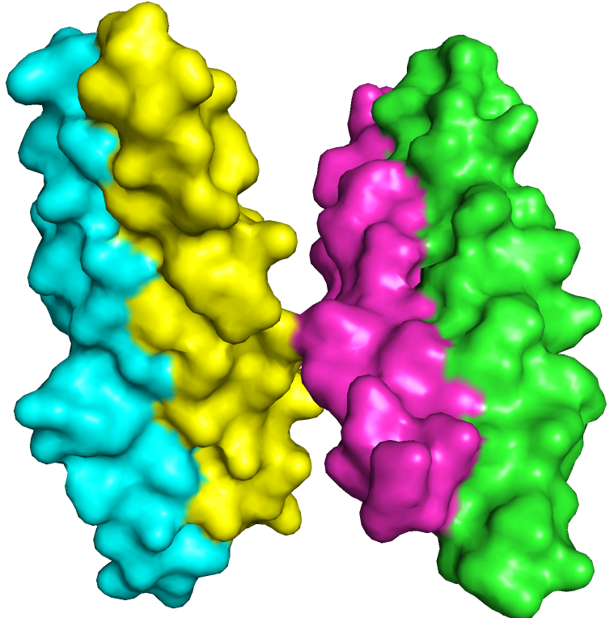</td>
</tr></table>
</center>

> Refers to: [Structure of the 2019-nCoV HR2 Domain.](https://www.rcsb.org/structure/6lvn)


### 2.5 6vw1

2.5.1 Primary structure  
[6vw1.fasta](./fasta/pro/6vw1.fasta.txt)  
This protein have 4 chains: [A, B, E, F].  
Chian_[A, B]: 597 residues, Chian_[E, F]: 217 residues.
```
>6VW1:A|PDBID|CHAIN|SEQUENCE
STIEEQAKTFLDKFNHEAEDLFYQSSLASWNYNTNITEENVQNMNNAGDKWSAFLKEQSTLAQMYPLQEIQNLTVKLQLQALQQNGSSVLSEDKSKRLNTILNTMSTIYSTGKVCNPDNPQECLLLEPGLNEIMANSLDYNERLWAWESWRSEVGKQLRP
LYEEYVVLKNEMARANHYEDYGDYWRGDYEVNGVDGYDYSRGQLIEDVEHTFEEIKPLYEHLHAYVRAKLMNAYPSYISPIGCLPAHLLGDMWGRFWTNLYSLTVPFGQKPNIDVTDAMVDQAWDAQRIFKEAEKFFVSVGLPNMTQGFWENSMLTDPGN
VQKAVCHPTAWDLGKGDFRILMCTKVTMDDFLTAHHEMGHIQYDMAYAAQPFLLRNGANEGFHEAVGEIMSLSAATPKHLKSIGLLSPDFQEDNETEINFLLKQALTIVGTLPFTYMLEKWRWMVFKGEIPKDQWMKKWWEMKREIVGVVEPVPHDETYC
DPASLFHVSNDYSFIRYYTRTLYQFQFQEALCQAAKHEGPLHKCDISNSTEAGQKLFNMLRLGKSEPWTLALENVVGAKNMNVRPLLNYFEPLFTWLKDQNKNSFVGWSTDWSPYAD
>6VW1:E|PDBID|CHAIN|SEQUENCE
RVVPSGDVVRFPNITNLCPFGEVFNATKFPSVYAWERKKISNCVADYSVLYNSTFFSTFKCYGVSATKLNDLCFSNVYADSFVVKGDDVRQIAPGQTGVIADYNYKLPDDFMGCVLAWNTRNIDATSTGNYNYKYRLFRKSNLKPFERDISTEIYQAGST
PCNGVEGFNCYFPLQSYGFQPTNGVGYQPYRVVVLSFELLNAPATVCGPKLSTDLIK
```

2.5.2 Secondary structure  

* Secondary structures assigned by DSSP (Chain_A):  
62% helical (32 helices; 371 residues), 4% beta sheet (11 strands; 26 residues).
* Secondary structures assigned by DSSP (Chain_A):
62% helical (32 helices; 373 residues), 4% beta sheet (11 strands; 26 residues)
> Refers to: [rcsb online](https://www.rcsb.org/pdb/explore/remediatedSequence.do?structureId=6VW1).

2.5.3 Tertiary structure  
[6vw1.pdb](./pdb/6vw1.pdb.txt)
<!--  -->
<center>
<table><tr>
<td>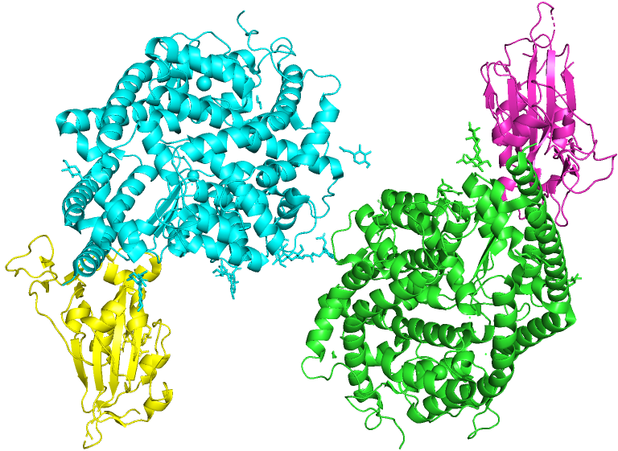</td>
<td>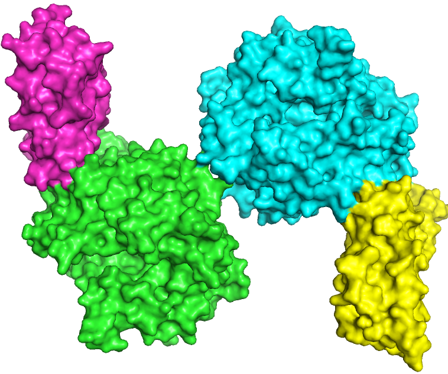</td>
</tr></table>
</center>

> Refers to: [Structure of 2019-nCoV chimeric receptor-binding domain complexed with its receptor human ACE2.](https://www.rcsb.org/structure/6vw1)


### 2.6 6vww

2.6.1 Primary structure  
[6vww.fasta](./fasta/pro/6vww.fasta.txt)  
This protein have 2 chains: [A, B].  
Chian_[A, B]: 371 residues.
```
>6VWW:A|PDBID|CHAIN|SEQUENCE
MHHHHHHSSGVDLGTENLYFQSNAMSLENVAFNVVNKGHFDGQQGEVPVSIINNTVYTKVDGVDVELFENKTTLPVNVAFELWAKRNIKPVPEVKILNNLGVDIAANTVIWDYKRDAPAHISTIGVCSMTDIAKKPTETICAPLTVFFDGRVDGQVDLFR
NARNGVLITEGSVKGLQPSVGPKQASLNGVTLIGEAVKTQFNYYKKVDGVVQQLPETYFTQSRNLQEFKPRSQMEIDFLELAMDEFIERYKLEGYAFEHIVYGDFSHSQLGGLHLLIGLAKRFKESPFELEDFIPMDSTVKNYFITDAQTGSSKCVCSVI
DLLLDDFVEIIKSQDLSVVSKVVKVTIDYTEISFMLWCKDGHVETFYPKLQ
```

2.6.2 Secondary structure  

* Secondary structures assigned by DSSP (Chain_A):  
19% helical (10 helices; 72 residues), 28% beta sheet (30 strands; 106 residues).
> Refers to: [rcsb online](https://www.rcsb.org/pdb/explore/remediatedSequence.do?structureId=6VWW).

2.6.3 Tertiary structure  
[6vww.pdb](./pdb/6vww.pdb.txt)
<!--  -->
<center>
<table><tr>
<td>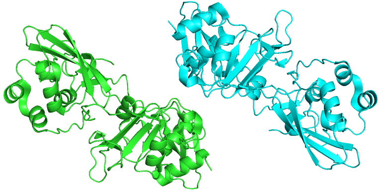</td>
<td>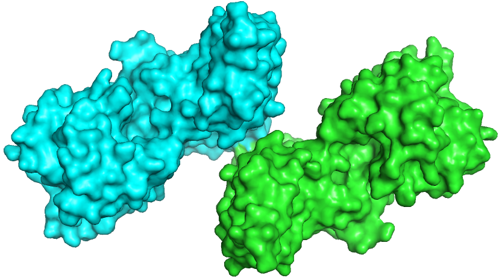</td>
</tr></table>
</center>

> Refers to: [Crystal Structure of NSP15 Endoribonuclease from SARS CoV-2.](https://www.rcsb.org/structure/6vww)


### 2.7 6y2e

2.7.1 Primary structure  
[6y2e.fasta](./fasta/pro/6y2e.fasta.txt)  
This protein have 1 chains: A.  
Chian_A: 306 residues.
```
>6Y2E:AAA|PDBID|CHAIN|SEQUENCE
SGFRKMAFPSGKVEGCMVQVTCGTTTLNGLWLDDVVYCPRHVICTSEDMLNPNYEDLLIRKSNHNFLVQAGNVQLRVIGHSMQNCVLKLKVDTANPKTPKYKFVRIQPGQTFSVLACYNGSPSGVYQCAMRPNFTIKGSFLNGSCGSVGFNIDYDCVSFC
YMHHMELPTGVHAGTDLEGNFYGPFVDRQTAQAAGTDTTITVNVLAWLYAAVINGDRWFLNRFTTTLNDFNLVAMKYNYEPLTQDHVDILGPLSAQTGIAVLDMCASLKELLQNGMNGRTILGSALLEDEFTPFDVVRQCSGVTFQ
```

2.7.2 Secondary structure  

* Secondary structures assigned by DSSP (Chain_A):  
null


2.7.3 Tertiary structure  
[6y2e.cif](./pdb/6y2e.cif.txt)
<!--  -->
<center>
<table><tr>
<td>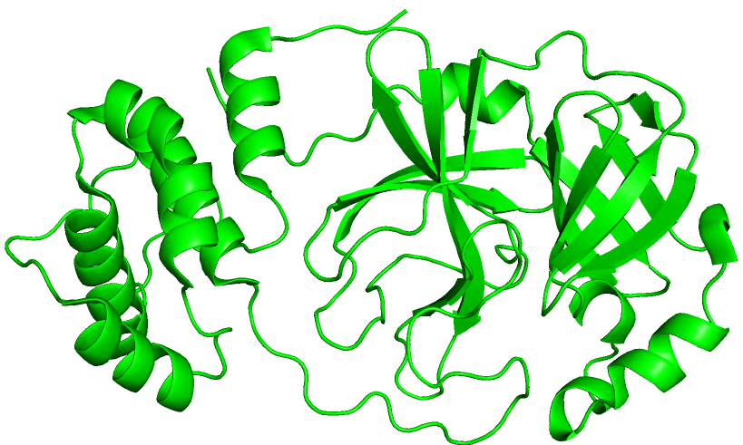</td>
<td>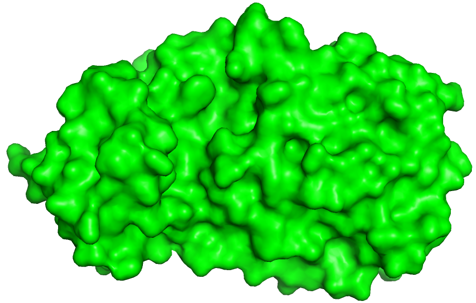</td>
</tr></table>
</center>

> Refers to: [Crystal structure of the free enzyme of the SARS-CoV-2 (2019-nCoV) main protease.](https://www.rcsb.org/structure/6y2e)


### 2.8 6y2f

2.8.1 Primary structure  
[6y2f.fasta](./fasta/pro/6y2f.fasta.txt)  
This protein have 1 chains: A.  
Chian_A: 306 residues.
```
>6Y2F:AAA|PDBID|CHAIN|SEQUENCE
SGFRKMAFPSGKVEGCMVQVTCGTTTLNGLWLDDVVYCPRHVICTSEDMLNPNYEDLLIRKSNHNFLVQAGNVQLRVIGHSMQNCVLKLKVDTANPKTPKYKFVRIQPGQTFSVLACYNGSPSGVYQCAMRPNFTIKGSFLNGSCGSVGFNIDYDCVSFC
YMHHMELPTGVHAGTDLEGNFYGPFVDRQTAQAAGTDTTITVNVLAWLYAAVINGDRWFLNRFTTTLNDFNLVAMKYNYEPLTQDHVDILGPLSAQTGIAVLDMCASLKELLQNGMNGRTILGSALLEDEFTPFDVVRQCSGVTFQ
```

2.8.2 Secondary structure  

* Secondary structures assigned by DSSP (Chain_A):  
null
> Refers to: [rcsb online](https://www.rcsb.org/pdb/explore/remediatedSequence.do?structureId=6Y2F).


2.8.3 Tertiary structure  
[6y2f.cif](./pdb/6y2f.cif.txt)
<!--  -->
<center>
<table><tr>
<td>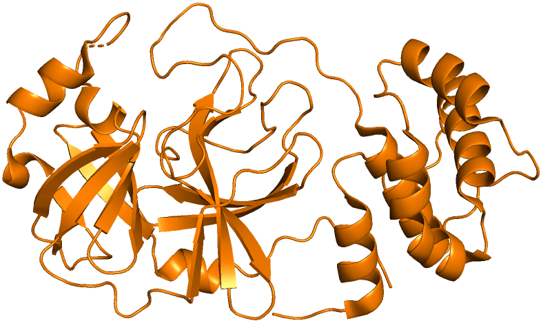</td>
<td>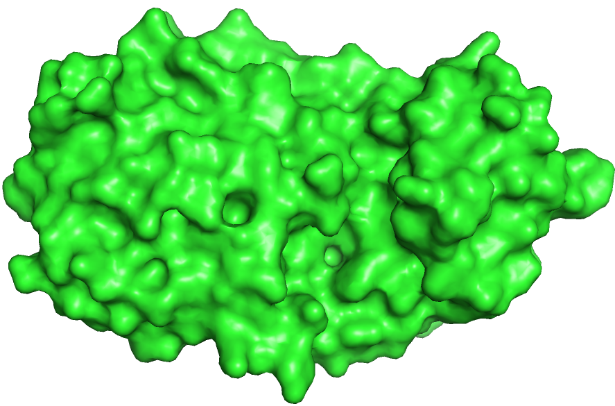</td>
</tr></table>
</center>

> Refers to: [Crystal structure (monoclinic form) of the complex resulting from the reaction between SARS-CoV-2 (2019-nCoV) main protease and tert-butyl.](https://www.rcsb.org/structure/6y2f)


### 2.9 6y2g

2.9.1 Primary structure  
[6y2g.fasta](./fasta/pro/6y2g.fasta.txt)  
This protein have 2 chains: [A, B].  
Chian_[A, B]: 306 residues.
```
>6Y2G:AAA|PDBID|CHAIN|SEQUENCE
SGFRKMAFPSGKVEGCMVQVTCGTTTLNGLWLDDVVYCPRHVICTSEDMLNPNYEDLLIRKSNHNFLVQAGNVQLRVIGHSMQNCVLKLKVDTANPKTPKYKFVRIQPGQTFSVLACYNGSPSGVYQCAMRPNFTIKGSFLNGSCGSVGFNIDYDCVSFC
YMHHMELPTGVHAGTDLEGNFYGPFVDRQTAQAAGTDTTITVNVLAWLYAAVINGDRWFLNRFTTTLNDFNLVAMKYNYEPLTQDHVDILGPLSAQTGIAVLDMCASLKELLQNGMNGRTILGSALLEDEFTPFDVVRQCSGVTFQ
```

2.9.2 Secondary structure  

* Secondary structures assigned by DSSP (Chain_A):  
null


2.9.3 Tertiary structure  
[6y2g.cif](./pdb/6y2g.cif.txt)
<!--  -->
<center>
<table><tr>
<td>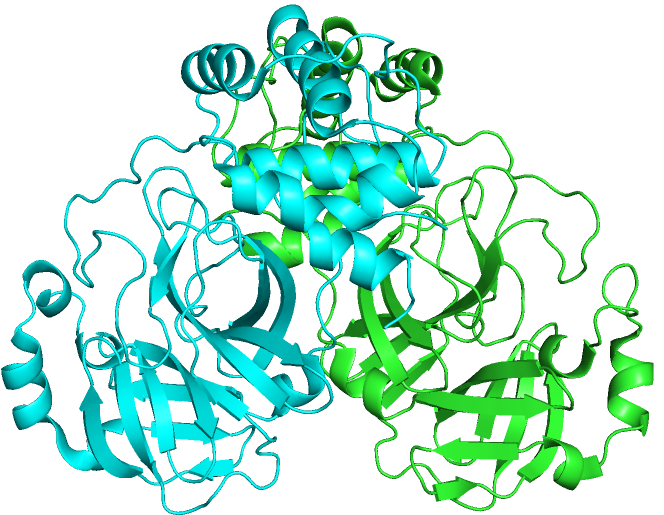</td>
<td>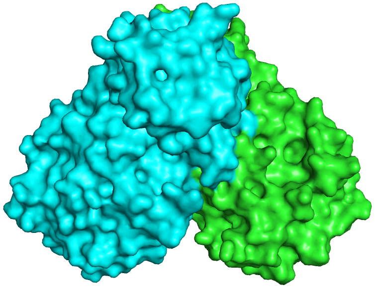</td>
</tr></table>
</center>

> Refers to: [Crystal structure (orthorhombic form) of the complex resulting from the reaction between SARS-CoV-2 (2019-nCoV) main protease and tert-butyl.](https://www.rcsb.org/structure/6y2g)

### Structure Alignment
pdb_6lu7, pdb_6y2f, pdb_6y2e are similar to Chain_A (or B) of pdb_6y2g. Their pairwised TMscore are shown below:  
<center>
<table border="1">
  <tr>
    <th>6lu7_6y2g</th>
    <th>6y2e_6y2g</th>
    <th>6y2f_6y2g</th>
  </tr>
  <tr>
    <td>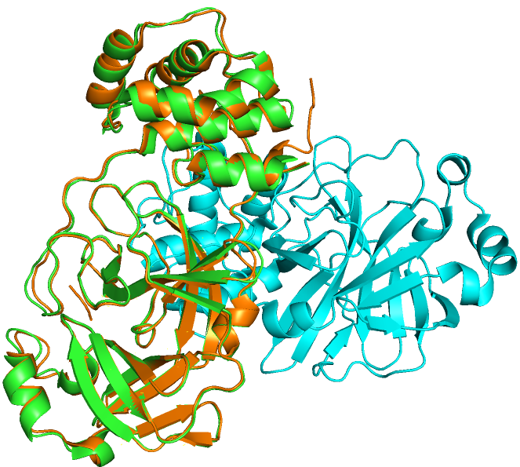<center>RMSD = 0.560 (270 to 270 atoms)</center></td>
    <td>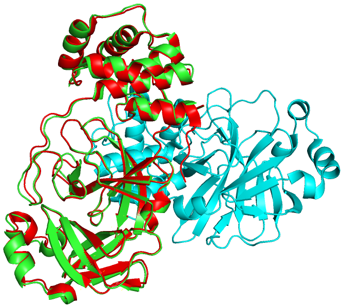<center>RMSD =  0.433 (247 to 247 atoms)</center></td>
    <td>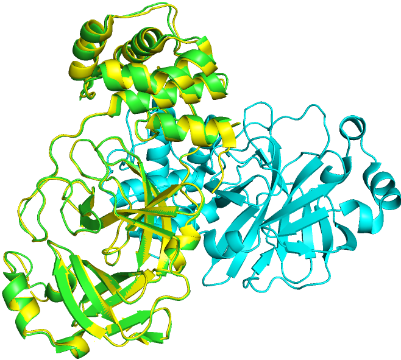<center>RMSD = 0.376 (260 to 260 atoms)</center></td>
  </tr>
</table>
</center>
</br>
<center>
<table border="1">
  <tr>
    <th>6lu7_6y2f</th>
    <th>6lu7_6y2e</th>
    <th>6y2e_6y2f</th>
  </tr>
  <tr>
    <td>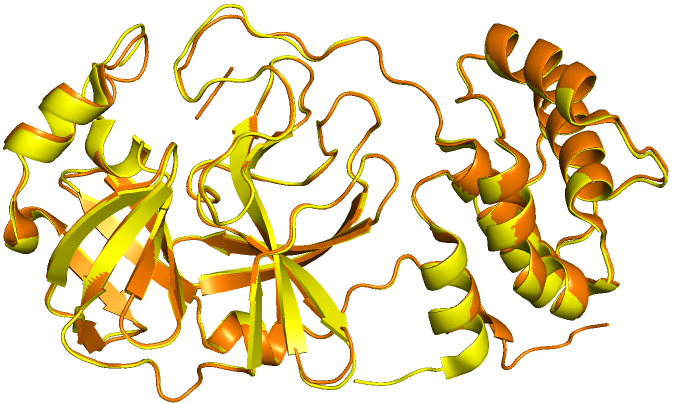<center>RMSD = 0.265 (257 to 257 atoms)</center></td>
    <td>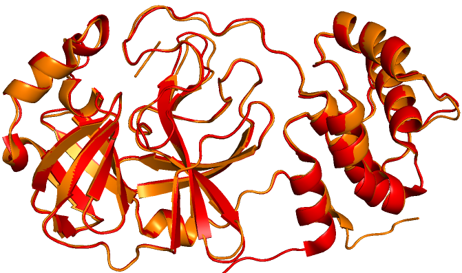<center>RMSD =  0.352 (271 to 271 atoms)</center></td>
    <td>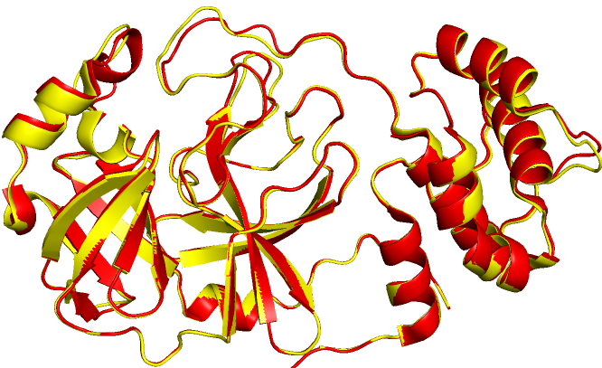<center>RMSD = 0.256 (250 to 250 atoms)</center></td>
  </tr>
</table>
</center>


## Reference
+ News (02/04): [New Coronavirus Protease Structure Available](http://www.rcsb.org/news?year=2020&article=5e39e03fa5007a04a313edc3)
+ News (02/06): [COVID-19 Coronavirus Resources](http://www.rcsb.org/news?year=2020&article=5e3c4bcba5007a04a313edcc)
+ News (02/15): [Molecular Landscapes: Coronavirus](http://www.rcsb.org/news?year=2020&article=5e3c3b96a5007a04a313edcb)