# <center>mCNN</center>

**<center>宋瑞阳</center>**
**<center>2020/03/30</center>**
</br>
***
## 1. 数据  
S2648：2648个突变
## 2. 特征
每个原子124维特征
```
        self.keys = ['dist', 'x', 'y', 'z', 'occupancy', 'b_factor',

                     's_H', 's_G', 's_I', 's_E', 's_B', 's_T', 's_C',
                     's_Helix', 's_Strand', 's_Coil',

                     'sa', 'rsa', 'asa', 'phi', 'psi',

                     'ph', 'temperature',

                     'C', 'O', 'N', 'Other',

                     'C_mass', 'O_mass', 'N_mass', 'S_mass',

                     'hydrophobic', 'positive', 'negative', 'neutral', 'acceptor', 'donor', 'aromatic', 'sulphur', 
                     'hydrophobic_bak', 'polar',

                     'fa_atr', 'fa_rep', 'fa_sol', 'fa_intra_rep', 'fa_intra_sol_xover4', 'lk_ball_wtd', 'fa_elec', 'pro_close', 'hbond_sr_bb',
                     'hbond_lr_bb', 'hbond_bb_sc', 'hbond_sc', 'dslf_fa13', 'atom_pair_constraint', 'angle_constraint', 'dihedral_constraint',
                     'omega', 'fa_dun', 'p_aa_pp', 'yhh_planarity', 'ref', 'rama_prepro', 'total',

                     'WT_A', 'WT_R', 'WT_N', 'WT_D', 'WT_C', 'WT_Q', 'WT_E', 'WT_G', 'WT_H', 'WT_I', 'WT_L', 'WT_K', 'WT_M',
                     'WT_F', 'WT_P', 'WT_S', 'WT_T', 'WT_W', 'WT_Y', 'WT_V', 'WT_-',
                     'MT_A', 'MT_R', 'MT_N', 'MT_D', 'MT_C', 'MT_Q', 'MT_E', 'MT_G', 'MT_H', 'MT_I', 'MT_L', 'MT_K', 'MT_M',
                     'MT_F', 'MT_P', 'MT_S', 'MT_T', 'MT_W', 'MT_Y', 'MT_V', 'MT_-',

                     'dC', 'dH', 'dO', 'dN', 'dOther',

                     'dhydrophobic', 'dpositive', 'dnegative', 'dneutral', 'dacceptor', 'ddonor', 'daromatic', 'dsulphur',

                     'dhydrophobic_bak', 'dpolar',

                     'dEntropy', 'entWT', 'entMT']
```
## 3.实验
### 3.1 在原始模型基础上增加残差连接，使用**hyperas**搜索超参数空间
* S2648 (neighbor120)

|acc |rec+ |rec- |pre+ |pre- |mcc |rho |rmse|
|:----:|:----:|:----:|:----:|:----:|:----:|:----:|:----:|
|0.79 |0.41 |0.90 |0.54 |0.84 |0.34 |0.61 |1.38|
|0.79 |**0.55** |0.86 |0.52 |0.87 |**0.40** |**0.65** |1.40|
||
> 第1行为之前CNN结果（特征无 Rosetta energy和多序列比对）  
第2行为经过超参数搜索得到的网结构的预测结果（基于上述124维特征）

#### 结论、问题
1. 在分类评估指标中 acc 和 mcc 相对更重要，现模型在这两种指标上表现更优；在回归指标中, 相关系数 rho 结果更优, rmse略差
2. 在**回归器**训练过程中有这样一种现象：rho 和 rmse总是有些矛盾，即 rmse 不会随着相关系数 rho 的上升而下降，相反 rmse 会随着 rho 上升大概率上升

### 3.2 评估rosetta预测的突变结构是否可用于数据增强
由于数据本身的不平衡性，过拟合难以避免，数据分布如下：
<center>
<table><tr>
<td>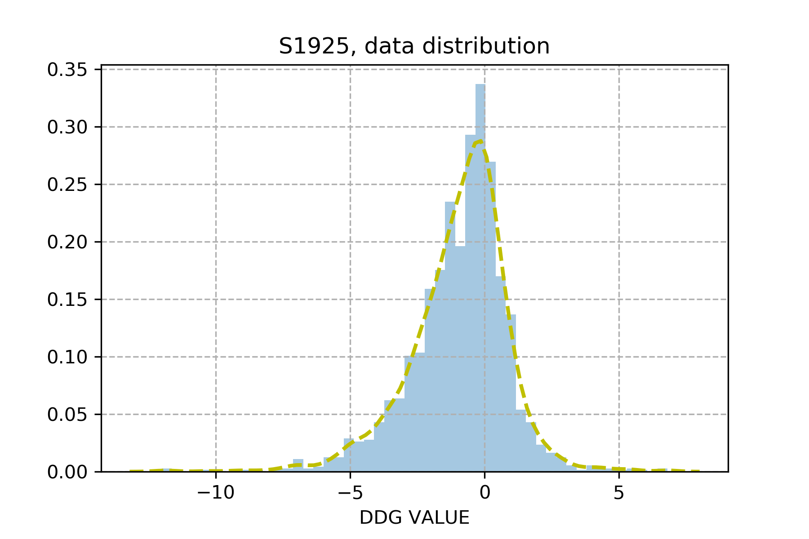</td>
<td>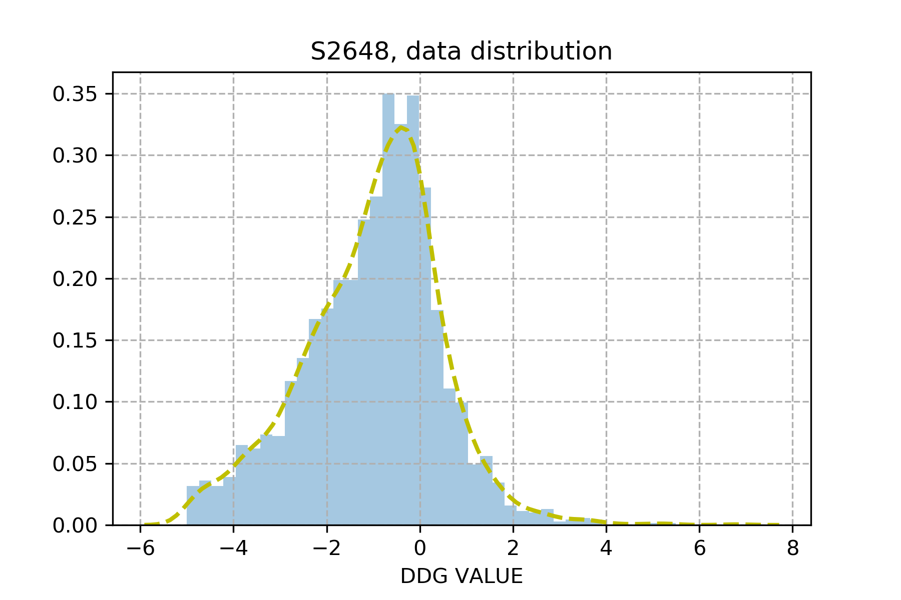</td>
</tr></table>
</center>

设计三组平行实验验证**数据增强**是否可行：
1. 只使用原始的 wild structure
2. 只是用rosetta的 mutant structure
3. 使用 wild structure 和 mutant structure

结果表明 wild > wild + mutant > mutant

## 4. 观察Rosetta和TrRosetta建立的突变结构

|key	|PDB	|WILD_TYPE	|CHAIN	|POSITION	|MUTANT	|PH |TEMPERATURE|DDG	|RSA|
|:----:|:----:|:----:|:----:|:----:|:----:|:----:|:----:|:----:|:----:|
|853	|1RTB	|Y	|A	|97	  |A	|5	  |63.3	  |-12	  |2.95|
|855	|1RTB	|Y	|A	|97	  |G	|5	  |63.3	  |-11.7	|2.95|
|1834	|3SSI	|V	|A	|13	  |G	|7	  |82.21	|-10.3	|36.56|
|263	|1BNI	|Y	|A	|103	|F	|6.3	|25	    |0	    |28.22|
|68	  |1AJ3 |Q	|A  |86	  |A	|7	  |25	    |0      |63.44|
|1082	|1FVK |H	|A	|32	  |Y	|7	  |30	    |6.8    |43.27|
|**4**	  |**1A23**	|**H**	|**A**	|**32**  |**Y**	|**7**	  |**30**	    |**0.5**	|**31.56**|
|**5**	  |**1A23**	|**H**	|**A**	|**32**	 |**Y**	|**7**	  |**30**	    |**6.8**	|**31.56**|
|**6**	  |**1A23**	|**H**  |**A**	|**32**	 |**Y**	|**7**	  |**30**	    |**6.8**	|**31.56**|
||
1. key 854
<center>
<table border="1">
  <tr>
    <th>Rosetta_ref and Rosetta_mut alignment</th>
    <th>TrRosetta_ref and TrRosetta_mut alignment</th>
    <th>Rosetta_ref and TrRosetta_mut alignment</th>
  </tr>
  <tr>
    <td>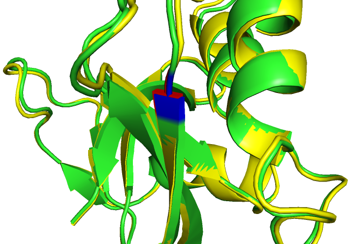<center>RSA=2.59%, DDG=-12</center></td>
    <td>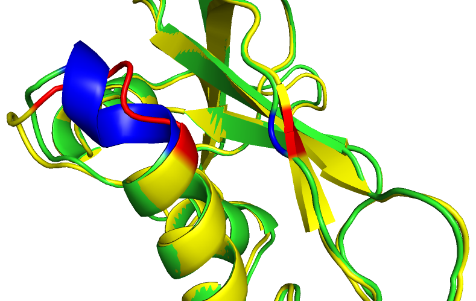<center>RSA=2.59%, DDG=-12<center></td>
    <td>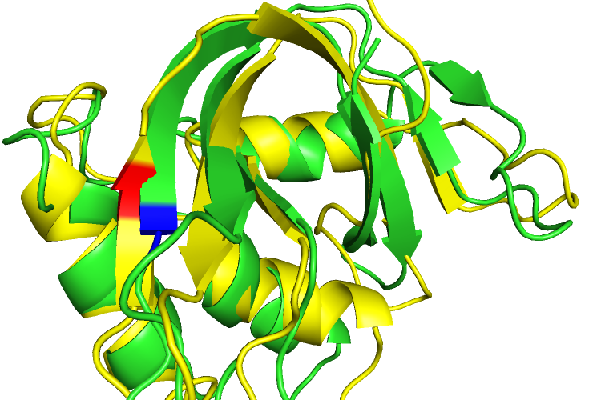<center>RSA=2.59%, DDG=-12</center></td>
  </tr>
</table>
</center>

2. key 855
<center>
<table border="1">
  <tr>
    <th>Rosetta_ref and Rosetta_mut alignment</th>
    <th>TrRosetta_ref and TrRosetta_mut alignment</th>
    <th>Rosetta_ref and TrRosetta_mut alignment</th>
  </tr>
  <tr>
    <td>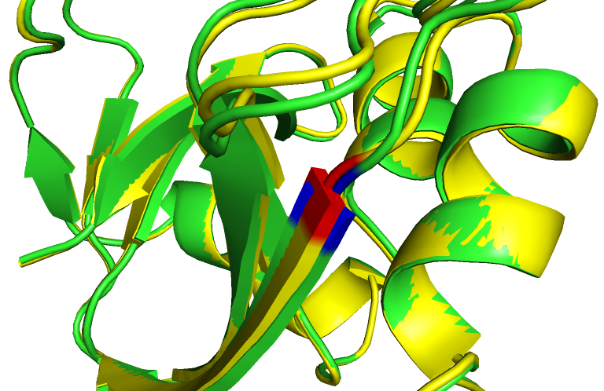<center>RSA=2.95%, DDG=-11.7</center></td>
    <td>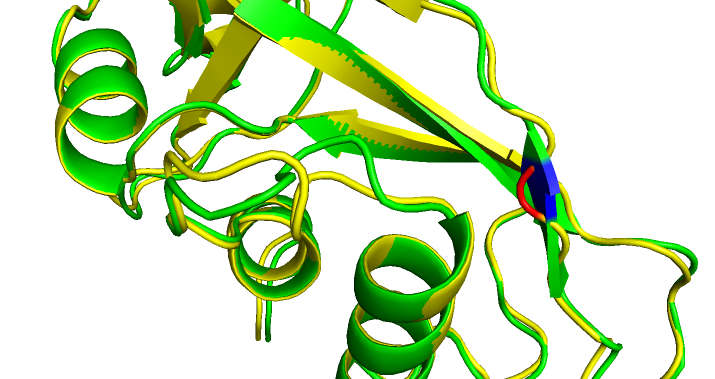<center>RSA=2.95%, DDG=-11.7<center></td>
    <td>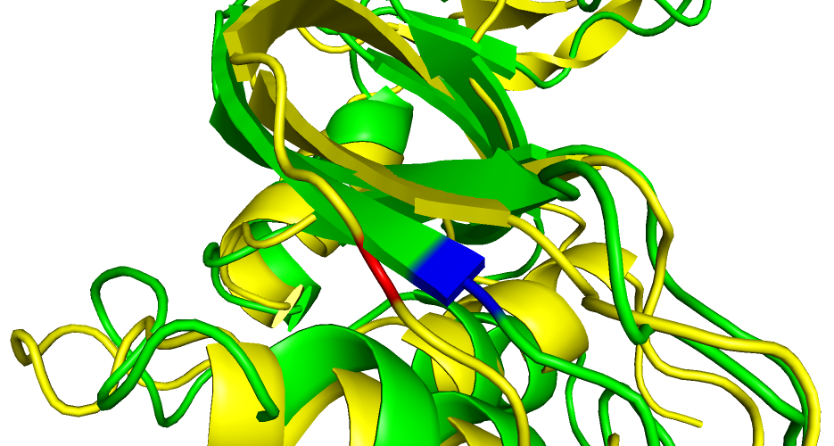<center>RSA=2.95%, DDG=-11.7</center></td>
  </tr>
</table>
</center>

3. key 1834
<center>
<table border="1">
  <tr>
    <th>Rosetta_ref and Rosetta_mut alignment</th>
    <th>TrRosetta_ref and TrRosetta_mut alignment</th>
    <th>Rosetta_ref and TrRosetta_mut alignment</th>
  </tr>
  <tr>
    <td>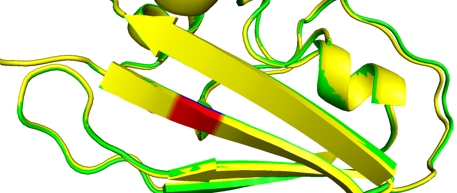<center>RSA=28.22%, DDG=-10.3</center></td>
    <td>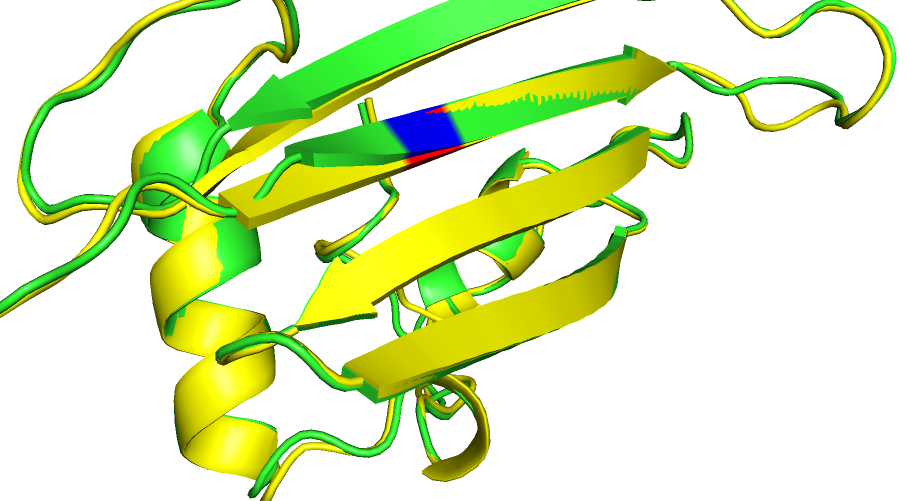<center>RSA=28.22%, DDG=-10.3, 不吻合但RSA偏大<center></td>
    <td>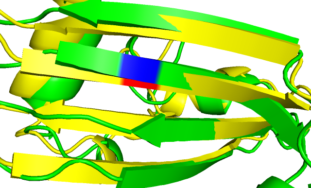<center>RSA=28.22%, DDG=-10.3</center></td>
  </tr>
</table>
</center>

4. key 263
<center>
<table border="1">
  <tr>
    <th>Rosetta_ref and Rosetta_mut alignment</th>
    <th>TrRosetta_ref and TrRosetta_mut alignment</th>
    <th>Rosetta_ref and TrRosetta_mut alignment</th>
  </tr>
  <tr>
    <td>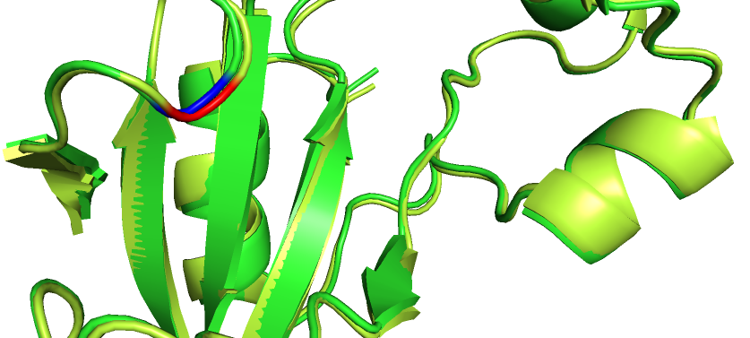<center>RSA=63.44%, DDG=0</center></td>
    <td>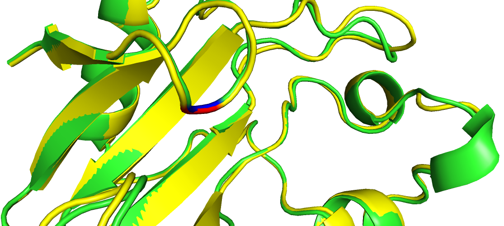<center>RSA=63.44%, DDG=0<center></td>
    <td>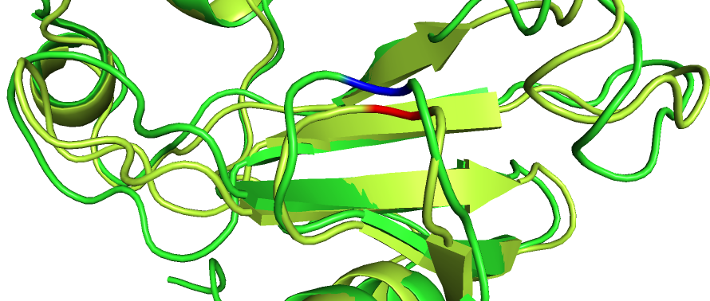<center>RSA=63.44%, DDG=0</center></td>
  </tr>
</table>
</center>

5. key 68
<center>
<table border="1">
  <tr>
    <th>Rosetta_ref and Rosetta_mut alignment</th>
    <th>TrRosetta_ref and TrRosetta_mut alignment</th>
    <th>Rosetta_ref and TrRosetta_mut alignment</th>
  </tr>
  <tr>
    <td>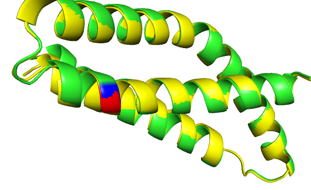<center>RSA=43.27%, DDG=0</center></td>
    <td>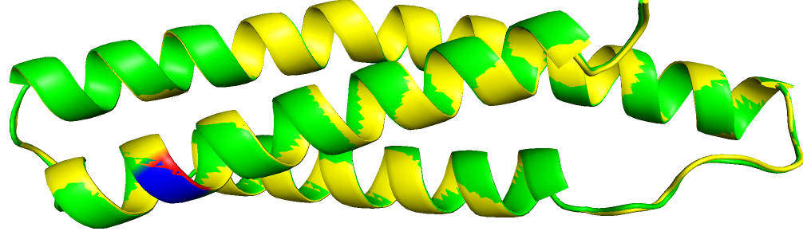<center>RSA=43.27%, DDG=0<center></td>
    <td>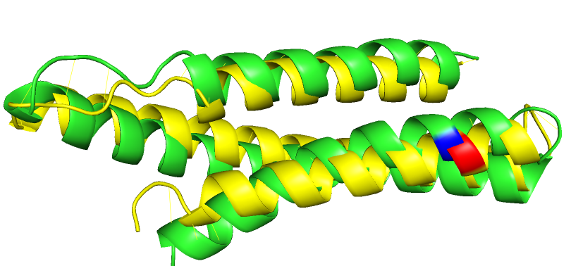<center>RSA=43.27%, DDG=0</center></td>
  </tr>
</table>
</center>

6. key 1082
<center>
<table border="1">
  <tr>
    <th>Rosetta_ref and Rosetta_mut alignment</th>
    <th>TrRosetta_ref and TrRosetta_mut alignment</th>
    <th>Rosetta_ref and TrRosetta_mut alignment</th>
  </tr>
  <tr>
    <td>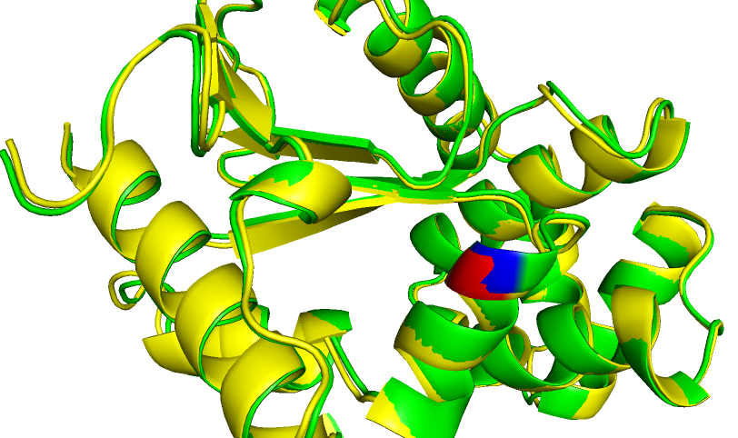<center>RSA=31.56%, DDG=6.8</center></td>
    <td>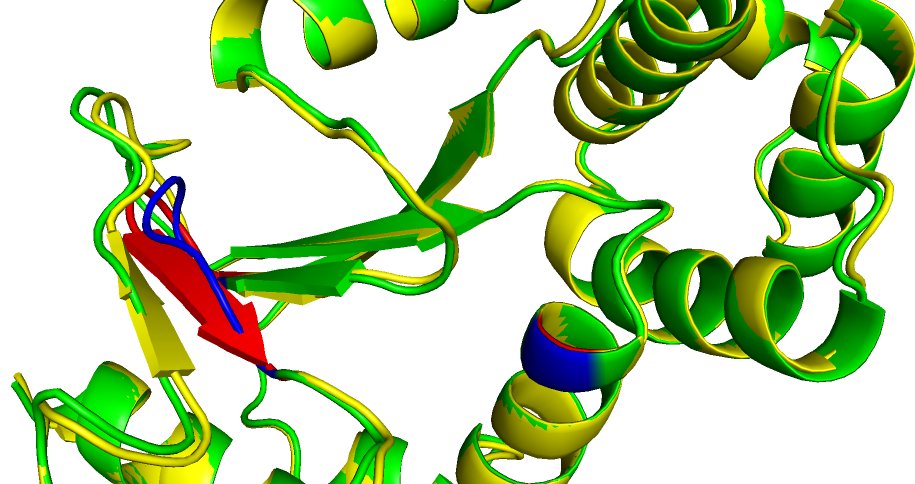<center>RSA=31.56%, DDG=6.8<center></td>
    <td>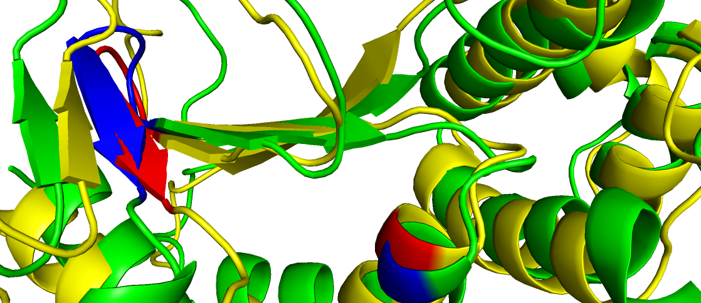<center>RSA=31.56%, DDG=6.8</center></td>
  </tr>
</table>
</center>

7. key 4
<center>
<table border="1">
  <tr>
    <th>Rosetta_ref and Rosetta_mut alignment</th>
    <th>TrRosetta_ref and TrRosetta_mut alignment</th>
    <th>Rosetta_ref and TrRosetta_mut alignment</th>
  </tr>
  <tr>
    <td>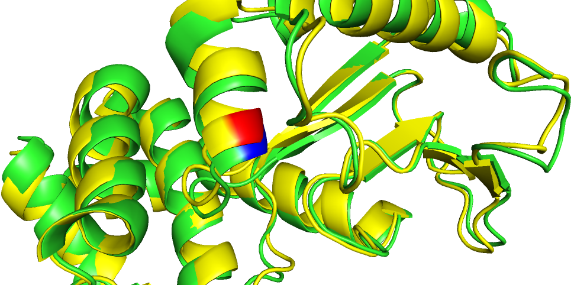<center>RSA=2.59%, DDG=[6.8|0.5]</center></td>
    <td>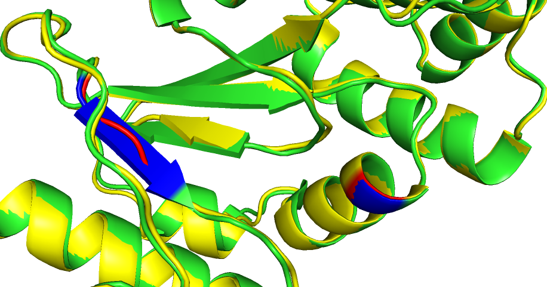<center>RSA=2.59%, DDG=[6.8|0.5]<center></td>
    <td>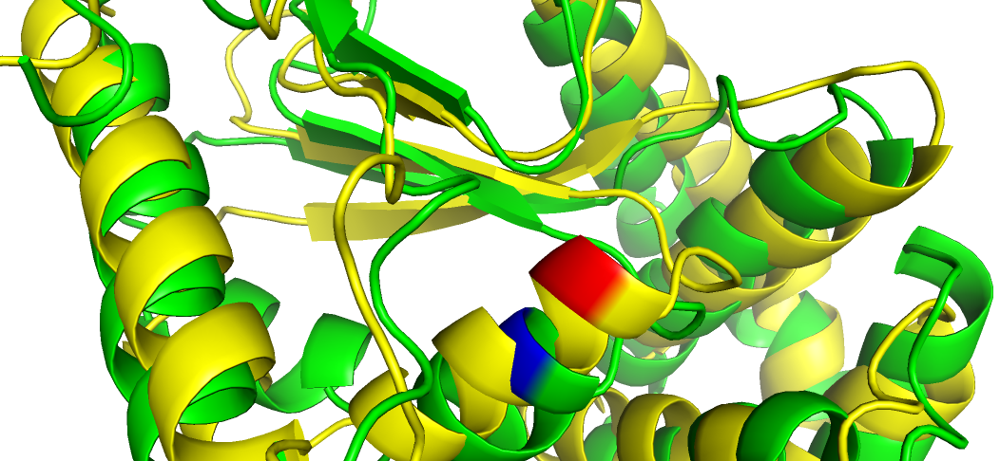<center>RSA=2.59%, DDG=[6.8|0.5], DDG values are in conflict</center></td>
  </tr>
</table>
</center>

### 结论
Rosetta_ref 和 Rosetta_mut 的空间结构几乎一样，会导致上述数据增强引入噪声，反而不利于网络学习
TrRosetta_ref 和 TrRosetta_mut 结构中二级结构的比较与ddg呈现出较大相关性.

## 5. 文献
[DeepDDG2019cao](https://pubs.acs.org/doi/10.1021/acs.jcim.8b00697)通过ProTherm和文献挖掘收集了5720条突变数据，通过和S1925、S2648整合后发现出现1595条完全重复的数据，进一步有2775条重复数据（实验条件作为主键），4369条重复数据（实验条件不作为主键），**即数据中出现大量冲突，这可能暗示了数据本身质量较差**
此外DeepDDG中也考虑了反向突变进行数据增强，利用modeller创建突变之后结构，web server测试时返回了一个错误。

另外测试了CATHER的一个例子key855，结果mut结构和ref几乎一致，如下图

<center>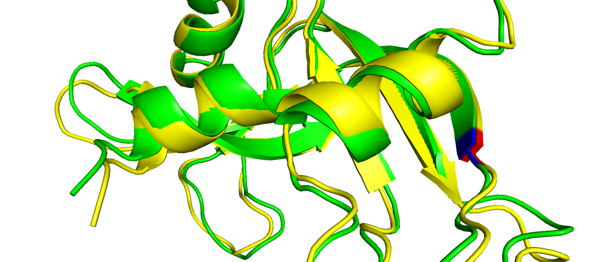<center>RSA=2.95%, DDG=-11.7</center></center>

## 5. appendix (网络结构)
利用[hyperas](https://github.com/maxpumperla/hyperas)搜索超参数空间得到,以classifier为例，超参数空间为：

```
# setHyperParams------------------------------------------------------------------------------------------------
        batch_size = 64
        epochs = {{choice([50,100,150,200,250])}}

        lr = {{loguniform(np.log(1e-4), np.log(1e-2))}}

        optimizer = {{choice(['adam','sgd','rmsprop'])}}

        activator = {{choice(['elu', 'relu', 'tanh'])}}

        basic_conv2D_layers     = {{choice([1, 2])}}
        basic_conv2D_filter_num = {{choice([16, 32])}}

        loop_dilation2D_layers = {{choice([2, 4, 6])}}
        loop_dilation2D_filter_num = {{choice([16, 32, 64])}}#used in the loop
        loop_dilation2D_dropout_rate = {{uniform(0.001, 0.35)}}
        dilation_lower = 2
        dilation_upper = 16

        reduce_layers = 3  # conv 3 times: 120 => 60 => 30 => 15
        reduce_conv2D_filter_num = {{choice([8, 16, 32])}}#used for reduce dimention
        reduce_conv2D_dropout_rate = {{uniform(0.001, 0.25)}}
        residual_stride = 2

        dense1_num = {{choice([64, 128, 256])}}
        dense2_num = {{choice([32, 64])}}

        drop_num = {{uniform(0.0001, 0.3)}}

        kernel_size=(3,3)
        pool_size=(2,2)
        initializer='random_uniform'
        padding_style='same'
        loss_type='binary_crossentropy'
        metrics = ('accuracy',)


        my_callbacks = [
            callbacks.ReduceLROnPlateau(
                monitor='val_loss',
                factor=0.8,
                patience=10,
                )
            ]

        if lr > 0:
            if optimizer == 'adam':
                chosed_optimizer = optimizers.Adam(lr=lr)
            elif optimizer == 'sgd':
                chosed_optimizer = optimizers.SGD(lr=lr)
            elif optimizer == 'rmsprop':
                chosed_optimizer = optimizers.RMSprop(lr=lr)
```


> 分类器


> 回归器
