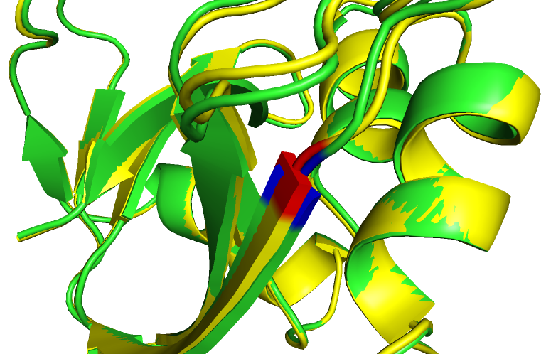
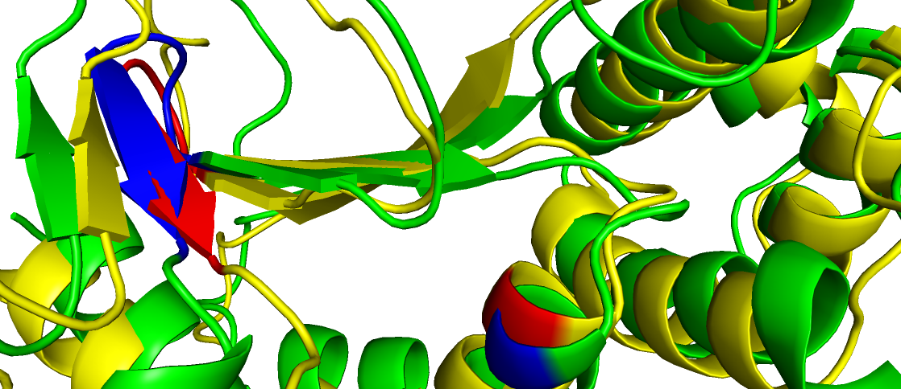

# <center>mCNN</center>

**<center>sry</center>**
**<center>2020/04/06</center>**
</br>
***
## meeting links

[<center>meeting 2020-03-30</center>](./20200330.html)


***
## 1. 数据  
S2648  
deepddg
## 2. 特征
每个原子118维特征
```python
        self.keys = ['dist', 'x', 'y', 'z', 'occupancy', 'b_factor',

                     's_H', 's_G', 's_I', 's_E', 's_B', 's_T', 's_C',
                     's_Helix', 's_Strand', 's_Coil',
                     'sa', 'rsa', 'asa', 'phi', 'psi',

                     'ph', 'temperature',

                     'C', 'O', 'N', 'Other',
                     'C_mass', 'O_mass', 'N_mass', 'S_mass',

                     'hydrophobic', 'positive', 'negative', 'neutral', 'acceptor', 'donor', 'aromatic', 'sulphur', 
                     'hydrophobic_bak', 'polar',

                     'fa_atr', 'fa_rep', 'fa_sol', 'fa_intra_rep', 'fa_intra_sol_xover4', 'lk_ball_wtd', 'fa_elec', 'pro_close',
                     'hbond_bb_sc', 'hbond_sc', 'omega', 'fa_dun', 'p_aa_pp', 'yhh_planarity', 'ref', 'rama_prepro', 'total',

                     'WT_A', 'WT_R', 'WT_N', 'WT_D', 'WT_C', 'WT_Q', 'WT_E', 'WT_G', 'WT_H', 'WT_I', 'WT_L', 'WT_K', 'WT_M',
                     'WT_F', 'WT_P', 'WT_S', 'WT_T', 'WT_W', 'WT_Y', 'WT_V', 'WT_-',
                     'MT_A', 'MT_R', 'MT_N', 'MT_D', 'MT_C', 'MT_Q', 'MT_E', 'MT_G', 'MT_H', 'MT_I', 'MT_L', 'MT_K', 'MT_M',
                     'MT_F', 'MT_P', 'MT_S', 'MT_T', 'MT_W', 'MT_Y', 'MT_V', 'MT_-',

                     'dC', 'dH', 'dO', 'dN', 'dOther',
                     'dhydrophobic', 'dpositive', 'dnegative', 'dneutral', 'dacceptor', 'ddonor', 'daromatic', 'dsulphur',
                     'dhydrophobic_bak', 'dpolar',
                     'dEntropy', 'entWT', 'entMT']
```
## 3.实验
### 3.1 S2648 (neighbor120 blind test)

|acc |rec+ |rec- |pre+ |pre- |mcc |rho |rmse|TUT|
|:----:|:----:|:----:|:----:|:----:|:----:|:----:|:----:|:----:|
|0.79 |0.41 |**0.90** |**0.54** |0.84 |0.34 |0.61 |**1.38**|ieee access|
|0.79 |**0.55** |0.86 |0.52 |**0.87** |**0.40** |**0.65** |1.40|not found log file|
|0.81 |0.54     |0.89 |0.59 |**0.87** |**0.45** |**0.66** |1.79|multi-task ([**log**](./network/multi_task/run_best_model.log),[**py**](./network/multi_task/run_best_model.py))|<!-- /dl/sry/mCNN/src/Network/OptimizeHypers/multi_task/reduceAUTO -->
||

### 3.2 [deepddg](https://pubs.acs.org/doi/10.1021/acs.jcim.8b00697)对比实验
deepddg关于overfitting的对比

* 根据数据集 S2648 blind test 选择的网络结构测试 deepddg (原文提供的10折交叉验证)，结果很差:
```
AVG results ----------
*avg(pearson_coeff): 0.2114956762654386
*avg(std): 2.6856843899847256
*avg(mae): 1.2549294474814188
*avg(acc): 0.6807272724797355
*avg(mcc): 0.052656168440217074
*avg(recall_p): 0.13124999983593752
*avg(recall_n): 0.9061538456891519
*avg(precision_p): 0.33006476781287636
*avg(precision_n): 0.7180112125516553
---------------------------------------
The network structure used by cross_valid.py was Optimizer by S2648 (multi_task, blind test)
The result of S2648 (multi_task, blind test) are

pearson_coeff: 0.660638454382328, std: 1.7878190310496471
acc: 0.8106060604525368, mcc: 0.4451319072587876, recall_p: 0.5416666662152778, recall_n: 0.889705882134876, precision_p: 0.5909090903719009, precision_n: 0.8684210524238226

Optimizer S2648 codes at /dl/sry/mCNN/src/Network/OptimizeHypers/multi_task/reduceAUTO
```
### 3.3 评估TrRosetta预测的突变结构实验 **(top_prob.txt)**
选出500个样本测试TrRosetta, 结果表 --> [**S2648_TR500_with_PROB.csv.txt**](./csv/S2648_TR500_with_PROB.csv.txt)
* DDG 和 WILD_PROB - MUTANT_PROB 的相关性为：pearson_coeff: -0.1043027033756192, p_value: 0.01965822807789628
* TrRosetta测试路径为：/public/home/sry/mCNN/dataset/TR

## 4. 观察Rosetta, TrRosetta和MODELLER建立的突变结构

|key	|PDB	|WILD_TYPE	|CHAIN	|POSITION	|MUTANT	|PH |TEMPERATURE|DDG	|RSA|
|:----:|:----:|:----:|:----:|:----:|:----:|:----:|:----:|:----:|:----:|
|854	|1RTB	|Y	|A	|97	  |A	|5	  |63.3	  |-12	  |2.95|
|855	|1RTB	|Y	|A	|97	  |G	|5	  |63.3	  |-11.7	|2.95|
|1834	|3SSI	|V	|A	|13	  |G	|7	  |82.21	|-10.3	|36.56|
|263	|1BNI	|Y	|A	|103	|F	|6.3	|25	    |0	    |28.22|
|68	  |1AJ3 |Q	|A  |86	  |A	|7	  |25	    |0      |63.44|
|1082	|1FVK |H	|A	|32	  |Y	|7	  |30	    |6.8    |43.27|
|**4**	  |**1A23**	|**H**	|**A**	|**32**  |**Y**	|**7**	  |**30**	    |**0.5**	|**31.56**|
|**5**	  |**1A23**	|**H**	|**A**	|**32**	 |**Y**	|**7**	  |**30**	    |**6.8**	|**31.56**|
|**6**	  |**1A23**	|**H**  |**A**	|**32**	 |**Y**	|**7**	  |**30**	    |**6.8**	|**31.56**|
||
1. key 854
<center>
<table border="1">
  <tr>
    <th>Rosetta_ref and Rosetta_mut alignment</th>
    <th>TrRosetta_wild and TrRosetta_mut alignment</th>
    <th>Rosetta_ref and TrRosetta_mut alignment</th>
    <th>MODELLER_wild and MODELLER_mut alignment</th>
  </tr>
  <tr>
    <td><center>RSA=2.59%, DDG=-12</center></td>
    <td><center>RSA=2.59%, DDG=-12<center></td>
    <td><center>RSA=2.59%, DDG=-12</center></td>
    <td><center>RSA=2.59%, DDG=-12, </br><a href="./pymol/key854-MO_aln.pse"><b>pymol.pse</b></a></center></td>
  </tr>
</table>
</center>

2. key 855
<center>
<table border="1">
  <tr>
    <th>Rosetta_ref and Rosetta_mut alignment</th>
    <th>TrRosetta_wild and TrRosetta_mut alignment</th>
    <th>Rosetta_ref and TrRosetta_mut alignment</th>
    <th>MODELLER_wild and MODELLER_mut alignment</th>
  </tr>
  <tr>
    <td><center>RSA=2.95%, DDG=-11.7</center></td>
    <td><center>RSA=2.95%, DDG=-11.7<center></td>
    <td><center>RSA=2.95%, DDG=-11.7</center></td>
    <td><center>RSA=2.95%, DDG=-11.7, </br><a href="./pymol/key855-MO_aln.pse"><b>pymol.pse</b></a></center></td>
  </tr>
</table>
</center>

3. key 1834
<center>
<table border="1">
  <tr>
    <th>Rosetta_ref and Rosetta_mut alignment</th>
    <th>TrRosetta_wild and TrRosetta_mut alignment</th>
    <th>Rosetta_ref and TrRosetta_mut alignment</th>
    <th>MODELLER_wild and MODELLER_mut alignment</th>
  </tr>
  <tr>
    <td><center>RSA=28.22%, DDG=-10.3</center></td>
    <td><center>RSA=28.22%, DDG=-10.3, 不吻合但RSA偏大<center></td>
    <td><center>RSA=28.22%, DDG=-10.3</center></td>
    <td><center>RSA=28.22%, DDG=-10.3, </br><a href="./pymol/key1834-MO_aln.pse"><b>pymol.pse</b></a></center></td>
  </tr>
</table>
</center>

4. key 263
<center>
<table border="1">
  <tr>
    <th>Rosetta_ref and Rosetta_mut alignment</th>
    <th>TrRosetta_wild and TrRosetta_mut alignment</th>
    <th>Rosetta_ref and TrRosetta_mut alignment</th>
    <th>MODELLER_wild and MODELLER_mut alignment</th>
  </tr>
  <tr>
    <td><center>RSA=63.44%, DDG=0</center></td>
    <td><center>RSA=63.44%, DDG=0<center></td>
    <td><center>RSA=63.44%, DDG=0</center></td>
    <td><center>RSA=63.44%, DDG=0, </br><a href="./pymol/key263-MO_aln.pse"><b>pymol.pse</b></a></center></td>
  </tr>
</table>
</center>

5. key 68
<center>
<table border="1">
  <tr>
    <th>Rosetta_ref and Rosetta_mut alignment</th>
    <th>TrRosetta_wild and TrRosetta_mut alignment</th>
    <th>Rosetta_ref and TrRosetta_mut alignment</th>
    <th>MODELLER_wild and MODELLER_mut alignment</th>
  </tr>
  <tr>
    <td><center>RSA=43.27%, DDG=0</center></td>
    <td><center>RSA=43.27%, DDG=0<center></td>
    <td><center>RSA=43.27%, DDG=0</center></td>
    <td><center>RSA=43.27%, DDG=0, </br><a href="./pymol/key68-MO_aln.pse"><b>pymol.pse</b></a></center></td>
  </tr>
</table>
</center>

6. key 1082
<center>
<table border="1">
  <tr>
    <th>Rosetta_ref and Rosetta_mut alignment</th>
    <th>TrRosetta_wild and TrRosetta_mut alignment</th>
    <th>Rosetta_ref and TrRosetta_mut alignment</th>
    <th>MODELLER_wild and MODELLER_mut alignment</th>
  </tr>
  <tr>
    <td><center>RSA=31.56%, DDG=6.8</center></td>
    <td><center>RSA=31.56%, DDG=6.8<center></td>
    <td><center>RSA=31.56%, DDG=6.8</center></td>
    <td><center>RSA=31.56%, DDG=6.8, </br><a href="./pymol/key1082-MO_aln.pse"><b>pymol.pse</b></a></center></td>
  </tr>
</table>
</center>

7. key 4
<center>
<table border="1">
  <tr>
    <th>Rosetta_ref and Rosetta_mut alignment</th>
    <th>TrRosetta_wild and TrRosetta_mut alignment</th>
    <th>Rosetta_ref and TrRosetta_mut alignment</th>
    <th>MODELLER_wild and MODELLER_mut alignment</th>
  </tr>
  <tr>
    <td><center>RSA=2.59%, DDG=[6.8|0.5]</center></td>
    <td><center>RSA=2.59%, DDG=[6.8|0.5]<center></td>
    <td><center>RSA=2.59%, DDG=[6.8|0.5], DDG values are in conflict</center></td>
    <td><center>RSA=2.59%, DDG=[6.8|0.5], </br><a href="./pymol/key4-MO_aln.pse"><b>pymol.pse</b></a></center></td>
  </tr>
</table>
</center>


* 测试了CATHER的一个例子key855，结果mut结构和ref几乎一致，如下图

<!--  -->


> RSA=2.95%, DDG=-11.7
</br>


</br>


<!-- 
> 分类器


> 回归器 -->
