# 

1. 递归问题，画出递归树分析计算量和计算顺序

   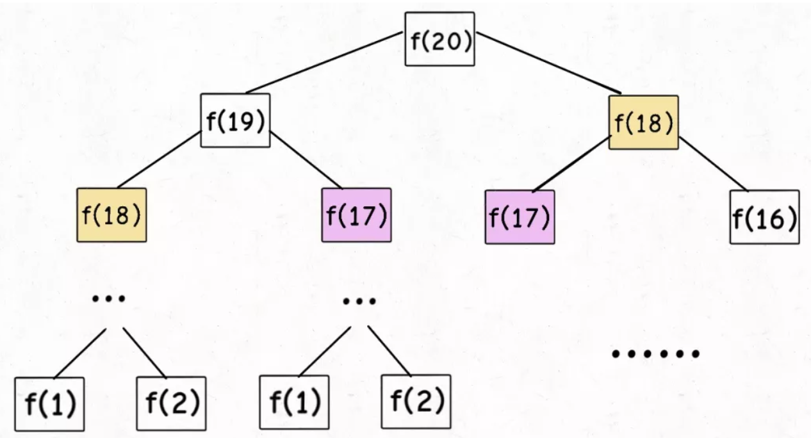

2. 

# ADT

## 二叉堆（Binary Heap）

**优先队列**  
优先队列依然从队首出队，但是入队时跟根据优先级插队  
使用二叉堆实现优先队列，动机是二叉堆能够将优先队列地 入队 和 出队 复杂度都保持再O(log n)。为了使堆操作能够保持在对数水平，必须使用二叉树结构，且需要保持二叉树的“平衡”。我们使用 **“完全二叉树”** 来近似实现平衡。

**堆次序**  
二叉堆中，任何一个节点，其父节点的值小于（大于）此节点的值。

1. 最小值排在head称为 最小堆
2. 最大值排在head称为 最大堆

3. 平衡二叉树
   

4. 完全二叉树
   


### python实现

1. 采用一个列表保存堆数据，index=0 的数据项无用，只是为了方便代码编写
2. **insert**
   首先将新数据加到列表的末尾，然后将新的数据上浮到正确的位置


```python
class binHeap:
    def __init__(self):
        self.heapLst = [0]
        self.currentSize = 0
    def insert(self):
        
```


## 树的链表实现


```python
class BinaryTree:
    def __init__(self, val):
        self.val = val
        self.left = None
        self.right = None
    
    def insertLeft(self, val):
        if self.left == None:
            node = BinaryTree(val)
            self.left = node
        else:
            tmp = BinaryTree(val)
            tmp.left = self.left
            self.left = tmp
            
    def insertRight(self, val):
        if self.right == None:
            node = BinaryTree(val)
            self.right = node
        else:
            tmp = BinaryTree(val)
            tmp.right = self.right
            self.right = tmp
    
    def getLeft(self):
        return self.left
    
    def getRight(self):
        return self.right
    
    def sefRoot(self, val):
        self.val = val
        
    def getRoot(self):
        return self.val
```

## 内置队列deque

```python
from collections import deque
lst = [3,2,1]
queue = deque(lst)

print(queue)
a = queue.popleft()
print(queue, a)
queue.appendleft(a)
print(queue)
queue.append(10)
print(queue)
queue.pop()
print(queue)
```


# 二叉树的遍历

## 前中后序遍历
```python
	    1
    2       3
4      5 6      7
前序遍历（1245367）
中序遍历（4251637）
后序遍历（4526731）

1. 前序(preorder)  : 根 -> 左 -> 右
2. 中序(inorder)   : 左 -> 根 -> 右
3. 后续(postorder) : 左 -> 右 -> 根

#------------------------#------------------------#------------------------#------------------------
## 前序遍历（1234567）
class Solution:
    def preorderTraversal(self, root: TreeNode) -> List[int]:
        rst = []
        def traverse(root):
            if not root:
                return
            rst.append(root.val)
            traverse(root.left)
            traverse(root.right)
        traverse(root)
        return rst
### 迭代(用循环模拟调用栈)
'''
	    1
    2       3
4      5 6      7
前序遍历（1245367）
'''
def preorderTraversal(self, root: TreeNode) -> List[int]:
        rst = []
        if not root:
            return rst
        stack = [root]
        while stack:
            cur = stack.pop()
            rst.append(cur.val)
            if cur.right:
                stack.append(cur.right)
            if cur.left:
                stack.append(cur.left)
        return rst
#------------------------#------------------------#------------------------#------------------------
## 中序遍历（4251637）
### 递归
class Solution:
    def inorderTraversal(self, root: TreeNode) -> List[int]:
        rst = []
        def traverse(root):
            if not root:
                return 
            traverse(root.left)
            rst.append(root.val)
            traverse(root.right)
        traverse(root)
        return rst
### 迭代
'''
	    1
    2       3
4      5 6      7
中序遍历（4251637）
'''
class Solution:
	def inorderTraversal(self, root: TreeNode) -> List[int]:
        rst = []
        if not root:
            return rst
        stack = [(root, 0)]#第二个flag表示是否访问过当前节点的子孙节点
        while stack:
            cur, visited = stack.pop()
            if visited:
                rst.append(cur.val)
            else:
                if cur.right:
                    stack.append((cur.right, 0))
                stack.append((cur, 1))
                if cur.left:
                    stack.append((cur.left, 0))
        return rst

class Solution:
    def traverse(root):
        stack = [root]
        ## 左节点入栈
        while root.left:
            stack.append(root.left)
            root = root.left
        while stack:
            tmp = stack.pop()
            print(tmp.val)
            ## 考虑节点2，如果有右节点
            if tmp.right:
                stack.append(tmp.right)
                ## 如果右节点还有左节点
                while stack[-1].left:
                    stack.append(stack[-1].left)
#------------------------#------------------------#------------------------#------------------------             
## 后序遍历
class Solution:
    def postorderTraversal(self, root: TreeNode) -> List[int]:
        rst = []
        def traverse(root):
            if not root:
                return 
            traverse(root.left)
            traverse(root.right)
            rst.append(root.val)
        traverse(root)
        return rst
## 迭代
''' 
        1
    2       3
4      5 6      7        
后序遍历（4526731）
'''
class Solution:
	def postorderTraversal(self, root: TreeNode) -> List[int]:
        rst = []
        if not root:
            return rst
        stack = [(root, 0)]
        while stack:
            cur, visited = stack.pop()
            if visited:
                rst.append(cur.val)
            else:
                stack.append((cur, 1))
                if cur.right:
                    stack.append((cur.right, 0))
                if cur.left:
                    stack.append((cur.left, 0))
        return rst
```

## 层序遍历

```python
## 递归
# 通过一个layer index指定往哪个列表中append
class Solution:
    def levelOrder(self, root: TreeNode) -> List[List[int]]:
        rst = []
        def traverse(layer, root):
            if not root:
                return
            if len(rst) < layer: # 处理左节点时创建过，不再重复创建
                rst.append([])
            rst[layer - 1].append(root.val)
            traverse(layer+1, root.left)
            traverse(layer+1, root.right)
        traverse(layer=1, root=root)
        return rst

#------------------------#------------------------#------------------------#------------------------
## 迭代
# 用队列存储层
class Solution:
	def levelOrder(self, root: TreeNode) -> List[List[int]]:
        rst = []
        if not root:
            return rst
        queue = [root] # 存储一层的节点
        while queue:
            rst.append([node.val for node in queue])
            ## pop当前层，append下一层
            for _ in range(len(queue)):
                cur = queue.pop(0)
                if cur.left:
                    queue.append(cur.left) # 此时的append不影响for循环
                if cur.right:
                    queue.append(cur.right)
        return rst
```


- [ ] 字符串解码
- [ ] 

# 1. 排序


## 1.1 冒泡

**思路**：步长为1，窗口为2依次滑动，将每一对的较小值放在前面

**一次滑动完成之后，最大值放在了最后**，下一步处理`nums[:, -1]`，故需要处理 n-1 次

算法终止条件：一次扫描中没有发生交换

```python
def bubble_sort(nums):
    n = len(nums)
    for i in range(n-1):
        switched = False
        for j in range(1, n-i):
            if nums[j-1] > nums[j]:
                nums[j-1], nums[j] = nums[j], nums[j-1]
                switched = True
        if not switched:
            break
    return nums
```

## 1.2 快排

**思路**：冒泡排序基础上的==递归分治法==，冒泡每次相邻的交换，快排打破了这个限制

1. 从数列中挑出一个元素，称为 "基准"（pivot）
2. 重新排序数列，所有元素比基准值小的摆放在基准前面，所有元素比基准值大的摆在基准的后面（相同的数可以到任一边）。在这个分区退出之后，该基准就处于数列的中间位置
3. 递归地（recursive）把小于基准值元素的子数列和大于基准值元素的子数列排序

```python
def quick_sort(nums):
    def quick(left, right):
        if left >= right:
            return
        l, r, pivot = left, right, left
        while l < r:
            while l < r and nums[l] < nums[pivot]:
                l += 1 #l为第一个大于等于基准值的index， l左边全都比基准小
            while l < r and nums[r] >= nums[pivot]:
                r -= 1 # r为第一个小于基准值的index， r右边全都比基准大
            nums[l], nums[r] = nums[r], nums[l]
        nums[pivot], nums[r] = nums[r], nums[pivot]
        quick(left, r-1)
        quick(r+1, right)
    quick(0, len(nums)-1)
    return nums


def selectNum(arr, left, right):
    # write your code here
    if left >= right:
        return 
    l, r = left, right
    pivot = arr[l]
    while l < r:
        while l < r and arr[r] >= pivot:
            r -= 1
        arr[l] = arr[r]#将右边第一个小于pivot的数字放在pivot的位置
        while l < r and arr[l] < pivot:
            l += 1
        arr[r] = arr[l]# 用左边第一个大于pivot的数字填在上一步的数字的位置
    # arr[r], arr[pivot] = arr[pivot], arr[r]
    arr[l] = num

    selectNum(arr,left, l - 1)
    selectNum(arr,l + 1, right)


    


arr = [10, 7, 8, 9, 1, 5] 
selectNum(arr, 0, len(arr) - 1)
print(arr)
```

## 1.3 归并排序

递归算法，**将数据表持续分成两半，对两半分别进行归并排序**
1. 递归结束条件：数据表中仅有1个数据项
2. 缩小问题规模：将数据表分裂成相等的两半，规模减少为原来的1/2
3. 调用自身        ：将两半分别调用自身排序，然后分别将排好序的两半按照大小归并，得到排序好的数据表

```python
def merge_sort(lst):
    if len(lst) < 2:
        return lst
    middle = len(lst) // 2
    left   = merge_sort(lst[:middle]) #左半部分排好序
    right  = merge_sort(lst[middle:]) #右半部分排好序
    merged = []##合并左右半部分，完成排序
    while left and right:
        if left[0] <= right[0]:
            merged.append(left.pop(0))
        else:
            merged.append(right.pop(0))
    merged.extend(right if right else left)
    return merged
```


## 1.4 堆排序

1. 创建一个堆 H[0……n-1]；
2. 把堆首（最大值）和堆尾互换；
3. 把堆的尺寸缩小 1，并调用 shift_down(0)，目的是把新的数组顶端数据调整到相应位置；
4. 重复步骤 2，直到堆的尺寸为 1。

```python
def heapify(nums, i, len_max=None):
    if len_max is None:
        len_max = len(nums)
    left = 2 * i + 1
    right = 2 * i + 2
    largest_idx = i
    if left < len_max and nums[left] > nums[largest_idx]:
        largest_idx = left
    if right < len_max and nums[right] > nums[largest_idx]:
        largest_idx = right
    if largest_idx != i:
        nums[i], nums[largest_idx] = nums[largest_idx], nums[i]
        heapify(nums, largest_idx, len_max)


def build_heap(nums):
    '''
    :param nums: [1, 2, 3, 5, 1]
    :return:     [5, 2, 3, 1, 1]
    '''
    for i in range(len(nums)//2, -1, -1):
        heapify(nums, i)

    return nums


def heap_sort(nums):
    len_max = len(nums)
    nums = build_heap(nums)
    for i in range(len(nums)-1, 0, -1):
        nums[i], nums[0] = nums[0], nums[i]

        len_max -= 1
        heapify(nums, 0, len_max)

    return nums
```


## 双排序

```python
'''
问题：描述一下：简单算法的使用，如停车场根据剩余车位数从多到少排序、距离从近到远排序；离线地图按照首字母进行排序.
使用稳定的排序算法
'''
def double_sort(nums,nums1,nums2):
    """
    nums: 停车场  --> 列表（str(停车场名称)）
    nums1:车位数（降序） --> 列表（int）
    nums2:距离（升序）--> 列表（int）
    return:
     nums ： 排序好的停车场列表
    """
    for i in range(len(nums1)):
     for j in range(len(nums1)-i-1):
         ##先跟据停车数量判断
         if nums1[j] < nums1[j+1]:
             nums[j],nums[j+1] = nums[j+1],nums[j]
                nums1[j],nums1[j+1] = nums1[j+1],nums1[j]
                nums2[j],nums2[j+1] = nums2[j+1],nums2[j]
            elif nums1[j] == nums1[j]:
               ##如果相等，则判断距离的远近
               ##距离近的优先
             if nums2[j] > nums2[j+1]:
                 nums[j],nums[j+1] = nums[j+1],nums[j]
                    nums1[j],nums1[j+1] = nums1[j+1],nums1[j]
                    nums2[j],nums2[j+1] = nums2[j+1],nums2[j]
    return nums

def sort1(part_dicts):
    car_nums_lst = []
    distance_lst =[]
    part_name_lst = []
    for part_dict in part_dicts:
     car_nums_lst.append(part_dict[车位数])
        distance_lst.append(part_dict[距离])
     part_name_lst.append(part_dict[停车场名称])
    part_name = double_sort(part_name_lst,car_nums_lst,distance_lst)
    
def sort2(maps):
 """
    maps：离线地图的列表 --> 列表（str）
    return
     根据首字母排序后的地图列表
         
    """
 for i in range(len(maps)):
     for j in range(len(maps)-i-1):
         map1,map2 = maps[j],maps[j+1]
            #根据首字母的ASCII码值判断
            if ord(map1[0]) >= ord(map2[0]):
             maps[j],maps[j+1] = maps[j+1],maps[j]
    return maps
part_dict = {车位数:car_nums,距离：distance,离线地图：map,停车场名称：name}
```


## topK


# 二分查找


# 动态规划

## 概述

1. 适合的场景

   有重叠子问题、具有最优子结构的场景，通过 dp table 来优化穷举过程

2. 套路

   ```
   套路：
   1. 确定状态和选择
   2. 明确dp数组含义，用dp数组把状态描述出来
   3. 定义 base case
   4. 状态转移方程(根据选择确定状态转移)
   ```

   ```python
   for 状态1 in 状态1列表:
   	for 状态2 in 状态2列表:
         	for ...
          		dp[状态1][状态2][...] = 择优(选择1, 选择2, ...)
   ```

3. 一些理解

   - dp 通过备忘录来优化穷举，其是自底向上由base case计算后续结果，区别于递归（自顶向下），因此dp一般用循环而不是递归。

   - 数组的遍历方向

     * 遍历的过程中，所需的状态必须是已经计算出来的

     * 遍历的终点必须是存储结果的那个位置。

       


## 子序列问题模版

1. **第一种思路模板是一个一维的 dp 数组**

   在子数组`array[0..i]`中，以`array[i]`结尾的目标子序列（最长递增子序列）的长度是`dp[i]`。

2. **第二种思路模板是一个二维的 dp 数组**

   - 涉及两个字符串/数组时（比如最长公共子序列）

     在子数组`arr1[0..i]`和子数组`arr2[0..j]`中，我们要求的子序列（最长公共子序列）长度为`dp[i][j]`

   - 只涉及一个字符串/数组时（比如最长回文子序列）

     在子数组`array[i..j]`中，我们要求的子序列（最长回文子序列）的长度为`dp[i][j]`

   

## 编辑距离（2维dp）

给你两个单词 word1 和 word2，请你计算出将 word1 转换成 word2 所使用的最少操作数 。

你可以对一个单词进行如下三种操作：

插入一个字符
删除一个字符
替换一个字符

dp含义：`dp[i-1][j-1]` 存储 `s1[0..i]` 和 `s2[0..j]` 的最小编辑距离

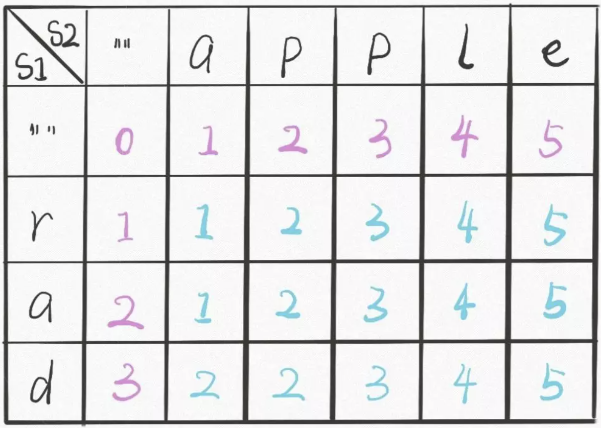


```python
class Solution:
    def minDistance(self, word1: str, word2: str) -> int:
        m, n = len(word1), len(word2)
        dp = [[0 for _ in range(n + 1)] for _ in range(m + 1)]
        for i in range(m + 1):
            dp[i][0] = i
        for j in range(n + 1):
            dp[0][j] = j
        for i in range(1, m + 1):
            for j in range(1, n + 1):
                if word1[i - 1] == word2[j - 1]:
                    dp[i][j] = dp[i - 1][j - 1]
                else:
                    dp[i][j] = min(
                        dp[i - 1][j - 1] + 1, # 替换
                        dp[i - 1][j] + 1,     # 把i对应的字符删掉
                        dp[i][j - 1] + 1      # 在i位置插入一个字符与j匹配
                    )
        return dp[-1][-1]
```


## 最长递增子序列（1维dp）

**dp解法**

给一个无序的整数数组，求其中最长上升子序列的长度

```
输入：nums = [10,9,2,5,3,7,101,18]
输出：4
解释：最长递增子序列是 [2,3,7,101]，因此长度为 4 。
```

1. 状态是序列的每一个字符，dp是一维的

2. **dp[i] 表示以 nums[i] 这个数结尾的最长递增子序列的长度**。==为什么不能是前i个中最长递增子序列的长度==

   返回dp的最大值

3. base case: 每个字符至少为1，dp全部初始化为1

4. 状态转移

   对于`nums[i]`,查找0-i中小于nums[i]的位置j，计算dp[j]+1中的最大值作为dp[i]的值

```python
def lengthOfLIS(self, nums: List[int]) -> int:
        if not nums:
            return None
        dp = [1] * len(nums)
        for i in range(len(nums)):
            lst = [dp[j] for j in range(i) if nums[j] < nums[i]]
            if lst:
                dp[i] = max(lst) + 1
                
        return max(dp)
```

**二分查找**

**patience sort**

只能把点数小的牌压到点数比它大的牌上；如果当前牌点数较大没有可以放置的堆，则新建一个堆，把这张牌放进去；如果当前牌有多个堆可供选择，则选择最左边的那一堆放置。

这样保证top cards有序，堆的个数就是最长递增子序列的长度

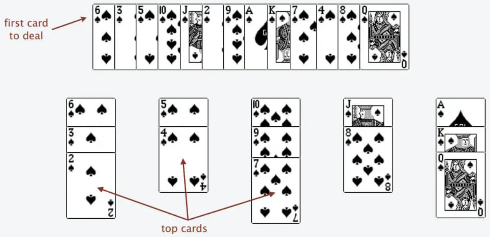

我们只要把处理扑克牌的过程写出来即可。每次处理一张扑克牌要找一个合适的牌堆顶来放，牌堆顶的牌**有序**，可用二分查找来搜索当前牌应放置的位置。

```python
def lengthOfLIS(nums):
    n = len(nums)
    top = [0] * n
    # 牌堆数初始化为 0
    piles = 0
    for i in range(n):
        # 对每张牌，查找放置位置
        poker = nums[i]
        # 搜索左侧边界的二分查找
        left = 0
        right = piles
        while (left < right):
            mid = (left + right) // 2
            if top[mid] >= poker:
                right = mid
            else top[mid] < poker:
                left = mid + 1
        # 没找到合适的牌堆，新建一堆
        if left == piles: 
            piles+=1
        # 把这张牌放到牌堆顶
        top[left] = poker
    #牌堆数就是 LIS 长度
    return piles
```


## 二维递增子序列：信封嵌套

给你一个二维整数数组 envelopes ，其中 envelopes[i] = [wi, hi] ，表示第 i 个信封的宽度和高度。当另一个信封的宽度和高度都比这个信封大的时候，这个信封就可以放进另一个信封里，如同俄罗斯套娃一样。请计算最多能有多少个信封能组成一组“俄罗斯套娃”信封（即可以把一个信封放到另一个信封里面）。

**思路**：标准的 LIS 算法只能在数组中寻找最长子序列，而信封是由`(w,h)`这样的二维数对形式表示的，如何把 LIS 算法运用过来呢？固定一个维度，再在另一个维度上进行选择：先对w这一列升序排序，对于w相同的再对h逆序排序。这个解法的关键在于，对于宽度`w`相同的数对，要对其高度`h`进行降序排序。因为两个宽度相同的信封不能相互包含，而逆序排序保证在`w`相同的数对中最多只选取一个计入 LIS。

```python
class Solution:
    def maxEnvelopes(self, envelopes: List[List[int]]) -> int:
        ## 对第一列进行正向排序，再对第二列进行逆向排序
        if not envelopes:
            return 0
        
        n = len(envelopes)
        envelopes.sort(key=lambda x: (x[0], -x[1]))

        f = [1] * n
        for i in range(n):
            for j in range(i):
                if envelopes[j][1] < envelopes[i][1]:
                    f[i] = max(f[i], f[j] + 1)
        
        return max(f)
```


## 最大子数组和

给定一个整数数组 `nums` ，找到一个具有最大和的连续子数组（子数组最少包含一个元素），返回其最大和。

**状态：**以`nums[i]`为结尾的「最大子数组和」为`dp[i]`。

**选择**：假设`dp[i-1]`已知，`dp[i]`有两种「选择」，要么与前面的相邻子数组连接，形成一个和更大的子数组；要么不与前面的子数组连接，自成一派，自己作为一个子数组。

```python
def max_sub_arr(nums):
    n = len(nums)
    dp = nums.copy()
    for i in range(1, n):
        dp[i] = max(dp[i-1] + nums[i], nums[i])
    return max(dp)
```

**状态压缩**

dp[i]只和dp[i-1]有关

```python
def max_sub_arr(nums):
    n = len(nums)
    dp0 = nums[0]
    res = nums[0]
    for i in range(1, n):
        dp0 = max(dp0 + nums[i], nums[i])
        res = max(res, dp0)
    return res
```

## 最长公共子序列（2维dp）

输入: str1 = "abcde", str2 = "ace" 
输出: 3 
解释: 最长公共子序列是 "ace"，它的长度是 3

`子序列类型的问题，穷举出所有可能的结果都不容易，而动态规划算法做的就是穷举 + 剪枝，它俩天生一对儿。所以可以说只要涉及子序列问题，十有八九都需要动态规划来解决`

1. 明确 dp table

   一般两个字符串的问题，都是构造一个`m+1 * n+1`的dp table

   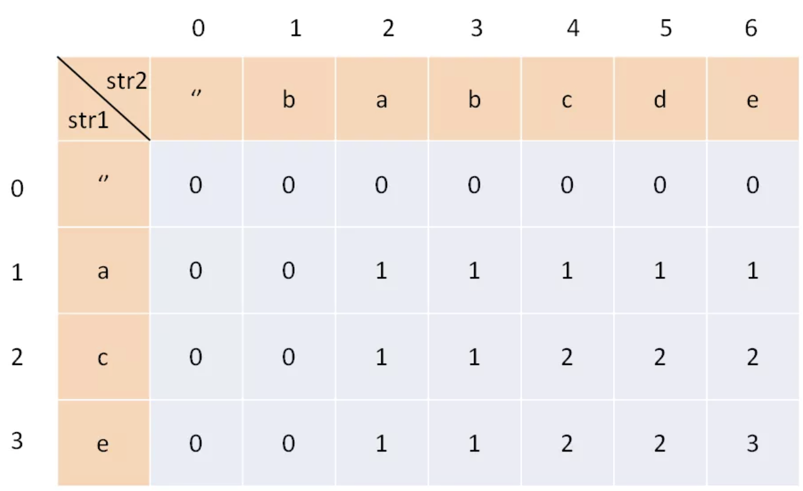

   **`dp[i][j]`的含义是：对于`s1`中前`i`个和`s2`中前`j`个，它们的 LCS 长度是`dp[i][j]`**

2. Base case

   `dp[0][..]`和`dp[..][0]`都为0

3. 选择：`i,j`对应的字符在不在LCS中

4. 状态转移

   如果`s1[i]==s2[j]`则这个字符一定在LCS中， `dp[i][j] = dp[i-1][j-1]+1`

   如果`s1[i]!=s2[j]`则至少有一个字符不在LCS中， `dp[i][j] = max(dp[i-1][j],dp[i][j-1],dp[i-1][j-1])`

```python
def longestCommonSubsequence(self, text1: str, text2: str) -> int:
        m, n = len(text1), len(text2)
        dp = [[0] * (n + 1) for _ in range(m + 1)]
        
        for i in range(1, m + 1):
            for j in range(1, n + 1):
                if text1[i - 1] == text2[j - 1]:
                    dp[i][j] = dp[i - 1][j - 1] + 1
                else:
                    dp[i][j] = max(dp[i - 1][j], dp[i][j - 1])
        
        return dp[m][n]
```


## 两个字符串的删除操作

给定两个单词 *word1* 和 *word2*，找到使得 *word1* 和 *word2* 相同所需的最小步数，每步可以删除**任意一个字符串**中的**任意一个字符**。

**思路**：删除的结果就是这两个字串的最长公共子序列，删除的次数可以通过最长公共子序列的长度推导出来

```python
def minDistance(s1, s2):
    m = len(s1)
    n = len(s2)
    lcs = longestCommonSubsequence(s1, s2)
    return m - lcs + n - lcs
```

## [两个字符串的最小ASCII删除和](https://leetcode-cn.com/problems/minimum-ascii-delete-sum-for-two-strings/)

给定两个字符串`s1, s2`，找到使两个字符串相等所需删除字符的ASCII值的最小和。

**思路**：不要求公共子序列最长，不能直接复用计算最长公共子序列的函数了，但是可以依照之前的思路，**稍微修改 base case 和状态转移部分即可直接写出解法代码**：

```python
## 将 s1[i..] 和 s2[j..] 删除成相同字符串, 最小的 ASCII 码之和为 dp(i, j)
def fun_dp(i,j,s1,s2):
    if i == len(s1):
        for k in range(j,len(s2)):
            rst += ord(s2[k])
    if j == len(s2):
        for k in range(i,len(s1)):
            rst += ord(s1[k])
    if memo[i][j] != -1:
        return memo[i][j]
    ## 相等时不用删除
    if s1[i] == s2[j]:
        memo[i][j] = dp(i + 1, j + 1, s1, s2)
	## s1[i] 和 s2[j] 至少有一个不在 lcs 中，删ord最小的那个
    else:
        memo[i][j] = min(
            memo(i+1, j, s1,s2) + ord(s1[i]),
            memo(i, j+1, s1,s2) + ord(s2[j]),
        )
    return memo[i][j]
def minimumDeleteSum(self, s1: str, s2: str) -> int:
	m, n = len(text1), len(text2)
    memo = [[-1] * (n + 1) for _ in range(m + 1)]
    return fun_dp(0, 0, s1, s2)
    
    
```


## 最长回文子序列（2维dp）

1. dp 数组的定义是：**在子串`s[i..j]`中，最长回文子序列的长度为`dp[i][j]`**

   ==注意`i>=j`==

假设已知`dp[i+1][j-1]`,计算`dp[i][j]`

- `s[i]==s[j] ==> dp[i][j]=dp[i+1][j-1]+2`

- `s[i]!=s[j]`说明s[i]、 s[j]不同时出现在以s[i..j]为子串的最长回文子序列中

  那么`dp[i][j]`等于它俩**分别**加入`s[i+1..j-1]`中，看看哪个子串产生的回文子序列更长

  即：`dp[i][j] = max(dp[i + 1][j], dp[i][j - 1])`

最终要求的是`dp[0][n-1]`

2. Base case

   对角线元素为1

   `i>j`即左下角初始化为0

   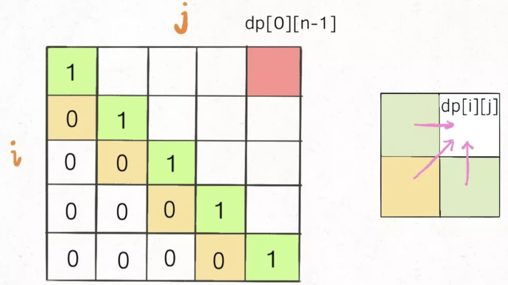

3. 遍历原则

   根据依赖关系选择和最终求解的位置选择遍历方式，如dp计算时依赖左边，下边和左下的元素，最终停留在求解的位置左上角。

   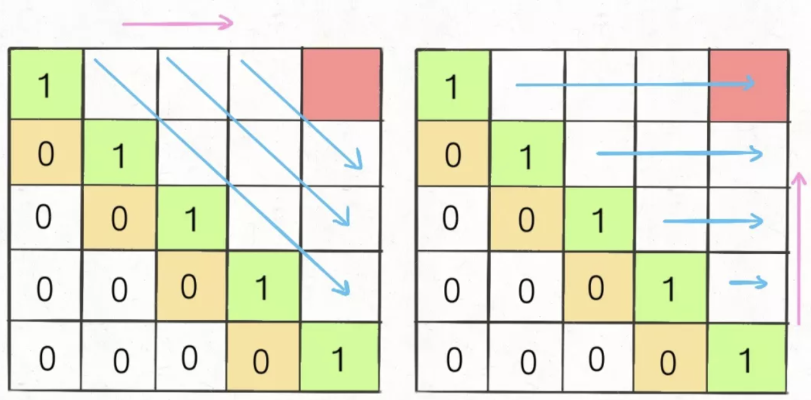

```python
def longestPalindromeSubseq(s):
    n = len(s)
    # dp 数组全部初始化为 0
    dp = [[0 for _ in range(n)] for _ in range(n)]
    # base case
    for i in range(n):
        dp[i][i] = 1
    #反着遍历保证正确的状态转移,先计算右下角，从下往上 从左往右 遍历
    for i in range(n - 2, -1, -1):
        for j in range(i + 1, n):
            #状态转移方程
            if s[i] == s[j]
                dp[i][j] = dp[i + 1][j - 1] + 2
            else
                dp[i][j] = max(dp[i + 1][j], dp[i][j - 1])
        
    #整个 s 的最长回文子串长度
    return dp[0][n - 1]
```

**状态压缩（将二维数组 投影 到一维数组）**

计算`dp[i][j]`只需要这三个相邻状态，其实根本不需要维护那么大一个二维的 dp table.

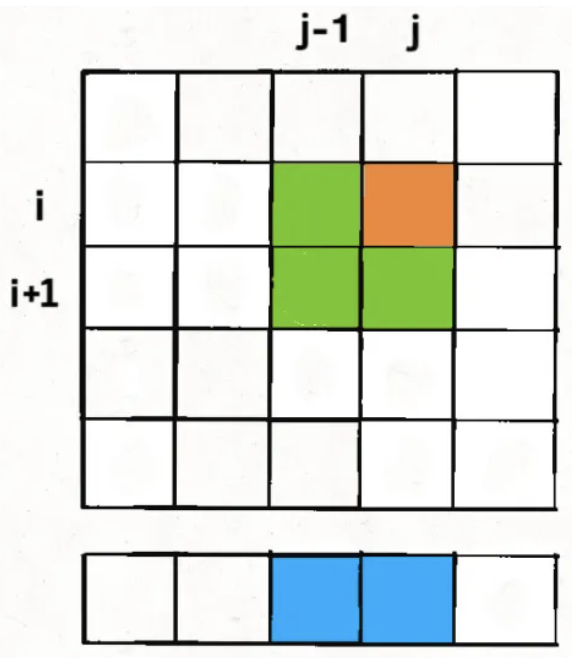

向下投影时（一般向下投影，把`i`这个维度去掉），`dp[i][j-1]` 和 `dp[i+1][j-1]` 其中有一个值会被覆盖，我们采用一个临时变量保存来解决这个问题。

先无脑丢掉维度`i`

**站在当前`i`和`j`的位置分析`dp[j]`和`dp[j-1]`：**

1. `dp[i+1][j]`： `j`循环更改一维dp数组`dp[j]`的值，对于一个固定的$j$，在更改其值之前，其存储的是上一次修改是在外层循环`i=i+1`时的值，即`dp[j]`对应原始二维dp数组的`dp[i+1][j]`

2. `dp[i][j-1]`：  `dp[j-1]`是在内层循环j中的上一次（j-1）进行修改的，此时的外层循环为i，即`dp[j-1]`对应原始数组`dp[i][j-1]`

   

3. `dp[i+1][j-1]`：目前原始数组`dp[i+1][j] ==> dp[j]`, `dp[i][j-1] ==> dp[j-1]`，还剩下`dp[i+1][j-1]`在一维dp数组中没有对应的位置，因此，我们定义一个临时变量存储每次变化的`dp[i+1][j-1]`。 **那么如果我们想得到`dp[i+1][j-1]`，就必须在它被覆盖之前用一个临时变量`temp`把它存起来，并把这个变量的值保留到计算`dp[i][j]`的时候**

4. Base case：将二维base case投影成一维base case

```python
def longestPalindromeSubseq(s):
    n = len(s)
    # dp 数组全部初始化为 0
    #dp = [[0 for _ in range(n)] for _ in range(n)]
    # base case
    #for i in range(n):
    #    dp[i][i] = 1
    dp = [1]*len(n)
    #反着遍历保证正确的状态转移,先计算右下角，从下往上从左往右便利
    for i in range(n - 2, -1, -1):
        pre = 0
        for j in range(i + 1, n):
            tmp = dp[j]
            #状态转移方程
            if s[i] == s[j]
                #dp[i][j] = dp[i + 1][j - 1] + 2
              	dp[j] =pre + 2
            else
                #dp[i][j] = max(dp[i + 1][j], dp[i][j - 1])
              	dp[j] = max(dp[j], dp[j-1])
        	pre = tmp
    #整个 s 的最长回文子串长度
    return dp[0][n - 1]
```

## 最长回文子串（字串是连续的）

首先注意的点：回文串可能是奇数也可能是偶数，一般用**双指针**来解决，从中间向两边扩展

```python
def longestPalindrome(self, s: str) -> str:
    ## 	中心扩展
    def find_max(s, l, r):
      while l >= 0 and r < len(s) and s[l] == s[r]:
        l -= 1
        r+=1
        return l+1, r-1
    
    ## 每个位置都进行中心扩展
    top, down = 0,0
    for i in range(len(s)):
      ## 以i为中心的回文子串
      l1, r1 = find_max(s,i,i)
      if r1-l1 > down-top:
        top, down = l1, r1
      ## 以i和i+1为中心的回文子串
      l2, r2 = find_max(s,i,i+1)
      if r2-l2 > down-top:
        top, down = l2, r2
return s[top: down+1]
```

## [零钱兑换](https://leetcode-cn.com/problems/coin-change/)

给定不同面额的硬币 coins 和一个总金额 amount。编写一个函数来计算可以凑成总金额所需的**最少的硬币个数**。如果没有任何一种硬币组合能组成总金额，返回 -1。每种硬币的数量是无限的。


1. 状态：也就是原问题和子问题中变化的变量。由于硬币数量无限，所以唯一的状态就是目标金额`amount`。

   选择：从硬币列表选择硬币，然后amount减小

2. dp数组是一维的, dp[i] = 金额为i时，需要的最少硬币数量

3. base case：目标金额为0时，所需硬币数量为0

4. 状态转移方程

   dp[0] = 0

   dp[n] = -1, n<0 

   dp[n] = min{dp[n-coin] + 1 for each coin}, n>0

```python
def coinChange(self, coins: List[int], amount: int) -> int:
  dp = [float('inf')] * (amount+1)
  dp[0] = 0
  for i in range(1, amount+1):
    for coin in coins:
      if i >= coin:
	      dp[i] = min(dp[i], dp[i-coin] + 1)
	return dp[-1] if dp[-1] != float('inf') else -1 ## 考虑凑不出的情形返回-1
```

## [零钱兑换2](https://leetcode-cn.com/problems/coin-change-2/)

返回可以凑成总金额的 **所有组合方法的个数**。如果任何硬币组合都无法凑出总金额，返回 `0` ，每种硬币的数量是无限的。

**二维dp解法**

1. 状态：背包容量和可选择的物品

   选择：装或不装（使用这个硬币或者不使用）

2. `dp[i][j]` 当背包容量为`j`时，用前`i`种商品，有`dp[i][j]`种装法

3. base case：`dp[0][..] = 0，dp[..][0] = 1`

4. 状态转移

   不使用第i个硬币：`dp[i][j]=dp[i-1][j]`

   使用第i个硬币：`dp[i][j]=dp[i][j-coins[i]]`

   最终结果是两种情况相加

```java
int change(int amount, int[] coins) {
    int n = coins.length;
    int[][] dp = amount int[n + 1][amount + 1];
    // base case
    for (int i = 0; i <= n; i++) 
        dp[i][0] = 1;

    for (int i = 1; i <= n; i++) {
        for (int j = 1; j <= amount; j++)
            if (j - coins[i-1] >= 0)
                dp[i][j] = dp[i - 1][j] 
                         + dp[i][j - coins[i-1]];
            else 
                dp[i][j] = dp[i - 1][j];
    }
    return dp[n][amount];
}
```

**状态压缩**

`dp`数组的转移只和`dp[i][..]`和`dp[i-1][..]`有关

```java
int change(int amount, int[] coins) {
    int n = coins.length;
    int[] dp = new int[amount + 1];
    dp[0] = 1; // base case
    for (int i = 0; i < n; i++)
        for (int j = 1; j <= amount; j++)
            if (j - coins[i] >= 0)
                dp[j] = dp[j] + dp[j-coins[i]];

    return dp[amount];
}
```


**一维dp解法**

1. 状态：总金额

   选择：选择硬币，总金额减小

2. dp[i]：能够装满i的所有方式

3. Base case: dp[0] = 1, 总金额为0时，凑法为1

4. 状态转移

   dp[i] = dp[i] + dp[i-coin],  for each coin in coins

   先循环coin再循环[coin,amount]可以保证不出现组合数的重复，可以这样理解：

   对于一个coin，对于coin 到 amount之间的数i，dp[i] 增加 dp[i-coin]，循环每个coin可得到最终结果

```python
def change(self, amount: int, coins: List[int]) -> int:
  dp = [0] * (amount+1)
  dp[0] = 1
  # 先遍历coin再遍历amount，避免重复计算组合（如，1，2和2，1是同一种）
  for coin in coins:
    for i in range(coin, amount+1):
  ##for i in range(amount+1):
    ##for coin in coins:
      if i >= coin:
        dp[i] += dp[i-coin]
  return dp[-1]
```

## 背包问题

给定一个target（背包容量）和一个数组（物品），能否按照一定方式选取物品得到target

选取方式：每个元素选一次/每个元素选多次/选元素进行排列组合

## 01背包问题

给你一个可装载重量为`W`的背包和`N`个物品，每个物品有重量和价值两个属性。其中第`i`个物品的重量为`wt[i]`，价值为`val[i]`，现在让你用这个背包装物品，最多能装的价值是多少？

1.  明确状态和选择

   状态：用来描述一个问题所需要的变量，即背包容量和可选择的物品，所以状态有两个背包容量和物品重量

   选择：物品装或者不装

2. ==用dp描述状态==

   状态有两个，用二维数组描述

   `dp[i][w]`：对于前`i`个物品，当前背包的容量为`w`，这种情况下可以装的最大价值是`dp[i][w]`

   所求的是`dp[N][W]`

3. base case

   `dp[...][0]` = 0, `dp[0][...]`=0

   ```python
   dp = [N+1][W+1]
   dp[0][...] = 0
   dp[...][0] = 0
   
   for i in [1..N]:
     for w in [1..W]:
       dp[i][w] = max(
         物品i装进背包，
         物品i不装进背包
       )
   return dp[N][W]
   ```

4. 根据==选择==确定状态转移方式

   如果第`i`个物品没有装进背包：`dp[i][w]=dp[i-1][w]`

   如果第`i`个物品没有装进背包：`dp[i][w]=dp[i-1][w-wt[i-1]]+val[i-1]`

   迭代结果是上述两个的最大值

   ```python
   for i in [1..N]:
       for w in [1..W]:
         if w - wt[i-1]<0:
           dp[i][w] = dp[i-1][w] # 背包装不下第i个物品
         else:
           dp[i][w] = max(
             dp[i-1][w],
             dp[i-1][w - wt[i-1]] + val[i-1]
           )
   return dp[N][W]
   ```


## 分割等和子集

给一个容量为`sum/2`的背包和一个物品列表（物品只包含重量），问是否存在一种装法刚好装满背包

1. 状态和选择

   状态：描述问题需要背包容量和物品重量，故状态是背包容量和物品重量

   选择：物品装或不装

2. 用dp描述状态

   **`dp[i][w]`：前`i`个商品是否能够装满容量为`w`的背包**

   最终求的是`dp[i][sum/2]`

3. base case

   `dp[0][...]`=False	#没有物品时不能装满背包

   `dp[...][0]`=True     #背包容量为0时可以什么都不装

4. 根据==选择==确定状态转移

   第`i`个商品装进背包：`dp[i][w] = dp[i-1][w-nums[i-1]]`

   第`i`个商品不装进被背包：`dp[i][w] = dp[i-1][w]`

   上述两个选择只有有一个是True，则此步迭代结果就是True

注意的点：

1. 如果sum是奇数，肯定不能满足条件
2. 判断`w-nums[i-1]`是否小于0
3. 注意index的对应关系

```python
def canPartition(self, nums: List[int]) -> bool:
    # 如果和为奇数，不满足条件
    s = sum(nums)
    if s & 1:
        return False
    # 初始化
    w = s//2 #背包容量
    dp = [[False for _ in range(w+1)] for _ in range(len(nums)+1)]
    for i in range(len(nums)+1):
        dp[i][0] = True

    # 状态转移
    for i in range(1, len(nums)+1):
        for j in range(1, w+1):
            dp[i][j] = dp[i-1][j]
            if nums[i-1] <= j:
                dp[i][j] = dp[i-1][j] or dp[i-1][j-nums[i-1]]
	return dp[-1][-1]
```


**状态压缩**

观察dp数组的转移方式，`dp[i][j]`依赖的是上一行`dp[i-1][...]`转移过来的。

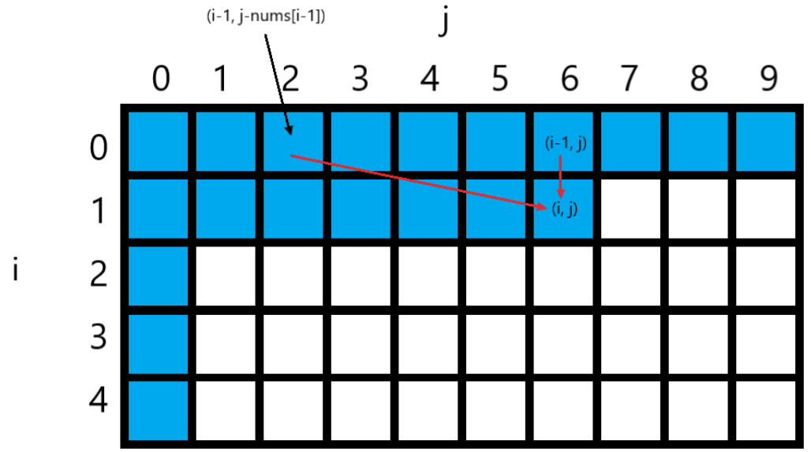

我们直接将维度`i`去掉，向下投影，此时需要注意的是，`dp[i][j]`在更新过程中覆盖`dp[i-1][j]`，此时更新`dp[i][j+1]`的时候无法利用原始的`dp[i-1][j]`，因此状态压缩之后我们反向遍历。

```python
def canPartition(self, nums: List[int]) -> bool:
    # 如果和为奇数，不满足条件
    s = sum(nums)
    if s & 1:
        return False
    # 初始化
    w = s//2 #背包容量
    dp = [False for _ in range(w+1)]
    dp[0] = True # 背包容量为0时的填充方式
    # 状态转移
    for i in range(1, len(nums)+1):
        for j in range(w, 0, -1):
            if nums[i-1] <= j:
                dp[j] = dp[j] or dp[j-nums[i-1]]
	return dp[-1]
```


## 完全背包问题

查看零钱兑换2


## 下降路径最小和

给你一个 `n x n` 的 **方形** 整数数组 `matrix` ，请你找出并返回通过 `matrix` 的**下降路径** 的 **最小和**

```python
	def minFallingPathSum(self, matrix: List[List[int]]) -> int:
        m,n = len(matrix), len(matrix[0])
        dp = [[0 for _ in range(n)] for _ in range(m)] #到matrix[i][j]的最小路径和
        ## 第一行初始化为本身
        for j in range(n):
            dp[0][j] = matrix[0][j]    
        for i in range(1,m):
            for j in range(n):
                if j == n-1:
                    dp[i][j] = matrix[i][j] + min(
                    dp[i-1][j],
                    dp[i-1][j-1]
                    )
                elif j == 0:
                    dp[i][j] = matrix[i][j] + min(
                    dp[i-1][j],
                    dp[i-1][j+1]
                    )
                else:
                    dp[i][j] = matrix[i][j] + min(
                        dp[i-1][j],
                        dp[i-1][j-1],
                        dp[i-1][j+1]
                        )
        return min(dp[-1])
```

## 正则表达式匹配

输入两个字符串`s`和`p`，`s`代表文本，`p`代表模式串，请你判断模式串`p`是否可以匹配文本`s`。点号「.」可以匹配任意一个字符，星号「*」可以让之前的那个字符重复任意次数（包括 0 次）。

**思路**

**两个指针`i, j`分别在`s`和`p`上移动，如果最后两个指针都能移动到字符串的末尾，那么匹配成功，反之则匹配失败。**

涉及两个字符串的穷举，我们就应该条件反射地想到动态规划的技巧了。

1. 只要遇到`.`通配符，无脑匹配就完事了
2. 一旦遇到`*`通配符，对于所有可能出现的情况，全部穷举一遍，只要有一种情况可以完成匹配，就认为`p`可以匹配`s`。

- `p[j + 1]`为`*`通配符时：
  1. `s[i]==p[j]`时有两种情况
     * `p[j]`匹配多个字符，比如`s = "aaa", p = "a*"`，那么`p[0]`会通过`*`匹配 3 个字符`"a"`。
     * `p[j]`匹配0个字符，比如`s = "aa", p = "a*aa"`，由于后面的字符可以匹配`s`，所以`p[0]`只能匹配 0 次。
  2. `s[i] != p[j]`时有一种情况
     - `p[j]`只能匹配 0 次，然后看下一个字符是否能和`s[i]`匹配。比如说`s = "aa", p = "b*aa"`，此时`p[0]`只能匹配 0 次。

```python
class Solution:
    def isMatch(self, s: str, p: str) -> bool:
        m, n = len(s), len(p)
        
        def matches(i: int, j: int) -> bool:
            '''s[i-1]和p[j-1]是否match'''
            if i == 0:
                return False
            if p[j - 1] == '.':
                return True
            return s[i - 1] == p[j - 1]

        dp = [[False] * (n + 1) for _ in range(m + 1)] # dp[i][j]：s 的前 i 个字符与 p 中的前 j 个字符是否匹配
        dp[0][0] = True
        for i in range(m + 1):
            for j in range(1, n + 1):
                # p的第j个如果是*
                if p[j - 1] == '*':
                    dp[i][j] |= dp[i][j - 2]
                    if matches(i, j - 1):
                        dp[i][j] |= dp[i - 1][j]
                else:
                    if matches(i, j):
                        dp[i][j] |= dp[i - 1][j - 1]
        return dp[m][n]
```


## ==用动态规划玩游戏(未完成)==


# 贪心

## 删除被覆盖的区间

给一个区间列表，删除被其他区间覆盖的区间，返回剩余区间个数

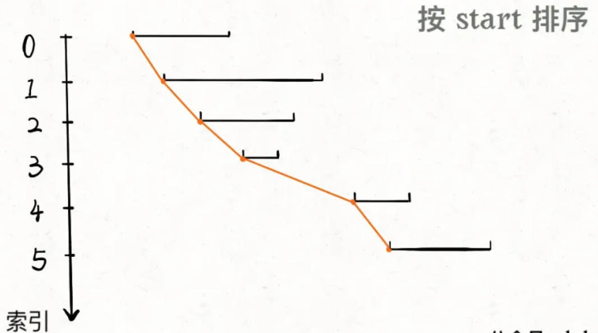

**思路：**按照起点升序终点降序排列后，相邻的区间有下面三种关系

1. 上一个包含下一个（找到了覆盖区间）
2. 相交，但不包含（两个区间可以合并）
3. 不相交（更新区间）

起点相同的区间，需要保证长的那个区间在上面（按照终点降序），这样才会被判定为覆盖，否则会被错误地判定为合并，少删除一个

```python
class Solution:
    def removeCoveredIntervals(self, intervals: List[List[int]]) -> int:
        n = len(intervals)
        if n <= 1:
            return n
        intervals.sort(key = lambda x: [x[0], -x[1]])
        start = intervals[0][0]
        end   = intervals[0][1]
        cnt   = 0
        for interval in intervals[1:]:
            if interval[1] <= end:
                cnt += 1
            elif interval[1] > end and interval[0] <= end:
                end = interval[1]
            else:
                start, end = interval[0], interval[1]
        return n - cnt
```

## 合并区间

合并所有相交区间，返回合并后结果

**思路：**按照start升序排序，然后分析相邻两个区间的相对位置关系

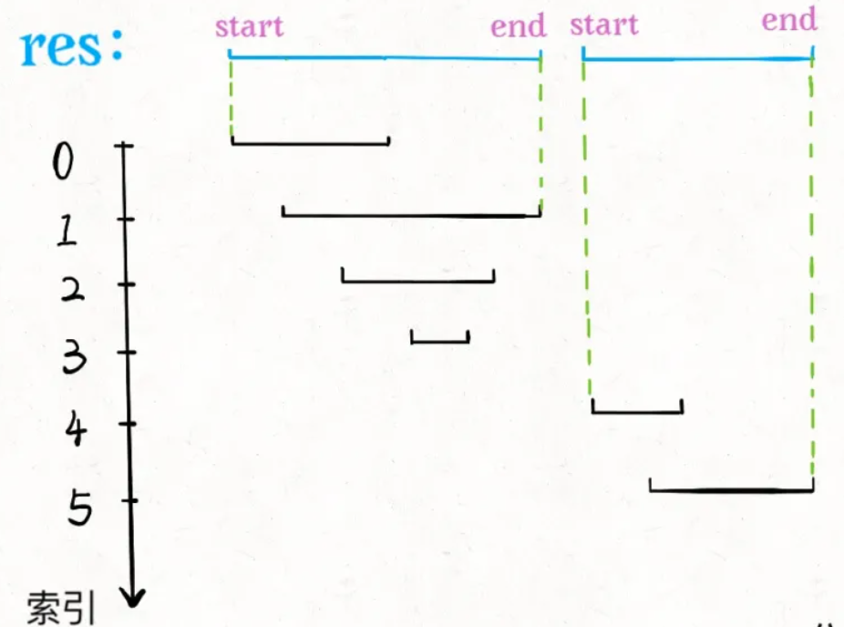

```python
class Solution:
    def merge(self, intervals: List[List[int]]) -> List[List[int]]:
        n = len(intervals)
        if n <= 1:
            return intervals
        intervals.sort(key=lambda x: x[0])
        start, end = intervals[0]
        rst = [intervals[0]]
        for interval in intervals[1:]:
            if interval[1] <= end:
                continue
            elif interval[0] <= end:
                rst.pop()
                end = interval[1]
                rst.append([start, interval[1]])
            else:
                start, end = interval
                rst.append(interval)
        return rst
```

## 区间列表的交集

全是闭区间，每个区间列表中区间不相交

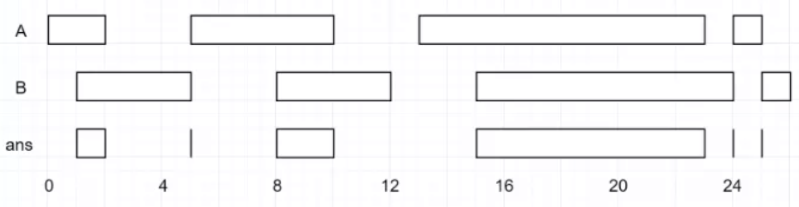

**思路：**用两个指针分别在两个列表从左向右滑动，判读i和j指向的区间可能存在的位置关系，根据关系选择是否求交集还是移动指针

**指针如何前进**

谁的end小谁前进

**无交集的情况不用管**

1. [        ]

   ​               [        ]

2. ​               [        ]

   [        ]

**存在交集的情况（此时`x1 <= y2 and x2 <= y1`）**

交集：`[max(x1,x2), min(y1,y2)]`

1. [       ]

      [ ]

2.    [ ]

   [       ]

3. [       ]

   ​     [        ]

4. ​     [        ]

   [       ]

```python
## 题目中是排好序的
class Solution:
    def intervalIntersection(self, firstList: List[List[int]], secondList: List[List[int]]) -> List[List[int]]:
        i, j = 0, 0
        rst = []
        while i < len(firstList) and j < len(secondList):
            x1, y1 = firstList[i]
            x2, y2 = secondList[j]
            if x1 <= y2 and x2 <= y1:
                rst.append([max(x1,x2), min(y1,y2)])
            ## 步进指针
            if y1 <= y2:
                i+=1
            else:
                j+=1
        return rst
```


## 求不相交区间

给定一个区间的集合，找到需要移除区间的最小数量，使剩余区间互不重叠。

正确的思路其实很简单，可以分为以下三步：

1. 从区间集合 intvs 中选择一个区间 x，这个 x 是在当前所有区间中**结束最早的**（end 最小）。
2. 把所有与 x 区间相交的区间从区间集合 intvs 中删除，更新区间x为下一个不相交的区间，cnt+=1。
3. 重复步骤 1 和 2，直到 intvs 为空为止。之前选出的那些 x 就是最大不相交子集。

把这个思路实现成算法的话，可以按每个区间的`end`数值升序排序，因为这样处理之后实现步骤 1 和步骤 2 都方便很多

```python
class Solution:
    def eraseOverlapIntervals(self, intervals: List[List[int]]) -> int:
        if len(intervals) == 0:
            return 0
        ## 按照end排序
        intervals.sort(key=lambda x: x[1])
        end = intervals[0][1]
        cnt = 1
        for interval in intervals:
            ## 如果起点和上一个终点相交，继续
            if interval[0] < end:
                continue
            else:
                end = interval[1] # 更新end为新的end
                cnt+=1
        return len(intervals) - cnt
```

## [用最少数量的箭引爆气球](https://leetcode-cn.com/problems/minimum-number-of-arrows-to-burst-balloons/)

给你一个数组 points ，其中 points [i] = [xstart,xend] ，返回引爆所有气球所必须射出的最小弓箭数。

这个问题和区间调度算法一模一样！如果最多有`n`个不重叠的区间，那么就至少需要`n`个箭头穿透所有区间：

​                                  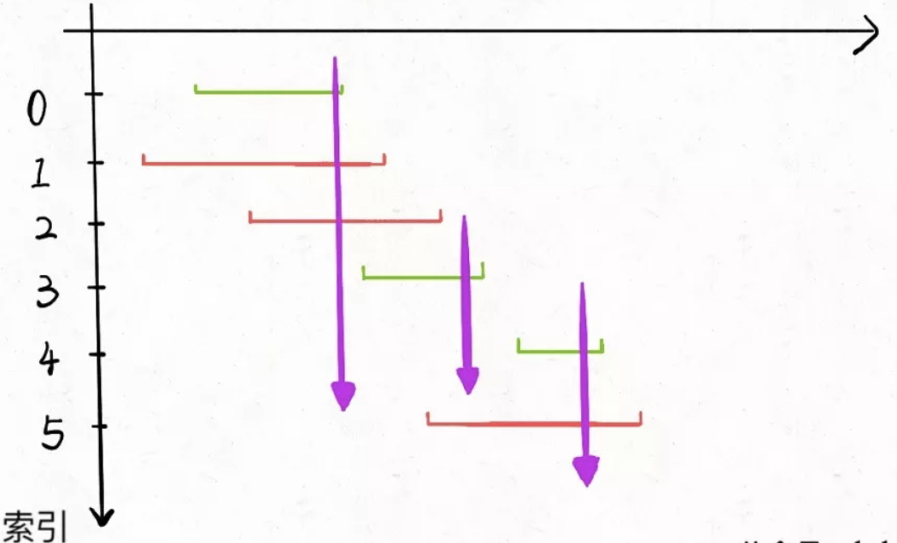                                 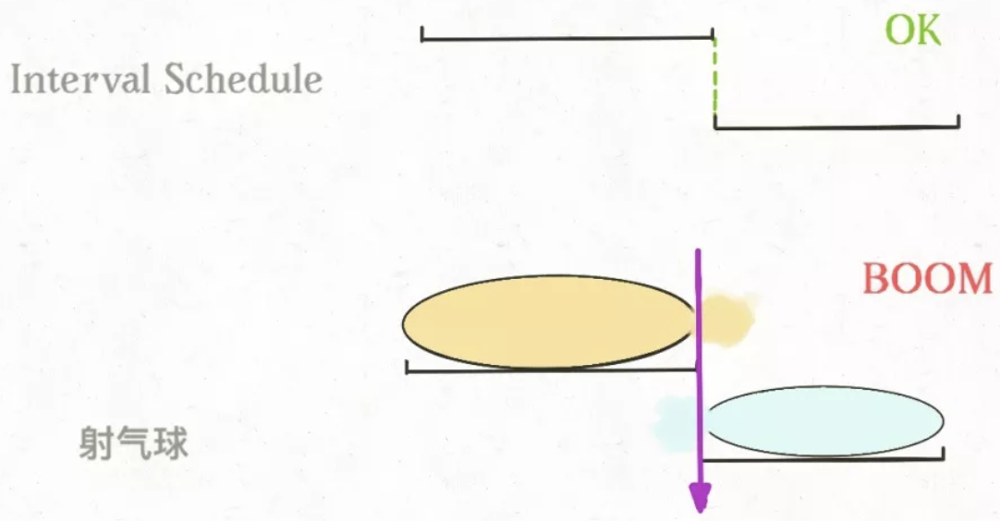

代码同上，不同之处是边界不允许一样。

## [视频拼接](https://leetcode-cn.com/problems/video-stitching/)

视频片段 clips[i] 都用区间进行表示：开始于`clips[i][0]` 并于 `clips[i][1]` 结束。我们甚至可以对这些片段自由地再剪辑，例如片段 [0, 7] 可以剪切成 [0, 1] + [1, 3] + [3, 7] 三部分。我们需要将这些片段进行再剪辑，并将剪辑后的内容拼接成覆盖整个运动过程的片段（[0, T]）。返回所需片段的最小数目，如果无法完成该任务，则返回 -1 。

**理解**：给定一个目标区间和若干小区间，如何通过裁剪和组合小区间拼凑出目标区间？最少需要几个小区间？

**思路**：先按照起点升序排序，如果起点相同的话按照终点降序排序。

**关键点**：

1. 至少得有一个短视频的起点是 0
2. 起点相同的视频，选择最长的

排序之后，第一个一定会被选择，后续选择从前一个的结尾开始往后（从起点小于前一个终点的视频中选终点最长的那个）。

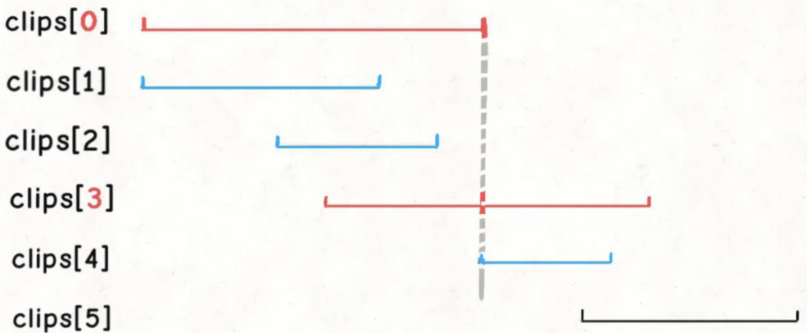

```python
def videoStitching(self, clips: List[List[int]], T: int) -> int:
    if T == 0: return 0
    # 按起点升序排列，起点相同的降序排列
    clips.sort(key=lambda x: [x[0], -x[1]])

    cnt = 0

    curEnd = 0
    nextEnd = 0
    i = 0
    n = len(clips)
    ## 从当前起点小于上一个终点的片段中选
    while i < n and clips[i][0] <= curEnd: {
		## 贪心选择下一个视频(从满足条件中找最大的)
        while i < n and clips[i][0] <= curEnd:
            nextEnd = max(nextEnd, clips[i][1])
            i+=1
        cnt += 1
        curEnd = nextEnd
        if curEnd >= T:
            return cnt
    return -1
```


## 跳跃游戏

给定一个非负整数数组 nums ，你最初位于数组的 第一个下标 。数组中的每个元素代表你在该位置可以跳跃的最大长度。判断你是否能够到达最后一个下标。(注意有的位置是0)

```python
class Solution:
    def canJump(self, nums: List[int]) -> bool:
        ## 贪心寻找当前位置能够跳到的最远位置
        n = len(nums)
        if n == 1:
            return True
        longest = 0  # 存储能够跳到的最远位置
        for i in range(n):
            ## 如果跳不到i位置，返回False
            if longest < i:
                return False
            ## 如果能跳到i位置, 更新longest
            else:
                longest = max(longest, i+nums[i])
                if longest == i and i != n-1:
                    #说明nums[i] == 0
                    return False
        return longest >= n - 1
```

## 跳跃游戏2

使用最少的跳跃次数到达数组的最后一个位置。求最少跳跃次数

```python
class Solution:
    def jump(self, nums: List[int]) -> int:
        n = len(nums)
        if n == 1:
            return 0
        longest = 0
        end = 0
        cnt = 0
        for i in range(n):
            longest = max(longest, nums[i] + i) #在当前位置最远能够跳到longest位置
            ## i不断变大，[i,end]之间会选择一个跳的最远的，先选择，当i增大到end后再执行跳的操作
            if end == i:
                cnt += 1
                end = longest
            if end >= n-1:
                break
        return cnt
```


## 组合数字使得乘积最大

```python
import sys
nums = list(map(int, sys.stdin.readline().strip().split(" ")))
# nums = [2,3,0,1,0,0,0,0,0,0]
num1, num2 = 0, 0
for i in range(len(nums)-1, -1, -1):
    cnt_i = nums[i]
    if cnt_i == 0:
        continue
    else:
        cnt = 0
        while cnt < cnt_i:
            # 根据增益判断把数字添加到哪里
            appro1 = num2*(num1 * 9 + i)
            appro2 = num1*(num2 * 9 + i)
            if appro1 >= appro2:
                num1 = num1 * 10 + i
            else:
                num2 = num2 * 10 + i
            cnt += 1
print(num1*num2)
```


# 回溯

## 概述

**回溯算法不像动态规划存在重叠子问题可以优化，回溯算法就是纯暴力穷举，复杂度一般都很高**。

1. 套路

   回溯问题是一个决策树的遍历过程

   1. 路径：已经做出的选择
   2. 选择列表：当前可以做出的选择
   3. 结束条件：到达决策树底层，无法再做出选择

2. 算法模版

```python
rst = []
def bashtrack(pth, choice_lst):
    if 满足结束条件:
        rst.append(pth)
        return 
    for choice in choice_lst:
        做选择
        backtrack(pth_new, choice_lst_new) #此处应该创建新的pth和choice_lst,否则影响下一次循环
```

## 1. 全排列

给定一个不含重复数字的数组 `nums` ，返回其 **所有可能的全排列** 。你可以 **按任意顺序** 返回答案。

```python
def permute(self, nums: List[int]) -> List[List[int]]:
    rst = []
    def dfs(pth, choices):
        if not choices:
            rst.append(pth)
        for i in range(len(choices)):
            dfs(pth+[choices[i]], choices[:i]+choices[i+1:])# a[end+1:]不会报错，但是a[end+1]会报错
    dfs([], nums)
    return rst
```

## 全排列2

给定一个可包含重复数字的序列 `nums` ，**按任意顺序** 返回所有不重复的全排列。

```python
class Solution:
    def permuteUnique(self, nums: List[int]) -> List[List[int]]:
        rst = set()
        def dfs(pth, choices):
            if not choices and tuple(pth) not in rst:
                rst.add(tuple(pth))
            for i in range(len(choices)):
                dfs(pth+[choices[i]], choices[:i]+choices[i+1:])
        dfs([], nums)
        rst = [list(x) for x in list(rst)]
        return rst
```


## [N皇后问题](https://mp.weixin.qq.com/s?__biz=MzAxODQxMDM0Mw==&mid=2247484709&idx=1&sn=1c24a5c41a5a255000532e83f38f2ce4&chksm=9bd7fb2daca0723be888b30345e2c5e64649fc31a00b05c27a0843f349e2dd9363338d0dac61&scene=21#wechat_redirect)

给一个 N×N 的棋盘，放置 N 个皇后，使得它们不能互相攻击。

PS：皇后可以攻击同一行、同一列、左上左下右上右下四个方向的任意单位。

这是 N = 8 的一种放置方法：

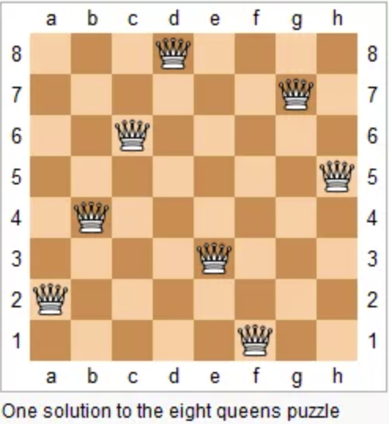

问题本质上跟全排列问题差不多，决策树的每一层表示棋盘上的每一行；每个节点可以做出的选择是在该行的任意一列放置一个皇后。

## 子集划分

给你输入一个数组`nums`和一个正整数`k`，请你判断`nums`是否能够被平分为元素和相同的`k`个子集。


## 目标和

**回溯解法**

i为index，sums为当前和

实际上是一个二叉树的遍历问题，树的深度为nums的长度，故时间复杂度是`O(2^N)`

```python
### 时间超出限制 (回溯)
def helper(i, sums):
    '''sums = sum(nums[:i])'''
    if i == len(nums):
        if sums == target:
            return 1
        else:
            return 0
    else:
        return helper(i+1, sums+nums[i]) + helper(i+1, sums-nums[i])

    return helper(0, 0)
```

**回溯剪枝**

回溯解法中有重叠子问题，如当`nums[i]=0`时，

$helper(nums, i+1, sums+nums[i], target)=helper(nums, i+1, sums-nums[i], target)$是重叠子问题。

思路：通过备忘录记忆,主键是（i，sums）

```python
### 回溯 + memo
memo = {}
def helper(i, sums):
    if i == len(nums):
        if sums == target:
            return 1
        else:
            return 0
    else:
        k = f'{i},{sums}'
        if k in memo:
            return memo[k]
        else:
            rst = helper(i+1, sums+nums[i]) + helper(i+1, sums-nums[i])
            memo[k] = rst
            return rst
return helper(0,0)
```

**dp解法（分割等和子集）**

**分析：**我们把nums分成两个子集 `A` 和 `B`，分别代表分配 `+` 的数和分配 `-` 的原始数字，那么他们和 `target` 存在如下关系：

```
sum(A) - sum(B) = target
sum(A) = target + sum(B)
sum(A) + sum(A) = target + sum(B) + sum(A)
2 * sum(A) = target + sum(nums) //将等式右边凑成一个常数值
sum(A) = (target + sum(nums)) / 2
```

此时问题变为一个分割等和子集问题

```python
def findTargetSumWays(self, nums: List[int], S: int) -> int:
	sumAll = sum(nums)
    if S > sumAll or (S + sumAll) % 2:
    	return 0
    target = (S + sumAll) // 2
    dp = [0] * (target + 1)
    dp[0] = 1

    for num in nums:
    	for j in range(target, num - 1, -1):
        	dp[j] = dp[j] + dp[j - num]
    return dp[-1]
```

# BFS

bfs把问题抽象成图，从一个点开始，向四周开始扩散。一般来说，BFS 算法都是用「队列」这种数据结构，每次将一个节点周围的所有节点加入队列。

bfs解决的问题：**在一幅「图」中找到从起点`start`到终点`target`的最近距离**

**模版**

```python
def bfs(start, end):
    queue   = [] # 核心数据结构
    visited = set() # 防止走回头路
    queue.append(start) #起点加入队列
    visited.add(start)
    step = 0 #记录扩散的步数
    
    while queue:
        # 当前队列中所有节点向四周扩散
        n = len(queue)
        for i in range(queue):
            cur = queue.pop(0) # 步数每增加一次，队列中的所有节点都向前迈一步（一次一次齐头并进）！！！
            #判断是否到达终点
            if cur == end:
                return step
            #将cur的相邻节点加入队列
            for x in cur.adj():
                if x not in visited:
                    queue.append(x)
                    visited.add(x)

        ##划重点，更新步数在这里
        step += 1
```


## 二叉树的最小高度

最小深度是指根节点到最近叶子结点的最短路径上的节点数量

起点：根节点

终点：左右孩子都为空的节点

注意：由于树结构中孩子节点不会反向指向父节点，所以不需要visited来标志

```python
'''
每次存储二叉树的一层节点，借助队列做到所有节点齐头并进，在不遍历完整棵树的前提下找到最短路径
'''
def minDepth(root):
    if not root:
        return 0
    queue = [root]
    depth = 1
    while queue:
        n = len(queue)
        for i in range(n):
            cur = queue.pop(0) 
            if cur.left is None and cur.right is None:
                return depth
        	if cur.left is not None:
            	queue.append(cur.left)
	        if cur.right is not None:
	            queue.append(cur.right)
        
        depth += 1
	return depth
```


## 打开密码锁的最少步数

四个圆形拨轮的转盘锁，初始为[0,0,0,0]，每次旋转都只能旋转一个拨轮的一位数字。列表 `deadends` 包含了一组死亡数字，拨的过程中密码数字不能出现在deadends中。字符串 `target` 代表真实密码，求最少旋转次数

输入：deadends = ["0201","0101","0102","1212","2002"], target = "0202"
输出：6


先不考虑限制，对所有可能的密码组合进行穷举。转一次有8种选择，（4个位置，每个位置有两种选择）

问题可以抽象成一张图，每个节点有8个相邻的节点，又让求最短距离，是典型的 BFS。

```python
# 将 s[j] 向上拨动一次
def plusOne(s, j):
    s = int(s)
    if s[j] == '9':
        a[j] = '0'
    else:
        a[j] = chr(ord(a[j]) + 1)
    return ''.join(a)

# 将 s[i] 向下拨动一次
def minusOne(s, j):
    s = int(s)
    if s[j] == '0':
        a[j] = '9'
    else:
        a[j] = chr(ord(a[j]) - 1)
    return ''.join(a)

# BFS 框架，打印出所有可能的密码
def bfs(deadends, target):
    deadends = set(deadends)
    queue = []
    q.append("0000")
    while queue:
        n = len(queue)
        # 将当前队列中的所有节点向周围扩散
        for i in range(n):
            cur = q.pop(0)
            /* 判断是否到达终点 */
            System.out.println(cur);

            # 将一个节点的相邻节点加入队列
            for j in range(len(cur)):
                up = plusOne(cur, j)
                down = minusOne(cur, j)
                queue.append(up)
                queue.append(down)
            }
        }
        /* 在这里增加步数 */
    }
    return;
}
```


# 单调栈

## 接雨水


## 每日温度


## 柱状图中最大矩形


## 最大矩形


```python
import sys
nums = list(map(int, sys.stdin.readline().strip().split(" ")))
num1, num2 = [], []
for i in range(9, 0, -1):
    cnt_i = nums[i]
    if cnt_i == 0:
        continue
    else:
        num1.extend([i]*cnt_i//2)
        num2.extend([i]*(cnt_i-(cnt_i//2)))
if nums[0] != 0:
    num1.extend([0]*nums[0])
print(int(''.join(num1)) * int(''.join(num2)))
```


# 滑动窗口

滑动窗口算法无非就是双指针形成的窗口扫描整个数组/子串，但关键是，你得清楚地知道什么时候应该移动右侧指针来扩大窗口，什么时候移动左侧指针来减小窗口。