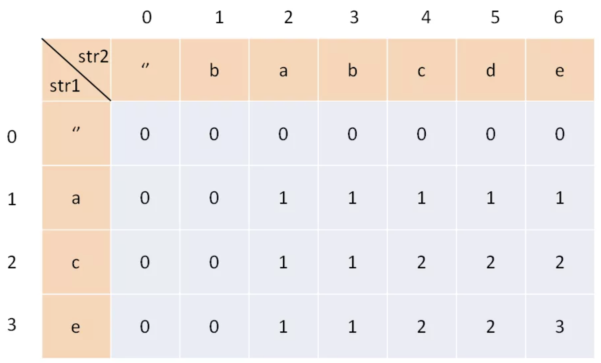

# 

1. 递归问题，画出递归树分析计算量和计算顺序

   

2. 


# 1. 排序


### 1.1 冒泡

**思路**：步长为1，窗口为2依次滑动，将每一对的较小值放在前面

一次滑动完成之后，最大值放在了最后，下一步处理`nums[:, -1]`，故需要处理 n-1 次

算法终止条件：一次扫描中没有发生交换

```python
def bubble_sort(nums):
    for i in range(1, len(nums)):
        flag = False
        for j in range(len(nums)-i):
            if nums[j + 1] < nums[j]:
                nums[j], nums[j + 1] = nums[j + 1], nums[j]
                flag = True
        if not flag:
            break
    print(nums)
```

## 1.2 快排

**思路**：冒泡排序基础上的==递归分治法==，冒泡每次相邻的交换，快排打破了这个限制

1. 从数列中挑出一个元素，称为 "基准"（pivot）;
2. 重新排序数列，所有元素比基准值小的摆放在基准前面，所有元素比基准值大的摆在基准的后面（相同的数可以到任一边）。在这个分区退出之后，该基准就处于数列的中间位置。这个称为分区（partition）操作；
3. 递归地（recursive）把小于基准值元素的子数列和大于基准值元素的子数列排序，所以partition函数中有index来标识；

```python
def quick_sort(nums, left, right):
    if left < right:
        index = partition(nums, left, right)
        quick_sort(nums, left, index-1)
        quick_sort(nums, index+1, right)
    print(nums)

def partition(nums, left, right):
    pivot = left
    index = pivot + 1
    i = pivot + 1
    while i <= right:
        if nums[i] < nums[pivot]:
            nums[i], nums[index] = nums[index], nums[i]
            index += 1
        i += 1
    nums[index-1], nums[pivot] = nums[pivot], nums[index-1]
    return index-1
```


### 1.3 归并排序

```python
def merge_sort(nums):
    if len(nums) < 2:
        return nums
    mid = len(nums) // 2
    left_part  = nums[:mid]
    right_part = nums[mid:]
    return merge(merge_sort(left_part), merge_sort(right_part))

def merge(left_part, right_part):
    rst = []
    while left_part and right_part:
        if left_part[0] >= right_part[0]:
            rst.append(right_part.pop(0))
        else:
            rst.append(left_part.pop(0))
    if left_part:
        rst.extend(left_part)
    elif right_part:
        rst.extend(right_part)
    return rst
```


## 1.4 堆排序

1. 创建一个堆 H[0……n-1]；
2. 把堆首（最大值）和堆尾互换；
3. 把堆的尺寸缩小 1，并调用 shift_down(0)，目的是把新的数组顶端数据调整到相应位置；
4. 重复步骤 2，直到堆的尺寸为 1。

```python
def heapify(nums, i, len_max=None):
    if len_max is None:
        len_max = len(nums)

    left = 2 * i + 1
    right = 2 * i + 2
    largest_idx = i
    if left < len_max and nums[left] > nums[largest_idx]:
        largest_idx = left
    if right < len_max and nums[right] > nums[largest_idx]:
        largest_idx = right
    if largest_idx != i:
        nums[i], nums[largest_idx] = nums[largest_idx], nums[i]
        heapify(nums, largest_idx, len_max)


def build_heap(nums):
    '''
    :param nums: [1, 2, 3, 5, 1]
    :return:     [5, 2, 3, 1, 1]
    '''
    for i in range(len(nums)//2, -1, -1):
        heapify(nums, i)

    return nums


def heap_sort(nums):
    len_max = len(nums)
    nums = build_heap(nums)
    for i in range(len(nums)-1, 0, -1):
        nums[i], nums[0] = nums[0], nums[i]

        len_max -= 1
        heapify(nums, 0, len_max)

    return nums
```


# 1. 动态规划

**适合的场景**

**有重叠子问题、具有最优子结构**的场景，通过 dp table 来优化穷举过程

**套路**

```
套路：
1. 确定状态和选择
2. 明确dp数组含义，用dp数组把状态描述出来
3. 定义 base case
4. 状态转移方程(根据选择确定状态转移)
```

```python
for 状态1 in 状态1列表:
		for 状态2 in 状态2列表:
      	for ...
        		dp[状态1][状态2][...] = 择优(选择1, 选择2, ...)
```

**一些理解**

dp 通过备忘录来优化穷举，其是自底向上的，一般递归是自顶向下的，因此dp一般用循环而不是递归。

## 零钱兑换

### [零钱兑换](https://leetcode-cn.com/problems/coin-change/)

给定不同面额的硬币 coins 和一个总金额 amount。编写一个函数来计算可以凑成总金额所需的**最少的硬币个数**。如果没有任何一种硬币组合能组成总金额，返回 -1。每种硬币的数量是无限的。


1. 状态：也就是原问题和子问题中变化的变量。由于硬币数量无限，所以唯一的状态就是目标金额`amount`。

   选择：从硬币列表选择硬币，然后amount减小

2. dp数组是一维的, dp[i] = 金额为i时，需要的最少硬币数量

3. base case：目标金额为0时，所需硬币数量为0

4. 状态转移方程

   dp[0] = 0

   dp[n] = -1, n<0 

   dp[n] = min{dp[n-coin] + 1 for each coin}, n>0

```python
def coinChange(self, coins: List[int], amount: int) -> int:
  dp = [float('inf')] * (amount+1)
  dp[0] = 0
  for i in range(1, amount+1):
    for coin in coins:
      if i >= coin:
	      dp[i] = min(dp[i], dp[i-coin] + 1)
	return dp[-1] if dp[-1] != float('inf') else -1 ## 考虑凑不出的情形返回-1
```

### [零钱兑换2](https://leetcode-cn.com/problems/coin-change-2/)

返回可以凑成总金额的 **所有组合方法的个数**。如果任何硬币组合都无法凑出总金额，返回 `0` 

1. 状态：总金额

    选择：选择硬币，总金额减小

2. dp[i]：能够装满i的所有方式

3. Base case: dp[0] = 1, 总金额为0时，凑法为1

4. 状态转移

    dp[i] = dp[i] + dp[i-coin],  for each coin in coins

    先循环coin再循环[coin,amount]可以保证不出现组合数的重复，可以这样理解：

    对于一个coin，对于coin 到 amount之间的数i，dp[i] 增加 dp[i-coin]，循环每个coin可得到最终结果

```python
def change(self, amount: int, coins: List[int]) -> int:
  dp = [0] * (amount+1)
  dp[0] = 1
  # 先遍历coin再遍历amount，避免重复计算组合（如，1，2和2，1是同一种）
  for coin in coins:
    for i in range(coin, amount+1):
  ##for i in range(amount+1):
    ##for coin in coins:
      if i >= coin:
        dp[i] += dp[i-coin]
  return dp[-1]
```

## 子序列问题（不连续的序列）

### 最长递增子序列

给一个无序的整数数组，求其中最长上升子序列的长度

```
输入：nums = [10,9,2,5,3,7,101,18]
输出：4
解释：最长递增子序列是 [2,3,7,101]，因此长度为 4 。
```

1. 状态是序列的每一个字符，dp是一维的

2. **dp[i] 表示以 nums[i] 这个数结尾的最长递增子序列的长度**。==为什么不能是前i个中最长递增子序列的长度==

   返回dp的最大值

3. base case: 每个字符至少为1，dp全部初始化为1

4. 状态转移

   对于`nums[i]`,查找0-i中小于nums[i]的位置j，计算dp[j]+1中的最大值作为dp[i]的值


```python
def lengthOfLIS(self, nums: List[int]) -> int:
        if not nums:
            return None
        dp = [1] * len(nums)
        for i in range(len(nums)):
            lst = [dp[j] for j in range(i) if nums[j] < nums[i]]
            if lst:
                dp[i] = max(lst) + 1
                
        return max(dp)
```


### 最长回文子序列==（2维dp）==

1. dp 数组的定义是：**在子串`s[i..j]`中，最长回文子序列的长度为`dp[i][j]`**

   ==注意`i>=j`==

假设已知`dp[i+1][j-1]`,计算`dp[i][j]`

- `s[i]==s[j] ==> dp[i][j]=dp[i+1][j-1]+2`

- `s[i]!=s[j]`说明s[i]、 s[j]不同时出现在以s[i..j]为子串的最长回文子序列中

  那么`dp[i][j]`等于它俩**分别**加入`s[i+1..j-1]`中，看看哪个子串产生的回文子序列更长

  即：`dp[i][j] = max(dp[i + 1][j], dp[i][j - 1])`

最终要求的是`dp[0][n-1]`

2. Base case

   对角线元素为1

   `i>j`即左下角初始化为0

   

3. 遍历原则

   根据依赖关系选择和最终求解的位置选择遍历方式，如dp计算时依赖左边，下边和左下的元素，最终停留在求解的位置左上角。

   

```python
def longestPalindromeSubseq(s):
    n = len(s)
    # dp 数组全部初始化为 0
    dp = [[0 for _ in range(n)] for _ in range(n)]
    # base case
    for i in range(n):
        dp[i][i] = 1
    #反着遍历保证正确的状态转移,先计算右下角，从下往上 从左往右 遍历
    for i in range(n - 2, -1, -1):
        for j in range(i + 1, n):
            #状态转移方程
            if s[i] == s[j]
                dp[i][j] = dp[i + 1][j - 1] + 2
            else
                dp[i][j] = max(dp[i + 1][j], dp[i][j - 1])
        
    #整个 s 的最长回文子串长度
    return dp[0][n - 1]
```

#### **状态压缩（将二维数组 ==投影== 到一维数组）**

计算`dp[i][j]`只需要这三个相邻状态，其实根本不需要维护那么大一个二维的 dp table.


向下投影时（一般向下投影，把`i`这个维度去掉），`dp[i][j-1]` 和 `dp[i+1][j-1]` 其中有一个值会被覆盖，我们采用一个临时变量保存来解决这个问题。

先无脑丢掉维度`i`

**站在当前`i`和`j`的位置分析`dp[j]`和`dp[j-1]`：**

1. `dp[i+1][j]`： `j`循环更改一维dp数组`dp[j]`的值，对于一个固定的$j$，在更改其值之前，其存储的是上一次修改是在外层循环`i=i+1`时的值，即`dp[j]`对应原始二维dp数组的`dp[i+1][j]`

2. `dp[i][j-1]`：  `dp[j-1]`是在内层循环j中的上一次（j-1）进行修改的，此时的外层循环为i，即`dp[j-1]`对应原始数组`dp[i][j-1]`

   

3. `dp[i+1][j-1]`：目前原始数组`dp[i+1][j] ==> dp[j]`, `dp[i][j-1] ==> dp[j-1]`，还剩下`dp[i+1][j-1]`在一维dp数组中没有对应的位置，因此，我们定义一个临时变量存储每次变化的`dp[i+1][j-1]`。 **那么如果我们想得到`dp[i+1][j-1]`，就必须在它被覆盖之前用一个临时变量`temp`把它存起来，并把这个变量的值保留到计算`dp[i][j]`的时候**

   

```python
for i in range(n - 2, -1, -1):
  	for j in range(i + 1, n):    
        #状态转移方程
        if s[i] == s[j]:
            #dp[i][j] = dp[i + 1][j - 1] + 2
            dp[j] = ?? + 2
        else:
            #dp[i][j] = max(dp[i + 1][j], dp[i][j - 1])
            dp[j] = max(dp[j], dp[j-1])
```


```python
def longestPalindromeSubseq(s):
    n = len(s)
    # dp 数组全部初始化为 0
    dp = [[0 for _ in range(n)] for _ in range(n)]
    # base case
    for i in range(n):
        dp[i][i] = 1
    #反着遍历保证正确的状态转移,先计算右下角，从下往上从左往右便利
    for i in range(n - 2, -1, -1):
        pre = 0
        for j in range(i + 1, n):
            #状态转移方程
            if s[i] == s[j]
                #dp[i][j] = dp[i + 1][j - 1] + 2
              	dp[j] = ?? + 2
            else
                #dp[i][j] = max(dp[i + 1][j], dp[i][j - 1])
              	dp[j] = 
        
    #整个 s 的最长回文子串长度
    return dp[0][n - 1]
```


#### 最长回文子串（字串是连续的）

首先注意的点：回文串可能是奇数也可能是偶数，一般用**双指针**来解决，从中间向两边扩展

```python
def longestPalindrome(self, s: str) -> str:
    ## 	中心扩展
    def find_max(s, l, r):
      while l >= 0 and r < len(s) and s[l] == s[r]:
        l -= 1
        r+=1
        return l+1, r-1
    
    ## 每个位置都进行中心扩展
    top, down = 0,0
    for i in range(len(s)):
      ## 以i为中心的回文子串
      l1, r1 = find_max(s,i,i)
      if r1-l1 > down-top:
        top, down = l1, r1
      ## 以i和i+1为中心的回文子串
      l2, r2 = find_max(s,i,i+1)
      if r2-l2 > down-top:
        top, down = l2, r2
return s[top: down+1]
```


### 最长公共子序列（2维dp）

输入: str1 = "abcde", str2 = "ace" 
输出: 3 
解释: 最长公共子序列是 "ace"，它的长度是 3

`子序列类型的问题，穷举出所有可能的结果都不容易，而动态规划算法做的就是穷举 + 剪枝，它俩天生一对儿。所以可以说只要涉及子序列问题，十有八九都需要动态规划来解决`

1. 明确 dp table

   一般两个字符串的问题，都是构造一个`m+1 * n+1`的dp table

   

   **`dp[i][j]`的含义是：对于`s1`中前`i`个和`s2`中前`j`个，它们的 LCS 长度是`dp[i][j]`**

2. Base case

   `dp[0][..]`和`dp[..][0]`都为0

3. 选择：`i,j`对应的字符在不在LCS中

4. 状态转移

   如果`s1[i]==s2[j]`则这个字符一定在LCS中， `dp[i][j] = dp[i-1][j-1]+1`

   如果`s1[i]!=s2[j]`则至少有一个字符不在LCS中， `dp[i][j] = max(dp[i-1][j],dp[i][j-1],dp[i-1][j-1])`

```python
def longestCommonSubsequence(self, text1: str, text2: str) -> int:
        m, n = len(text1), len(text2)
        dp = [[0] * (n + 1) for _ in range(m + 1)]
        
        for i in range(1, m + 1):
            for j in range(1, n + 1):
                if text1[i - 1] == text2[j - 1]:
                    dp[i][j] = dp[i - 1][j - 1] + 1
                else:
                    dp[i][j] = max(dp[i - 1][j], dp[i][j - 1])
        
        return dp[m][n]
```


### 编辑距离（2维dp）

### 


## 1.1 背包问题

给定一个target（背包容量）和一个数组（物品），能否按照一定方式选取物品得到target

选取方式：每个元素选一次/每个元素选多次/选元素进行排列组合

### 1.1.1 01背包问题：每个元素最多选取一次

给你一个可装载重量为`W`的背包和`N`个物品，每个物品有重量和价值两个属性。其中第`i`个物品的重量为`wt[i]`，价值为`val[i]`，现在让你用这个背包装物品，最多能装的价值是多少？

1.  明确状态和选择

   状态：用来描述一个问题所需要的变量，即背包容量和可选择的物品，所以状态有两个背包容量和物品重量

   选择：物品装或者不装

2. ==用dp描述状态==

   状态有两个，用二维数组描述

   `dp[i][w]`：对于前`i`个物品，当前背包的容量为`w`，这种情况下可以装的最大价值是`dp[i][w]`

   所求的是`dp[N][W]`

3. base case

   `dp[...][0]` = 0, `dp[0][...]`=0

   ```python
   dp = [N+1][W+1]
   dp[0][...] = 0
   dp[...][0] = 0
   
   for i in [1..N]:
     for w in [1..W]:
       dp[i][w] = max(
         物品i装进背包，
         物品i不装进背包
       )
   return dp[N][W]
   ```

4. 根据==选择==确定状态转移方式

   如果第`i`个物品没有装进背包：`dp[i][w]=dp[i-1][w]`

   如果第`i`个物品没有装进背包：`dp[i][w]=dp[i-1][w-wt[i-1]]+val[i-1]`

   迭代结果是上述两个的最大值

   ```python
   for i in [1..N]:
       for w in [1..W]:
         if w - wt[i-1]<0:
           dp[i][w] = dp[i-1][w] # 背包装不下第i个物品
         else:
           dp[i][w] = max(
             dp[i-1][w],
             dp[i-1][w - wt[i-1]] + val[i-1]
           )
   return dp[N][W]
   ```

   

### 1.1.2 分割等和子集

给一个容量为`sum/2`的背包和一个物品列表（物品只包含重量），问是否存在一种装法刚好装满背包

1. 状态和选择

   状态：描述问题需要背包容量和物品重量，故状态是背包容量和物品重量

   选择：物品装或不装

2. 用dp描述状态

   **`dp[i][w]`：前`i`个商品是否能够装满容量为`w`的背包**

   最终求的是`dp[i][sum/2]`

3. base case

   `dp[0][...]`=False	#没有物品时不能装满背包

   `dp[...][0]`=True     #背包容量为0时可以什么都不装

4. 根据==选择==确定状态转移

   第`i`个商品装进背包：`dp[i][w] = dp[i-1][w-nums[i-1]]`

   第`i`个商品不装进被背包：`dp[i][w] = dp[i-1][w]`

   上述两个选择只有有一个是True，则此步迭代结果就是True

注意的点：

1. 如果sum是奇数，肯定不能满足条件
2. 判断`w-nums[i-1]`是否小于0
3. 注意index的对应关系

```python
def canPartition(self, nums: List[int]) -> bool:
    s = sum(nums)
    if s & 1:
        return False

    # 初始化
    dp = [[False for _ in range(s//2+1)] for _ in range(len(nums)+1)]
    for i in range(len(nums)+1):
        dp[i][0] = True

    # 状态转移
    for i in range(1, len(nums)+1):
        for j in range(1, s//2+1):
            dp[i][j] = dp[i-1][j]
            if nums[i-1] <= j:
                dp[i][j] = dp[i-1][j] or dp[i-1][j-nums[i-1]]
	return dp[-1][-1]
```


#### 状态压缩

观察dp数组的转移方式，查看其依赖的上游是那些，根据传递关系优化空间使用。

`dp[i][w]`都是通过上一行的`dp[i-1][...]`转移过来的。


### 1.1.3 组合背包问题：背包中的物品要考虑顺序


### 1.1.4 分组背包问题：不止一个背包，需要遍历每个背包


## 最长公共子序列

```
dp[i][j]的含义是：对于s1[1..i]和s2[1..j]，它们的 LCS 长度是dp[i][j]

```




## 编辑距离

