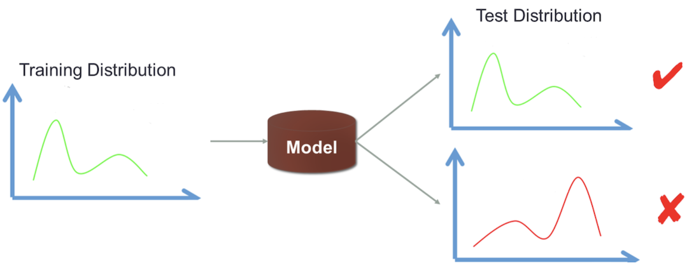

# 因果推断

## 《what if》

## 《CAUSAL INFERENCE IN STATISTICS A PRIMER》

Judea Pearl的[CAUSAL INFERENCE IN STATISTICS A PRIMER](http://bayes.cs.ucla.edu/PRIMER/) 一书，因果性问题涉及到的重要书籍，及选择阅读逻辑，可以参考[这里](https://www.bradyneal.com/img/books_flowchart.svg)。

因果性相关的研究尤其是因果性和机器学习如何结合近两年来更加受到AI学术界的关注，关注学术界相关的历史和最新工作，可以[Follow这个页面的更新](https://sites.google.com/view/causal-inference-zerotoall/home)。

**然而，无论是因果性研究本身，还是单纯理解因果性本身的基础理论都比较难。**之前的同学对[因果推断做过整体的介绍](http://way.xiaojukeji.com/article/25308)，核心的基础理论框架有Judea Pearl的SCM和Donald B. Rubin的Potential Outcome Framework（潜在结果框架），近年来相关研究逐步认为这两者是等价的（关于两者之前的差异可以[关注这里](http://causality.cs.ucla.edu/blog/index.php/2012/12/03/judea-pearl-on-potential-outcomes/) ，顺便可以学习一下科学家是怎么battle的）。

PS，最近刚发现有中译本了，感兴趣的同学也可以直接看中译本，搜 统计因果推理入门 就能买到

# OOD问题

Out-Of-Distribution

survey：Towards Out-Of-Distribution Generalization: A Survey

# AUTOML

