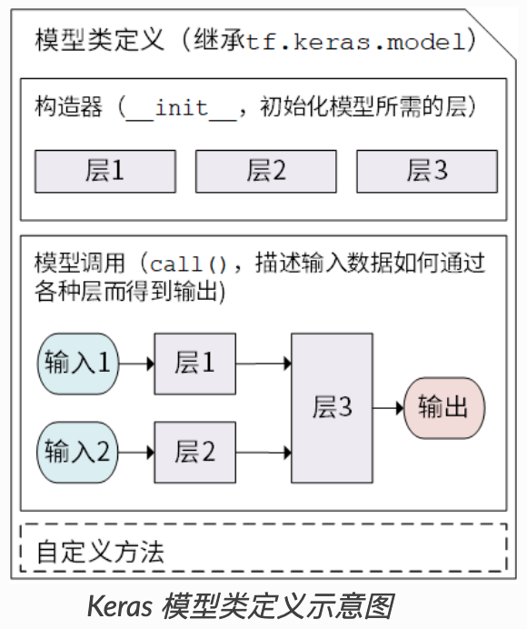

book: https://tf.wiki/zh_hans/

# TF基础

## Tensor

### 张量定义

```python
# 随机
random_float = tf.random.uniform(shape=())

# 零
zero_vector = tf.zeros(shape=(2))

# 常量
A = tf.constant([[1., 2.], [3., 4.]])
B = tf.constant([[5., 6.], [7., 8.]])
```

### 张量运算

```python
# 计算矩阵A和B的和
C = tf.add(A, B)

# 计算矩阵A和B的乘积
D = tf.matmul(A, B)

# 沿着指定的轴对输入张量这个轴的所有元素求和
tf.reduce_sum()

# 逐元素平方
tf.square()

# reshape
tf.reshape(tensor, shape)

# 拼接
tf.concat([t1, t2], axis=0)
```

## 自动求导机制

在即时执行模式下，TensorFlow 引入了 `tf.GradientTape()` 这个 “求导记录器” 来实现自动求导。

**变量**：变量与普通张量的一个重要区别是其默认能够被 TensorFlow 的自动求导机制所求导，因此往往被用于定义机器学习模型的参数。

**例1 (对标量求导)**

```python
import tensorflow as tf

x = tf.Variable(initial_value=3.)
with tf.GradientTape() as tape:     # 在 tf.GradientTape() 的上下文内，所有计算步骤都会被记录以用于求导
    y = tf.square(x)
y_grad = tape.gradient(y, x)        # 计算y关于x的导数
print(y, y_grad)
```

输出：

```
tf.Tensor(9.0, shape=(), dtype=float32)
tf.Tensor(6.0, shape=(), dtype=float32)
```

`tf.GradientTape()` 是一个自动求导的记录器，只要进入了 `with tf.GradientTape() as tape` 的上下文环境，则在该环境中计算步骤都会被自动记录。比如在上面的示例中，计算步骤 `y = tf.square(x)` 即被自动记录。离开上下文环境后，记录将停止，但记录器 `tape` 依然可用，因此可以通过 `y_grad = tape.gradient(y, x)` 求张量 `y` 对变量 `x` 的导数。

**例2（对向量求导）**

```python
X = tf.constant([[1., 2.], [3., 4.]])
y = tf.constant([[1.], [2.]])
w = tf.Variable(initial_value=[[1.], [2.]])
b = tf.Variable(initial_value=1.)
with tf.GradientTape() as tape:
    L = tf.reduce_sum(
        tf.square(tf.matmul(X, w) + b - y)
    )
w_grad, b_grad = tape.gradient(L, [w, b])        # 计算L(w, b)关于w, b的偏导数
print(L, w_grad, b_grad)
```

输出：

```
tf.Tensor(125.0, shape=(), dtype=float32)

tf.Tensor(
[[ 70.]
[100.]], shape=(2, 1), dtype=float32)

tf.Tensor(30.0, shape=(), dtype=float32)
```

## LR示例

拟合函数为：$y=ax+b$

1. 定义数据并归一化

   ```python
   import numpy as np
   
   X_raw = np.array([2013, 2014, 2015, 2016, 2017], dtype=np.float32)
   y_raw = np.array([12000, 14000, 15000, 16500, 17500], dtype=np.float32)
   
   X = (X_raw - X_raw.min()) / (X_raw.max() - X_raw.min())
   y = (y_raw - y_raw.min()) / (y_raw.max() - y_raw.min())
   ```

2. 基于tf的LR

   ```python
   X = tf.constant(X)
   y = tf.constant(y)
   
   a = tf.Variable(initial_value=0.)
   b = tf.Variable(initial_value=0.)
   variables = [a, b]
   
   num_epoch = 10000
   optimizer = tf.keras.optimizers.SGD(learning_rate=5e-4) # 优化器可以根据计算出的求导结果 更新模型参数
   for e in range(num_epoch):
       
       # 使用tf.GradientTape()记录损失函数的梯度信息
       with tf.GradientTape() as tape:
           y_pred = a * X + b
           loss = tf.reduce_sum(tf.square(y_pred - y))
       
       # TensorFlow自动计算损失函数关于自变量（模型参数）的梯度
       grads = tape.gradient(loss, variables)
   
       # TensorFlow自动根据梯度更新参数
       optimizer.apply_gradients(grads_and_vars=zip(grads, variables))
   ```

   在实际应用中，我们编写的模型往往比这里一行就能写完的线性模型 `y_pred = a * X + b` （模型参数为 `variables = [a, b]` ）要复杂得多。所以，我们往往会编写并实例化一个模型类 `model = Model()` ，然后使用 `y_pred = model(X)` 调用模型，使用 `model.variables` 获取模型参数。

# TF模型建立与训练 

推荐使用 Keras（ `tf.keras` ）构建模型，Keras 有两个重要的概念： **模型（Model）** 和 **层（Layer）** 。**Layer** 将各种计算流程和变量进行了封装（例如基本的全连接层，CNN 的卷积层、池化层等），而 **Model** 则将各种层进行组织和连接，并封装成一个整体，描述了如何将输入数据通过各种层以及运算而得到输出。

在需要模型调用的时候，使用 `y_pred = model(X)` 的形式即可。Keras 在 `tf.keras.layers` 下内置了深度学习中大量常用的的预定义层，同时也允许我们自定义层。

- 模型的构建： `tf.keras.Model` 和 `tf.keras.layers`
- 模型的损失函数： `tf.keras.losses`
- 模型的优化器： `tf.keras.optimizer`
- 模型的评估： `tf.keras.metrics`


## Model

Keras 模型以类的形式呈现，我们可以通过继承 `tf.keras.Model` 这个 Python 类来定义自己的模型。在继承类中，我们需要重写 `__init__()` （构造函数，初始化）和 `call(input)` （模型调用）两个方法（即继承 `tf.keras.Model` 并重载 `call()` 方法），同时也可以根据需要增加自定义的方法。

继承 `tf.keras.Model` 后，我们同时可以使用父类的若干方法和属性，例如在实例化类 `model = Model()` 后，可以通过 `model.variables` 这一属性直接获得模型中的所有变量，免去我们一个个显式指定变量的麻烦。



### 简单示例

```python
class MyModel(tf.keras.Model):
    def __init__(self):
        super().__init__()     # Python 2 下使用 super(MyModel, self).__init__()
        # 此处添加初始化代码（包含 call 方法中会用到的层），例如
        # layer1 = tf.keras.layers.BuiltInLayer(...)
        # layer2 = MyCustomLayer(...)

    def call(self, input):
        # 此处添加模型调用的代码（处理输入并返回输出），例如
        # x = layer1(input)
        # output = layer2(x)
        return output

    # 还可以添加自定义的方法
```

### LR

线性模型 `y_pred = a * X + b` ，我们可以通过模型类的方式编写如下：

```python
import tensorflow as tf

X = tf.constant([[1.0, 2.0, 3.0], [4.0, 5.0, 6.0]])
y = tf.constant([[10.0], [20.0]])


class Linear(tf.keras.Model):
    def __init__(self):
        super().__init__()
        self.dense = tf.keras.layers.Dense(
            units=1,
            activation=None,
            kernel_initializer=tf.zeros_initializer(),
            bias_initializer=tf.zeros_initializer()
        )

    def call(self, input):
        output = self.dense(input)
        return output


# 以下代码结构与前节类似
model = Linear()
optimizer = tf.keras.optimizers.SGD(learning_rate=0.01)
for i in range(100):
    with tf.GradientTape() as tape:
        y_pred = model(X)      # 调用模型 y_pred = model(X) 而不是显式写出 y_pred = a * X + b
        loss = tf.reduce_mean(tf.square(y_pred - y))
    grads = tape.gradient(loss, model.variables)    # 使用 model.variables 这一属性直接获得模型中的所有变量
    optimizer.apply_gradients(grads_and_vars=zip(grads, model.variables))
print(model.variables)
```

## MLP

- 使用 `tf.keras.datasets` 获得数据集并预处理
- 使用 `tf.keras.Model` 和 `tf.keras.layers` 构建模型
- 构建模型训练流程，使用 `tf.keras.losses` 计算损失函数，并使用 `tf.keras.optimizer` 优化模型
- 构建模型评估流程，使用 `tf.keras.metrics` 计算评估指标


**用MNIST进行10分类**

1. **交叉熵**

    `tf.keras.losses.categorical_crossentropy` 和 `tf.keras.losses.sparse_categorical_crossentropy` 。

   不需要onehot

   ```
   loss = tf.keras.losses.sparse_categorical_crossentropy(y_true=y, y_pred=y_pred)
   ```

   需要onehot

   ```
   loss = tf.keras.losses.categorical_crossentropy(
       y_true=tf.one_hot(y, depth=tf.shape(y_pred)[-1]),
       y_pred=y_pred
   )
   ```

2. **code**

```python
class MNISTLoader():
    def __init__(self):
        mnist = tf.keras.datasets.mnist
        (self.train_data, self.train_label), (self.test_data, self.test_label) = mnist.load_data()
        # MNIST中的图像默认为uint8（0-255的数字）。以下代码将其归一化到0-1之间的浮点数，并在最后增加一维作为颜色通道
        self.train_data = np.expand_dims(
            self.train_data.astype(np.float32) / 255.0, axis=-1)      # [60000, 28, 28, 1]
        self.test_data = np.expand_dims(
            self.test_data.astype(np.float32) / 255.0, axis=-1)        # [10000, 28, 28, 1]
        self.train_label = self.train_label.astype(np.int32)    # [60000]
        self.test_label = self.test_label.astype(np.int32)      # [10000]
        self.num_train_data, self.num_test_data = self.train_data.shape[0], self.test_data.shape[0]

    def get_batch(self, batch_size):
        # 从数据集中随机取出batch_size个元素并返回
        index = np.random.randint(0, self.num_train_data, batch_size)
        return self.train_data[index, :], self.train_label[index]
    
class MLP(tf.keras.Model):
    def __init__(self):
        super().__init__()
        self.flatten = tf.keras.layers.Flatten()    # Flatten层将除第一维（batch_size）以外的维度展平
        self.dense1 = tf.keras.layers.Dense(units=100, activation=tf.nn.relu)
        self.dense2 = tf.keras.layers.Dense(units=10)

    def call(self, inputs):         # [batch_size, 28, 28, 1]
        x = self.flatten(inputs)    # [batch_size, 784]
        x = self.dense1(x)          # [batch_size, 100]
        x = self.dense2(x)          # [batch_size, 10]
        output = tf.nn.softmax(x)
        return output
    
## 超参数
num_epochs = 5
batch_size = 50
learning_rate = 0.001

model = MLP()
data_loader = MNISTLoader()
optimizer = tf.keras.optimizers.Adam(learning_rate=learning_rate)

## 模型训练（tf.keras.losses 和 tf.keras.optimizer）
'''
然后迭代进行以下步骤：
从 DataLoader 中随机取一批训练数据；
将这批数据送入模型，计算出模型的预测值；
将模型预测值与真实值进行比较，计算损失函数（loss）。这里使用 tf.keras.losses 中的交叉熵函数作为损失函数；
计算损失函数关于模型变量的导数；
将求出的导数值传入优化器，使用优化器的 apply_gradients 方法更新模型参数以最小化损失函数。
'''
num_batches = int(data_loader.num_train_data // batch_size * num_epochs)
for batch_index in range(num_batches):
    X, y = data_loader.get_batch(batch_size)
    with tf.GradientTape() as tape:
        y_pred = model(X)
        loss = tf.keras.losses.sparse_categorical_crossentropy(y_true=y, y_pred=y_pred)
        loss = tf.reduce_mean(loss)
        print("batch %d: loss %f" % (batch_index, loss.numpy()))
	grads = tape.gradient(loss, model.variables)
    optimizer.apply_gradients(grads_and_vars=zip(grads, model.variables))
    
## 模型评估（tf.keras.metrics）
'''
每次通过 update_state() 方法向评估器输入两个参数： y_pred 和 y_true ，即模型预测出的结果和真实结果。
评估器具有内部变量来保存当前评估指标相关的参数数值（例如当前已传入的累计样本数和当前预测正确的样本数）。
迭代结束后，使用 result() 方法输出最终的评估指标值（预测正确的样本数占总样本数的比例）
'''
sparse_categorical_accuracy = tf.keras.metrics.SparseCategoricalAccuracy()
num_batches = int(data_loader.num_test_data // batch_size)
for batch_index in range(num_batches):
    start_index, end_index = batch_index * batch_size, (batch_index + 1) * batch_size
    y_pred = model.predict(data_loader.test_data[start_index: end_index])
    sparse_categorical_accuracy.update_state(
        y_true=data_loader.test_label[start_index: end_index],
        y_pred=y_pred
    )
print("test accuracy: %f" % sparse_categorical_accuracy.result())
```

## CNN

下给出代码的模型部分，其他部分和 MLP 保持一致

```python
class CNN(tf.keras.Model):
    def __init__(self):
        super().__init__()
        self.conv1 = tf.keras.layers.Conv2D(
            filters=32,             # 卷积层神经元（卷积核）数目
            kernel_size=[5, 5],     # 感受野大小
            padding='same',         # padding策略（vaild 或 same）
            activation=tf.nn.relu   # 激活函数
        )
        self.pool1 = tf.keras.layers.MaxPool2D(pool_size=[2, 2], strides=2)
        self.conv2 = tf.keras.layers.Conv2D(
            filters=64,
            kernel_size=[5, 5],
            padding='same',
            activation=tf.nn.relu
        )
        self.pool2 = tf.keras.layers.MaxPool2D(pool_size=[2, 2], strides=2)
        self.flatten = tf.keras.layers.Reshape(target_shape=(7 * 7 * 64,))
        self.dense1 = tf.keras.layers.Dense(units=1024, activation=tf.nn.relu)
        self.dense2 = tf.keras.layers.Dense(units=10)

    def call(self, inputs):
        x = self.conv1(inputs)                  # [batch_size, 28, 28, 32]
        x = self.pool1(x)                       # [batch_size, 14, 14, 32]
        x = self.conv2(x)                       # [batch_size, 14, 14, 64]
        x = self.pool2(x)                       # [batch_size, 7, 7, 64]
        x = self.flatten(x)                     # [batch_size, 7 * 7 * 64]
        x = self.dense1(x)                      # [batch_size, 1024]
        x = self.dense2(x)                      # [batch_size, 10]
        output = tf.nn.softmax(x)
        return output
```

### [预训练网络](https://keras.io/api/applications/)

`tf.keras.applications` 中有一些预定义好的经典卷积神经网络结构，如 `VGG16` 、 `VGG19` 、 `ResNet` 、 `MobileNet` 等。我们可以直接调用这些经典的卷积神经网络结构（甚至载入预训练的参数），而无需手动定义网络结构。

```python
model = tf.keras.applications.MobileNetV2()
```

当执行以上代码时，TensorFlow 会自动从网络上下载 `MobileNetV2` 网络的预训练权值，因此在第一次执行代码时需要具备网络连接。也可以通过将参数 `weights` 设置为 `None` 来随机初始化变量而不使用预训练权值。每个网络结构具有自己特定的详细参数设置，一些共通的常用参数如下：

- `input_shape` ：输入张量的形状（不含第一维的 Batch），大多默认为 `224 × 224 × 3` 。一般而言，模型对输入张量的大小有下限，长和宽至少为 `32 × 32` 或 `75 × 75` ；
- `include_top` ：在网络的最后是否包含全连接层，默认为 `True` ；
- `weights` ：预训练权值，默认为 `'imagenet'` ，即为当前模型载入在 ImageNet 数据集上预训练的权值。如需随机初始化变量可设为 `None` ；
- `classes` ：分类数，默认为 1000。修改该参数需要 `include_top` 参数为 `True` 且 `weights` 参数为 `None` 。


## Keras pipeline

Keras 提供的另一套更为简单高效的内置方法来建立、训练和评估模型。

### Sequential API

 通过向 `tf.keras.models.Sequential()` 提供一个层的列表，就能快速地建立一个 `tf.keras.Model` 模型并返回。

```python
model = tf.keras.models.Sequential([
            tf.keras.layers.Flatten(),
            tf.keras.layers.Dense(100, activation=tf.nn.relu),
            tf.keras.layers.Dense(10),
            tf.keras.layers.Softmax()
        ])
```

### Functional API

```python
inputs = tf.keras.Input(shape=(28, 28, 1))
x = tf.keras.layers.Flatten()(inputs)
x = tf.keras.layers.Dense(units=100, activation=tf.nn.relu)(x)
x = tf.keras.layers.Dense(units=10)(x)
outputs = tf.keras.layers.Softmax()(x)

model = tf.keras.Model(inputs=inputs, outputs=outputs)
```

### 模型训练

```python
## 配置训练过程
model.compile(
        optimizer=tf.keras.optimizers.Adam(learning_rate=0.001),
        loss=tf.keras.losses.sparse_categorical_crossentropy,
        metrics=[tf.keras.metrics.sparse_categorical_accuracy]
    )

## 训练模型
model.fit(
    x = data_loader.train_data,
    y = data_loader.train_label,
    epochs = num_epochs,
    batch_size = batch_size,
    validation_data = None
)

## 评估
model.evaluate(data_loader.test_data, data_loader.test_label)
```

## 自定义Layer（AFM）

自定义层需要继承 `tf.keras.layers.Layer` 类，并重写 `__init__` 、 `build` 和 `call` 三个方法，如下所示

```python
class MyLayer(tf.keras.layers.Layer):
    def __init__(self):
        super().__init__()
        # 初始化代码

    def build(self, input_shape):     # input_shape 是一个 TensorShape 类型对象，提供输入的形状
        # 在第一次使用该层的时候调用该部分代码，在这里创建变量可以使得变量的形状自适应输入的形状
        # 而不需要使用者额外指定变量形状。
        # 如果已经可以完全确定变量的形状，也可以在__init__部分创建变量
        self.variable_0 = self.add_weight(...)
        self.variable_1 = self.add_weight(...)

    def call(self, inputs):
        # 模型调用的代码（处理输入并返回输出）
        return output
```

**例子（FC）**

```python
class LinearLayer(tf.keras.layers.Layer):
    def __init__(self, units):
        super().__init__()
        self.units = units

    def build(self, input_shape):     # 这里 input_shape 是第一次运行call()时参数inputs的形状
        self.w = self.add_weight(
            name='w',
            shape=[input_shape[-1], self.units],
            initializer=tf.zeros_initializer()
        )
        self.b = self.add_weight(
            name='b',
            shape=[self.units],
            initializer=tf.zeros_initializer()
        )

    def call(self, inputs):
        y_pred = tf.matmul(inputs, self.w) + self.b
        return y_pred
```

**例子（AFM）**

```python
class AFM(Layer):
    """
    Input shape:
        3D-tensor with shape: `(batch_size, feature_num, embedding_size)`

    Output shape:
        2D-tensor with shape: `(batch_size, embedding_size)`
    """

    def __init__(self,
                 attention_factor,
                 l2_reg=0,
                 dropout_rate=0.1,
                 kernel_initializer='glorot_uniform',
                 bias_initializer='zeros',
                 **kwargs):
        super().__init__(**kwargs)
        self.attention_factor = attention_factor
        self.l2_reg = regularizers.l2(l2_reg)
        self.dropout_rate = dropout_rate
        self.kernel_initializer = initializers.get(kernel_initializer)
        self.bias_initializer = initializers.get(bias_initializer)
        super(AFM, self).__init__(**kwargs)

    def build(self, input_shape):
        if len(input_shape) != 3:
            raise ValueError('AFM layer requires input shape of `(batch_size, feature_num, embedding_size)`!')

        embedding_size = input_shape[2]
        self.embedding_size = embedding_size

        # attention net weights
        self.attention_w = self.add_weight(
            'attention_w',
            shape=[embedding_size, self.attention_factor],
            initializer=self.kernel_initializer,
            regularizer=self.l2_reg
        )
        # attention net bias
        self.attention_b = self.add_weight(
            'attention_b',
            shape=[self.attention_factor, ],
            initializer=self.bias_initializer,
            regularizer=self.l2_reg
        )
        # attention output projection
        self.attention_p = self.add_weight(
            'attention_p',
            shape=[self.attention_factor, 1],
            initializer=self.kernel_initializer,
            regularizer=self.l2_reg
        )

        self.built = True

    def call(self, inputs, **kwargs):
        shape = inputs.shape  # (batch_size, feature_nums, emb_dim)

        # step 1. get element-wise interaction <v_i, v_j>*x_i*x_j
        v_x_1 = K.expand_dims(inputs, axis=1)  # [batch, 1, input, emb]
        v_x_2 = K.expand_dims(inputs, axis=2)  # [batch, input, 1, emb]
        cross = v_x_1 * v_x_2  # [batch, input, input, emb]
        # reshape to [batch, input**2, emb]
        cross = K.reshape(cross, shape=(-1, shape[1] ** 2, self.embedding_size))

        # step 2. get attention weight with attention net
        # we use a two layer MLP with size of [ attention_factor, 1]
        # to calculate attention weight matrix a_ij
        a1 = K.dot(cross, self.attention_w) + self.attention_b  # [batch, input**2, factor]
        a1 = K.relu(a1)
        a2 = K.dot(a1, self.attention_p)  # [batch, input**2, 1]
        a_matrix = K.softmax(a2, axis=1)

        # step 3. attach weight / sum pooling / projection
        a_cross = cross * a_matrix  # [batch, input**2, emb]
        a_cross = Dropout(self.dropout_rate)(a_cross, training=True)
        a_cross = K.sum(a_cross, axis=1)  # [batch, emb]
        return a_cross

    def compute_output_shape(self, input_shape):
        return None, self.embedding_size

    def get_config(self, ):
        config = {'attention_factor': self.attention_factor,
                  'l2_reg': self.l2_reg, 'dropout_rate': self.dropout_rate}
        base_config = super(AFM, self).get_config()
        config.update(base_config)
        return config
```

## 自定义loss

定义损失函数需要继承 `tf.keras.losses.Loss` 类，重写 `call` 方法即可，输入真实值 `y_true` 和模型预测值 `y_pred` ，输出模型预测值和真实值之间通过自定义的损失函数计算出的损失值。

**例子（MSE）**

```python
class MeanSquaredError(tf.keras.losses.Loss):
    def call(self, y_true, y_pred):
        return tf.reduce_mean(tf.square(y_pred - y_true))
```


## 自定义metrics（评估指标）

自定义评估指标需要继承 `tf.keras.metrics.Metric` 类，并重写 `__init__` 、 `update_state` 和 `result` 三个方法。

**例子（SparseCategoricalAccuracy）**

```python
class SparseCategoricalAccuracy(tf.keras.metrics.Metric):
    def __init__(self):
        super().__init__()
        self.total = self.add_weight(name='total', dtype=tf.int32, initializer=tf.zeros_initializer())
        self.count = self.add_weight(name='count', dtype=tf.int32, initializer=tf.zeros_initializer())

    def update_state(self, y_true, y_pred, sample_weight=None):
        values = tf.cast(tf.equal(y_true, tf.argmax(y_pred, axis=-1, output_type=tf.int32)), tf.int32)
        self.total.assign_add(tf.shape(y_true)[0])
        self.count.assign_add(tf.reduce_sum(values))

    def result(self):
        return self.count / self.total
```

## 自定义梯度下降

### eg1

```python
#!/usr/bin/env python3
# -*- coding: utf-8 -*-
import matplotlib as mpl
import matplotlib.pyplot as plt
import numpy as np
import sklearn
import pandas as pd
import os
import sys
import time
import tensorflow as tf
from tensorflow import keras

# 1,打印使用的python库的版本信息
print(tf.__version__)
print(sys.version_info)
for module in mpl, np, pd, sklearn, tf, keras:
    print(module.__name__, module.__version__)
    
# 2,下载并使用sklearn中的“fetch_california_housing”数据集
from sklearn.datasets import fetch_california_housing

housing = fetch_california_housing()
print(housing.DESCR)
print(housing.data.shape)
print(housing.target.shape)

# 3,拆分数据集中的数据为 训练数据、验证数据、测试数据
from sklearn.model_selection import train_test_split

x_train_all, x_test, y_train_all, y_test = train_test_split(housing.data, housing.target, random_state = 7)
x_train, x_valid, y_train, y_valid = train_test_split(x_train_all, y_train_all, random_state = 11)
print(x_train.shape, y_train.shape)
print(x_valid.shape, y_valid.shape)
print(x_test.shape, y_test.shape)

# 4,在将数据带入到模型之前，先进行预处理-训练、验证、测试数据标准化
from sklearn.preprocessing import StandardScaler

scaler = StandardScaler()
x_train_scaled = scaler.fit_transform(x_train)
x_valid_scaled = scaler.transform(x_valid)
x_test_scaled = scaler.transform(x_test)

# 5,metric的使用方法
# metric的计算方法与mse_loss函数类似,使用均方误差计算
metric = keras.metrics.MeanSquaredError()
print(metric([5.], [2.]))
print(metric([0.], [1.]))
print(metric.result())

metric.reset_states()
metric([1.], [3.])
print(metric.result())

# 
# 1. batch 遍历训练集 metric
#    1.1 自动求导
# 2. epoch结束 验证集 metric


# 6,tf.GradientTape与tf.keras的结合使用,替换tf.fit方法
epochs = 100    # 训练次数
batch_size = 32    # 每次训练的每个batch数量
steps_per_epoch = len(x_train_scaled) // batch_size     # 每次训练的batch数量
optimizer = keras.optimizers.SGD(learning_rate=3e-3)    # 定义优化器,并传入学习率
metric = keras.metrics.MeanSquaredError()               # 实例化keras的测量函数

# 从测试数据集中随机取batch_size个测试数据和标准数据
def random_batch(x, y, batch_size=32):
    idx = np.random.randint(0, len(x), size=batch_size)
    return x[idx], y[idx]

# 定义模型层级结构
model = keras.models.Sequential([
    keras.layers.Dense(30, activation='relu',input_shape=x_train.shape[1:]),
    keras.layers.Dense(1),
])

for epoch in range(epochs):
    # 每次训练之前,初始化keras的测量函数对象
    metric.reset_states()
    # 在每次训练中遍历 (训练集/每个batch数量) 次,正向反向传播训练
    for step in range(steps_per_epoch):
        # 调用自定义的随机取值方法,选取batch的测试数据和训练数据
        x_batch, y_batch = random_batch(x_train_scaled, y_train,batch_size)
        # 调用tf.GradientTape()方法,对损失函数求导,求出其导数
        with tf.GradientTape() as tape:
            """with tape中写入所有求导公式"""
            # 将数据带入模型,得到预测值
            y_pred = model(x_batch)
            # 对预测值的维度为二维数据,将数据下降到一维数据
            y_pred = tf.squeeze(y_pred, 1)
            # 求算损失函数的公式如下
            loss = keras.losses.mean_squared_error(y_batch, y_pred)
        # 调用keras的测量函数方法,使用均方误差测量误差大小
        metric(y_batch, y_pred)
        # 使用tape方法对函数的所有变量求偏导
        grads = tape.gradient(loss, model.variables)
        # 将求出的导数和模型所有的参数变量打包为元组
        grads_and_vars = zip(grads, model.variables)
        # 使用优化器更新参数变量
        optimizer.apply_gradients(grads_and_vars)
        # 打印每次训练每个batch的训练数据的均方误差
        print("\rEpoch",epoch+1," train mse:",metric.result().numpy(),end="")
    # 在每次正反向传播训练后,更新好模型参数变量后,带入验证数据验证数据的均方误差
    y_valid_pred = model(x_valid_scaled)
    # 对预测值的维度为二维数据,将数据下降到一维数据
    y_valid_pred = tf.squeeze(y_valid_pred, 1)
    # 求得所有验证数据集上的loss损失函数的均方误差
    valid_loss = keras.losses.mean_squared_error(y_valid_pred, y_valid)
    print("\t", "valid mse: ", valid_loss.numpy())
```

### eg2

```python
import os
os.environ["TF_CPP_MIN_LOG_LEVEL"]='3' # 只显示 Error
import tensorflow as tf
# tf.compat.v1.disable_eager_execution()
tf.compat.v1.enable_eager_execution()

X = tf.constant([
    [1.0, 2.0, 3.0, 1.0, 0.],
    # [4.0, 5.0, 6.0, 0., 1.0]
])
y = tf.constant([
    [10.],
    # [120.]
])

inputs = tf.keras.layers.Input(shape=X.shape[1:])
x = inputs[:, :3]
flag1 = inputs[:, 3]
flag2 = inputs[:, 4]
x  = tf.keras.layers.Dense(units=5,use_bias=False)(inputs)
x1 = tf.keras.layers.Dense(units=1,use_bias=False)(x)
x2 = tf.keras.layers.Dense(units=1,use_bias=False)(x)
outputs = x1 * flag1 + x2*flag2
model = tf.keras.Model(
    inputs,
    outputs
)
learning_rate = 0.001
optimizer = tf.keras.optimizers.Adam(learning_rate=learning_rate)
for step in range(2):
    with tf.GradientTape() as tape:
        """with tape中写入所有求导公式"""
        y_pred = model(X)
        # 对预测值的维度为二维数据,将数据下降到一维数据
        y_pred = tf.squeeze(y_pred, 1)
        # 求算损失函数的公式如下
        loss = tf.reduce_sum(tf.square(y_pred - y))

    grads = tape.gradient(loss, model.variables)
    # 将求出的导数和模型所有的参数变量打包为元组
    grads_and_vars = zip(grads, model.variables)
    # 使用优化器更新参数变量
    print(f'\nstep: {step + 1}, {grads[1]}')

    print(model.get_weights())

    optimizer.apply_gradients(grads_and_vars)

    print(model.get_weights())


# layer1 = model.get_layer(index=0)
# weights = layer1.get_weights()
# print(weights)

# model.summary()
```


## 模型子结构抽取

```python
model_task1_output = model.get_layer('prob_task1').output
model_task1_input = model.input.copy()
model_task1_input.pop(f'resource_id_{combine_ids[0]}')
model_task1_input.pop(f'resource_id_{combine_ids[1]}')

print(len(model_task1_input))
print(model_task1_output.shape)
model_task1 = Model(
    model_task1_input,
    model_task1_output
#       best_model.get_layer('prob_task1').output,
#       best_model.get_layer(name_of_rgb_output_layer).output
)
## compile model
print(f'\nmodel compliling')
model_task1.compile(
    loss='binary_crossentropy',
    optimizer=optimizer,
    metrics=[tf.keras.metrics.AUC()],
    experimental_run_tf_function = False
)
model_task1.summary()

## save&load model
# tf.saved_model.save(
#     model_task1,
#     model_pth
#         )
# if not isinstance(model,tf.python.keras.engine.training.Model):
#     model = tf.keras.models.load_model(model_pth)

## print model layer
# idx=1
# for layer in model.layers:
#     print(idx, layer.name,layer.trainable)
#     idx+=1    
#     # if idx <= 5:
#     #     layer.trainable = False
```


# TF常用模块

## CheckPoint


## TensorBoard


# [TensorFlow 2.0+Keras 防坑指南](https://zhuanlan.zhihu.com/p/64310188)