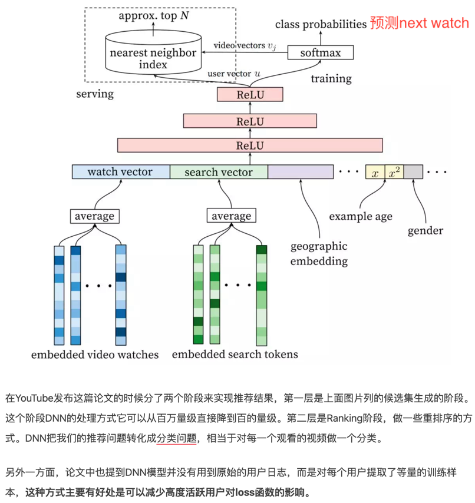
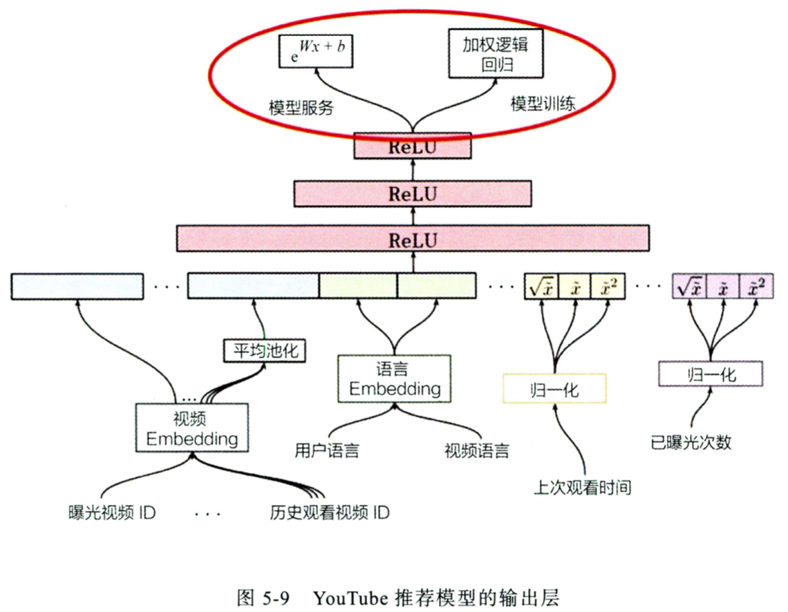
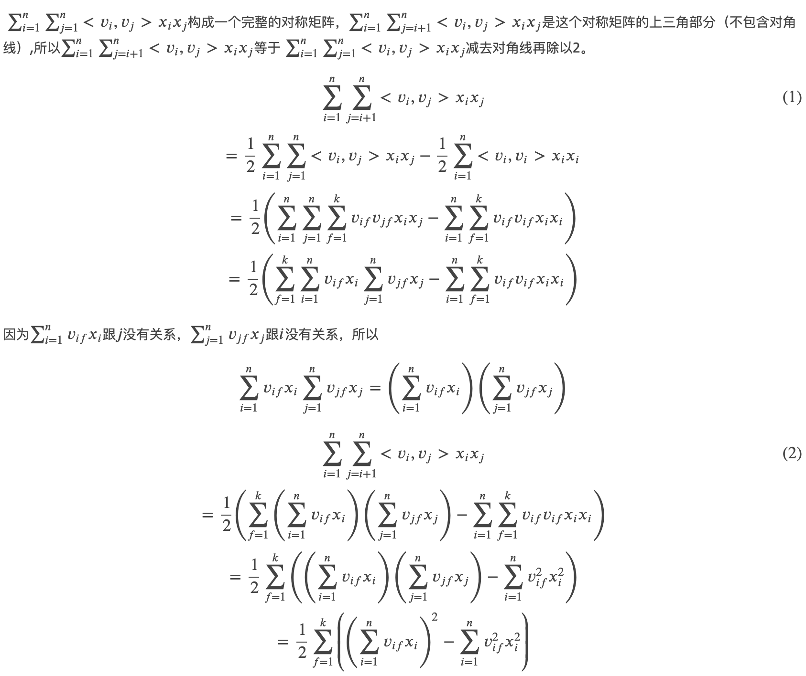

系统处理流程


# 0 引子


* 召回：利用高效的召回规则、 算法或简单的模型，快速从海量的候选集中召回用户可能感兴趣的物品 。
* 粗排过滤：对于内容不可重复消费的领域，例如实时性比较强的新闻等，在用户已经曝光和点击后不会再推送到用户面前
* 排序：利用**复杂模型多特征**对初筛的候选集进行精排序 
* 混排：为避免内容越推越窄，将精排后的推荐结果进行一定修改，例如控制某一类型的频次。
* 强规则：根据业务规则进行修改，例如在活动时将某些文章置顶


# 1 召回


**目的**：待计算的候选集合大、速度快、模型简单、特征较少，保证相关物品的召回率（用户感兴趣的物品在这个阶段能够被快速召回）。

在权衡计算速度和召回率后，目前工业界主流的召回方法是采用多个简单策略叠加的 "多路召回策略" 

## 1.1 多路召回策略

**定义**：采用不同的策略 、特征或简单模型，分别召回一部分候选集，然后把候选集混合在一起

每个策略召回的商品数值K是超参数， 一般需要通过离线评估+线上 A/B 确定合理的取值范围。

**缺点**：从策略选择到候选集大小参数的调整都需要人工参与 ，策略之间的信息也是割裂的，无法综合考虑不同策略对一个物品的影响。基于 Embedding 的召回方法应运而生。

## 1.2 基于embedding的召回

多路召回中使用"兴趣标签" "热门度" "流行趋势" "物品属性" 等信息都可以作为 Embedding 召回方法中的附加信息融合进最终的 Embedding向量，生成embedding的方法是多样的，可兼顾业务和时间复杂度选择。


## 1.3 深度召回模型

### 1.3.1 DSSM（2013）


> word hashing：将词做break成连续的字母组，把字母组形成一个词典，此词典比直接词组成的词典维度小。
>
> word编码为letter n-grams


### 1.3.2 YouTube DNN

预测next watch，正样本是用户观看过的视频。


#### 标签和上下文选择


文中使用的是（b）方法采样和构建标签（只留最后一次观看行为做测试集主要是为了避免引入未来信息( future information )，产生与事实不符的数据穿越问题 ），skip-gram是用的是（a）中的采样方法，这种方法实际上是**使用了未来信息**，在线上的时候会导致效果下降。

#### 召回阶段

对几百万候选集进行粗筛

1. 用户向量：

   最后一层 ReLU 层的输出向量可以当作该用户的 Embedding 向量，在模型训练完成后，逐个输入所有用户的特征向量到模型中，就可以得到所有用户的 Embedding 向量 ，之后导入线上 Embedding数据库。

2. 视频向量：

   softmax 层的参数是一 个mxn维的矩阵， 其中m指的是最后一层 (ReLU层)的维度， n指的是分类的总数，也就是 YouTube所有视频的总数为n。那么视频 Embedding就是这个mXn 维矩阵的各列向量（类似word2vec）。

3. 召回：

   在预测某用户的视频候选集时，先得到该用户的 Embedding 向 量 ，再在视频 Embedding 向量空间中利用局部敏感哈希等方法搜索该用户 Embedding 向量的 TopK近邻。



> Example age: 训练样本产生的时刻距离当前时刻的时间, 没有采用视频上传距离此时的时间是因为避免稀疏性（视频可能5年前上传）。

#### 排序阶段

引入更多特征进行精排

重点关注模型的输入层和输出层， 即排序模型的特征工程和优化目标。



1. 输入

   当前推荐视频的embedding 和 历史观看视频embedding的平均池化

   用户语言 和 当前推荐视频的语言

   该用户上次观看同频道视频的间隔时间

   当前视频已经曝光过给该用户的次数

2. 训练

   根据观看时长对正样本进行加权，负样本的权重为1，Weighted LR的特点是，正样本权重w的加入会让正样本发生的几率变成原来的w倍，样本i的$Odds =\frac{p}{1-p}=\frac{w_ip}{1-w_ip}$

   

   训练Weighted LR一般来说有两种办法

   - 将正样本按照weight做重复sampling，然后输入模型进行训练；

   - 在训练的梯度下降过程中，通过改变梯度的weight来得到Weighted LR。

3. serving

   YouTube推荐系统中 serving 时使用的值是指数形式的中间值，预估值$e^z$的物理含义为：**用户期望观看时长**

   

   $e^z$其实是LR中的Odds，为什么此Odds为观看时长？

   因为训练方式为 Weighted LR，$Odds =\frac{p}{1-p}=\frac{w_ip}{1-w_ip}$，在视频推荐场景中，用户打开一个视频的概率p往往是一个很小的值，因此上式可以继续简化：$e^z=Odds \approx w_ip=T_ip=E(T_i)$

### SDM


### MIND


​	

### DiDi

**动机**：考虑商品热度的演化过程，因为热度推荐和个性化推荐一样同样会吸引用户点击


1. 基于个性化推荐：用户历史行为

2. 基于meta的推荐：用户画像和商品画像的双塔

   动机：相似的用户具有相似的兴趣

3. 基于商品热度的推荐：统计商品历史点击率

   动机：==商品热度包含热度值和演化趋势==

   24小时每小时的点击率

   用lstm的原因是lstm能够学习到演化过程，比如两个商品ctr值相等，一个上升趋势一个下降趋势，此时应当选择上升趋势的推荐

4. fusion layer：上下文信息用户感知用户类型（新用户与否），用于调整上述三个兴趣的权重（Attention）


问题：

1. 为什么不用V的上下文来attention 两个U向量
2. 

1. 为什么不多路召回三个兴趣

   多路召回的后续merge问题，因为不同路中的指标不是同一个尺度的，不好比较

# 2 排序

## 2.1 经典排序模型


### 2.1.1 协同过滤

>共现矩阵
#### 2.1.1.1 UserCF

>根据共现矩阵计算u的topN相似用户S，维护一个相似度矩阵实现快速查找topN用户集合S

```
缺点：
1 存储n^2的用户相似度矩阵
2 用户反馈行为稀疏
3 不能考虑额外特征
4 新用户无法推荐
特点：
UserCF 正适用于发现热点，以及跟踪热点的趋势
```

#### 2.1.1.2 ItemCF
维护物品相似度矩阵，用户请求之后，根据用户正反馈数据查找相似的topN商品，
根据相似度排序实现推荐列表，相似度计算：


```
缺点：
1 不能考虑额外特征
2 新用户无法推荐
特点：
ItemCF更适用于兴趣变化较为稳定的应用场景
```

#### 2.1.1.3 改进的ItemCF

**动机** ：ItemCF算法不利用物品的内容属性计算物品之间的相似度，它主要通过分析不同用户对商品的行为计算物品之间的相似度

### 2.1.2 矩阵分解


> 隐向量的长度为2，长度决定了隐向量表达能力的强弱。
>
> 用户和商品的相关性由内积得到

#### 矩阵分解的求解方法

1. 特征分解

2. SVD

   

   > SVD要求M是稠密的；SVD计算复杂度太大O（mn^2）

3. 梯度下降

   

   > 其中 K 是**所有用户**评分样本的集合

#### 优缺点

1 泛化能力强（解决了CF的稀疏问题）

2 空间复杂度低，不需要存储 User（Item）相似度矩阵

3 分解结果可与其他特征结合

### 2.1.3 逻辑回归

综合利用用户、物品、上下文等多种不同的特征，将推荐问题转化为一个点击率预估问题

### 2.1.4 FM（隐向量自动交叉）

FM为每个特征学习一 个隐权重向量( latent vector)。 在特征交叉时，使用**两个特征隐向量的内积**作为交叉特征的权重 。

FM 是将矩阵分解隐向量的思想进行了进一 步扩展，从单纯的用户、物品隐向量扩展到了所有特征上。


>实现二阶交叉

**[求解方法SGD](https://www.cnblogs.com/zhangchaoyang/articles/7897085.html)**




SGD求解参数（梯度计算如下）


### 2.1.5 FFM（特征域）


> 每个特征域为其他每个特征域学习一个权重
>
> 实现二阶交叉

### 2.1.6 GBDT+LR or **GBDT+FM**

实现快速的高阶特征交叉,树中每个节点的分裂是一个自然的特征选择的过程，而多层节点的结构则对特征 进行了有效的自动组合，把 GBDT 所有子树的特征向量连接起来，即形成了后续 LR 模型输入的离散型特征向量。


> GBDT 由三棵子树构成,每棵子树有 4 个叶子节点，输入一个训练样本后，其先后落入"子树 1"的第 3 个叶节点中，"子树2" 的第1个叶节点, "子树3" 的第 4 个叶节点。最后连接所有特征向量，形成最终的特征向量。

决策树的深度决定了特征交叉的阶数 。 如果决策树的深度为 4，则通过 3 次节点分裂，最终的叶节点实际上是进行三阶特征组合后的结果。

**缺点**：GBDT 容易过拟合，以及 GBDT 的特征转换方式实际上丢失了大量特征的数值信息。

## 2.2 深度排序模型


---


### 2.2.1 Deep Crossing（2016）

embeding - **拼接** - **残差MLP做深度特征交叉** - 输出


> **先拼接**，拼接之后在连接一层网络可以实现特征交叉
>
> 打分层一般选用逻辑回归

### 2.2.2 NCF（2017）

动机：用网络实现**User/Item**隐向量（**embedding**）的特征交互


> 将传统矩阵分解中间内积换成MLP（**先拼接再连接MLP**），实现User和Item特征特征更充分的交叉，但是仍然没有引入额外的特征


> 把通过不同互操作网络得到的特征向量拼接起来，交由输出层进行目标拟合。

### 2.2.3 PNN（product-based NN, 2016）

动机：

1. NFM实现了User/Item的交互，但是引入多组特征向量之后怎么交互？

2. 将简单的拼接换成了乘积层（特征两两交互之后再拼接），提出了多种特征交叉方式，如内积和外积。


> 1. Embeding成相同的特征维度（保证乘积层顺利进行）
> 2. 乘积层由线性操作部分（z，和常数1进行乘积后拼接）和乘积操作部分（p，向量内积、外积）组成。

**外积**：得到一个矩阵（由于embeding同维度，此处为方阵），为了降低计算复杂度，文中提出一种得到“外积矩阵”方法：


**乘积层和MLP连接之前的额外操作**


### 2.2.4 Wild&Deep（2016）

**动机**：**综合原始特征及交叉特征**，让特征交叉的方式更加高效


### 2.2.5 DCN（Deep &Cross， 2017）

**动机**：增加wide部分的交互力度，使用多个cross层。


> 用cross代替wide部分，cross 部分类似于PNN的外积操作
>
> 中间层的计算：（$x_0和x_{前一层输出}做运算$）：$x_0 * x_{input}^T * W + b +x_{input}$
>
> 引入了残差结构

**缺点：**

$x_1 = x_0 * x_0^T * W_1 + b_1 +x_0 = x_0(x_0^T * W_1 + 1) + b_1 = \alpha_1*x_0$          (为了表明思路，这里忽略了$b_1$)

$x_2 = x_0 * ((\alpha_1*x_0^T) * W_2) + b_2 + (\alpha_a*x_0) = \alpha_2*x_0$

==DCN的乘积层相当于 $x_0$ 不断乘一个标量！==

### xDeepFM


### VDCN（？？？）

**动机**：DCN对原始embed进行了拼接然后外积，对某个特征的内部也进行了交叉，vdcn只考虑特征embed之间每个维度的交叉


>Vector-dcn is an improvement of DeepCrossNet.
>
>Compared to origin dcn, vdcn only consider interaction of different features field. 
>
>More specifically, we apply outer product on each dimension of features embedding. 
>
>Denote that there are `n` features and embedding dimension is `d`,
>
>OriginCrossNet applies outer product on **vector** with size of `d * n`, 
>
>while VectorCrossNet applies outer product on vector with size of `n` on `d` dimensions parallelly.

其中DCN Matrix的维度为`d*d`，然后每个和一个不同的w乘，最后的向量进行拼接后接上MLP

### 2.2.6 FNN（2016）

**动机**：类似deep crossing，改进之处为：用 FM 模型训练好的各特征隐向量**初始化 Embedding 层的参数**，解决embeding收敛速度慢的问题


### 2.2.7 DeepFM (2017)

**动机**：用FM层代替wide部分(不具备特征组合能力)，加强特征组合的能力。

和DCN动机很像，都是增加wide的交互


>左边的 FM 部分与右边的深度神经网络部分共享相同的 Embedding层。 
>
>左侧的FM部分对不同的特征域的 Embedding进行了两两交叉，也就是将 Embedding向量当作原 FM 中的特征隐向量 。 
>
>最后将 FM 的输出与 Deep 部分的输出一同输入最后的输出层，参与最后的目标拟合.

### 2.2.8 NFM（2017）

**动机**：用一个表达能力更强的函数替代原 FM 中二阶隐向量内积的部分（用网络学习f(x)），用特征交叉池化层实现embedding向量的二阶交叉。


>使用原始的特征的值值乘以Embedding vector：$x_i \times v_i$

2. B-interaction 层


> 将V_x = {x_i v_i}转化为单一向量：将两两embedding向量的元素相乘后, 将交叉特征向量取和,得到池化层的输出向量
>
> 这个输出只有一个向量,维度仍然是K，可以理解为就是FM的二阶输出.

FM的二阶部分：


### 2.2.9 AFM (2017)

**动机**：NFM中的特征交叉池化层最后对交叉特征进行了无偏好加和，AFM利用attention加和


该注意力网络的结构是一个简单的单全连接层加 softmax输出层的结构， 其数学形式如下所示：


### 2.2.10 DIN（2018）

**动机**：根据用户历史生成user向量的过程中给不同特征赋予不同的注意力权重（待排item对行为序列做attention）

**Base Model and DIN**


---


---


> 利用**候选商品**和**历史行为商品**之间的相关性计算出一个权重
>
> Q是候选商品，K、V是历史行为商品对应的特征。


注意力得分由激活单元生成，激活单元的输入层是两个 Embedding 向量，经过元素减( element-wise minus )操作后，与原 Embedding 向量一同连接后形成全连接层的 输入，最后通过单神经元输出层生成注意力得分。

留意图 3-24 中的红线，可以发现商铺 id 只跟用户历史行为中的商铺 id序列发生作用，商品 id 只眼用户的商品 id 序列发生作用，因为注意力的轻重更应该由同类信息的相关性决定。

### 2.2.11 DIEN（2019）

**动机**：模拟用户兴趣的进化过程，引入注意力机制的 AFM 或 DIN 模型，仅是对不同行为的重要性进行打分，这样的得分是时间和序列无关的。


>( 1 )行为序列层: 把原始的 id 类行为序列转换成 Embedding 行为序列 。
>
>( 2 )兴趣抽取层(GRU): 模拟用户兴趣迁移过程，抽取用户兴趣。
>
>( 3 )兴趣进化层: 在兴趣抽取层基础上加入注意力机制（**和DIN的attention计算思路一致**），即考虑和目标广告的**相关性**来模拟与目标广告相关的兴趣进化过程。

2. GRU

将forget gate和input gate合并为一个update gate u_t，并且在计算tmp cell state的时候对来自过去的信息增加reset gate ![[公式]](https://www.zhihu.com/equation?tex=r_t) 做一个过滤


### <span id = "ESMMlink">2.2.12 ESMM（CVR model, 2018）</span>

**背景**：

CVR与CTR没有绝对的关系，如user对某item的点击概率很低，则user对这个item的转化概率也肯定低，这是不成立的。CVR预估模型的本质，不是==预测item被点击，然后被转化的概率（CTCVR）==，而是==假设item被点击，那么它被转化的概率（CVR）==。不能直接使用全部样本训练CVR模型，因为对于那些unclicked的item，假设他们被user点击了，它们是否会被转化我们无从知道。如果直接使用0作为它们的label，会很大程度上误导CVR模型的学习。

**动机**：如何优化cvr，解决真实场景中CVR预估面临数据稀疏以及样本选择偏差这两个关键问题。

1. 数据稀疏

   CVR训练数据的点击样本远小于CTR预估训练使用的曝光样本。

   共享 Embedding 层的目的主要是解决 CVR 任务正样本稀疏的问题。

2. 样本选择偏差

   CVR样本以点击未转化为负例，点击并转化为正例。但是训练好的模型实际使用时，则是对整个空间的样本进行预估，而非只对点击样本进行预估，即训练数据与实际要预测的数据来自不同分布。

    pCVR、 pCTR 和 pCTCVR 融合进一个统一的模型，因此模型可以一次性得出所有三个优化目标的值

   

   > CTR对应的label为click，而CTCVR对应的label为click & conversion，**这两个任务是可以使用全部样本的，通过这学习两个任务，再根据上式隐式地学习CVR任务**


### DeepAFM

### AUTOINT（2018）


## 2.3 多任务模型

### 2.3.1 [ESSM (CVR model, 2018)](#ESMMlink)

### 2.3.2 MMOE （2018）

[keras code](https://github.com/drawbridge/keras-mmoe)


> (a) 两个任务直接共享模型的 bottom 部分，只在最后处理时做区分
>
> (b) 将 input 分别输入给三个 Expert(不共享参数)和Gate，Gate 输出每个 Expert 被选择的概率，然后将三个 Expert 的输出加权求和，输出给 Towers
>
> 
>
> 其中：  g_i 表示 gate 门的输出，为多层感知机模型，实现时为简单的线性变换加 softmax 层。
>
> (c) 对于不同的任务，模型的权重选择是不同的，所以**为每个任务都配备一个 Gate 模型**


## 2.4 多业务模型

**场景描述：**当用户搜索地点如 “望京” 的时候，用户的需求不是很明确，此时搜索的结果的商家列表中会包含望京附近餐饮、电影、休闲娱乐、酒店等多种业务的结果，这就是一个多业务混合排序场景。

**多业务场景存在如下几点挑战**：

1. 因业务之间存在共性和特性，如何让模型兼顾这两种特性，实现更好的数据学习。比如到店餐饮对距离特征非常敏感，而旅游景点业务对距离特征相对不敏感。
2. 业务天然存在高频和低频特性（比如外卖和旅游），导致模型的训练数据中多业务样本数量不平衡。
3. 各个业务往往有自己不同的主目标，如何满足不同业务的目标，最终能够提升搜索的用户体验。

### 2.4.1 美团多业务排序建模


# 3 Embedding方法

将用户和物品embedding后，利用用户向量和物品向量的相似性，可以直接在推荐系统的==召回层（一般用于召回）==快速得到候选集合，或在排序层直接用于最终推荐列表的排序。


## 3.1 word2vec (2013)

**原理**：具有相似语意的词上下文一般也相同，因此学习到的词向量相近。

假定**每个词都跟其相邻的词的关系最密切**，即每个词都是由相邻的词决定的(CBOW)，或者每个词都决定了相邻的词(SG).


### 3.1.1 网络结构


**输入层**：词的onehot编码

​	CBOW：输入的是上下文每个词的onehot的加和平均，隐藏层输出为 $W\cdot(\sum_{i=1}^Cx_i)/C$

​	SG: skip-gram输入层输入的是中心词的onehot

**中间层**：==没有激活函数（为了计算内积）==，经过第一个连接权重矩阵（V*N,N是嵌入维度）之后得到投影层的输入（输出）

**输出层**：投影层经过第二个连接权重矩阵（N*V）之后实现==输入词向量和输出词向量的内积==

**softmax层**：将内积进行softmax输出概率向量

### 3.1.2 训练样本

**1. skip-gram**

选取一个长度为 2c+1 (目标词前后各选 c个词)的滑动窗 口， 从语料库T(T句子)中抽取一个句子，将滑动窗口由左至右滑动，每移动一次，窗口中的词组就形成了==**C个训练样本（输入是一个词，输出是上下文中的一个词）**==。


**2. CBOW**

cbow一次性输入上下文的onehot编码，在隐藏层做加权求和

### 3.1.3 目标函数


​	    多分类问题，概率p定义方式如下：


### 3.1.4 负采样和层级softmax

词典过大会导致输出层softmax输出计算量过大，相比原来需要计算所有字典中所有词的预测误差，负采样方法只需要对采样出的几个负样本计算预测误差，损失函数变为：


> 其中 $\sigma$ 为sigmoid函数

 

### 3.1.5 CBOW和SG的区别

**哲学解释**

1. skip-gram，每个词在作为中心词的时候，实际上是 1个学生 VS K个老师，K个老师（周围词）都会对学生（中心词）进行训练。
2. cbow，1个老师 VS K个学生，K个学生（周围词）都会从老师（中心词）那里学习知识，但是老师（中心词）是一视同仁的，教给大家的一样的知识。

**sg比cbow更适用于预测生僻字的场景**

1. cbow用周围词预测中心词，将输入的context word 加起来做average，在梯度回传的时候对周围词的调整是统一的：求出的gradient的值会平均分到周围词上，当周围次中有生僻字时，该生僻词没有受到专门的训练，因此**在遇到生僻词是，预测效果将会大大降低。**
2. skipgram是用中心词预测周围词，预测的时候是一对word pair，等于对每一个中心词都有C个词作为output，对于一个词的预测有C次，所以能够更有效的从context中学习信息，但是总共预测K*V次，训练比CBOW慢。

**计算复杂度**

cbow预测行为的次数跟整个文本的词数几乎是相等的，为`O(V)`

sg的复杂度为`O(KV)`，cbow更快

## 3.2 item2vec (2016)

**原理**：将用户历史行为视为序列做embeding，相比skip-gram，**摒弃了时间窗口的概念**，认为序列中任意两个物品都相关。

**目标函数**：


对比Skip-Gram的目标函数为：


在优化目标定义好之后， Item2vec 剩余的训练过程和最终物品 Embedding 的产生过程都与 Word2vec 完全一致，最终物品向量的查找表就是 Word2vec 中词向量的查找表

**缺点**：只能处理序列形式的数据，graph embedding应运而生。

### 3.2.2 广义item2vec


"物品塔"模型，输入特征由用户行为序列生成的 one-hot 特征向量，变成了可包含更多信息的、全面的物品特征向量，经过物品塔内的多层神经网络结构，最终生成一个多维的稠密向量。

## 3.3 deep walk（2014）

序列embedding和graph embedding的过渡方法。


**用户行为的选取**

由于用户兴趣随时间变化，因此在实践过程中，用户行为序列一般截取一个时间窗口，只考虑时间窗口内的用户行为，我们称之为 session-based 用户行为，一般大小为一小时。

在实际过程中，还会进行一些降噪处理：

1. 点击少于一秒的视为无意点击，需移除；

2. 去除过渡活跃用户，如三个月内购买超 1000 件商品，或者点击总数超过 3500 次；
3. 有些商家会不断更新商品的细节。极端情况下，一件商品可能经过长时间更新后变成完全不同的商品。所以需要移除类似的Item。

**建模方法**

1. 根据行为序列构建graph

   用户 Ui 先后购买了物品 A 和物品 B，物品 A 和 B 之间的产生边， 如果后续产生了多条相同的有向边，则有向边的**权重被加强**。 在将所有用户行为序列都转换成物品关系图中的边之后，全局的物品关系图就建立起来了 。

2. 随机游走

   每个节点作为起始节点N次，在原始的网络结构上进行随机游走M步（达到设定的游走长度后，停止游走），获得一条条序列数据。
   
3.  word2vec

   将这些物品序列作为训练样本输入 Word2vec 进行训练，得到物品的 Embedding。

**随机游走节点间的跳转概率：**

如果物品关系图是==有向带权图==（当后续产生了多条相同的边时，连接权重被加强），节点 $v_i$跳转到节点$v_j$的概率:


如果物品关系图是==无向无权图==，$M_{ij}=1，N_+(v_i)$为节点$v_i$所有边的集合

**缺点**：

1. 单纯通过用户行为序列形成graph，导致“长尾商品”无法被有效表征，引发冷启动问题。

2. 对于无权重的图：游走得到的序列数据与实际的数据分布不符，会获得较多的冷门商品。

## ~~3.4 LINE（2014）~~

LINE (Large-scale InformationNetwork Embedding) 的核心思想是通过一阶相似度和二阶相似度明确定义了如何表征图中节点的相似度


1. 一阶相似度

   描述图中节点之间的局部相似度（节点之间存在直接相连的边），如上图中的节点6和7之间存在直接相连的边，所以1阶相似度较高

3. 二阶相似度

   节点5和6虽然没有直接相连，但是因为有大量重合的边1-4，所以认为节点5和6也是相似的，二阶相似度则是用于描述这种关系

   

## 3.4 node2vec（2016）

**动机**：同质性和结构性的权衡。通过调整随机游走权重使 Graph Embedding 的结果更倾向于体现网络的同质性或结构性。


1. 同质性：距离相近节点的 Embedding 应尽量近似（U和$S_1$,$S_2$,$S_3$,$S_4$接近）

   让游走更倾向于**DFS**：DFS倾向于在一个集团内部进行，是的集团内部节点embedding更为相似，表达同质性。

2. 结构性：结构上相似的节点的 Embedding 应尽量近似（U和$S_6$同为中心）

   让游走更倾向于**BFS**：BFS在当前节点的邻域游走，相当于对当前节点的周边信息进行微观扫描，捕获当前节点的性质，比如：是否是局部中心、边缘节点、连接性节点。

**跳转概率**


通过跳转概率控制DFS和BFS的倾向性。节点 t 跳转到节点 v， 再从节点 v跳转到周围各点x的跳转概率为，其中$w_{vx}$是节点v和x的权重，$\alpha_{pq}(t,x)$的定义如下


其中，pq是参数，用于控制随机游走的倾向性：

p：返回参数，p越小，返回t的可能性越大，倾向于捕获结构性（BFS）

q：进出参数，q越小，随机游走到远方的可能性越大，倾向于捕获同质性（DFS）

通过不同的p，q参数可以产生不同的embedding效果，下图中左图倾向于捕获同质性（距离相近的节点颜色相近），右图倾向于捕获结构性（结构特点相近的节点颜色相近）


**在推荐中的对应关系**

1. 同质性

   同质性相同的物品很可能是同品类、同属性， 或者经常被一同购买的商品

2. 结构性

   各品类的爆款 、 各品类的最佳凑单商品 等拥有类似趋势或者结构性属性的商品

二者在推荐系统中都是非常重 要的特征表达。由于 Node2vec 的这种灵活性，以及发掘不同图特征的能力， 甚至可以把不同 Node2vec 生成的偏向"结构性"的 Embedding 结果和偏向"同质性"的Embedding结果共同输入后续的网络，以保留物品的不同图 特征信息。


## 3.5 EGES（2018）

**动机**：解决可扩展性（适用大规模数据集）；稀疏性（用户交互商品很少，数据稀疏）；冷启动（没有历史行为记录的商品的初始化embedding的生成问题）

**思想**：在deep walk生成的graph embedding的基础上引入补充信息（如category, brand, price等），具有相似 Side Information 的 Item 应该离得更近。丰富item的表征力度，解决新物品的初始embedding问题。

1. 补充信息embedding向量的生成思路

   通过用户行为序列可 以生成物品关系图， 也可以利用"相同属性"、"相同类别"等信息建立物品之间的边，生成基于内容的知识图谱。 而基于知识图谱生成补充信息 Embedding 向量。根据补充信息类别的不同，可以有多个补充信息embedding 向量。

   **item 和 side information（例如category, brand, price等） 的 Embedding 是通过 word2vec 算法一起训练得到的。**如果分开训练，得到的item_embedding和category_embedding（brand_embedding，price_embedding）不在一个向量空间中，做运算无意义。

   > 即：通过 DeepWalk 方案得到 item 的游走序列，同时得到对应的category（brand, price）序列。然后将所有序列数据放到word2vec模型中进行训练。

2. 如何融合多个embedding向量

   常规的做法是在网络中加入平均池化层，将不同 Embedding平均起来。缺点是会导致有效Embedding 信息的丢失，且不同的 Side Information 对商品的 Embedding 有不同的贡献，因此在学习 Embedding 时考虑加权机制。具体做法为将加权平均后的 Embedding 向量输入 softmax 层，通过梯度反向传播，求得每个 Embedding 的权重 $a_i(i=0...n)$.

   需要注意的是EGES模型采用了$e^{a_i}$来表示对应Embedding的权重，目的是既可以避免权重为0，又可以在梯度下降的过程中使用$e^{a_i}$良好的数学性质。


## 局部敏感哈希


# 4. 重排


## 4.1 MMR


### 4.2 行列式点过程

1. item间的多样性


2. item和user的相关性

   上有排序模型的度量，例如 item向量和user向量的余弦距离

3. 优化目标的一般性描述

   

## PRM（2019）

对 Initial list 做一次重排序，


> 其中 $x_{i_n}$是商品特征向量，$pv_{i_n}$ 是用户向量对每个商品的兴趣向量（类似于embedding），$pe_{i_n}$ 是位置编码


# 5. 冷启动问题

用户冷启动、商品冷启动、系统冷启动

## 5.1 基于规则的冷启动

### 5.1.1 用户冷启动

1. 默认推荐列表

   热门排行榜" "最近流行趋势" "最高评分"等榜单作为默认的推荐列表

2. 基于用户属性构建个性化推荐列表

   利用点击率等目标构建一个用户属性的决策树，在每个决策树的叶节点建立冷启动榜单，在新用户完成注册后，根据用户有限的注册信息，寻找决策树上对应的叶节点榜单，完成用户冷启动过程。

### 5.1.2 物品冷启动

1. 聚类：新物品聚类到之前的某一类（基于什么属性聚类是业务强相关的）

2. 新物料有倾向性的被强曝光

## 5.2 基于模型的冷启动

### 5.2.1 模型加入meta特征

在模型中加入更多用户或物品的属性特征（meta feature），而非历史数据特征。如：

1. 用户注册信息：年龄、性别、学历、职业以及根据ip和GPS获取的地理信息等

2. 第三方数据管理平台获取用户画像

3. 物品meta：物品的分类、标签、描述文字等
4. 注册时引导用户输入兴趣分类

### 5.2.2 主动学习

在一次又一 次的循环迭代中，让推荐系统尽量快速地度过冷启动状态，为用户提供更个性化的推荐结果。


如上图，商品分为四类，新用户来了之后如何推荐呢？

答案是应该选择最大聚类 d 的中心节点作为推荐影片，因为通过主动问询用户对 d 中心节点的打分，可以得到用户对最大聚类 d 的反馈，使推荐系统的收益最大 。 严格地讲，应定义推荐系统的损失函数，从而精确地评估推荐不同影片获得的损失下降收益。

### 5.2.3 迁移学习

和传统迁移学习的思路一致。

# 6. 实验流程

## 6.1 采样

尝试不同的采样率，通过实验做选择。

### 6.1.1 预估ctr漂移问题

不同采样率的采样，样本在采样之后会改变数据的分布，因此在预估点击率时还需要将原始分布还原（即下采样之后会过高的评估ctr，但是在实际场景中没有下采样，负样本还是很多）

### 6.1.2 ctr矫正


>q：矫正之后的ctr
>
>p：模型预估的ctr
>
>w：采样比例（如0.025）

## 6.2 特征工程

**如何设计特征**：将自己代入场景，想象自己的点击行为受什么因素影响

1. 类别特征

   a) 多类别multi-hot

   b) 离散化

2. 内容特征

   a) 字符串进行Hash同余

   b) nlp embedding

   c) ocr

3. 连续特征

   分桶/直接输入

### 6.2.1 常用特征

#### 6.2.1.1 用户行为

显性反馈行为（数据量小） 和 隐性反馈行为


**反馈行为建模方法**

a) 用户行为的item_id进行multi_hot

b) 将item进行embedding后平均或者通过attention平均

c）graph embedding

d) maybe more...

#### 6.2.1.2 用户社交网络

利用方式：

a) 将用户关系作为召回层的一种物品召回方式

b) graph embedding

c) 利用关系数据，通过"好友"的特征为用户添加新的属性特征

#### 6.2.1.3 标签类别


建模方法：

a) multi-hot

b) embedding

#### 5.2.1.4 内容类

1. 文本
2. 视频 

#### 6.2.1.5 上下文信息

上下文信息( context )是描述推荐行为产生的场景的信息。

最常用的是：时间、地点、季节、月份、是否节假日、天气、 空气质量、社会大事件等。

#### 6.2.1.6 统计类特征

统计类特征一般是一些粗力度的预测指标，往往与最后的预测目标有较强的相关性。

如历史 CTR、历史 CVR、 物品热门程度、物品流行程度等 

#### 6.2.1.7 交叉特征

**交叉方式**

1. 人为交叉（如：年龄+性别）

   传统的机器学习模型无法直接捕捉到两类特征之间的交互，因此需要显式地进行特征交叉，
   但是会造成维度灾难，需要尝试所有交叉后才知道哪个更有效

2. GBDT

3. 因子分解机

   每个特征可以被分解成相同空间中的K维向量表示，利用它们向量的点积表达**交互强弱**

4. 深度模型交叉（==注意限定特征域间交叉可能有更好的效果==）

   将深度学习模型输出的中间结果当作高层语义特征，输入到传统的浅层机器学习模型中
   
   - Inner Product Pattern
   
     
   
   - Outer Product Pattern
   
     
   
   - Hadamard Product Pattern
   
     
   
   - Self-Attention Pattern
   
     
   
   - 

### 6.2.2 常用特征处理方法

#### 6.2.2.1 连续型特征

如：用户年龄、统计类特征、物品的发布时间 、 影片的播放时长等数值型特征 

1. 归一化

   保证量纲

2. 离散分桶

   防止连续值带来的过拟合现象及特征值分布不均匀

3. 加非线性函数

   直接把原来的特征通过非线性函数做变换，然 后把原来的特征及变换后的特征一起加入模型进行训练，更好地捕获特征与优化目标之间的非线性关系，增强模型的非线性表达能力

#### 6.2.2.2 类别型特征

1. one-hot or multi-hot
2. embedding

## 6.3 模型训练

### 6.3.1 模型更新方式


#### 6.3.1.1 全量更新

#### 6.3.1.2 增量更新

缺点：增量更新的模型往往无法找到全局最优点，因此在实际的推荐系统中， 经常采用增量更新与全局更新相结合的方式，在进行了几轮增量更新后，在业务量较小的时间窗口进行全局更新，纠正模型在增量更新过程中积累的误差。

#### 6.3.1.3 在线学习

a) 在获得一个新的样本的同时更新模型，通过 SGD 的训练方式实现。

缺点：

使用 SGD 的方式进行模型更新，相比 batch 的方式，容易产生大量小权重的特征，增大了模型体积，为了在在线学习过程中兼顾训练效果和模型稀疏性，有大量相关的研究，最著名的包括微软的 FOBOS、谷歌的 FTRL等。

b)  DRN应用了一种竞争梯度下降,通过"随机探索新的深度学习模型参数，并根据实时效果反馈进行参数调整"的方法进行在线学习.

#### 6.3.1.4 局部更新

预训练embedding，实时局部更新下游。如GBDT+LR中，粗粒度训练GBDT，细粒度训练LR。

### 6.3.2 优化目标

#### 6.3.2.1 CTR

推荐标题党吸引CTR上升

#### 6.3.2.2 CVR 


**存在的问题**

1. 模型假设空间不同

   训练场景中：用点击+转化的数据训练CVR

   在线场景中：CVR模型根据CVR高低得到推荐列表，实际上这部分列表是用户的曝光，相当于需要从曝光商品上进行cvr预估

2. 一般的解决办法

   分两步，首先构建CTR预估模型，然后构建CVR模型。

   **缺点**：

   CTR 模型与最终优化目标的脱节，因为整个问题最终的优化目 标是"购买 转化" ，并不是 "点击"，在第一 步过程中仅 考 虑点 击 数据， 显然并不是全局最优化转化率的方案。

   **解决方案**：

   多目标优化模型如：ESMM (EntireSpaceMulti-taskModel)， 同时模拟 "曝光到点击 "和"点击到转化"两个阶段。

 #### 6.3.2.3 用户播放时长

如YouTube引入播放时长作为优化目标...


#### 6.3.2.4 目标函数非凸函

陷入局部最优时需要对随机梯度下降法失效的原因进行深入分析，并利用改进的方法进行训练

## 6.4 评估指标

### 6.4.1 离线评估

离线阶段常用的评估指标有Log Loss和AUC。
Log Loss衡量预测点击率与实际点击率的吻合程度;
AUC评价模型的排序能力，即获得点击的样本应尽量排在未获得点击的样本前面。
一方面，我们希望预测的点击率尽可能精准;
另一方面，又希望更有可能获得点击的广告被尽可能地排列在前面。
所以要 求两个指标都得到比较好的结果至于哪个指标作为主要指标要视具体的业务场景而定。

### 6.4.2 在线评估

A/B实验

### 6.4.3 其他指标

#### 点击率（单纯提升点击率为目标，会造成"标题党效应"）

* pv点击率=点击次数/曝光次数
* uv点击率=点击人数/曝光人数

#### 召回率和准确率


>R(u): 用户u的推荐列表  
>T(u): 用户u的行为列表（测试集上所有的正样本）

#### 覆盖率

  

#### 基尼系数

推荐系统是否具有马太效应的简单办法就是使用**基尼系数**。
如果G1是从初始用户行为中计算出的物品流行度的基尼系数，
G2是从推荐列表中计算出的物品流行度的基尼系数，那么如果G2 > G1，就说明推荐算法具有马太效应。

* 计算基尼系数时：**p(x)=物品x的流行度/所有物品流行度的和**


# 7. 工程实现


# 思考
## 如何将embedding融入到特征中
## 用户/商品进行聚类
k-means, 高斯混合聚类, 主题模型（LDA）


1. 用户多次点击但是没有完成任务，此时应该表明用户对此任务有兴趣（类似加购物车），算是隐性反馈行为


2. 用户点击到转化时间gap的处理：

除了为每个行 为建立全局统一 的 request id (请求 id )，还建立了 HashQueue (哈希队列)用于 缓存曝光记录 。 在 HashQueue 中的曝光记录，如果在等待窗口过期时还没有匹配到点击，就会被当作负样本。此等待窗口期的设定难免会zao成部分点击数据遗漏，解决方法是阶段性地对所有数据进行全量重新处 理，避免流处理平台产生的误差积累。


# 计算广告

## 合约广告
合约广告的客户通常是品牌类广告主，
它们的主要诉求是向公众宣传自己的品牌形象，并不显式地评估后续的转化效果。
合约广告一般以CPM(Cost per mille，千次曝光成本)进行结算。

## 竞价广告
广告对特定的关键词进行出价，用户输入的查询与广告竞标的关键词进行匹配，
检索出所有符合条件的广告，并选择其中的一条或几条广告与搜索的网页结果一起展示，
通常广告排在网页之前。搜索广告一般按点击结算，
在用户点击之后按照广告主对该关键词的出价收费，没有点击则不收费，
因此点击率预估算法对竞价广告的优化至关重要
## 程序化交易广告

## and more