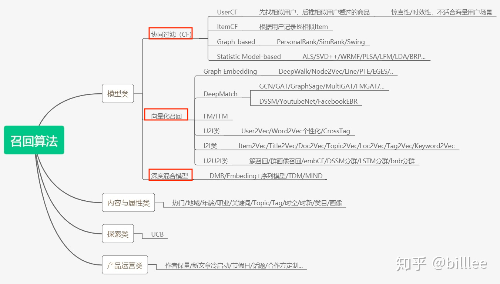
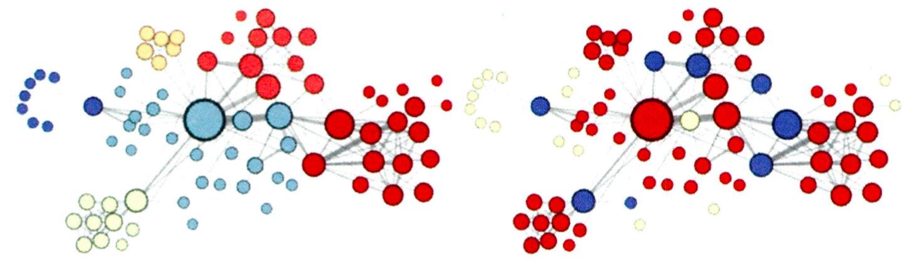

系统处理流程


# 0 引子

## 推荐应用场景

电商

图文feed

音频FM

资源投放

and more

## 优化目标

ctr

gmv

停留时长

and more


* 召回：利用高效的召回规则、 算法或简单的模型，快速从海量的候选集中召回用户可能感兴趣的物品 。
* 粗排过滤：对于内容不可重复消费的领域，例如实时性比较强的新闻等，在用户已经曝光和点击后不会再推送到用户面前
* 排序：利用**复杂模型多特征**对初筛的候选集进行精排序 
* 混排：为避免内容越推越窄，将精排后的推荐结果进行一定修改，例如控制某一类型的频次。
* 强规则：根据业务规则进行修改，例如在活动时将某些文章置顶


# 1 召回



**目的**：待计算的候选集合大、速度快、模型简单、特征较少，保证相关物品的召回率（用户感兴趣的物品在这个阶段能够被快速召回）。

在权衡计算速度和召回率后，目前工业界主流的召回方法是采用多个简单策略叠加的 "多路召回策略" 


## 1.1 多路召回策略

**定义**：采用不同的策略 、特征或简单模型，分别召回一部分候选集，然后把候选集混合在一起

每个策略召回的商品数值K是超参数， 一般需要通过离线评估+线上 A/B 确定合理的取值范围。

**缺点**：从策略选择到候选集大小参数的调整都需要人工参与 ，策略之间的信息也是割裂的，无法综合考虑不同策略对一个物品的影响。基于 Embedding 的召回方法应运而生。

## 1.2 基于embedding的召回

多路召回中使用"兴趣标签" "热门度" "流行趋势" "物品属性" 等信息都可以作为 Embedding 召回方法中的附加信息融合进最终的 Embedding向量，生成embedding的方法是多样的，其与第一代召回的本质区别在于通过user和item的向量化，将用户的兴趣信息和item的meta信息都嵌入到了各自对应的embedding内，进而用户兴趣的检索&匹配问题可以被可兼顾业务和时间复杂度选择。转换为以user向量为key的query检索问题。

## 1.3 经典召回模型

### 1.3.1 协同过滤

### 1.3.2 Swing

**动机：**user-item-user 的结构比 itemCF 的单边结构更稳定。

swing：用户 u 和用户 v ，都购买过同一件商品i，则三者之间会构成一个类似秋千的关系图，下图红线是一个swing结构。


商品i,j之间的相似性通过用户关系来传递的。考察都购买了物品 i 和 j 的用户 u 和用户 v ，==如果这两个用户共同购买的物品越少，则物品 i 和 j 的相似性越高。==


Swing算法的表达式如下：

    $\rightarrow$        $\rightarrow$    

$U_i$表示点击过i的user集合，$I_u$表示 u点击过的item集合。

含义：如果多个user在点击了一个item的同时，都只共同点了某一个其他的item，那么这两个item一定是强关联的；如果两个user pair对之间构成的swing结构越多，则每个结构越弱，在这个pair对上每个节点分到的权重越低。


## 1.4 深度召回模型

### 1.4.1 DSSM（2013）


> word hashing：将词做break成连续的字母组，把字母组形成一个词典，此词典比直接词组成的词典维度小。
>
> word编码为letter n-grams


### 1.4.2 YouTube DNN

预测next watch，正样本是用户观看过的视频。


#### 标签和上下文选择


文中使用的是（b）方法采样和构建标签（只留最后一次观看行为做测试集主要是为了避免引入未来信息( future information )，产生与事实不符的数据穿越问题 ），skip-gram是用的是（a）中的采样方法，这种方法实际上是**使用了未来信息**，在线上的时候会导致效果下降。

#### 召回阶段

对几百万候选集进行粗筛

1. 用户向量：

   最后一层 ReLU 层的输出向量可以当作该用户的 Embedding 向量，在模型训练完成后，逐个输入所有用户的特征向量到模型中，就可以得到所有用户的 Embedding 向量 ，之后导入线上 Embedding数据库。

2. 视频向量：

   softmax 层的参数是一 个mxn维的矩阵， 其中m指的是最后一层 (ReLU层)的维度， n指的是分类的总数，也就是 YouTube所有视频的总数为n。那么视频 Embedding就是这个mXn 维矩阵的各列向量（类似word2vec）。

3. 召回：

   在预测某用户的视频候选集时，先得到该用户的 Embedding 向 量 ，再在视频 Embedding 向量空间中利用局部敏感哈希等方法搜索该用户 Embedding 向量的 TopK近邻。


4. Example age: 训练样本产生的时刻距离当前时刻的时间, 没有采用视频上传距离此时的时间是因为避免稀疏性（视频可能5年前上传）。
5. 概率计算
6. uv内积之后的softmax

#### 排序阶段

引入更多特征进行精排

重点关注模型的输入层和输出层， 即排序模型的特征工程和优化目标。


1. 输入

   当前推荐视频的embedding 和 历史观看视频embedding的平均池化

   用户语言 和 当前推荐视频的语言

   该用户上次观看同频道视频的间隔时间

   当前视频已经曝光过给该用户的次数

2. 训练

   根据观看时长对正样本进行加权，负样本的权重为1，Weighted LR的特点是，正样本权重w的加入会让正样本发生的几率变成原来的w倍，样本i的$Odds =\frac{p}{1-p}=\frac{w_ip}{1-w_ip}$

   

   训练Weighted LR一般来说有两种办法

   - 将正样本按照weight做重复sampling，然后输入模型进行训练；

   - 在训练的梯度下降过程中，通过改变梯度的weight来得到Weighted LR。

3. serving

   YouTube推荐系统中 serving 时使用的值是指数形式的中间值，预估值$e^z$的物理含义为：**用户期望观看时长**

   

   $e^z$其实是LR中的Odds，为什么此Odds为观看时长？

   因为训练方式为 Weighted LR，$Odds =\frac{p}{1-p}=\frac{w_ip}{1-w_ip}$，在视频推荐场景中，用户打开一个视频的概率p往往是一个很小的值，因此上式可以继续简化：$e^z=Odds \approx w_ip=T_ip=E(T_i)$

### SDM


### MIND


​	

### DiDi

**动机**：考虑商品热度的演化过程，因为热度推荐和个性化推荐一样同样会吸引用户点击


1. 基于个性化推荐：用户历史行为

2. 基于meta的推荐：用户画像和商品画像的双塔

   动机：相似的用户具有相似的兴趣

3. 基于商品热度的推荐：统计商品历史点击率

   动机：==商品热度包含热度值和演化趋势==

   24小时每小时的点击率

   用lstm的原因是lstm能够学习到演化过程，比如两个商品ctr值相等，一个上升趋势一个下降趋势，此时应当选择上升趋势的推荐

4. fusion layer：上下文信息用户感知用户类型（新用户与否），用于调整上述三个兴趣的权重（Attention）


问题：

1. 为什么不用V的上下文来attention 两个U向量
2. 

1. 为什么不多路召回三个兴趣

   多路召回的后续merge问题，因为不同路中的指标不是同一个尺度的，不好比较

# 2 排序

## 2.1 经典排序模型


### 2.1.1 协同过滤

>共现矩阵
#### 2.1.1.1 UserCF

**动机：**相似的用户有相似的兴趣

**描述：**对用户u计算v的评分，首先根据共现矩阵找出和u的topN相似用户S，对于S中每一个用户，计算其对v的打分，最后根据用户相似度对打分加权求和。


>根据共现矩阵计算u的topN相似用户S，维护一个相似度矩阵实现快速查找topN用户集合S

```
缺点：
1 存储n^2的用户相似度矩阵
2 用户反馈行为稀疏
3 不能考虑额外特征
4 新用户无法推荐
特点：
UserCF 正适用于发现热点，以及跟踪热点的趋势
```

#### 2.1.1.2 ItemCF

**动机：**用户对相似的物品有相似的兴趣

**描述：**对用户u计算v的评分，首先查找u的正反馈物品集合H，对于H中每一个商品h，计算h和v的相似度，最后根据“h和v的相似度”对“u对h的历史打分”加权求和。

维护物品相似度矩阵，用户请求之后，根据用户正反馈数据查找相似的topN商品，
根据相似度排序实现推荐列表，相似度计算：


```
缺点：
1 不能考虑额外特征
2 新用户无法推荐
特点：
ItemCF更适用于兴趣变化较为稳定的应用场景
```

##### Item间的相似度计算方法

###### 传统距离度量

1. 余弦距离
2. 皮尔森系数

###### Slope-One算法

对于商品vh和v，假设要把v推荐给u，vh是u的交互历史，u对v的打分可以通过“位移”得到


#### 2.1.1.3 改进的ItemCF

**动机** ：ItemCF算法不利用物品的内容属性计算物品之间的相似度，它主要通过分析不同用户对商品的行为计算物品之间的相似度

### 2.1.2 矩阵分解


> 隐向量的长度为2，长度决定了隐向量表达能力的强弱。
>
> 用户和商品的相关性由内积得到

#### 矩阵分解的求解方法

1. 特征分解

2. SVD

   

   > SVD要求M是稠密的；SVD计算复杂度太大O（mn^2）

3. 梯度下降

   

   > 其中 K 是**所有用户**评分样本的集合

#### 优缺点

1 泛化能力强（解决了CF的稀疏问题）

2 空间复杂度低，不需要存储 User（Item）相似度矩阵

3 分解结果可与其他特征结合

### 2.1.3 逻辑回归

综合利用用户、物品、上下文等多种不同的特征，将推荐问题转化为一个点击率预估问题

### 2.1.4 FM（隐向量自动交叉）

FM为每个特征学习一 个隐权重向量( latent vector)。 在特征交叉时，使用**两个特征隐向量的内积**作为交叉特征的权重 。

FM 是将矩阵分解隐向量的思想进行了进一 步扩展，从单纯的用户、物品隐向量扩展到了所有特征上。


>实现二阶交叉

**[求解方法SGD](https://www.cnblogs.com/zhangchaoyang/articles/7897085.html)**


SGD求解参数（梯度计算如下）


**SVM vs FM**

为什么线性SVM在和多项式SVM在稀疏条件下效果会比较差呢？

线性svm只有一维特征，不能挖掘深层次的组合特征在实际预测中并没有很好的表现；而多项式svn正如前面提到的，交叉的多个特征需要在训练集上共现才能被学习到，否则该对应的参数就为0，这样对于测试集上的case而言这样的特征就失去了意义，因此在稀疏条件下，SVM表现并不能让人满意。而FM不一样，通过向量化的交叉，可以学习到不同特征之间的交互，进行提取到更深层次的抽象意义。

例子：

训练集中 x_ix_j 始终为零。在二阶多项式核 SVM 中，由于参数权重 w_{i,j} 得不到更新，模型无法学到 x_i 和 x_j 交叉带来的信息。但是在 FM 中，x_i 和 x_j 的参数并不完全由 x_i 和 x_j 的乘积决定。具体来说，每一维特征的表征向量由该维特征与其它所有维度特征的交叉共同决定。于是，只要存在某个 k 使得 x_i 和 x_k 的乘积不总是为零，那么第 i 维特征的表征向量 v_i 就能够学到有效的信息—同理对 v_j 也有同样的结论。于是乎，哪怕在训练集中，x_ix_j 始终为零，其参数 ⟨v_i,v_j⟩ 也是经过了学习更新的，因此能够表现出很好的泛化性能。

### 2.1.5 FFM（特征域）


> 每个特征域为其他每个特征域学习一个权重
>
> 实现二阶交叉

### 2.1.6 GBDT+LR or **GBDT+FM**

实现快速的高阶特征交叉,树中每个节点的分裂是一个自然的特征选择的过程，而多层节点的结构则对特征 进行了有效的自动组合，把 GBDT 所有子树的特征向量连接起来，即形成了后续 LR 模型输入的离散型特征向量。


> GBDT 由三棵子树构成,每棵子树有 4 个叶子节点，输入一个训练样本后，其先后落入"子树 1"的第 3 个叶节点中，"子树2" 的第1个叶节点, "子树3" 的第 4 个叶节点。最后连接所有特征向量，形成最终的特征向量。

决策树的深度决定了特征交叉的阶数 。 如果决策树的深度为 4，则通过 3 次节点分裂，最终的叶节点实际上是进行三阶特征组合后的结果。

**缺点**：GBDT 容易过拟合，以及 GBDT 的特征转换方式实际上丢失了大量特征的数值信息。

## 2.2 深度排序模型


---


### 2.2.1 Deep Crossing（2016）

embeding - **拼接** - **残差MLP做深度特征交叉** - 输出


> **先拼接**，拼接之后在连接一层网络可以实现特征交叉
>
> 打分层一般选用逻辑回归

### 2.2.2 NCF（2017）

动机：用网络实现**User/Item**隐向量（**embedding**）的特征交互


> 将传统矩阵分解中间内积换成MLP（**先拼接再连接MLP**），实现User和Item特征特征更充分的交叉，但是仍然没有引入额外的特征


> 把通过不同互操作网络得到的特征向量拼接起来，交由输出层进行目标拟合。

### 2.2.3 PNN（product-based NN, 2016）

动机：

1. NFM实现了User/Item的交互，但是引入多组特征向量之后怎么交互？

2. 将简单的拼接换成了乘积层（特征两两交互之后再拼接），提出了多种特征交叉方式，如内积和外积。


> 1. Embeding成相同的特征维度（保证乘积层顺利进行）
> 2. 乘积层由线性操作部分（z，和常数1进行乘积后拼接）和乘积操作部分（p，向量内积、外积）组成。

**外积**：得到一个矩阵（由于embeding同维度，此处为方阵），为了降低计算复杂度，文中提出一种得到“外积矩阵”方法：


**乘积层和MLP连接之前的额外操作**


### ==2.2.4 Wide&Deep（2016）==

**动机**：**综合原始特征及交叉特征**，让特征交叉的方式更加高效


wide部分让模型具有“记忆能力”，使得部分强特征直接作用于结果；deep部分让模型具有“泛化能力”，实验高阶特征交叉。

**输入特征分析**

1. deep输入全部特征，

2. wide输入已安装（历史）和曝光（待推荐），相当于学习一个关联规则

**Wide&Deep联合训练**

在联合模型中，Wide和Deep部分的输出通过加权方式合并到一起，并通过logistic loss function进行最终输出。

对于加法，梯度会进行比例分配。


### ==2.2.5 DCN（2017）==

**动机**：增加wide部分的交互力度，使用多个cross层。


> 中间层的计算：（$x_0和x_{前一层输出}做运算$）：$x_0 * x_{input}^T * W + b +x_{input}$
>
> Cross Layer可以进行堆叠来拟合任意阶的交叉特征
>
> 引入了残差结构

**缺点：**

1. 过拟合

   大约因为DCN身出名门,有些大小姐脾气,在实际训练中动不动就过拟合.

2. ==DCN的乘积层相当于 $x_0$ 不断乘一个标量！== （无bias就是线性缩放）

   $x_1 = x_0 * x_0^T * W_1 + b_1 +x_0 = x_0(x_0^T * W_1 + 1) + b_1 = \alpha_1*x_0$          (为了表明思路，这里忽略了$b_1$)

   $x_2 = x_0 * ((\alpha_1*x_0^T) * W_2) + b_2 + (\alpha_1*x_0) = \alpha_2*x_0$


### VDCN

**动机**：DCN对原始embed进行了拼接然后外积，对某个特征embedding vector中任意两维也进行了交叉，vdcn将其做了向量化的改造,**只考虑具体特征之间的交叉**. 并行地训练k个cross net, 每个cross net只负责embedding vector中特定维度的交叉。


>Vector-dcn is an improvement of DeepCrossNet.
>
>Compared to origin dcn, vdcn only consider interaction of different features field. 
>
>More specifically, we apply outer product on each dimension of features embedding. 
>
>Denote that there are `n` features and embedding dimension is `d`,
>
>OriginCrossNet applies outer product on **vector** with size of `d * n`, 
>
>while VectorCrossNet applies outer product on vector with size of `n` on `d` dimensions parallelly.

其中DCN Matrix的维度为`d*d`，然后每个和一个不同的w乘，最后的向量进行拼接后接上MLP

### xDeepFM


### 2.2.6 FNN（2016）

**动机**：类似deep crossing，改进之处为：用 FM 模型训练好的各特征隐向量**初始化 Embedding 层的参数**，解决embeding收敛速度慢的问题


### ==2.2.7 DeepFM (2017)==

**动机**：用FM层代替wide部分，加强特征组合的能力。

**注意**：FM是通过每一维特征的隐向量内积来提取特征组合的

**总体结构**


FM 和 Deep共享相同的 Embedding层==（embed学习的是latent vector）==

左侧的FM部分对不同的特征域的 Embedding进行了两两交叉，也就是将 Embedding向量当作原 FM 中的特征隐向量 。 


最后将 FM 的输出与 Deep 部分的输出一同输入最后的输出层，参与最后的目标拟合.

**FM部分**


一阶特征是normal connection：refers to a connection with weight to be learned

特征交叉是weight-1 connection：a connection with weight 1 by default（直接逐项相加）

**Deep部分**


### DeepAFM

- FM模型利用隐向量的方式自动学习特征组合,我们通过神经网络的方式实现了这一传统算法.
- FM的一个潜在问题是认为所有交叉特征同等重要,我们通过引进Attention机制对交叉特征进行重调权,实现Attentional-FM来修正这个问题.
- 无论FM/AFM都只能拟合2阶显示特征交叉,为了弥补这一点限制,我们又在AFM基础上加上DNN,合并为双塔结构的DeepAFM.


### 2.2.8 NFM（2017）

**动机**：用一个表达能力更强的函数替代原 FM 中二阶隐向量内积的部分（用网络学习f(x)），用特征交叉池化层实现embedding向量的二阶交叉。


>使用原始的特征的值值乘以Embedding vector：$x_i \times v_i$

2. B-interaction 层


> 将V_x = {x_i v_i}转化为单一向量：将两两embedding向量的元素相乘后, 将交叉特征向量取和,得到池化层的输出向量
>
> 这个输出只有一个向量,维度仍然是K，可以理解为就是FM的二阶输出.

FM的二阶部分：


### 2.2.9 AFM (2017)

**动机**：NFM中的特征交叉池化层最后对交叉特征进行了无偏好加和，AFM利用attention加和


该注意力网络的结构是一个简单的单全连接层加 softmax输出层的结构， 其数学形式如下所示：


### ==2.2.10 DIN（2018）==

**动机**：根据用户历史生成user向量的过程中给不同特征赋予不同的注意力权重（待排item对行为序列做attention）

**Base Model and DIN**


---


---


> 利用**候选商品**和**历史行为商品**之间的相关性计算出一个权重
>
> Q是候选商品，K、V是历史行为商品对应的特征。


1. Attention 权重没有经过softmax，为了保持原来兴趣之间的原始差异，这个差异不希望被非线性变化缩放

2. 注意力得分由激活单元生成，激活单元的输入层是两个 Embedding 向量，经过元素减( element-wise minus )操作后，与原 Embedding 向量一同连接后形成全连接层的 输入，最后通过单神经元输出层生成注意力得分。

3. 留意图 3-24 中的红线，可以发现商铺 id 只跟用户历史行为中的商铺 id序列发生作用，商品 id 只眼用户的商品 id 序列发生作用，因为注意力的轻重更应该由同类信息的相关性决定。

4. mini-batch aware reg- ularizer

   当不使用正则化时，模型很容易会陷入过拟合，而用传统的l1,l2正则化时，在参数更新时，对每个参数都要进行一轮计算，复杂度大大提高，因此本文提出了一种高效的mini-batch aware正则化方法，只有对每个mini-batch中出现的稀疏特征进行l2正则化

   只有对每个mini-batch中出现的稀疏特征进行l2正则化，利用上式在反向传播更新参数时，只有出现在第m个mini-batch中的特征才会被更新，减少了计算量。

   

5. data adaptive activation function(Dice)

     

   PRelu的突变点在0，但是当数据分布不同时，应该让数据自适应的选择分界点，这里改进了PRelu函数，利用Dice。利用每个mini-batch的均值和方差进行处理，依赖数据选择分割点，在均值附近平滑。

### ==2.2.11 DIEN（2019）==

**动机**：模拟用户兴趣的进化过程，引入注意力机制的 AFM 或 DIN 模型，仅是对不同行为的重要性进行打分，**这样的注意力得分是时间和序列无关的。**


>( 1 )行为序列层: 把原始的 id 类行为序列转换成 Embedding 行为序列 。
>
>( 2 )兴趣抽取层(GRU): 模拟用户兴趣迁移过程，抽取用户兴趣。
>
>( 3 )兴趣进化层: 在兴趣抽取层基础上加入注意力机制（**和DIN的attention计算思路一致**），即考虑和目标广告的**相关性**来模拟与目标广告相关的兴趣进化过程。

2. GRU

将forget gate和input gate合并为一个update gate u_t，并且在计算tmp cell state的时候对来自过去的信息增加reset gate $r$ 做一个过滤


atten加到了原始更新门上$u_t = a_t u_t$

### <span id = "ESMMlink">2.2.12 ESMM（2018）</span>

**背景**：

CVR与CTR没有绝对的关系，如user对某item的点击概率很低，则user对这个item的转化概率也肯定低，这是不成立的。CVR预估模型的本质，不是==预测item被点击，然后被转化的概率（CTCVR）==，而是==假设item被点击，那么它被转化的概率（CVR）==。不能直接使用全部样本训练CVR模型，因为对于那些unclicked的item，假设他们被user点击了，它们是否会被转化我们无从知道。如果直接使用0作为它们的label，会很大程度上误导CVR模型的学习。

**动机**：如何优化cvr，解决真实场景中CVR预估面临数据稀疏以及样本选择偏差这两个关键问题。

1. 数据稀疏

   CVR训练数据的点击样本远小于CTR预估训练使用的曝光样本。

   共享 Embedding 层的目的主要是解决 CVR 任务正样本稀疏的问题。

2. 样本选择偏差

   CVR样本以点击未转化为负例，点击并转化为正例。但是训练好的模型实际使用时，则是对整个空间的样本进行预估，而非只对点击样本进行预估，即训练数据与实际要预测的数据来自不同分布。

    pCVR、 pCTR 和 pCTCVR 融合进一个统一的模型，因此模型可以一次性得出所有三个优化目标的值

   

   > CTR对应的label为click，而CTCVR对应的label为click & conversion，**这两个任务是可以使用全部样本的，通过这学习两个任务，再根据上式隐式地学习CVR任务**


### AUTOINT（2018）


## 2.3 多任务模型

### 2.3.1 [ESSM (CVR model, 2018)](#ESMMlink)

### 2.3.2 MMOE （2018）

[keras code](https://github.com/drawbridge/keras-mmoe)


> (a) 两个任务直接共享模型的 bottom 部分，只在最后处理时做区分
>
> (b) 将 input 分别输入给三个 Expert(不共享参数)和Gate，Gate 输出每个 Expert 被选择的概率，然后将三个 Expert 的输出加权求和，输出给 Towers
>
> 
>
> 其中：  g_i 表示 gate 门的输出，为多层感知机模型，实现时为简单的线性变换加 softmax 层。
>
> (c) 对于不同的任务，模型的权重选择是不同的，所以**为每个任务都配备一个 Gate 模型**


## 2.4 多业务模型

**场景描述：**当用户搜索地点如 “望京” 的时候，用户的需求不是很明确，此时搜索的结果的商家列表中会包含望京附近餐饮、电影、休闲娱乐、酒店等多种业务的结果，这就是一个多业务混合排序场景。

**多业务场景存在如下几点挑战**：

1. 因业务之间存在共性和特性，如何让模型兼顾这两种特性，实现更好的数据学习。比如到店餐饮对距离特征非常敏感，而旅游景点业务对距离特征相对不敏感。
2. 业务天然存在高频和低频特性（比如外卖和旅游），导致模型的训练数据中多业务样本数量不平衡。
3. 各个业务往往有自己不同的主目标，如何满足不同业务的目标，最终能够提升搜索的用户体验。

### 2.4.1 美团多业务排序建模


# 3 Embedding方法

将用户和物品embedding后，利用用户向量和物品向量的相似性，可以直接在推荐系统的==召回层（一般用于召回）==快速得到候选集合，或在排序层直接用于最终推荐列表的排序。


## 3.1 word2vec (2013)

**原理**：具有相似语意的词上下文一般也相同，因此学习到的词向量相近。

假定**每个词都跟其相邻的词的关系最密切**，即每个词都是由相邻的词决定的(CBOW)，或者每个词都决定了相邻的词(SG).

**缺点**：静态词向量，无法解决一词多义的问题

### 3.1.1 网络结构


**输入层**：词的onehot编码

​	CBOW：输入的是上下文每个词的onehot的加和平均，隐藏层输出为 $W\cdot(\sum_{i=1}^Cx_i)/C$

​	SG: skip-gram输入层输入的是中心词的onehot

**中间层**：==没有激活函数（为了计算内积）==，经过第一个连接权重矩阵（V*N,N是嵌入维度）之后得到投影层的输入（输出）

**输出层**：投影层经过第二个连接权重矩阵（N*V）之后实现==输入词向量和输出词向量的内积==

**softmax层**：将内积进行softmax输出概率向量

### 3.1.2 训练样本

**1. skip-gram**

选取一个长度为 2c+1 (目标词前后各选 c个词)的滑动窗 口， 从语料库T(T句子)中抽取一个句子，将滑动窗口由左至右滑动，每移动一次，窗口中的词组就形成了==**C个训练样本（输入是一个词，输出是上下文中的一个词）**==。


**2. CBOW**

cbow一次性输入上下文的onehot编码，在隐藏层做加权求和

### 3.1.3 目标函数


​	    多分类问题，概率p定义方式如下：


### 3.1.4 负采样

词典过大会导致输出层softmax输出计算量过大，相比原来需要计算所有字典中所有词的预测误差，负采样方法只需要对采样出的几个负样本计算预测误差，损失函数变为：


> 其中 $\sigma$ 为sigmoid函数

**负采样如何进行**

一个词被采样的概率，**取决于这个词在语料中的词频$f(w_i)$**


> y=x 和 y=x^(3/4) 函数的区别

在0~1区间，经过3/4次方，**对于越小的值，这种增益越大**。从抽样的角度来看，**通过对权重开3/4次幂，可以提升低频词被抽到的概率**。在保证高频词容易被抽到的大方向下，通过权重3/4次幂的方式，适当提升低频词、罕见词被抽到的概率。如果不这么做，低频词，罕见词很难被抽到，以至于不被更新到对应的Embedding。

### 3.1.6 层级softmax


### 3.1.6 CBOW和SG的区别

**哲学解释**

1. skip-gram，每个词在作为中心词的时候，实际上是 1个学生 VS K个老师，K个老师（周围词）都会对学生（中心词）进行训练。
2. cbow，1个老师 VS K个学生，K个学生（周围词）都会从老师（中心词）那里学习知识，但是老师（中心词）是一视同仁的，教给大家的一样的知识。

**sg比cbow更适用于预测生僻字的场景**

1. cbow用周围词预测中心词，将输入的context word 加起来做average，在梯度回传的时候对周围词的调整是统一的：求出的gradient的值会平均分到周围词上，当周围次中有生僻字时，该生僻词没有受到专门的训练，因此**在遇到生僻词是，预测效果将会大大降低。**
2. skipgram是用中心词预测周围词，预测的时候是一对word pair，等于对每一个中心词都有C个词作为output，对于一个词的预测有C次，所以能够更有效的从context中学习信息，但是总共预测K*V次，训练比CBOW慢。

**计算复杂度**

cbow预测行为的次数跟整个文本的词数几乎是相等的，为`O(V)`

sg的复杂度为`O(KV)`，cbow更快

## FastText (子词嵌入)

**动机：**在word2vec中，我们并没有直接利用构词学中的信息，例如，“dog”和“dogs”分别用两个不同的向量表示。fastText提出了子词嵌入(subword embedding)的方法，从而试图将构词信息引入word2vec中的跳字模型。

**子词产生**

1. 以单词where为例，在单词的首尾分别添加特殊字符“<”和“>”。
2. n-gram，如n=3时生成：“<wh”“whe”“her”“ere”“re>”以及特殊子词“<where>”。

**词向量**

对于一个词$w$，我们将它所有⻓度在3 ∼ 6的子词和特殊子词的并集记为$G_w$

经过训练后，子词$g$的向量为$z_g$，那么跳字模型中词$w$的作为中心词的向量$v_w$ 则表示成$G_w$中词向量的`bit-wise`求和

**优点**

较生僻的复杂单词，甚至是词典中没有的单词，可能会从同它结构类似的其他词那里获取更好的词向量表示。

## 3.2 item2vec (2016)

**原理**：将用户历史行为视为序列做embeding，相比skip-gram，**摒弃了时间窗口的概念**，认为序列中任意两个物品都相关。

**目标函数**：


对比Skip-Gram的目标函数为：


在优化目标定义好之后， Item2vec 剩余的训练过程和最终物品 Embedding 的产生过程都与 Word2vec 完全一致，最终物品向量的查找表就是 Word2vec 中词向量的查找表

**缺点**：只能处理序列形式的数据，graph embedding应运而生。

### 3.2.2 广义item2vec


"物品塔"模型，输入特征由用户行为序列生成的 one-hot 特征向量，变成了可包含更多信息的、全面的物品特征向量，经过物品塔内的多层神经网络结构，最终生成一个多维的稠密向量。

## 3.3 deep walk（2014）

序列embedding和graph embedding的过渡方法。


**用户行为的选取**

由于用户兴趣随时间变化，因此在实践过程中，用户行为序列一般截取一个时间窗口，只考虑时间窗口内的用户行为，我们称之为 session-based 用户行为，一般大小为一小时。

在实际过程中，还会进行一些降噪处理：

1. 点击少于一秒的视为无意点击，需移除；

2. 去除过渡活跃用户，如三个月内购买超 1000 件商品，或者点击总数超过 3500 次；
3. 有些商家会不断更新商品的细节。极端情况下，一件商品可能经过长时间更新后变成完全不同的商品。所以需要移除类似的Item。

**建模方法**

1. 根据行为序列构建graph

   用户 Ui 先后购买了物品 A 和物品 B，物品 A 和 B 之间的产生边， 如果后续产生了多条相同的有向边，则有向边的**权重被加强**。 在将所有用户行为序列都转换成物品关系图中的边之后，全局的物品关系图就建立起来了 。

2. 随机游走

   每个节点作为起始节点N次，在原始的网络结构上进行随机游走M步（达到设定的游走长度后，停止游走），获得一条条序列数据。
   
3.  word2vec

   将这些物品序列作为训练样本输入 Word2vec 进行训练，得到物品的 Embedding。

**随机游走节点间的跳转概率：**

如果物品关系图是==有向带权图==（当后续产生了多条相同的边时，连接权重被加强），节点 $v_i$跳转到节点$v_j$的概率:


如果物品关系图是==无向无权图==，$M_{ij}=1，N_+(v_i)$为节点$v_i$所有边的集合

**缺点**：

1. 单纯通过用户行为序列形成graph，导致“长尾商品”无法被有效表征，引发冷启动问题。

2. 对于无权重的图：游走得到的序列数据与实际的数据分布不符，会获得较多的冷门商品。

## ~~3.4 LINE（2014）~~

LINE (Large-scale InformationNetwork Embedding) 的核心思想是通过一阶相似度和二阶相似度明确定义了如何表征图中节点的相似度


1. 一阶相似度

   描述图中节点之间的局部相似度（节点之间存在直接相连的边），如上图中的节点6和7之间存在直接相连的边，所以1阶相似度较高

3. 二阶相似度

   节点5和6虽然没有直接相连，但是因为有大量重合的边1-4，所以认为节点5和6也是相似的，二阶相似度则是用于描述这种关系

   

## 3.4 node2vec（2016）

**动机**：同质性和结构性的权衡。通过调整随机游走权重使 Graph Embedding 的结果更倾向于体现网络的同质性或结构性。


1. 同质性：距离相近节点的 Embedding 应尽量近似（U和$S_1$,$S_2$,$S_3$,$S_4$接近）

   让游走更倾向于**DFS**：DFS倾向于在一个集团内部进行，是的集团内部节点embedding更为相似，表达同质性。

2. 结构性：结构上相似的节点的 Embedding 应尽量近似（U和$S_6$同为中心）

   让游走更倾向于**BFS**：BFS在当前节点的邻域游走，相当于对当前节点的周边信息进行微观扫描，捕获当前节点的性质，比如：是否是局部中心、边缘节点、连接性节点。

**跳转概率**


通过跳转概率控制DFS和BFS的倾向性。节点 t 跳转到节点 v， 再从节点 v跳转到周围各点x的跳转概率为，其中$w_{vx}$是节点v和x的权重，$\alpha_{pq}(t,x)$的定义如下


其中，pq是参数，用于控制随机游走的倾向性：

p：返回参数，p越小，返回t的可能性越大，倾向于捕获结构性（BFS）

q：进出参数，q越小，随机游走到远方的可能性越大，倾向于捕获同质性（DFS）

通过不同的p，q参数可以产生不同的embedding效果，下图中左图倾向于捕获同质性（距离相近的节点颜色相近），右图倾向于捕获结构性（结构特点相近的节点颜色相近）




**在推荐中的对应关系**

1. 同质性

   同质性相同的物品很可能是同品类、同属性， 或者经常被一同购买的商品

2. 结构性

   各品类的爆款 、 各品类的最佳凑单商品 等拥有类似趋势或者结构性属性的商品

二者在推荐系统中都是非常重 要的特征表达。由于 Node2vec 的这种灵活性，以及发掘不同图特征的能力， 甚至可以把不同 Node2vec 生成的偏向"结构性"的 Embedding 结果和偏向"同质性"的Embedding结果共同输入后续的网络，以保留物品的不同图 特征信息。


## 3.5 EGES（2018）

**动机**：解决可扩展性（适用大规模数据集）；稀疏性（用户交互商品很少，数据稀疏）；冷启动（没有历史行为记录的商品的初始化embedding的生成问题）

**思想**：在deep walk生成的graph embedding的基础上引入补充信息（如category, brand, price等），具有相似 Side Information 的 Item 应该离得更近。丰富item的表征力度，解决新物品的初始embedding问题。

1. 补充信息embedding向量的生成思路

   通过用户行为序列可 以生成物品关系图， 也可以利用"相同属性"、"相同类别"等信息建立物品之间的边，生成基于内容的知识图谱。 而基于知识图谱生成补充信息 Embedding 向量。根据补充信息类别的不同，可以有多个补充信息embedding 向量。

   **item 和 side information（例如category, brand, price等） 的 Embedding 是通过 word2vec 算法一起训练得到的。**如果分开训练，得到的item_embedding和category_embedding（brand_embedding，price_embedding）不在一个向量空间中，做运算无意义。

   > 即：通过 DeepWalk 方案得到 item 的游走序列，同时得到对应的category（brand, price）序列。然后将所有序列数据放到word2vec模型中进行训练。

2. 如何融合多个embedding向量

   常规的做法是在网络中加入平均池化层，将不同 Embedding平均起来。缺点是会导致有效Embedding 信息的丢失，且不同的 Side Information 对商品的 Embedding 有不同的贡献，因此在学习 Embedding 时考虑加权机制。具体做法为将加权平均后的 Embedding 向量输入 softmax 层，通过梯度反向传播，求得每个 Embedding 的权重 $a_i(i=0...n)$.

   需要注意的是EGES模型采用了$e^{a_i}$来表示对应Embedding的权重，目的是既可以避免权重为0，又可以在梯度下降的过程中使用$e^{a_i}$良好的数学性质。


## 局部敏感哈希


# 4. 重排

| SIGIR  | 1998 |                      MMR                      | [The   Use of MMR, Diversity-Based Reranking for Reordering Documents and Producing   Summaries](https://www.cs.cmu.edu/~jgc/publication/The_Use_MMR_Diversity_Based_LTMIR_1998.pdf) |
| ------ | ---: | :-------------------------------------------: | :----------------------------------------------------------: |
| NIPS   | 2018 | [DPP](https://www.jianshu.com/p/30f2d0b31f0f) | [Fast   Greedy MAP Inference for Determinantal Point Process to Improve   Recommendation Diversity](https://papers.nips.cc/paper/2018/file/dbbf603ff0e99629dda5d75b6f75f966-Paper.pdf) |
| CIKM   | 2018 | [DPP](https://www.jianshu.com/p/30f2d0b31f0f) | [Practical Diversified   Recommendations on YouTube with Determinantal Point Processes](https://jgillenw.com/cikm2018.pdf) |
| RecSys | 2019 |                 Context-Model                 | [Personalized Re-ranking for   Recommendation](https://arxiv.org/pdf/1904.06813.pdf) |
| KDD    | 2020 |                 Context-Model                 | [Managing Diversity in Airbnb Search](https://arxiv.org/abs/2004.02621) |
| IJCAI  | 2019 |                      RL                       | [SLATEQ - A Tractable   Decomposition for Reinforcement Learning with Recommendation Sets](https://www.ijcai.org/Proceedings/2019/0360.pdf) |


## 4.1 MMR


### 4.2 行列式点过程

1. item间的多样性


2. item和user的相关性

   上有排序模型的度量，例如 item向量和user向量的余弦距离

3. 优化目标的一般性描述

   

## PRM（2019）

对 Initial list 做一次重排序，


> 其中 $x_{i_n}$是商品特征向量，$pv_{i_n}$ 是用户向量对每个商品的兴趣向量（类似于embedding），$pe_{i_n}$ 是位置编码


# 5. 长尾/冷启动问题

## 5.0 长尾效应

1. 单独对这些数据进行训练

2. 特征方面
   - 对于交互行为较少的，加入side information如EGES
   - 模型中加入更过属性特征，而非交互特征
   - **将整个商品集划分为头部和尾部，对尾部进行聚类分析**。尾部的推荐是在聚类内部的评分基础上，头部商品的评分是在单个的基础上。通过这样的方式，可以减少长尾商品的推荐错误

3. 样本上

   - 热点物品适当的降权

   - 适当采样交互较少的长尾商品

4. 类似didi召回，利用fusion策略使得模型自适应选择千人千面，全局，半全局

用户冷启动、商品冷启动、系统冷启动

## 5.1 基于规则的冷启动

### 5.1.1 用户冷启动

1. 默认推荐列表

   热门排行榜" "最近流行趋势" "最高评分"等榜单作为默认的推荐列表

2. 基于用户属性构建个性化推荐列表

   利用点击率等目标构建一个用户属性的决策树，在每个决策树的叶节点建立冷启动榜单，在新用户完成注册后，根据用户有限的注册信息，寻找决策树上对应的叶节点榜单，完成用户冷启动过程。
   
   **用户属性获取**
   
   - 注册信息
   - 引导用户进行兴趣选择

### 5.1.2 物品冷启动

1. 聚类：新物品聚类到之前的某一类（基于什么属性聚类是业务强相关的）
2. 新物料有倾向性的被强曝光
3. 根据物品内容特征

## 5.2 基于模型的冷启动

### 5.2.1 模型加入meta特征

在模型中加入更多用户或物品的属性特征（meta feature），而非历史数据特征。如：

1. 用户注册信息：年龄、性别、学历、职业以及根据ip和GPS获取的地理信息等

2. 第三方数据管理平台获取用户画像

3. 物品meta：物品的分类、标签、描述文字等
4. 注册时引导用户输入兴趣分类

### 5.2.2 主动学习

在一次又一 次的循环迭代中，让推荐系统尽量快速地度过冷启动状态，为用户提供更个性化的推荐结果。


如上图，商品分为四类，新用户来了之后如何推荐呢？

答案是应该选择最大聚类 d 的中心节点作为推荐影片，因为通过主动问询用户对 d 中心节点的打分，可以得到用户对最大聚类 d 的反馈，使推荐系统的收益最大 。 严格地讲，应定义推荐系统的损失函数，从而精确地评估推荐不同影片获得的损失下降收益。

### 5.2.3 迁移学习

和传统迁移学习的思路一致。

例子：ESSM通过CTR的知识迁移完成CVR的冷启动过程

### 5.2.4 传统探索与利用（MAB）

MAB是非个性化的探索与利用机制

==推荐时，探索新商品，利用旧商品==

#### 多臂老虎机定义

一个人看到一排老虎机 (一种有一个摇臂的机器，投入一定金额，摇动摇臂，随机获得一定收益)，每个老虎机获得回报的期望不同，刚开始这个人不知道这些老虎机获得回报的期望和 概率分布，如果有 N 次机会，按什么顺序选择老虎机可以收益最大化呢?

- 在RS中的应用

  在推荐系统中，每个候选物品就是一台老虎机，系统向用户推荐物品就相当于选择老虎机的过程。 推荐系统当然希望向用户推荐收益大的老虎机，以获得更好的整体收益。传统的MAB问题中，假设每台老虎机的回报期望对所有用户一视同仁，**即不是一个“个性化”问题。**

#### 解决传统MAB的方法

##### $\epsilon-Greedy$

- 算法描述

  选择：每次生成一个01间的随机数e，每次以e的概率在所有老虎机中进行随机选择，以1-e的概率选择当前平均收益最大的老虎机。

  摇臂：根据回报值更新回报期望

  这里的e表示对“探索”的偏好，1-e表示“利用”的偏好，e是选择和利用的平衡点。

- 算法缺点

  在进行了一段时间的探索后，再进行探索的 收益已经没有之前大了，这时应该逐渐减小 e的值，增加利用部分的占比;另外， 对每个老虎机进行完全"随机"的探索也不是高效的探索策略 ，例如有的老虎机 已经积累了 丰富 的信息，不用再进行探索来收集信息了，这时就应该让探索的机 会更倾向于那不常被选择的老虎机 。 为了改进 E-Greedy算法的这些缺陷，启发式探索与利用算法被提出 。

##### UCB（置信区间上界）

- 算法描述

  （1）对每个老虎机进行随机摇臂 `m` 次，获得每个老虎机的的初始化经验期望收益 $\overline x_j$

  （2）用n表示目前为止摇臂的总次数，$n_j$ 表示第j个老虎机至今被摇臂的次数，计算每个老虎机的UCB值：

  ​			$UCB(j)=\overline x_j+\sqrt {\frac{2logn}{n_j}}$

  （3）选择UCB最大的老虎机i摇臂，观察其收益$x_{i,t}$

  （4）根据$x_{i,t}$更新老虎机i的期望收益$\overline x_i$

  （5）重复步骤（2）

- 解释

  当物品的期望收益高时，UCB 的得分会高；同时，当物品的曝光次数低时， UCB 的得分也会高 。使用 UCB 方法进行推荐， 推荐系统会倾向于推荐"效果好"或者"冷启动"的物品。

- UCB公式的由来

  hoeffding 不等式：

  ​							$P(\overline X-E[X]>=\epsilon)<=e^{-2n\epsilon^2}$

  其中$\overline X$为经验期望，此处n相当于下式中的$n_j$

  取$\epsilon=\sqrt {\frac{2logn}{n_j}}$，得到

  $P\left( \overline X-E\left[X\right]>=\sqrt {\frac{2logn}{n_j}}\right)<=n^{-4}$

  经验期望与实际期望值的差距在上界之外的概率非常小，故用UCB公式定义为收益的期望去逼近真实的期望。

##### Thompson采样

- **描述**

  该算法假设老虎机能赢钱的概率是p服从beta分布`beta(win, lose)`，每个老虎机维护一组分布参数。

  1. 选择老虎机：利用每个老虎机对应的beta分布产生一组随机数$b_i$，选择最大的那个随机数对应的老虎机。
  2. 根据选择的老虎机进行摇臂，更新参数：有收益则`win+=1`，否则`lose+=1`。

- 伪代码

  ```python
  KAB   = [] #老虎机列表
  Kwin  = []
  Klose = []
  for i in range(totalIters):
      rand_num_lst = [rand_beta(Kwin[k], Klose[k]) for k in range(len(KAB))]
      # 选择最大的rand_num对应的index
      idx = rand_num_lst.index(max(rand_num_lst))
      # 摇臂
      win, lose   = play(KAB[idx])
      Kwin[idx]  += win
      Klose[idx] += lose
  ```

- **为什么可以假设赢钱的概率 p 服从 beta分布？**

  beta分布是伯努利分布的共辄先验分布，考虑掷硬币的过程，如果为硬币正面的概率指定一个**先验分布**，那么这个分布就是beta分布。 CTR的场景和掷硬币都可以看作伯努利过程 (可以把CTR问题看成 一 个掷偏心硬币的过程，点击率就是硬币正面的概率)，因此 Thompson 采样算法同样适用于 CTR等推荐场景。

  **示例**

  

  摇臂1000次，600win，400lose：`action1 ～ beta(600，400)`

  摇臂1000次，400win，600lose：`action2 ～ beta(400，600)`

  摇臂100次，30win，70lose：`action3 ～ beta(30，70)`

  前两个摇臂次数多，不确定性很小，期望收益在峰值附近，但是产生较大随机数的概率也较少，最后一个摇臂次数少，但是有可能产生更大的随机数（对新样本的倾向性）。

### 5.2.5 个性化探索与利用

**动机**：传统MAB无法引人用户的上下文和个性化信息，只能进行全局性的探索。


**LinUCB算法**

在挑选老虎机时使用 LinUCB 的探索与利用得分计算方法，在更新模型时，使用基于岭回归的模型更新方法 。


### 5.2.6 基于模型的探索与利用


# 6. 实验流程

## 6.1 数据


尝试不同的采样率，通过实验做选择。

1. 全局负采样（在一个大的池子里采样）
2. 随机负采样
3. 基于流行度的采样（一个商品很流行，但是某个用户没有交互过，可以采出来作为这个用户的负样本）
4. [其他](https://zhuanlan.zhihu.com/p/387378387)

### 6.1.1 预估ctr漂移问题

不同采样率的采样，样本在采样之后会改变数据的分布，因此在预估点击率时还需要将原始分布还原（即下采样之后会过高的评估ctr，但是在实际场景中没有下采样，负样本还是很多）

### 6.1.2 ctr矫正


>q：矫正之后的ctr
>
>p：模型预估的ctr
>
>w：采样比例（如0.025）

## 6.2 特征

**如何设计特征**：将自己代入场景，想象自己的点击行为受什么因素影响

1. 类别特征

   a) 多类别multi-hot

   b) 离散化

2. 内容特征

   a) 字符串进行Hash同余

   b) nlp embedding

   c) ocr

3. 连续特征

   分桶/直接输入

### 6.2.1 特征类别

#### 6.2.1.1 用户行为

显性反馈行为（数据量小） 和 隐性反馈行为


**用户行为的表示**

a) 用户交互的item_id进行multi_hot

b) 将item进行embedding后平均或者通过attention平均

c）graph embedding

d) maybe more...

#### 6.2.1.2 用户社交网络

利用方式：

a) 将用户关系作为召回层的一种物品召回方式

b) 利用用户和物品的交互graph生成用户和商品的graph embedding

c) 利用关系数据，通过"好友"的特征为用户添加新的属性特征

#### 6.2.1.3 标签类别


建模方法：

a) multi-hot

b) embedding

#### 5.2.1.4 内容类

1. 文本
2. 视频 

#### 6.2.1.5 上下文信息

上下文信息( context )是描述推荐行为产生的场景的信息。

最常用的是：**时间**、地点、季节、月份、是否节假日、**天气**、 空气质量、社会大事件等。

#### 6.2.1.6 统计类特征

统计类特征一般是一些粗力度的预测指标，往往与最后的预测目标有较强的相关性。

如历史 CTR、历史 CVR、 物品热门程度、物品流行程度等 

#### 6.2.1.7 交叉特征

**交叉方式**

1. 人为交叉（如：年龄+性别）

   传统的机器学习模型无法直接捕捉到两类特征之间的交互，因此需要显式地进行特征交叉，
   但是会造成维度灾难，需要尝试所有交叉后才知道哪个更有效

2. GBDT

3. 因子分解机

   每个特征可以被分解成相同空间中的K维向量表示，利用它们向量的点积表达**交互强弱**

4. 深度模型交叉（==注意限定特征域间交叉可能有更好的效果==）

   将深度学习模型输出的中间结果当作高层语义特征，输入到传统的浅层机器学习模型中
   
   - Inner Product Pattern
   
     
   
   - Outer Product Pattern
   
     
   
   - Hadamard Product Pattern
   
     
   
   - Self-Attention Pattern
   
     

### 6.2.2 特征处理

```
float   --> is categorical      --> CATE        特征组成的字典
        --> is numeric          --> NUM 		原始值
                                --> NUM_BUCK    根据分位数分bins
--------------------------------------------------------------                              
str     --> is categorical      --> CATE		特征组成的字典
        --> is identity         --> HASH		bucket_size
```

**常用的分桶方法**

1. 等距分桶

   适合样本分布比较均匀的情况

2. 等频分桶（分位数）

   每个桶有一样多的样本，但可能出现数值相差太大的样本放在同个桶的情况

3. 模型分桶

   - 树模型，利用特征分割点进行离散化。
   - 聚类，聚类中心作为分桶边界

4. 有监督的卡方分桶

   1. 初始化，按照属性值的大小进行排序，把每个属性当作单独的一组。

   2. 对于每一对相邻的组计算卡方值（n组计算n-1个卡方值）。

   3. 把卡方值最小的一对相邻组合并为一组。

   4. 重复2~3直到停止标准（卡方值不低于事先设定的阈值或者分组数达到一定条件）。
      卡方值计算如下：

      $X^2=\sum_i\sum_j\frac{\left(A_{i,j}-E_{i,j}\right)^2}{E_{i,j}}$

      其中$A_{ij}$是第i组中j类样本的频率，$E_{ij}$是第i组中j类样本的期望频率（所有组j类总样本数*i组样本占总样本的比例）

**分桶评价方法**

1. 单个桶内，正负样本比例
2. 每个桶内都有足够的样本
3. 每个桶内的样本取值分布是否均匀

**分桶优点**

1. 分桶后得到的稀疏向量，内积乘法运算速度更快，计算结果更方便存储
2. 对异常数据有很强的鲁棒性

#### 6.2.2.1 连续型特征

如：用户年龄、统计类特征、物品的发布时间 、 影片的播放时长等数值型特征 

1. 归一化

   保证量纲

2. 离散分桶

   - 防止连续值带来的过拟合
   - 特征值分布不均匀时，模型对大的特征值敏感

3. 加非线性函数

   原始特征通过非线性函数做变换，再和原始特征一起加入模型进行训练，更好地捕获特征与优化目标之间的非线性关系，增强模型的非线性表达能力。

#### 6.2.2.2 类别型特征

1. one-hot or multi-hot
2. embedding

#### 6.2.2.3 字符实例

hash分桶

### 6.2.3 特征的实时性


1. 客户端

   客户端能够缓存 session 内部的行为，将其作为与上下文特征同样的实时特征传给推荐服务器，那么推荐模型就能够实时地得到 session 内部的行为特征，进行实时的推荐。 

2. 流计算平台

   **将日志以流的形式进行微批处理( mini batch )**。 由于每次需要等待并处理一小批日志，流计算平台并非完全实时的平台，但它的优势是能够进行 一些简单的统计类特征的计算，比如一个物品在该时间窗口内的曝光次数，点击次数、一个用户在该时间窗口内的点击话题分布等 。

   流计算平台计算出的特征可以**立刻存入特征数据库**供推荐模型使用 。 虽然无法实时地根据用户行为改变用户结果，但分钟级别的延迟基本可以保证推荐系统能够准实时地引人用户的近期行为 。

3. 分布式批处理

   离线处理无法满足"实时"推荐，因此更多的是保证推荐系统特征的全面性，以便在用户下次登录时进行更准确的推荐 。

   

## 6.3 模型

### 6.3.1 模型的实时性


#### 6.3.1.1 全量更新

#### 6.3.1.2 增量更新

**缺点：**增量更新的模型往往无法找到全局最优点，因此经常采用==增量更新与全局更新相结合==（类似OCR冷启动）的方式，在进行了几轮增量更新后，在业务量较小的时间窗口进行全局更新，纠正模型在增量更新过程中积累的误差。

#### 6.3.1.3 在线学习

1. 在获得一个新的样本的同时更新模型，通过 SGD 的训练方式实现。

   - 缺点

     SGD相比 batch 的方式，容易产生小权重的特征，是的模型稀疏性不高，增大了模型体积，不利于更新和部署。为了在在线学习过程中兼顾训练效果和模型稀疏性，有大量相关的研究，最著名的包括微软的 FOBOS、谷歌的 FTRL等。

2. DRN应用了一种竞争梯度下降,通过"随机探索新的深度学习模型参数，并根据实时效果反馈进行参数调整"的方法进行在线学习.

#### 6.3.1.4 局部更新

降低训练效率低的部分的更新频率，提高训练效率高的部分的更新频率。通常用于预训练embedding+NN的模型，局部高频更新下游。如GBDT+LR中，粗粒度训练GBDT，细粒度训练LR。

#### 6.3.1.5 客户端更新

物品 Embedding 的更新一般需要全局的数据，因此只能在离线更新。

用户 Embedding 更多依赖用户自身的数据。把用户 Embedding 的更新过程移植到客户端，能实时地把用户最近的行为数据反映到用户的 Embedding 中来，从而可以在客户端通过实时改变用户 Embedding 的方式完成推荐结果的实时更新。具体为携带着用户embedding去请求服务器。

### 6.3.2 优化目标

#### 6.3.2.1 CTR

推荐标题党吸引CTR上升

#### 6.3.2.2 CVR 


**存在的问题**

1. 模型假设空间不同

   训练场景中：用点击+转化的数据训练CVR

   在线场景中：CVR模型根据CVR高低得到推荐列表，实际上这部分列表是用户的曝光，相当于需要从曝光商品上进行cvr预估

2. 一般的解决办法

   分两步，首先构建CTR预估模型，然后构建CVR模型。

   **缺点**：

   CTR 模型与最终优化目标的脱节，因为整个问题最终的优化目 标是"购买 转化" ，并不是 "点击"，在第一 步过程中仅 考 虑点 击 数据， 显然并不是全局最优化转化率的方案。

   **解决方案**：

   多目标优化模型如：ESMM (EntireSpaceMulti-taskModel)， 同时模拟 "曝光到点击 "和"点击到转化"两个阶段。

 #### 6.3.2.3 用户播放时长

如YouTube引入播放时长作为优化目标...


#### 6.3.2.4 目标函数非凸函

陷入局部最优时需要对随机梯度下降法失效的原因进行深入分析，并利用改进的方法进行训练

## 6.4 评估

### 6.4.1 离线评估

离线阶段常用的评估指标有Log Loss和AUC。
Log Loss衡量预测点击率与实际点击率的吻合程度;
AUC评价模型的排序能力，即获得点击的样本应尽量排在未获得点击的样本前面。
一方面，我们希望预测的点击率尽可能精准;
另一方面，又希望更有可能获得点击的广告被尽可能地排列在前面。
所以要 求两个指标都得到比较好的结果至于哪个指标作为主要指标要视具体的业务场景而定。

### 6.4.2 在线评估

A/B实验

### 6.4.3 其他指标

#### 点击率（单纯提升点击率为目标，会造成"标题党效应"）

* pv点击率=点击次数/曝光次数
* uv点击率=点击人数/曝光人数

#### 召回率和准确率


>R(u): 用户u的推荐列表
>T(u): 用户u的在测试集合上的行为列表（测试集上所有的正样本）

#### 覆盖率

 覆盖率反映了推荐算法发掘长尾的能力，覆盖率越高，说明推荐算法越能够将长尾中的物品推荐给用户。


分子部分表示实验中所有被推荐给用户的物品数目(集合去重)，分母表示数据集中所有物品的数目

#### 基尼系数

**动机**：覆盖率只能说明商品的种类问题，不能说明每种商品的“出场频率”。推荐系统是否具有马太效应的简单办法就是使用**基尼系数**。
如果G1是从初始用户行为中计算出的物品流行度的基尼系数，
G2是从推荐列表中计算出的物品流行度的基尼系数，那么如果G2 > G1，就说明推荐算法具有马太效应（热销更热销，长尾更冷门）。

* 计算基尼系数时：**p(x)=物品x的流行度/所有物品流行度的和**

$gini(X)=\sum_{x\in X} p(x)(1-p(x))$

# 7. 工程实现

## 数据流

### 批处理大数据架构

分布式存储 + Map Reduce 的架构只能批量处理已经落盘的静态数据，无法在数据采集、传输等数据流动的过程中处理数据，因此被称为批处理大数据架构。


**优点**

解决海量数据的存储和计算问题

**缺点**

只能批量处理分布式文件系统已经落盘的静态数据，数据处理的延迟较大

### 流计算大数据架构

在数据流产生及传递的过程中流式地消费并处理数据，流计算架构中"滑动窗口"的概念非常重要，在每个"窗口"内部，数据被短暂缓存并消费，在完成一个窗口的数据处理后，流计算平台滑动到下一时间窗口进行新一轮的数据处理，理论上，流计算平台的延迟仅与滑动 窗口的大小有关。


**优点**

1. 可以对多个不同数据流进行 join 操作，并在同一个时间窗口内做整合处理 。
2. 一个流计算环节的输出还可以成为下游应用的输入。
3. 延迟小，数据流的灵活性强 。 这对于数据监控 、推荐系统特征实时更新，以及推荐模型实时训练有很大的帮助。

**缺点**

1. 纯流计算的大数据架构摒弃了批处理的过程， 这使得数据合法性检查 、数据回放、全量数据分析等应用场景下表现不好。
2. 在时间窗口较短的情况下，日志乱序、 Join 操作造成的数据遗漏会使数据的误差累计。

#### 常用的流计算平台

1. Strom
2. Spark Streaming
3. Flink（将所有数据均看作"流"，把**批处理当作流计算的一种特殊情况**）

### Lambda架构

**动机：**对流计算和批处理架构做一定程度的融合 ，取长补短。

**思路：**将数据分裂成实时流和离线处理两部分，最终对实时流数据和离线层数据进行合并，利用离线层数据对实时流数据进行校验和纠错。


**缺点：**实时流和离线处理存在大量逻辑冗余，重复计算，浪费资源

### Kappa架构

**动机：**解决Lambda架构的冗余问题

**思路：**无论是真正的流还是离线批处理，都被流的形式执行，批处理仅是流处理的一种特殊形式


流计算框架实现批处理的方式

1. 批处理也采用时间窗口的方式，时间窗口比流数据的窗口长，计算逻辑和流处理相同
2. 原始数据存储+数据重播
   - 原始数据存储：将未经流处理的数据或者日志原封不动地保存到分布式文件系统中
   - 数据重播：原始数据按时间顺序进行重播，并用同样的流处理框架进行处理，从而完成离线状态下的数据批处理。

### 大数据平台与推荐系统

在Lambda或Kappa架构的流处理层上增加机器学习层，将ML和数据处理融为一体


如果推荐模型希望进行准实时甚至实时的训练更新，那么对大数据平台数据处理能力的要求会非常高。利用流计算平台实时地对数据进行特征工程的计算，不同数据流的 Join 操作是必须要进行的，甚至可以将模型的更新过程整合进流计算平台之中。


## 模型离线训练

在推荐、广告、搜索等互联网场景下，动辄 TB 甚至 PB 级的数据量导致几 乎不可能在传统单机环境下完成机器学习模型的训练，分布式机器学习训练成为唯一的选择。

### Spark MLlib

#### Spark分布式计算原理

分布式：计算节点之间不共享内存， 需要通过网络通信的方式交换数据。


## 模型线上部署


# 思考
## 如何将embedding融入到特征中
## 用户/商品进行聚类
k-means, 高斯混合聚类, 主题模型（LDA）


1. 用户多次点击但是没有完成任务，此时应该表明用户对此任务有兴趣（类似加购物车），算是隐性反馈行为


2. 用户点击到转化时间gap的处理：

除了为每个行 为建立全局统一 的 request id (请求 id )，还建立了 HashQueue (哈希队列)用于 缓存曝光记录 。 在 HashQueue 中的曝光记录，如果在等待窗口过期时还没有匹配到点击，就会被当作负样本。此等待窗口期的设定难免会zao成部分点击数据遗漏，解决方法是阶段性地对所有数据进行全量重新处 理，避免流处理平台产生的误差积累。


# DIDI

## 特征

### 特征重要性

1. 直方图

   离散特征直接根据特征取值画点击率直方图，查看是否有区分性。

2. 单特征和ctr相关性

3. xgb特征重要性

4. 消融实验

### 上下文特征

- 操作系统
- 手机品牌
- 系统版本

### User

1. 用户状态特征

   - 性别
   - 年龄
   - 教育程度
   - 星座
   - 行业
   - 所在城市
   - app版本
   - 注册时间
   - 手机类型
   - 实名状态
   - 注册渠道
   - 会员等级

2. 消费习惯特征

   - 30天拼车完单量
   - 30天快车完单量
   - 消费等级
   - 剩余券数量等

3. 统计类特征

   统计天数的不同也可以更好的反应用户的兴趣变化

   - 不同用户N天内点击率
   - 不同教育程度N天点击率
   - 不同性别N天点击率
   - 不同消费能力N天点击率
   - 不同手机品牌N天点击率

4. 内容类
   - 选取用户一个月以内的点击文本当用户历史文本，文本去停用词，以TOP N个词的词向量表示。
   - 相应的商品描述向量表示： 以TOP N个词的词向量表示。

### Item

1. 固有属性特征
   - 
   
2. 分类特征
   
   - 目标/品牌宣传标签
   
   - 场景/商旅
   
   - 内容新产品
   
   - 优惠类型/红包满减
   
   - 业务线
   - 类别（OCR）
   - 场景
   
3. 统计类（感知U/I的反馈特征）

   通过调节统计天数以获得长短期热门指标来区分热门新品和持续畅销

   - 商品N天内点击率
   - 不同tag下N天点击率

### 交叉特征

1. 同类组合用于tag制作

   - 基于用户基础特征组合来表示某类人群的点击倾向
   - 基于商品基础特征组合来表示不同属性商品的点击倾向
   - 某个商品在同类型商品中的点击倾向排名

2. User和Item组合

   我们仅仅考虑基础特征和统计特征时，我们只考虑了单个用户、单个套餐本身的属性对最终决策贡献。当某个套餐非常热门时，那么套餐三天点击率的这类特征会有很大贡献，即使用户不喜欢这个商品，当前商品的分值也会很高，导致误推荐。但在引入如用户对套餐类别的偏好作为交叉特征后，即可从一定程度上反映用户对套餐的偏好，即使该商品热门，但用户对此类商品不感兴趣，最终的排序分值也会较低，从而达到更好的推荐效果。

   因此我们将用户和商品的基础特征进行交叉，以表示用户对于某类商品的喜爱程度，直接拼接特征，之后做onehot

### 内容类

Bert，CV获取embedding

#### OCR

0. OCR

1. 预处理

   对文本高频错别字进行校正，譬如 "_口价" 校正 "一口价"。

2. 拼接

   素材文本以“标题、内容、点击按钮内容” 三项短文本组成，目前这三项文本拼接成一行文本。

3. 分词：jieba

4. 去除停用词（得到top3）

   tfidf：提取关键词策略有很多（e.g信息熵、互信息等），但目前素材文本较短，且词组变化不大，tf-idf 简单快速有效。

2. 特征表示：
   - 商品：以TOP N个词的词向量表示。
   - 用户：用户w2v以 用户历史点击过图片的文本的w2v的平均值（avg pooling）。

#### img2vec

前根据Resnet pretrain的分类模型预测图片，并提取全连接层前的隐向量, 1560维。

降维

- 向量标准化后PCA，之后选取特征贡献度大于90%的特征，作为最终的图片隐向量（约<10维）。
- pooling操作


BERT

ResNet：图片分类模型中间层权重作为embedding向量


### 序列行为建模

**首先离线计算好全部商品向量特征**，对于线上一个固定的用户U，获取其点击或购买过的套餐序列后，将对应向量进行合并，合并后的向量表示了用户的历史兴趣。我们将合并后的向量与待打分套餐商品向量计算相似度作为特征，相似度越高，特征值越大，证明当前商品与用户历史兴趣更相似。实际上，序列特征是一种特殊的交叉特征。

优点：

- 更好的表达用户兴趣
- 用户兴趣计算可干预
  - 序列长度（表征长短期兴趣）
  - 某一行为下最高频的K个商品作为用户序列来表示不同行为粒度下的兴趣
  - 行为序列merge多样，可以选用Mean算子获取全局兴趣，Max算子获取最强烈兴趣，attention自动计算权重

## 召回

### 基于图的召回

用户对商品的行为构建图，**建模用户、商品的相似性**；具有兴趣拓展的能力；可以捕获Item间的状态转移关系

deepwalk

GraphSage

### 基于内容的召回

基于商品图片、文本内容的召回，有效解决商品的冷启动问题，可以召回与用户感兴趣的商品相似度非常高的商品

OCR

BERT

ResNet：图片分类模型中间层权重作为embedding向量

### 基于模型的召回

深度模型可以抽象用户对商品的偏好，可扩展性强

DSSM

MIND

### 基于规则的召回

保证头部商品的曝光、新商品的展示；对新用户友好

热门商品

人气新品

最新上架

## 排序

### 规则/策略

### 机器学习模型

LR， XGB：较好的表达能力，具有一定可解释性

### 深度学习模型

FM，DeepFM，xDeepFM，DCN，VDCN

## 后排序

1. 静态加权：业务在物料表中传入权重字段
2. 动态加权：业务在请求时传入权重
3. 多样性打散：基于某一维度（如类别）对返回的item打散，提高结果的多样性。
4. 新内容曝光：强制新item按照一定比例曝光
5. 已读过滤：过滤用户一定时间内已读内容

## 样本

曝光事件重复

对于曝光/点击/关闭，将关闭作为负样本》


乘客端公告，行程中消息，

# [计算广告](https://dirtysalt.github.io/html/computational-advertising.html)

[MOOC](https://study.163.com/course/introduction.htm?courseId=321007#/courseDetail?tab=1)

## 合约广告
合约广告的客户通常是品牌类广告主，
它们的主要诉求是向公众宣传自己的品牌形象，并不显式地评估后续的转化效果。
合约广告一般以CPM(Cost per mille，千次曝光成本)进行结算。

## 竞价广告
广告对特定的关键词进行出价，用户输入的查询与广告竞标的关键词进行匹配，
检索出所有符合条件的广告，并选择其中的一条或几条广告与搜索的网页结果一起展示，
通常广告排在网页之前。搜索广告一般按点击结算，
在用户点击之后按照广告主对该关键词的出价收费，没有点击则不收费，
因此点击率预估算法对竞价广告的优化至关重要

## 程序化交易广告

## and more


# [搜索引擎](https://www.zhihu.com/question/19937854)


## **一句话描述**

- 把计算机中存储的信息与用户的信息需求(information need)相匹配，并把匹配的结果展示出来。

## **数据来源**

- 爬虫
  - 从一些网页出发，根据web之间的交互链接获取新的爬虫地址
- 解析
- 网页存储

## **索引**

- 索引是什么

  - 反转列表，每一个单词都拥有一个反转列表，记录了单词在哪些文档出现，出现多少次，出现在什么位置 **等**信息。

  - 其他，如维护文档ID到文档的mapping，存储单词属性和文档属性的其他数据结构。

- 如何创建索引
  - 文档解析
    - 分词、词干提取、停用词过滤、词性标注、n-gram、命名实体
  - 存储上述信息，进行反转列表创建
    - 利用M/R进行索引生成。对于每个机器来说，索引程序一边扫描输入文档，一边在内存中更新索引的数据结构。当内存中得数据大小超过一定阀值时，这些内容被作为一个块(block)一次性写入硬盘文件中。当所有文档扫描结束后这些块会再被合并成一个大的反转文件(Inverted file)。

- 索引访问机制
  - 通过一个单词找到它所对应的反转列表。大概可以使用两种数据结构：**b-tree 或 Hash table。**
  - 为了提高效率，索引中的单词和文档都用整形的ID表示而不是字符串。单词ID和字符串的映射由Term Dictionary维护，它还存储了关于此单词一些其他信息，比如在多少文件中出现(document frequency)，在文档中出现概率(inverse document frequency = total document count／document frequency)。

## **搜索**

- query生成解析树。

  - 进行一些类似于创建索引时对文本的处理，然后生成树

    例子：搜索词“iphone 6 售价”会被解析成一个树形结构：叶子节点就是一个个关键词，非叶子结点是搜索引擎自己定义的查询运算符（query operator）。比如可以被解析成` AND(TERM(iphone 6)，TERM(售价))`

- 分数列表

  - 每个词对应一个分数列表，记录这个单词所出现的文档拥有的分数。

- 流程

  - TERM运算符查询出每一个单词对应的反转列表
  - AND运算符将每个反转列表转换成分数列表，并且对于每个分数列表中的**文档id集合**进行求交集，结果是一个新的分数列表。

## **召回/排序**

- 文档打分

  $score(doc,query)=f(IRscore(doc,query),PageRank(doc))$

- IRscore
  - 向量空间
  - 概率模型
  - 统计语言模型
  - tfidf（只关注相关行，不考虑web内容质量）
    - TF：针对一个文档而言 --> 词出现个数/此文档总词数
    - IDF：针对语料库而言 --> log(总文档数/包含此词的文档数)

- PageRank

  - 介绍

    它的作用就是对网页的重要性打分。假设有网页A和B，A有链接指向B。如果A是一个重要网页，B的重要性也被提升。这种机制可靠的惩罚了没有被别的链接指向的欺诈网站。

  - 计算

    假设有n个网页，他们的PageRank分数用`n*1`的向量$\vec r$表示。PageRank定义了一个`n*n`矩阵$B_{pr}$表示网页间的连接关系。$B_{pr}=1-\alpha M^T+\alpha E^T$,其中$M$的元素$m_{i,j}$表示文档i指向j的比例，$E$是一个常量矩阵，每个元素都为$1/n$.

    $\vec r$的求解是一个迭代过程：$\vec{r}^{(k)}=B_{pr}\vec{r}^{(k-1)}=B^k\vec{r}^{(0)}$。这个迭代公式是有意义的。对于网页i，它的 PageRank得分为：$r_i^{(k)}=\sum_{t=1}^{n}{B_{pr}}_{it}*r_{t1}^{(k-1)}=\sum_{t=1}^{n}\left[ (1-\alpha)m_{ti}+\frac{\alpha}{n} \right] r_{t1}^{(k-1)}$

    因为$B_{pr}$是由M和E的转置矩阵加权组成的，所以注意上式中$B_{pr}$展开后对应的矩阵M的值是$m_{ti}$。$(1-\alpha)m_{ti}+\frac{\alpha}{n}$是经过平滑后的从网页t跳转到网页i的概率。这样即使t没有连接指向i，它的跳转概率也是1/n。这个公式表示，网页i的PageRank得分由所有其他网页的PageRank得分分别乘以其跳转至网页i的概率之和得到。k是迭代次数。可以证明当k足够大时，$\vec{r}^{(k)}$会收敛至一个定值。

- 根据打分倒排


