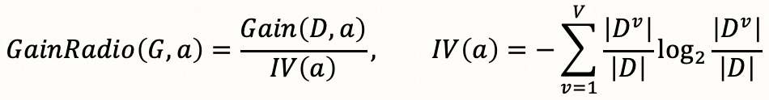
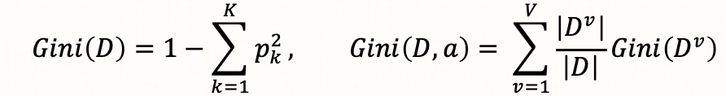
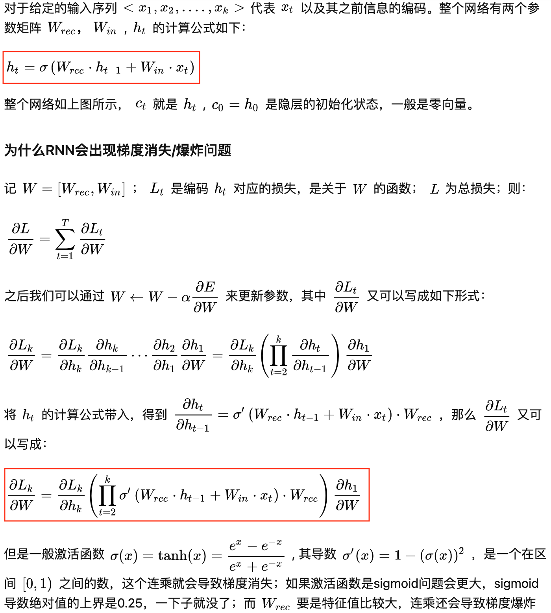
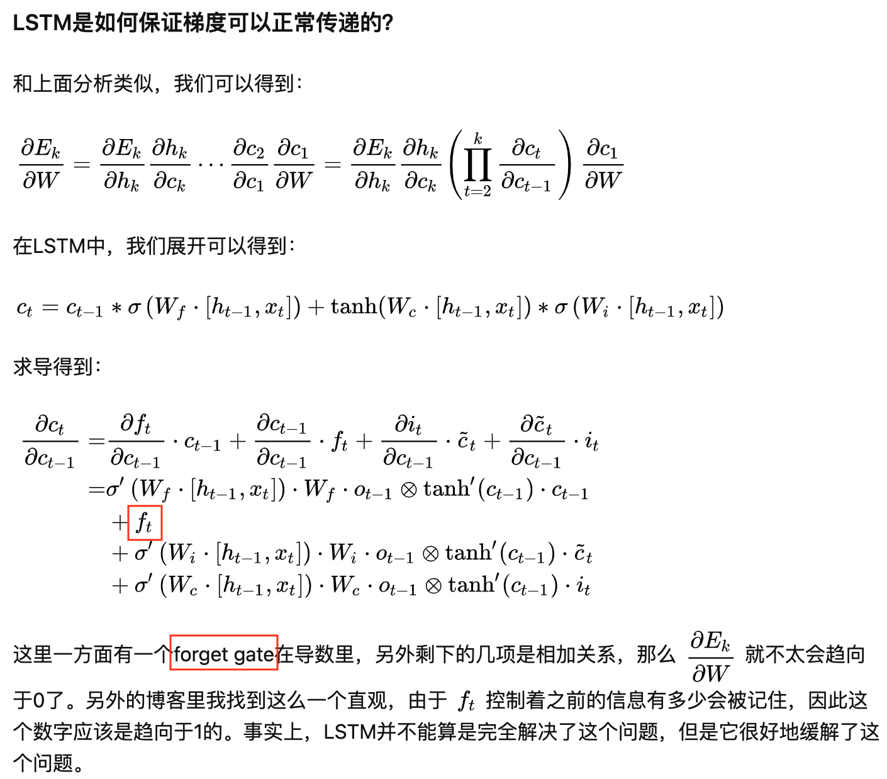
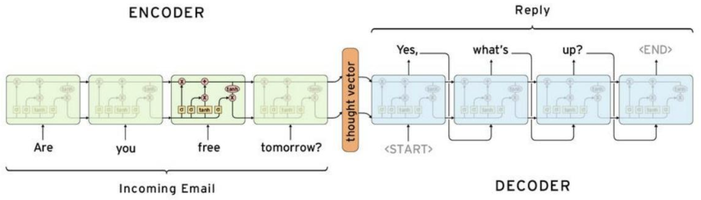
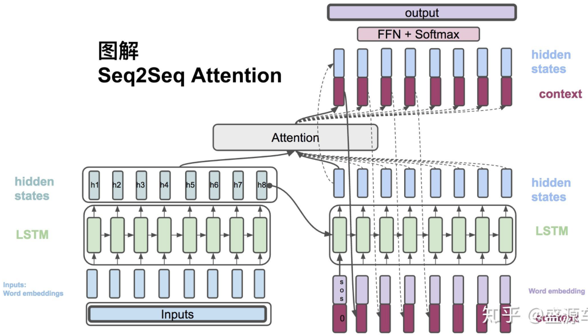
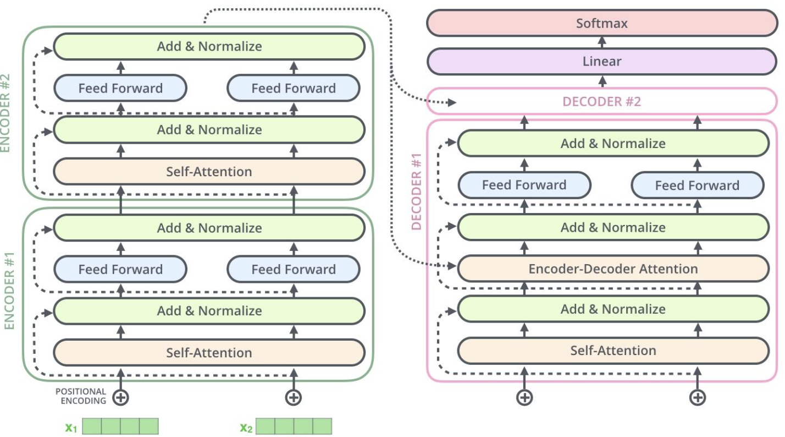
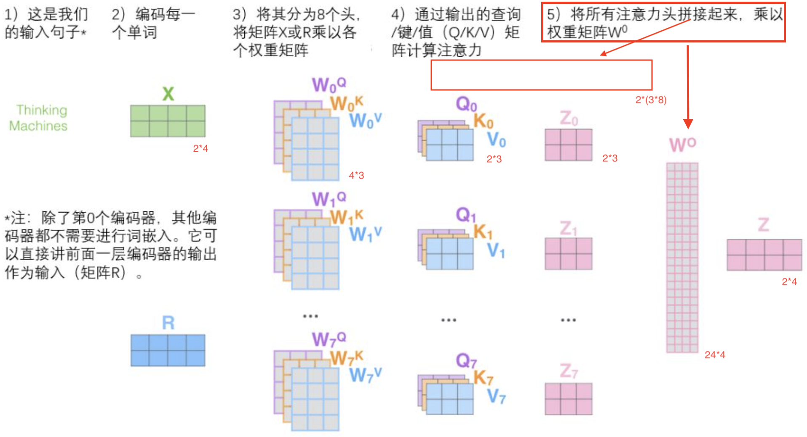

[toc]

# 数学

贝叶斯公式
$P(A|B) = P(B|A)P(A)/P(B)$
其中$P(B)=P(B|C_1)P(C_1)+P(B|C_1)P(C_2)$

## [泰勒展开](https://charlesliuyx.github.io/2018/02/16/%E3%80%90%E7%9B%B4%E8%A7%82%E8%AF%A6%E8%A7%A3%E3%80%91%E6%B3%B0%E5%8B%92%E7%BA%A7%E6%95%B0/)


## 常用概率分布

### 伯努利分布（0-1分布）

$P(X=0)=p$

$P(X=1)=1-p$

期望：$p$

方差 $p(1-p)$

### 二项式分布

X：n次伯努利实验的结果

$P(X=k)=C_n^kp^k(1-p)^{n-k}$

期望：np

方差：np(1-p)

### 几何分布/负二项分布

**几何分布**

几何分布与二项分布类似，也是由n次伯努利分布构成，随机变量X表示第一次成功所进行试验的次数

$P(X=k)=p*(1-p)^{k-1}$

期望：$1/p$

方差：$(1-p)/p^2$

**负二项分布**

负二项分布是几何分布的一般形式，表示直到成功r次停止，显而易见，当r=1时，它就是几何分布

### 超几何分布

表示在N个物品中有指定商品M个，不放回抽取n个，抽中指定商品的个数，即X~H(N,n,M)，则抽中k件的概率为：


### 多项式分布


### 先验/后验概率

先验概率和后验概率的概念是相对的。后验的概率通常是在先验概率的基础上加入新的信息后得到的概率，也通常称为条件概率，有时也可以认为是不断学习修正得到的更精确、更符合当前情况下的概率。

1. 例1（抽奖活动）

   5个球中有2个球有奖，五个人去抽，小明排在第三个，问题小明抽到奖的概率是多少？

   初始时什么都不知道，当然小明抽到奖的概率P( X = 1) = 2/5。但当知道第一个人抽到奖后，小明抽到奖的概率就要发生变化，P(X = 1| Y1 = 1) = 1/4。

2. 例2（语言模型）

   计算一个单词w被语言模型产生的概率P(w)。没有看到任何语料库的时候，我们只能猜测或者凭经验，或者根据一个文档中单词w的占比，来决定单词的先验概率P(w) = 1/1000。之后根据获得的文档越多，我们可以不断的更新概率。

### 共轭分布

通常我们假设先验概率符合某种规律或者分布，然后根据增加的信息，可以得到后验概率的计算公式或者分布。

如果先验概率和后验概率的符合相同的分布，那么这种分布叫做共轭分布。

共轭分布的好处是可以清晰明了的看到，新增加的信息对分布参数的影响，也即概率分布的变化规律。

## 似然和概率

$L(\theta|x)$是在确定的结果下去推测产生这个结果的可能环境（参数）

$P(x|\theta)$理解为在θ 的前提下，事件 x 发生的概率

需要说明的是两者在数值上相等，但是意义并不相同，L 是关于 θ 的函数，而 P 则是关于 x 的函数，两者从不同的角度描述一件事情。

## 假设检验

### H0/H1
```text
当我们的某个猜想难以直接验证的时候,我们通过证伪目标的互斥命题来间接达到目的.
比如,当我们想要验证新模型比旧模型效果更好,我们可以证伪新旧模型之间效果一致.
一般希望达成的目标称为备择假设H1, 与之对立的称为零假设H0. 
H0: 新旧模型效果一致.
H1: 新旧模型效果不一致.
```
### p-value
```text
当我们成功拒绝H0时,p-value是指多大概率我们做出了错误的决策,也称为第一类错误/假阳性.
如新冠肺炎每100个确诊的人里,有5个是被误诊的,那么假阳性率就是5%.
p-value越小,做出错误决策的概率越低.
```

## 基尼指数和熵


是在p(x)=1 处做泰勒展开


# 数据预处理 


# 误差来源于哪里？


对于不同sample的data，模型越复杂，variance越高，但是bias越低

              

> 每个红线表示一个model


                

# 评估指标

## AUC

对于分类问题来说，不同的阈值导致了不同的分类结果，AUC进行综合衡量。

### 混淆矩阵


### ROC&AUC

横轴为FPR，纵轴为TPR

$TPR=TP/(TP+FN)$，正样本被预测为1的概率

$FPR=FP/(TN+FP)$，负样本被预测为1的概率

AUC即ROC曲线下的面积，反应的是随机抽取一对正负样本，**把正样本预测为1的概率大于把负样本预测为1的概率的概率**，

即：$AUC=P(P_正>P_负)$

1. AUC的最大值为1，此时TPR恒为1，表示正样本永远被预测正确

### 解释

AUC面积越大，对于任意一个fixed的截断点（FPR，TPR）越靠近左上角

$FPR \to 0$，负样本几乎全被预测为0

$TPR \to 1$，正样本几乎全被预测为1，

上述是对于任意截断点来说的，很明显是分类器对**正样本的打分基本要大于负样本的打分**

### 计算方法

1. $AUC = ROC曲线下的面积/X\times Y区域的面积$

2. $AUC=\frac{\sum_{i=1}^MN_i}{(M*N)}$

   其中，M为正样本数量，N为负样本数量，$N_i$ 为分值排在第 $i$ 个真实正样本**之后**的真实负样本个数

### 优缺点

优点：

- AUC衡量的是一种排序能力，因此特别适合排序类业务。
- AUC能够综合考虑到正例和负例，在样本不均衡的情况下，也可以做出合理的评估。
- 其他指标比如precision，recall，F1，根据区分正负样本阈值的变化会有不同的结果，而AUC不需要手动设定阈值，是一种整体上的衡量方法。

缺点：

- 忽略了预测的概率值和模型的拟合程度。

  例子：假设某个模型对“1”类样本输出的概率都是0.51，对“0”类样本输出的概率均为0.49，此时AUC是1，但是二元交叉熵非常大。

- AUC反应了太过笼统的信息。无法反应召回率、精确率等在实际业务中经常关心的指标。

- AUC只关注正负样本之间的排序，并不关心正样本内部，或者负样本内部的排序，即没有给出模型误差的空间分布信息，这样我们也无法衡量同类样本好坏程度的刻画能力；

- misleading问题

  下图A和B的AUC相等，但两个模型在不同区域的预测能力不同，不能单纯根据AUC的大小来判断模型的好坏。

  

## GAUC（Group AUC）

### 动机

传统的AUC反映的是整体样本间的一个排序能力，但是推荐领域要评估的是模型对于每个人的二分类结果的排序能力，GAUC是在**请求粒度**的角度去评估模型的排序能力。$AUC=P(P_正>P_负)$

**例子**

两个用户甲和乙，5个样本，其中+表示正样本，-表示负样本。现有两个模型A和B，对5个样本的predict score按从小到大排序如下：


对于用户甲的样本，模型A和B对甲的正样本打分都比其负样本高；对于用户乙的样本也是如此，**因此分别对于用户甲和乙来说，这两个模型的效果是一样好的。**但是$AUC_A=0.883, AUC_B=0.667$

AUC在这个场景下不准了。这是因为，AUC是对于全体样本排序后计算的一个值，**反映了模型对于整体样本的排序能力**。但用户推荐是一个个性化的场景，不同用户之间的商品排序不好放在一起比较。因此阿里妈妈团队使用了Group AUC来作为另一个评价指标。

### [计算方法](https://github.com/qiaoguan/deep-ctr-prediction/blob/master/DeepCross/metric.py)

GAUC即先计算各个用户自己的AUC，然后加权平均


权重一般可以设为**每个用户view或click的次数**，而且==**会过滤掉单个用户全是正样本或负样本的情况。**==

### 缺点

**优点**

- 在请求粒度的角度去评估模型的排序能力，当AUC增加了很多，实际效果却变差了，这时候可以看一下GAUC。

**缺点**

- 会过滤掉单个用户全是正样本或负样本的情况。

# Loss Function

==损失函数的选择是出于对数据分布的假设，不同的loss形式隐式地有对数据分布的要求，需要分析数据特点进行判断==

至于为什么A分布对应甲损失函数，B分布却对应乙损失函数，简单来说这是**最大熵原理**约束下的选择。

如对于高斯噪音分布，选择mse是满足最大熵要求的，它没有在高斯分布的假设之外增加额外的先验偏好。

## MSE

真实值和回归值之间的平均平方差异


回归问题常用mse作为损失函数，这里面一个隐含的假设是**误差符合高斯分布**。

## 交叉熵

真实标签分布（onehot）和预测标签分布的分布距离度量，交叉熵和MSE不同，其隐含假设为**数据服从多项式分布**，（多项式分布一般和离散数据相关）。


## Q&A

### 分类问题不用MSE的原因

**结论：**分类问题不易使用MSE

以3分类问题为例，例如某样本label是(1, 0, 0)，评估两个预估值(0.8, 0.1, 0.1)和(0.8, 0.15, 0.05)

预估输出概率为$\hat y = (\hat y_a, \hat y_b, \hat y_c)$,其中

$$\hat y_a = softmax(z_a) = \frac{e^{z_a}}{\sum_k e^{z_k}}$$

1. 从概率角度

   前者mse损失函数值更小。这在分类问题上显然是不合适的（分类更关注于正确类别的概率，这两者都为0.8）。

2. 从梯度角度

   - MSE

     

     **如果$\hat y_a=0$说明错得离谱，但根据上面推导此时梯度却是0.**

   - 交叉熵

     

     **$\hat y_a=1$时梯度是0，符合直觉.**

### 回归问题可用交叉熵

本质上回归应该用什么样的损失函数取决于数据分布，损失函数的选择本身也是一种先验偏好，选择mse意味着你认为数据误差符合高斯分布，选择交叉熵则表示你倾向于认为数据接近多项式分布。

多项式分布一般和离散数据相关，但如果连续数据分桶后接近多项式分布，那选用mse可能就不合时宜了，但可选用CE。

1. **如何在回归中使用交叉熵损失**

   以二元交叉熵为例

   $L=-(plog\hat y+(1-p)log(1-\hat y))$

   将概率推广成实数

   $L=-(alog\hat y+blog(1-\hat y))$

   这里的a, b已不必具有概率意义，这种形式的loss收敛目标：

   

   如将上述CE应用于回归，则另a为回归目标，b=1，即

   收敛目标是$1/(1+a)$，预估值是$1/(1+e^{-z})$ ==> 则$a=e^z$

   **即此时模型预估值并不是回归目标，而是$e^z$收敛到回归目标**

2. **例子**

   YouTube推荐系统中 serving 时使用的值是指数形式的中间值，预估值的物理含义为：**用户期望观看时长**


$e^z$其实是LR中的Odds，为什么此Odds为观看时长？


因为训练方式为 Weighted LR，这里的Weight，对于正样本i来说就是观看时长Ti，对于负样本来说，则指定了单位权重1。Weighted LR的特点是，正样本权重w的加入会让正样本发生的几率变成原来的w倍，也就是说样本i的$Odds =\frac{w_ip}{1-w_ip}$,在视频推荐场景中，用户打开一个视频的概率p往往是一个很小的值，因此上式可以继续简化：$Odds \approx w_ip=T_ip=E(T_i)$

## Focal Loss

[Focal Loss for Dense Object Detection](https://openaccess.thecvf.com/content_ICCV_2017/papers/Lin_Focal_Loss_for_ICCV_2017_paper.pdf)

增强难分类样本

在CV的目标检测任务中，传统方案都是两阶段解法：第一阶段首先去除图片背景，第二阶段从图片中抠出目标。如果想要将两阶段合并成一个阶段直接把目标找出来就面临两个问题：1）图片的大多区域都是背景，负样本占比过大，面临严重的样本不均衡；2）图片背景很容易被分类器识别出来，导致模型被带偏（dominated）。因此作者提出一种动态加权的交叉熵——Focal Loss，优化上面两个问题

## Dynamic Bootstrapping Loss

[Unsupervised Label Noise Modeling and Loss Correction](https://arxiv.org/pdf/1904.11238)

削弱难分类样本

与FL不同，本文认为由于人工标记的不确定性，CV图像分类数据集中常常会有一些被错误标记的样本，也就是噪声样本。针对这些噪声的去除已经有很多成熟的方法，本文在Bootstrapping Loss的基础上进行改进，试图降低难分类样本的权重。

## Gradient Harmonized Mechanism

[Gradient Harmonized Single-stage Detector](https://arxiv.org/pdf/1811.05181.pdf)

同时削弱易分类和难分类样本

这篇论文也是目标检测领域的，作者认为Focal Loss对难分类样本进行增强是不合适的。本文作者认为目标检测中的样本不平衡问题可以被归因（summarized）为样本学习难易程度上的不平衡，进而转变为梯度分布上的不平衡。认为大多数时候易分类就是负样本（图片背景），难分类的就是正样本；易分类样本loss小，从而梯度小，难分类样本梯度较大。作者尝试分析了训练过程中梯度大小的分布情况：

# 机器学习

## 逻辑回归

log(Odds)=wx


> 称为对数几率回归的原因  


## 岭回归和Lasso


## 决策树

==树模型不需要归一化，归一化解决梯度下降过程中的等高线椭圆 导致迭代次数增多的问题，树模型不需要梯度下降==

离散值需要onehot


### 计算最优划分属性

#### 信息增益（ID3）

**信息熵**


**信息增益**

假设属性a有V个取值，则会产生V个分支点，$D_v$ 为第 v 个分支节点包含了 D 中所有在属性 a 上取值为 v 的样本


>信息增益偏向于选出那些分叉多的特征

**计算流程**

选择信息增益最大的特征，如最大信息增益小于事先制定的阈值，则返回叶子节点，类标记为多数样本的类标签。否则，对此特征的**每一个取值**将数据切分成若干子集,即 $D_v$ 是选出特征 a=v 时的样本集合。然后递归调用

#### 信息增益比（C4.5）

因为信息增益容易选取特征取值多的特征。一般情况，a的取值越多，则IV(a)值通常会越大。因此信息增益比对可取值数目较少的属性有所偏好，因此C4.5先从候选划分属性中找出信息增益高于平均水平的属性，再从中选出增益率最高的。



#### Gini指数

Gini(D)为随机从数据集D中抽取两个样本，两个样本不一致的概率。那么Gini(D)越小，则数据集的纯度越高。因此，选择使得划分后基尼指数最小的属性为最优属性。



### CART（二叉树）


#### 回归树(平方误差最小准则)


> ==切分变量和切分点(j,s)的求解一般选用启发式的算法==
>
> ==每个节点的输出值是结点所有样本值的**均值**==

#### 分类树（gini index）

基尼系数比熵的计算更加高效，不涉及log


> 二叉树，所以是否等于a，将数据集分割成两部分
>
> ==叶子节点输出值(即叶子结点的权重)是落入到叶子节点的样本中最多的那个label==


### 决策树剪枝

**思想**：剪枝通过极小化决策树的损失函数(等价于正则化的极大似然估计)  


其中C(T)表示模型对训练数据的拟合程度，|T|表示模型复杂度，\alpha是事先指定的值


> 其中|T|是叶子节点个数，N_t 是叶子t包含的样本数量，$ \alpha $>=0 为调节参数。
>
> ==物理意思为每个叶子结点的熵 + 叶子结点的个数。==

#### 预剪枝（生成过程剪枝）


#### 后剪枝（基于目标函数）

先建树再剪枝，剪枝由目标函数指导


#### CART剪枝（CCP方法）


> 首先证明当alpha取g（t）  

==未完==


## Adaboost


Adaboost（Adaptive boosting）：改变训练样本权重来学习多个弱分类器并进行线性组合的过程

1. 在训练过程中如何改变训练样本的权重或者是概率分布
2. 如何将多个弱分类器组合成一个强分类器

## Random Forest（bagging）


### 随机性

1. 随机抽样训练集（Bootstrap）

   $\lim\limits_{n\to+\infty}(1+\frac{1}{n})^n=e$

   一个样本在n次都不被采样到的概率是$(1-\frac{1}{n})^n$，当n趋向于无穷时极限为$\lim\limits_{n\to+\infty}(1+\frac{1}{n})^n=\frac{1}{e}$，即初始数据集中约有36.8%的样本未出现在训练样本中（OOB数据）。

2. 节点分裂随机的选取m个特征

   减小特征选择个数m，树的相关性和分类能力也会相应的降低；增大m，两者也会随之增大。所以**关键问题**是如何选择最优的m。

### 特征重要性

思想：判断每个特征在随机森林中每个树上的贡献，最后取平均值，然后比较各特征贡献的大小，主要采用基尼指数、基于袋外数据

1. 基于基尼指数


2. 基于袋外数据

   - 用OOB去做交叉验证，或不做交叉验证，直接用oob_score去对模型性能做评估

   - 对每棵决策树，用OOB计算袋外数据误差errOOB1；然后随机对OOB所有样本的特征加入**噪声干扰**，再次计算袋外数据误差errOOB2；假设有N棵树，**特征i的重要性**为：$\sum_{i=1}^N(errOOB_2-errOOB_1)/N$

     如果加入随机噪声后，袋外数据准确率大幅下降，说明这个特征对预测结果有很大的影响，说明他的重要性比较高

3. 基于噪声干扰

   随机改变第j列，其他列不变，对第j列进行随机的替换，E1-E2来刻画特征j的重要性。其中对数据进行打乱的方法通常有两种：

   - 使用uniform或者gaussian抽取随机值替换原特征
   - 通过permutation的方式将原来的所有N个样本的第 i 个特征值重新打乱分布（相当于重新洗牌）


## GBDT（boosting）

### Boosting Tree

Boosting Tree基于CART（回归/分类）为基学习器，是一个加法模型。

           

### GBDT

梯度提升树（Grandient Boosting）是Boosting Tree的一种改进。利用**损失函数的负梯度**作为提升树算法中的残差的近似值。


**叶子结点的值**

gbdt：采用的是回归树

​           1.回归任务的叶子节点输出值(即叶子结点的权重)是落入到叶子节点的样本的均值

​           2.二分类任务的叶子节点输出值(即叶子结点的权重)是**落入到该节点的样本的负梯度的一个公式**。如果损失函数是交叉熵，再将该节点输出(一般乘以一个shinkge学习率后)做一个sigmoid激活得到概率。


## XGBoost（boosting）

1. XGB将回归和分类整合进了一套统一的目标函数

   

   $l(y_i,\hat y_i)$ 可以是平方损失（回归），logistic loss（分类）

2. XGB通过拟合残差逼近目标值


3. boosted方式概述（==加入shrinkage抑制过拟合==）

   

### 目标函数

#### **第`t`轮的原始目标函数**


#### **二阶泰勒展开**

动机 

1. 相比GBDT基于`t-1`轮的预测值$y_{t-1}$处做一阶的泰勒展开，泰勒二阶近似比一阶近似更接近真实的Loss Fnction，优化的更彻底。
2. ==二阶展开之后loss函数变成了一个 $f_t^2(x_i)$ 的二次函数，可直接求的使loss最小的 $f_t(x)$==


> $f(x) = l(y_i, \hat y^{(t-1)}) = (y_i - \hat y^{(t-1)})^2$

> $f(x+\Delta x) = l(y_i, \hat y^{(t-1)} + f_t(x_i)) = (y_i - (\hat y^{(t-1)} + f_t(x_i)))^2$

> Where： $x=\hat y^{(t-1)},  \Delta x = f_t(x_i)$，在 $\hat y^{(t-1)}$ 处展开

==**去除常数项之后：**==


#### **树的复杂度**

原始的GBDT算法基于经验损失函数的负梯度来构造新的决策树，只是在决策树构建完成后再进行剪枝。而XGBoost在决策树构建阶段就加入了正则项。一些符号定义：

1. 每个叶子有一个打分**$w_j$**, **如下图所示叶子三中的所有实例打分都为`-1`**
2. 一个将样本映射为叶子的mapping函数


**复杂度$\Omega$定义**

1. 树的叶子结点个数
2. 所有叶子结点上得分wj平方的和，这部分限制当前树中不要每个叶子结点都预测的过分接近残差，要为下一棵树留点优化空间。


#### **第`t`轮的目标函数**


### 求解方法

#### 在树的结构固定时

优化此目标函数是一个二次函数求最值问题，最优解为$w_j^*=-G_j/(H_j+\lambda)$


#### 如何搜索树的结构

**定义增益指导分割**，在实践过程中增益还有**熵或基尼index**


线性扫描选择切分特征和分割点


### 关于剪枝


### [特征重要性](https://www.jianshu.com/p/2920c97e9e16)

xgboost实现中Booster类get_score方法输出特征重要性，其中*importance_type参数*支持三种特征重要性的计算方法：

- *importance_type=*weight，使用**特征在所有树中作为划分属性的次数**作为特征重要性度量。（默认值）

- *importance_type=*gain，    使用**特征在作为划分属性时loss平均的降低量**作为特征重要性度量。（常用）

  `gain = total_gain / weight`，

- *importance_type=*cover，  使用**特征在作为划分属性时对样本的覆盖度**作为特征重要性度量。

  `cover = total_cover / weight`，`total_cover`表示在所有树中，某特征在每次分裂节点时处理(覆盖)的所有样例的数量。

==注意区别随机森林特征重要性的计算==

### 叶子结点的值

叶子节点输出值wj(即叶子结点的权重)是wj= -Gj/(Hj+λ) ，其中Gj是所有落到这个叶子结点的一阶导，Hj是所有落到这个叶子结点的二阶导，λ是叶子节点的正则系数。

### [迁移学习](https://github.com/jindongwang/transferlearning-tutorial)

https://www.hongruimy.com/a/18605

https://mp.weixin.qq.com/s?__biz=MzA3MTU2ODMzNA==&mid=2247498475&idx=2&sn=0857aea4d3309a6dfcf1add739b960ab&chksm=9f29244aa85ead5c9920a059b33b4e745f73695a5685a8648490afb1bb534f9d68ef765ed303#rd

给定一个源域Ds和目标域Dt，常规迁移学习可以定义为优化f：


其中vi为样本权重，T为特征变换函数（在深度学习中可以是一个共享网络层）, 这里的R项不完全等价于模型复杂度，可以看做一种迁移正则项。从这个定义出发，有以下三种迁移学习方法：

- 样本权重迁移法

  Tradaboost[3]等方法即是通过调整样本权重实现迁移学习，它对于源域中越无法被正确分类的样本赋予越小的权重，对于目标域中越无法被正确分类的样本赋予越大的权重。

  [3] W. Dai, et al., 2007. Boosting for Transfer Learning. In ICML. ACM, 193-200

- 特征变换迁移法

  通过学习特征变换函数T来减小R项。

- 预训练模型迁移法

  $R(T(D_s),T(D_t)):=R(f_s, D_t)$，即把源域学到的模型fs拿到目标域Dt的数据上去finetune。使用XGboost先后对源域和目标域做提升树在原理上也是类似的。

- ==补充想法==，在domain1训练xgb1，xgb1在domain2预测值作为一个domain2的新特征，训练xgb2，反过来xgb2可以在domain1上预测为domain1增加新特征。**这样不断迭代下去，是否可行，收敛性如何考虑？**

### Q&A

#### **如何处理离散型特征**

One-hot之后直接拼到原始特征中，或统计后分桶再onehot或label encoding。

#### 为什么在稀疏特征上表现不好

1. 每次分裂Onehot特征时的选择不再是选择一个特征，而是一个特征的某一维。此时树的分割往往只考虑了少量特征，大部分特征用不到，少量的特征在多次重复用到，剩余的长尾基本用不到。模型容易过拟合。

2. GBDT容易因为训练集中个别样本的某个稀疏feature与y的偶然关系，拟合到噪声（用某一特征将训练集分至类别单一的叶子结点，无法再分），产生过拟合。

**和LR的比较**

LR每次随机选择batch个样本对w优化，特征=0（xi），则梯度=0，实则是用特征i不为0的样本对wi梯度下降。如果特征稀疏，则下降次数也少，不容易过度拟合。

⚠️注意：对于离散特征较多的情形（如用户的打车行为），xgb 不太适合，但在分布稠密的数据集上，泛化能力和模型表达能力都很好。

#### **xgb的特征交叉体现在哪里**

多个子树分裂过程的特征选择可能不一致，后一个树在前一个树的基础上预测残差，相当于进行了特征交叉

#### xgb如何防止过拟合

1. 显式地加入了正则项来控制模型的复杂度
2. 借鉴了随机森林的做法，支持特征抽样，防止过拟合同时减少计算
3. 衰减系数shrinkage，后续树不会完全拟合

#### **重复选择特征**

同一颗树多次分裂过程可以选择之前选过的特征

#### **[xgb的超参数](https://www.cnblogs.com/TimVerion/p/11436001.html)**


```scala
val xgbParam = Map(
    "objective" -> "binary:logistic",
    "num_round" -> 15,         //训练的轮数,也就是需要多少棵树。
    "eval_metric"->"auc",
    "max_depth"->12,           //树的深度，默认值为6,典型值3-10.调参:值越大，约容易过拟合;值越小，约容易欠拟合。
    "subsample"->0.9,          //每棵树需要的样本数占总的样本数的比例,防止过拟合,默认值为1 典型值为(0.5-1)
    "colsample_bytree"->0.9,   //每颗树使用的特征占总的特征比例，防止过拟合,默认值为1,典型值为(0.5-1)
    "eta"->0.4882498358964229, //学习率
    "num_workers" -> 100       //训练需要的work个数
)
```


[xgb调参指南](https://blog.csdn.net/han_xiaoyang/article/details/52665396)

超参数是怎么选择的（超参数搜索）

Grid search、Random search

#### **关于并行计算**

xgboost的并行不是tree粒度的并行，xgboost的**并行是在每一层的分裂过程**上的，大致的过程是迭代叶子节点&特征，选择每个叶子结点的最有分裂特征和分裂节点，然后执行树的构建。

xgboost在训练之前，预先对特征的值进行排序，保存为block结构，后面的迭代中重复地使用这个结构，大大减小计算量。这个block结构也使得并行成为了可能，在进行节点的分裂时，需要计算每个特征的每个分割点对应的增益，最终选增益最大的那个特征去做分裂，**各个特征的增益计算可以开多线程进行**。

增益计算一般采用**贪心法枚举所有可能的分割点**，当数据无法一次载入内存或者在分布式情况下，贪心算法效率就会变得很低，所以xgboost还提出了一种**可并行的近似直方图算法**，用于高效地**生成候选的分割点**。

#### **Boosting和Bagging**

- Boosting能够提升弱分类器性能的原因是降低了偏差

  Boosting过程不断拟合残差，因此会降低偏差，另一方面，弱分类器之间是强相关的，**缺乏独立性**，并不会对降低方差有作用

- Bagging能够提高弱分类器性能的原因是降低了方差

  Bagging 是 Bootstrap Aggregating 的简称，意思就是再抽样，然后在每个样本上训练出来的模型取平均，此时**模型是相互独立的**，对*n*个独立不相关的模型的预测结果取平均， 方差是原来单个模型的1/*n*

#### XGB和GBDT的区别

1. 传统GBDT以CART作为基分类器，xgboost还支持线性分类器，这个时候xgboost相当于带L1和L2正则化项的逻辑斯蒂回归（分类问题）或者线性回归（回归问题）

2. 传统GBDT在优化时只用到一阶导数信息，xgboost则对代价函数进行了二阶泰勒展开，同时用到了一阶和二阶导数。xgboost工具支持自定义代价函数，只要函数可一阶和二阶求导。
3. 在使用CART作为基分类器时，XGBoost显式地加入了正则项来控制模型的复杂度，有利于防止过拟合，从而提高模型的泛化能力。
4. 传统的GBDT在每轮迭代时使用全部的数据，XGBoost则采用了与随机森林相似的策略，支持对数据进行采样。
5. xgboost在代价函数里加入了正则项，用于控制模型的复杂度
6. Shrinkage（缩减），相当于学习速率（xgboost中的eta）。xgboost在进行完一次迭代后，会将叶子节点的权重乘上该系数，主要是为了削弱每棵树的影响，让后面有更大的学习空间。
7. 列抽样（column subsampling）。xgboost借鉴了随机森林的做法，支持列抽样，不仅能降低过拟合，还能减少计算，这也是xgboost异于传统gbdt的一个特性。
8. 对缺失值的处理。对于特征的值有缺失的样本，xgboost可以自动学习出它的分裂方向。
9. 支持并行计算

#### **优点&缺点**

**优点**

- 可解释性和鲁棒性
- 能够自动发现特征间的高阶关系
- 不需要对数据进行特殊的预处理如归一 化

**缺点**

- 不适用高维稀疏的数据集
- 串行训练，只能在决策树内部采用一些局部并行的手段
- 对于连续特征处理还好，特征embedding处理不好，明显不如深度模型（比如深度模型可以attention），xgb只能把一个embedding当成多个特征

# 深度学习

## 学习任务

find a mapping f

### 回归

### 分类

### structure learning （output a seq, matrix, graph, tree, ...）

- Machine translation
- Speech recognition
- Chat-bot
- Image2image (图片上色)
- text2image (输入文字，生成文字所描述的图片)

why structure learning challenging?

- One-shot/Zero-shot (test 的时候遇到的实例可能是一次也没有见过的，类似的也没有见过)
- Machine has to learn to do **planning**（对于一次输出，不仅子元素输出正确，而且元素间符合逻辑）

Structured Learning Approach

- Top Down

  Learn to generate the object at the global level, Evaluating the whole object, and find the best one

- Bottom Up

  Learn to generate the object at the component level，容易没有大局观

## 激活函数

### Sigmoid和Tanh


**tanh是sigmoid的平移：$tanh=2sigmoid(2*x)−1$**

**梯度消失**

Sigmoid：导数为$f(z)(1-f(z))$，当z过大或过小的时候,激活值趋近于0或1，导数趋近于0

tanh：导数为$1-f^2(z)$，当z过大或过小的时候,激活值趋近于-1或1，导数趋近于0

### ReLU和LReLU


**优点：**

1. 计算量小
2. ReLU的非饱和性可以有效地解决梯度消失的问题
3. ReLU的单侧抑制提供了网络的稀疏表达能力

**缺点：**

1. 负梯度在经过该ReLU单元时被置为0，导致神经元死亡，在之后也不被任何数据激活，即流经该神经元的梯度永远为0，不对任何数据产生响应，进而参数梯度无法更新，整个训练过程失败。
2. 


## [Batch-Normalization](https://www.cnblogs.com/shine-lee/p/11989612.html)

### [归一化](https://blog.csdn.net/blogshinelee/article/details/102875044)

#### 为什么要做特征归一化

1. 从距离计算考虑

   一个特征的变化范围可能是[ 1000 , 10000 ]，另一个特征的变化范围可能是[ − 0.1 , 0.2 ]，在进行距离有关的计算时，单位的不同会导致计算结果的不同，**尺度大的特征会起决定性作用，而尺度小的特征其作用可能会被忽略**，为了消除特征间单位和尺度差异的影响，以对每维特征同等看待，需要对特征进行归一化。

2. 从SGD过程考虑

   只要权重w与输入特征x 间是相乘关系，损失函数对w的偏导必然含有因子x，**w 的梯度下降速度就会受到特征x尺度的影响**，学习率不容易选择，下降过程也可能不稳定，通过scaling可对不同方向上的下降速度有所控制，使下降过程相对更稳定。
   以MSE为例，原始特征因尺度差异，其损失函数的等高线图可能是椭圆形，梯度方向垂直于等高线，下降会走 **zigzag** 路线，而不是指向local minimum。通过对特征进行zero-mean and unit-variance变换后，其损失函数的等高线图更接近圆形，梯度下降的方向震荡更小，收敛更快.


3. 从激活函数考虑

   采用sigmoid等有饱和区的激活函数，如果输入分布范围很广，参数初始化时没有适配好，很容易直接陷入饱和区，导致梯度消失，所以，需要对输入做Standardization或映射到[ 0 , 1 ] 、[ − 1 , 1 ]， 并配合参数初始化方法，对值域进行控制。

#### 归一化方法中的平移和尺度缩放

1. **减一个统计量**可以看成**选哪个值作为原点，是最小值还是均值，并将整个数据集平移到这个新的原点位置**。如果特征间偏置不同对后续过程有负面影响，则该操作是有益的，可以看成是某种**偏置无关操作**；如果原始特征值有特殊意义，比如稀疏性，该操作可能会破坏其稀疏性。

2. **除以一个统计量**可以看成在坐标轴方向上对特征进行缩放，用于降低特征尺度的影响，可以看成是某种**尺度无关操作**。缩放可以使用最大值最小值间的跨度，也可以使用标准差（到中心点的平均距离），前者对outliers敏感，outliers对后者影响与outliers数量和数据集大小有关，outliers越少数据集越大影响越小。

3. **除以自身模长**相当于把长度归一化，把所有样本映射到单位球上，可以看成是某种**长度无关操作**，比如，词频特征要移除文章长度的影响，图像处理中某些特征要移除光照强度的影响，以及方便计算余弦距离或内积相似度等。

#### 什么时候需要归一化

1. 涉及距离计算的算法

   比如K-means、KNN、PCA、SVM等。

   如PCA倾向于关注方差较大的特征所在的坐标轴方向，其他特征可能会被忽视，因此，在PCA前做Standardization效果可能更好。

2. 损失函数中含有**正则项**时

   正则项如$\lambda ||W||$, $\lambda$ 为超参数，**对每一个参数w施加同样的惩罚系数**，但对于某一维特征 $x_i$ 而言，其scale越大，系数 $w_i$ 越小，其在正则项中的比重就会变小，相当于其惩罚变小，即损失函数会相对忽视对那些scale大的特征的惩罚，这并不合理，所以需要feature scaling，使损失函数平等看待每一维特征。

3. 涉及梯度下降的算法

   在梯度下降过程中，**所有参数维度共用同一个学习率**。收敛意味着在每个参数维度上都取得极小值，每个参数维度上的偏导数都为0，但是损失函数对w的偏导必然含有因子x，w 的梯度下降速度会受到特征x尺度的影响，为了每个维度上都能收敛，先将特征归一化，这样更容易选择到合适的学习率，使下降过程相对更稳定。（学习率可以取所有维度在当前位置合适步长中最小的那个（小学习率可以保证所有参数都收敛到local minimum）。


4. zero center与参数初始化相配合，缩短初始参数位置与local minimum间的距离，加快收敛。

   模型的最终参数是未知的，所以一般随机初始化，比如从0均值的均匀分布或高斯分布中采样得到，对线性模型而言，其分界面初始位置大致在原点附近，bias经常初始化为0，则分界面直接通过原点。同时，为了收敛，学习率不会很大。而每个数据集的特征分布是不一样的，如果其分布集中且距离原点较远，比如位于第一象限遥远的右上角，分界面可能需要花费很多步骤才能“爬到”数据集所在的位置。所以，无论什么数据集，先平移到原点，再配合参数初始化，可以保证分界面一定会穿过数据集。此外，outliers常分布在数据集的外围，与分界面从外部向内挪动相比，从中心区域开始挪动可能受outliers的影响更小。

#### 什么时候不需要归一化

与距离计算无关的模型，不需要feature scaling，比如Naive Bayes；决策树、随机森林等，树中节点的选择只关注当前特征在哪里切分对分类更好，即只在意特征内部的相对大小，而与特征间的相对大小无关。

### Batch Normalization

#### 动机

如果没有做归一化处理，那么每一批次训练数据的分布不一样，从大的方向上看，神经网络则需要在这多个分布中找到平衡点，从小的方向上看，由于每层网络输入数据分布在不断变化，会导致每层网络在找平衡点，很难收敛

以神经网络的某一层为考虑对象，其接受上一层的输入。在梯度下降的过程中，所有层的权重同时在不断更新，第一次backward过程中，调整此层的参数是在拟合上一层forward的输入，同时上一层的参数也会调整，然后在下一轮的forward的时候，由于上一层的参数进行了调整，其输出（后面一层的输入）相当于是一个新的分布，因此相当于后面这一层的激活层输入的分布会一直变化。

在梯度下降的时候，每层权重的更新是在假定其他权重不变的情况下，向损失函数降低的方向调整自己，层之间缺乏默契，造成**Internal Covariate Shift** 现象，为了避免过于震荡，==学习率不得不设置得足够小，足够小就意味着学习缓慢==。为此，希望对每层输入的分布有所控制，于是就有了**Batch Normalization**。

**一个例子（追逐游戏）：**

假定当前输入𝑥1和𝑥2的分布如图中圆点所示，本次更新的方向是将直线H1更新成H2，本以为切分得不错，但是当前面层的权重更新完毕，当前层输入的分布换成了另外一番样子，直线相对输入分布的位置可能变成了H3，下一次更新又要根据新的分布重新调整。**直线调整了位置，输入分布又在发生变化，直线再调整位置，就像是直线和分布之间的“追逐游戏”。**


#### BN计算流程


⚠️注意：

1. 无论𝑥𝑖原本的均值和方差是多少，通过BatchNorm后其均值和方差分别变为待学习的𝛽和𝛾

2. BN把每个通道单独拿出来归一化处理，每个channel都有一组γ,β，所以可学习的参数为2*C

3. 当batch size越小，BN的表现效果越不好，因为计算过程中所得到的均值和方差不能代表全局，

   另一方面，基于一个batch的数据计算均值和方差，而不是基于整个Training set，相当于数据增强，在进行梯度计算时引入噪声，不容易过拟合。

#### BN的反向传播


#### BN预测阶段使用的参数

在预测阶段，所有参数的取值是固定的，对BN层而言，意味着𝜇、𝜎、𝛾、𝛽都是固定值。其中𝜇、𝜎不用批量预测数据的 𝜇、𝜎 的原因是因为：当只输入一个样本的时候，𝜎 无法确定。故**采用训练收敛最后几批mini batch的 𝜇和𝜎的期望，作为预测阶段的𝜇和𝜎**


#### BN添加的位置

对于**有饱和区域的激活函数**来说，其输入可能无法一直保持zero mean unit variance分布，有梯度消失和梯度爆炸的可能。对于此类激活函数，一般建议BN放在激活层之前


对于RELU，前后均可

#### BN的作用

1. **可以使用更大的学习率**，**极大提高了训练速度**（BN发表之前，为了减少震荡，选择小的lr），也可从椭圆和圆的角度解释。

2. **可以将bias置为0**，因为Batch Normalization的Standardization过程相当于移除了偏置量，所以不再需要bias。

3. **对权重初始化不再敏感**，通常权重采样自0均值某方差的高斯分布，以往对高斯分布的方差设置十分重要，有了Batch Normalization后，对与同一个输出节点相连的权重进行放缩，其标准差𝜎也会放缩同样的倍数，相除抵消。

4. **对权重的尺度不再敏感**，理由同上，尺度统一由𝛾参数控制，在训练中决定。

5. **抑制了梯度消失**，深层网络可以使用sigmoid和tanh了，理由：如果输入分布范围很广，参数初始化时没有适配好，容易陷入饱和区，导致梯度消失。

6. **具有减少过拟合作用**，每个batch内的数据相互牵连，不太受单例影响。

7. **BN和dropout有冲突**，dropout的依概率mask操作会改变均值和标准差，从而削弱bn的能力。

#### Scale and shift需要吗？

直觉上理解，**浅层模型中，只需要模型适应数据分布即可**。对深度神经网络，每层的输入分布和权重要相互协调，强制把分布限制在zero mean unit variance并不见得是最好的选择，加入参数𝛾和𝛽，对输入进行scale and shift，**有利于分布与权重的相互协调**，特别地，令𝛾=1,𝛽=0等价于只用Standardization，令𝛾=𝜎,𝛽=𝜇等价于没有BN层，scale and shift涵盖了这2种特殊情况，在训练过程中决定什么样的分布是适合的，所以使用scale and shift增强了网络的表达能力。

### LN、IN、GN和SN


> 将输入的 feature map shape 记为[N, C, H, W]，其中N表示batch size，即N个样本；C表示通道数；H、W分别表示特征图的高度、宽度。为了方便画出示意图，HW是被合成一个维度。

BN、LN、IN和GN归一化的计算流程几乎是一样的，均为：

1. 计算出均值

2. 计算出方差

3. 归一化处理到均值为0，方差为1

4. 变化重构（scale and shift），恢复出这一层网络所要学到的分布

#### BN

1. BN是在batch上，对N、H、W做归一化，而保留通道 C 的维度

2. BN适用于固定深度的前向神经网络，如CNN。

#### Layer Normalizaiton

1. LN在通道方向上，对C、H、W归一化，而保留N的维度。

2. 常用在RNN网络，对**每一个样例内部**进行相同操作，让不同样本间没有差异，但如果输入的特征区别很大时，不建议用它做归一化

#### Instance Normalization

1. IN在图像像素上，对H、W单独拿出来做归一化，而保留(N,C)的维度。

2. 常用在风格化迁移，如果特征图可以用到通道之间的相关性，不建议使用它做归一化处理。

#### Group Normalization

1. GN的计算就是把先把通道C分成G组
、】
2. 】
   1. -098765	·	123、、
   2. 
   3. ｜然后把每个GHW单独拿出来归一化处理，最后把G组归一化之后的数据合并成CHW
3. GN介于LN和IN之间，当然可以说LN和IN就是GN的特列，比如G的大小为1或者为C

#### Switchable Normalization

将 BN、LN、IN 结合，**赋予权重**，让网络自己去学习归一化层应该使用什么方法

## ResNet和DenseNet


DenseNet里 模块B的输出不是像ResNet那样和模块A的输出相加，而是在通道维上连结。每个稠密块都会带来通道数的增加，使用过多则会带来过于复杂的模型。通过过渡层来控制模型复杂度。它通过1 × 1卷积层来减小通道数，并使用步幅为2的平均池化层减半高和宽，从而进一步降低模型复杂度。

## 卷积网络

### 卷积的理解

通过bp不断更新卷积核，是在调整数据的投影方向

### 1*1卷积的作用

用于改变数据的通道数


## 循环网络

==RNN和CNN本质上的区别，从单层角度来看==

RNN：经过一层RNN Unit，最后一个节点的隐藏状态包含了之前所有节点的信息

CNN：经过一层卷积层，输出的结果只包含了卷积核的感受野的信息

RNN $\rightarrow$ ，此处表示每个节点信息包含前面所有节点的信息

CNN $\rightarrow$，每个节点信息包含卷积核感受野内所有节点的信息

### 语言模型

语言模型将文本看成时间序列，计算句子生成的概率$P(w_1,w_2,...,w_T)=P(w_1)P(w_2|w_1)P(w_3|w_1,w_2)\cdots P(w_T|w_1,w_2,\cdots,w_{T-1}).$

#### 应用场景

- 语音识别

  识别模型会根据人的发言生成多个候选句子，这些候选句子可根据语言模型的概率进行排序。

  例子：给定一段“厨房里⻝油 用完了”的语音，有可能会输出“厨房里⻝油用完了”和“厨房里石油用完了”这两个读音完全 一样的文本序列。如果语言模型判断出前者的概率大于后者的概率，我们就可以根据相同读音的 语音输出“厨房里⻝油用完了”的文本序列。

- 机器翻译

  例子：如果对英文“you go first”逐词翻译成中文的话，可能得到“你走先”“你先走”等排列方式的文本序列。如果语言模型判断出“你先走”的概率大于其他排列方式的文本序列的概率，我们就可以把“you go first”翻译成“你先走”。

#### 条件概率计算

给定语料库可以计算上述条件概率

#### n-gram

当序列⻓度增加时，计算和存储多个词共同出现的概率的复杂度会呈指数级增加。因此假设一个词的出现只与前面n个词相关（n阶⻢尔可夫链），如n=3时：$P(w_1,w_2,...,w_T)=P(w_1)P(w_2|w_1)P(w_3|w_1,w_2)\cdots P(w_T|w_{T-3},w_{T-2},w_{T-1}).$

==注意：CBOW可看成ngram模型在忽略了单词顺序的特殊情况==

#### 存在的问题

如何选择n，n太大计算和存储复杂，n太小损失信息。

### RNN

**动机**：对于一个很长的序列，ngram处理最后位置的文本时，其只能和前面n个相关（n是一个定值）。

RNN非刚性地记忆所有固定⻓度的序列，而是**通过隐藏状态来存储之前时间步的信息，而且保持了顺序关系。**


> 问答系统中，待预测值是Tom，要想获得正确答案，模型需要将最开始的Tom记住，如果ngram的n设置的很小，则无法向后传递Tom的信息

#### 模型结构


#### 梯度回传


1. BPTT（基于时间的BP）

   在内存中保留每个时刻的中间数据，随着时间变长，内存和梯度计算都会增加，还会出现梯度消失/爆炸现象

2. 截断的BPTT

   

   只是网络反向传播的链接被截断，每个块之间保持前向的链接，反向传播的过程只考虑块内部（前向计算的时候）

#### 梯度消失/爆炸



RNN对于短期记忆的模型效果很好，却无法进行长期记忆的输出，因为权重累加过于庞大，可能导致结果失真、运算效率低下。LSTM和门控网络应运而生。

### [LSTM](https://zhuanlan.zhihu.com/p/199389873)

将重复信息遗忘，将未知信息记录下来，将结果更新之后，再输出。


>**其中的*是元素积**
>
>遗忘门: 控制前一步记忆单元中的信息有多大程度被遗忘掉;
>
>输入门: 控制当前计算的新状态以多大程度**更新**到记忆单元;
>
>细胞状态：遗忘门点乘上一个细胞状态+输入门点乘这一个临时细胞状态
>
>输出门: 控制当前的输出有多大程度上取决于当前的记忆单元。




### GRU


>**重置门: 计算当前temp cell state的时候对前一个隐状态做一个过滤**
>
>更新门: 调节当前temp cell state和前一个隐状态的tread off。
>
>如果我们将重置门设置为 1，更新门设置为 0，那么我们将再次获得标准 RNN 模型。

使用门控机制学习长期依赖关系的基本思想和 LSTM 一致，但还是有一些关键区别：

- GRU 有两个门（重置门与更新门），而 LSTM 有三个门（输入门、遗忘门和输出门）。
- GRU 并不会控制并保留内部记忆（$c_t$），且没有 LSTM 中的输出门。
- LSTM 中的输入与遗忘门对应于 GRU 的更新门，重置门直接作用于前面的隐藏状态。
- 在计算输出时并不应用二阶非线性。


## 生成式对抗网络

### 自编码器（AE）

AE可应用于数据去噪、可视化降维以及数据生成等方向。


### 变分自编码器（VAE）

**动机**：AE 在生成样本时用到的隐向量是真实样本的压缩编码（code），也就是说每一个生成样本都需要对应的真实样本，其本身无法直接产生新的隐向量来生成新的样本。即，AE在生成数据时只会模仿而不会创造 ， 无法直接生成任意的新样本。而VAE能够产生新的隐向量code，进而生成有效的新样本。


**流程描述**

VAE 在编码过程中加入了一些限制，迫使 encoder 产生的 **隐向量的后验分布 $q(z|x)$  尽量接近某个特定分布(如正态分布) **。

VAE编码器的输出不再是隐空间中的向量，而是所属正态分布的均值和标准差，然后再根据均值与标准差来采样出隐向量 z。由于采样存在随机性，每一个输入图像经过 VAE 得到的生成图像不再是唯的，只要z是从隐空间的正态分布中采样得到的，生成的图像就是有效的。

**VAE 训练过程的优化目标**

1. 重构误差
2. 对后验分布的约束

### AE和VAE的区别和联系

AE 和 VAE 都属于有向图模型 ，模型的目的都是对隐变量空间进行建模，但 AE只会模仿而不会创造，VAE 则可以根据随机生成的隐向量来生成新的样本。

AE 的优化目标是最小化真实样本与对应的生成样本之间的重构误差，VAE 中除了考虑重构误差之外还加入了对隐变量空间的约束目标。

AE 中编码器的输出代表真实样本对应的隐向量，

VAE 中编码器的输出可以看作由两个部分组成

- 隐向量所对应的分布的均值
- 另一部分是标准差。 计算均值的编码器就相当于AE中的编码器，而计算标准差的编码器相当于为重构过程增加躁声，使得解码器能够对噪声更为鲁棒(当噪声为0时，VAE模型就退化成AE)。


### GAN


动机：为了优化生成任务。

背景：生成模型的一大难点在于如何度量生成分布与真实分布的相似度，一般情况下，我们只知道这两个分布的采样结果，很难知道具体的分布表达式，因此难以找到合适的度量方法。

思路：GAN把度量任务交给一个神经网络来做，这个网络被称为判别器(Discriminator)，GAN 在训练阶段用对抗训练的方式来交替优化生成器G与判别器D。

步骤：


#### G为什么不直接学习？

            


# NLP 

## TFIDF

1、计算词频

　　词频（TF） = 某个词在文章中的出现次数

文章有长短之分，为了便于不同文章的比较,做"词频"标准化。

　　词频（TF） = 某个词在文章中的出现次数 / 文章总词数

或者 词频（TF） = 某个词在文章中的出现次数 / 拥有最高词频的词的次数

2、某个词在文章中的出现次数

这时，需要一个语料库（corpus），用来模拟语言的使用环境。

逆文档频率（IDF） = log（语料库的文档总数/包含该词的文档总数+1）

3、计算TF-IDF

　　TF-IDF = 词频（TF) * 逆文档频率（IDF）

　　可以看到，TF-IDF与一个词在文档中的出现次数成正比，与该词在整个语言中的出现次数成反比。

　　所以，自动提取关键词的算法就是计算出文档的每个词的TF-IDF值，

　　然后按降序排列，取排在最前面的几个词。

## Word2Vec

见推荐算法.md


## [Seq2Seq](https://www.pianshen.com/article/19231505797/)

==为什么一定可以翻译出一个<EOS>?==



Seq2Seq模型分为encoder层与decoder层，并均由RNN或RNN的变体构成

### Encoder&Decoder

**Encoder**

- 输入：当前时间步的词和上一个时间步的hidden state

- 输出：语义向量context（最后一个cell的hidden state，或者所有时间步hidden state的组合）

**Decoder**

- 输入：第一个cell：Encoder输出的context，之后输入前一个的hidden state

- 输出：翻译后的词

**Decoder Train**

- Training 并不会把每个阶段的预测输出作为下一阶段的输入，下一阶段的输入会直接使用target data，这样能够保证模型更加准确。

- predict阶段，在这个阶段没有target data，前一阶段的预测结果就会作为下一阶段的输入。

**优缺点**：

对于短文本的翻译来说效果很好，但是其也存在一定的缺点，如果文本稍长一些，就很容易丢失文本的一些信息，为了解决这个问题，Attention应运而生。

### Attention Seq2Seq

encoder：把所有的节点的hidden state提供给decoder，而不只是encoder最后一个节点的hidden state。

decoder：采取一种attention选择机制，把encoder的hidden state加权求和



   

## [Transformer](http://jalammar.github.io/illustrated-transformer/)


### Overview

6层encoder，6层decoder

  

每一个encoder-decoder结构如下：


### Attention

#### Self-Attention

              

#### Multi-Head Attention


---

Multi-Head Attention的输出是Z

pytorch的实现和原始paper不太相同：https://discuss.pytorch.org/t/embed-dim-must-be-divisible-by-num-heads/54394/2



### Positional Encoding

为了让模型理解单词的顺序，我们添加了位置编码向量，这些向量的值遵循特定的**模式**。

​                

**模式**

如上图，左半部分的值使用正弦生成，而右半部分由余弦生成。然后将它们拼在一起而得到每一个位置编码向量。

每一行对应一个词向量的位置编码，第一行对应着输入序列的第一个词。每行包含512个值（embedding的维度）


其中$d_{model}$是embedding维度。在偶数位置，使用正弦编码，在奇数位置，使用余弦编码。

**注意**⚠️

这不是唯一可能的位置编码方法。然而，它的优点是能够扩展到未知的序列长度（例如，当我们训练出的模型需要翻译远比训练集里的句子更长的句子时）

### LayerNorm & ResidualConnect

1. 在attention和FF层之间用了LN和残差连接
2. 在FF层之后用了LN和残差连接，之后输入到下一层encoder

  

### Decoder

在完成编码阶段后，则开始解码阶段。解码阶段的每个步骤都会有一个输出，重复了这个过程，直到到达一个特殊的终止符号，它表示transformer的解码器已经完成了它的输出。每个步骤的输出在下一个时间步被提供给底端解码器。完成编码阶段后，我们开始解码阶段。解码阶段的每个步骤从输出序列（本例中为英语翻译句）输出一个元素。


**Self-Atention的表现模式与Encoder不同**

**自注意力层** --> **只处理输出序列中更靠前的那些位置**。在softmax步骤前，它会把后面的位置给隐去（把它们设为-inf）。用mask实现， 它对某些值进行掩盖，使其在参数更新时不产生效果。模型里面涉及两种 mask，分别是 **padding mask**和 **sequence mask**。

#### Padding mask

在所有的 scaled dot-product attention 里面都需要用到。

**每个批次**输入序列长度是不一样，要对**一个批次下**的输入序列进行对齐。较短的序列后面填充 0。长序列截取左边的内容。对于填充的位置，其实是没什么意义的，所以attention机制不应该把注意力放在这些位置上，需要进行一些处理。具体的做法是，把这些位置的值加上一个非常大的负数(负无穷)，这样的话，经过 softmax，这些位置的概率就会接近0

具体实现的时候是：**padding mask 实际上是一个张量**，每个值都是一个Boolean，值为 false 的地方就是我们要进行处理的地方。

#### Sequence mask

只有在 decoder 的 **self-attention** 里面用到。

sequence mask 是为了使得 decoder 不能看见未来的信息（在 time_step 为 t 的时刻，解码输出应该只能依赖于 t 时刻之前的输出，而不能依赖 t 之后的输出）

具体做法是把$QK^T/\sqrt d$在softmax前讲上三角的值全为-inf。

- 对于 decoder 的 self-attention，里面使用到的 scaled dot-product attention，同时需要padding mask 和 sequence mask 作为 attn_mask，==具体实现就是两个mask相加作为attn_mask？？？？==。
- 其他情况，attn_mask 一律等于 padding mask。

### Output

预测阶段目标端先是 [<bos>]，模型返回下个词的概率，你从中挑出一个w1，然后输入[<bos>,w1], 模型返回第2个词的概率，你从中挑出w2，再输入[<bos>, w1,w2]，这样一直到你选了 <eos> 为止。


### LossFunction

greedy decoding and beam search


## [BERT](https://zhuanlan.zhihu.com/p/48612853)


==Bert只用了transformer的encoder部分==

bert其实并没有过多的结构方面的创新点，其和GPT一样均是采用的transformer的结构，相对于GPT来说，其是双向结构的，而GPT是单向的，如下图所示


Bert两个版本

1. $L-12, H-768, Head-12, Params-110M$
2. $L-24, H-1024, Head-16, Params-340M$

### 输入

输入单一的一个句子或者是句子对，以下是句子对的例子


BERT的输入embedding（512dim）是三个向量之和：

- Token Embedding     ：WordPiece （如#playing被划分成了#play和#ing）tokenization subword词向量。
- Segment Embedding：表明这个词属于哪个句子（NSP需要两个句子，第一个句子的特征值是0，第二个句子的特征值是1）。
- Position Embedding ：学习出来的embedding向量。这与Transformer不同，Transformer中是预先设定好的值。

其中`[CLS]`表示该特征用于分类模型，对非分类模型，该符合可以省去。`[SEP]`表示分句符号，用于断开输入语料中的两个句子

### 训练任务

Bert是一个**多任务模型**，它的任务是由两个自监督任务组成，即MLM和NSP。用MLM来完成语义的大部分的学习，用NSP来辅助模型对噪声/非噪声的辨识。

#### MLM（Masked Language Model）

==完形填空（WordPiece级别的分类任务）==

随机mask每一个句子中15%的词，用其上下文来做预测，例如：my dog is hairy → my dog is [MASK]，然后采用非监督学习的方法预测mask位置的词是什么，但是该方法有一个问题，因为是mask15%的词，其数量已经很高了，这样就会导致某些词在fine-tuning阶段从未见过，为了解决这个问题，作者采用了如下的mask方法（先确定了哪个词需要mask，然后按照如下规则执行mask）：

- 80%采用[mask]，my dog is hairy → my dog is [MASK]
- 10%随机取一个词来代替mask的词，my dog is hairy -> my dog is apple
- 10%保持不变，my dog is hairy -> my dog is hairy

为什么要以一定的概率使用随机词呢？

这是因为transformer要保持对每个输入token分布式的表征（动态词向量），否则Transformer很可能会记住这个[MASK]就是"hairy"。至于使用随机词带来的负面影响，文章中解释说,所有其他的token(即非"hairy"的token)共享15%*10% = 1.5%的概率，其影响是可以忽略不计的。Transformer全局的可视，又增加了信息的获取，但是不让模型获取全量信息。

注意：

- 只用15%的mask，导致收敛缓慢

- 有参数dupe_factor决定数据duplicate的次数。
- 其中，create_instance_from_document函数，是构造了一个sentence-pair的样本。对每一句，先生成[CLS]+A+[SEP]+B+[SEP]，有长（0.9）有短（0.1），再加上mask，然后做成样本类object。
- create_masked_lm_predictions函数返回的tokens是已经被遮挡词替换之后的tokens
- masked_lm_labels则是遮挡词对应位置真实的label。

#### NSP（Next Sentence Prediction）

==句子级别的分类任务==

NSP任务是判断句子B是否是句子A的下文。如果是的话输出’IsNext‘，否则输出’NotNext‘。

训练数据的生成方式是从平行语料中随机抽取的连续两句话，其中50%保留抽取的两句话，它们符合IsNext关系，另外50%的第二句话是随机从预料中提取的，它们的关系是NotNext的。==这个关系保存在图4中的`[CLS]`符号中==

[A, B]正样本，[A, C]负样本

**例子：**

```
输入=[CLS]男子去[MASK]商店[SEP]他买了一加仑[MASK]牛奶[SEP]
label=IsNext

输入=[CLS]男子去[MASK]商店[SEP]企鹅[MASK]是飞行##[SEP]
label=NotNext
```


### 损失

Bert 损失函数组成：

1. 来自 Mask-LM 的单词级别分类任务（只计算mask部分的损失）

   ```python
   def get_masked_lm_output(bert_config, input_tensor, output_weights, positions, label_ids, label_weights):
       # 这里的label_weights = masked_lm_weights，mask掉的token的权重为1，没有mask的token的权重为0
       # label_weights的shape为[batch_size * max_pred_per_seq]
       ...
       # 下面只计算了被mask的部分
       numerator = tf.reduce_sum(label_weights * per_example_loss)
       ...
   ```

   

2. 另一部分是句子级别的分类任务

总的损失是两者相加

### 微调模型

我们可以根据BERT的输出信息作出对应的预测。下图展示了BERT在11个不同任务中的模型，它们只需要在BERT的基础上再添加一个输出层便可以完成对特定任务的微调。


> 其中Tok表示不同的Token，E表示嵌入向量，T_i表示第i个Token在经过BERT处理之后得到的特征向量。

#### NSP任务

其条件概率表示为 $P=softmax(CW^T)$ ，其中 C 是BERT输出中的`[CLS]`符号， W 是可学习的权值矩阵。

#### 其它任务

1. **基于句子对的分类任务**

- MNLI：给定一个前提 (Premise) ，根据这个前提去推断假设 (Hypothesis) 与前提的关系。该任务的关系分为三种：
  - 蕴含关系 (Entailment)
  - 矛盾关系 (Contradiction) 
  - 中立关系 (Neutral)
- QQP：基于Quora，判断 Quora 上的两个问题句是否表示的是一样的意思。
- QNLI：用于判断文本是否包含问题的答案，类似于我们做阅读理解定位问题所在的段落。
- STS-B：预测两个句子的相似性，包括5个级别。
- MRPC：也是判断两个句子是否是等价的。
- RTE：类似于MNLI，但是只是对蕴含关系的二分类判断，而且数据集更小。
- SWAG：从四个句子中选择为可能为前句下文的那个。

2. **基于单个句子的分类任务**

- SST-2：电影评价的情感分析。
- CoLA：句子语义判断，是否是可接受的（Acceptable）。

3. **问答任务**

通过在**描述文本**上接一层激活函数为softmax的全连接来获得输出文本的条件概率

4. **命名实体识别**

整个句子作为输入，在每个时间片输出一个概率，并通过softmax得到这个Token的实体类别。

### 一些理解

- Bert用Mask来提高视野范围的信息获取量，只预测mask位置，但是非mask位置的预测难度增加。解决办法是增加duplicate，再随机Mask。
- 全局视野极大地降低了学习的难度，然后再用A+[B/C]来作为样本，这样每条样本都有50%左右的噪声。但直接学习Mask A+[B/C]是没法学习的，因为不知道哪些是噪声，所以又加上next_sentence预测任务，与MLM同时进行训练，这样用next来辅助模型对[噪声/非噪声]的辨识，用MLM来完成语义的大部分的学习。
- Bert利用Transormet，因此词向量是动态的（不同的上下文词向量也不一样）。

**模型一次训练过程在一个sequence上的视野**

1. CBOW视野是一个窗口
2. Bert除了mask掉的其余都可见

# CV

## 视频分类

### TSN+LSTM

PaddleHub预训练模型[videotag_tsn_lstm](https://paddlepaddle.org.cn/hubdetail?name=videotag_tsn_lstm&en_category=VideoClassification)。该 Module 是一个基于千万短视频预训练的视频分类模型，可直接预测短视频的中文标签（3000分类）。在实际业务中取得89.9%的Top-1精度，具有良好的泛化能力，因此适用于多种短视频中文标签分类场景。[GitHub](https://github.com/PaddlePaddle/models/tree/develop/PaddleCV/video/application/video_tag)


---


#### TSN视频特征抽取

TSN（Temporal Segment Network）是视频分类领域经典的基于2D-CNN的解决方案。该方法主要解决视频的长时间行为判断问题，通过**稀疏采样视频帧**的方式代替稠密采样，既能捕获视频全局信息，也能去除冗余，降低计算量。**最终将每帧特征平均融合**后得到视频的整体特征，并用于分类。

先从训练数据中，对每个类别均匀采样少量样本数据，构成十万量级的训练视频。然后使用TSN网络进行训练，提取所有视频帧的TSN模型**分类层前一层的特征数据**。在这个过程中，每一帧都被转化成相应的特征向量，一段视频被转化成一个特征序列。

#### AttentionLSTM识别

从TSN网络获取的视频特征作为输入，通过AttentionLSTM网络学习各个特征之间的组合方式，进行序列建模实现分类。

attention权重为一层全连接层的输出，类似AFM的做法。

# 知识蒸馏

[Distilling the Knowledge in a Neural Network](https://arxiv.org/pdf/1503.02531.pdf)

用teacher的soft targets指导student的收敛


$q_i$ 是student网络学习的对象（soft targets）， $z_i$是神经网络softmax前的输出logit。如果将T取1，这个公式就是softmax，根据logit输出各个类别的概率。如果T接近于0，则最大的值会越近1，其它值会接近0，近似于onehot编码。如果T越大，则输出的结果的分布越平缓，相当于平滑的一个作用，起到保留相似信息的作用。如果T等于无穷，就是一个均匀分布。

# 增量学习

学习中的灾难性遗忘现象


[Learning without Forgetting](https://arxiv.org/pdf/1606.09282.pdf)


# Trick

## 网络参数初始化

**为什么需要随机初始化**

考虑全连接的深度神经网络，同一层中的任意神经元都是同构的，它们拥有相同的输入和输出，如果再将参数全部初始化为同样的值，那么无论前向传播还是反向传播的取值都是完全相同的。学习过程将永远无法打破这种对称性，最终同一网络层中的各个参数仍然是相同的。因此，我们需要随机地初始化神经网络参数的值，以打破这种对称性

## 深度网络训练困难原因

1. **过拟合**

2. **梯度消失/爆炸**

   - 更换损失函数
   - BN对每一层的输入做scale和shift方法，将每层神经元的输入分布强行拉回均值为0、方差为1的标准正态分布。
   - 残差结构
   - 梯度剪裁

3. **网络退化**

   在增加网络层数的过程中，training accuracy 逐渐趋于饱和，继续增加层数，training accuracy 就会出现下降的现象，而这种下降不是由过拟合造成的。

   - 原因：较深模型后面添加的不是恒等映射，而是一些非线性层，通过多个非线性层来近似恒等映射可能是困难的。

   - 解决方案：ResNet拟合残差

## 过拟合

### 数据增强

最有效的抑制过拟合方法为增大数据量，以下为数据固定时的一些抑制过拟合的tricks

### 模型集成

### 参数共享

根据具体场景将不同网络层适当进行参数共享，可以减少模型复杂度

### L1/L2正则化

**为什么正则化可以防止过拟合**

1. 在添加权值惩罚项后，应用梯度下降算法迭代优化计算时，如果参数theta比较大，则此时的正则项数值也比较大，那么在下一次更新参数时，参数削减的也比较大。可以使拟合结果看起来更平滑，不至于过拟合。
2. 为减少模型复杂度，可以将权重 w 限制为 0。为了达到这一目的，最直观的方法就是限制 w 的个数，但是这类条件属于 NP-hard 问题，求解困难。所以，一般的做法是寻找更宽松的限定条件：$|W|\leq C$，加入正则化项之后的优化目标等价于带约束的优化问题。

**[则化项 $\lambda$ 的影响](https://blog.csdn.net/red_stone1/article/details/80755144)**


> 左：$\lambda$ 大 C 小
>
> 右：$\lambda$ 小 C 大

以 L2 为例，若 λ 很小，对应上文中的 C 值就很大。这时候，圆形区域很大，能够让 w 更接近 Ein 最优解的位置。若 λ 近似为 0，相当于圆形区域覆盖了最优解位置，这时候，正则化失效，容易造成过拟合。相反，若 λ 很大，对应上文中的 C 值就很小。这时候，圆形区域很小，w 离 Ein 最优解的位置较远。w 被限制在一个很小的区域内变化，w 普遍较小且接近 0，起到了正则化的效果。但是，λ 过大容易造成欠拟合。欠拟合和过拟合是两种对立的状态。

### Dropout

也可认为是模型集成（特征层面的bagging）

**Dropout如何实现的**

1. 训练阶段

   a. 激活值以一定的概率p变为0（通过伯努利分布实现），前向传播得到损失

   b. 损失在没有被mask掉的神经元上进行梯度更新

   c. 恢复被mask掉的神经元，继续前两个步骤

==尺度缩放==

假设某一层神经元的个数为1000个，激活值为y1、y2、y3、......、y1000，经过dropout后，需要对向量y1……y1000进行缩放，也就是乘以1/(1-p)。如果在训练的时候没有对y1……y1000进行缩放（rescale），那么在测试的时候，就需要对权重进行缩放，操作如下。

2. 预测阶段

   预测模型的时候，每一个神经单元的权重参数要乘以概率p。

### EarlyStoping和lr衰减

在验证集上观测损失值，适当早停

### BN

- BN的使用使得一个batch中的样本被关联在一起，网络不易从某一个训练样本中生成具有偏向性的结果。

- 基于一个batch的数据计算均值和方差，而不是基于整个Training set，相当于数据增强，在进行梯度计算时引入噪声，不容易过拟合。

## 类别不平衡

**为什么要采样**

训练数据不平衡，如果未来未知的测试数据是平衡的，则处理不平衡问题是必要的

### 过采样

1. 随机抽取（有过拟合风险）

   从少数类样本中随机重复抽取样本（有放回）

2. SMOTE

   对少数类样本集S中每个样本*x*，从它在S中的*K*近邻中随机选一个样本*y*，然后在*x*,*y*连线上随机选取一点作为新合成的样本(根据需要的过采样倍率重复上述过程若干次)。此算法为每个少数类样本合成相同数量的新样本，这可能会增大类间重 叠度，并且会生成一些不能提供有益信息的样本。

3. Borderline-SMOTE

   和SMOTE相同的做法，但是只给那些处在分类边界上的少数类样本 合成新样本。

4. ADASYN

   给不同的少数类样本合成不同个数的新样本。

5. 数据增强

### 欠采样

1. 随机抽取

   从多数类样本中随机抽取部分样本（有/无放回）

2. NearMiss或给予聚类的采样方法

   利用K近邻或聚类信息挑选具有代表性的样本

3. Easy Ensemble

   每次从多数类中上随机抽取一个子集，然后用此子集和少数类样本训练一个分类器；重复上述过程若干次，得到多个分类器后集成。

4. Balance Cascade

   和Easy Ensemble开始的做法一样，在得到一个分类器之后，对多数类全量样本做预测，然后剔除正确预测的样本；之后再基于剔除后的多数类样本继续下一级的操作，重复若干次得到级联结构；然后将模型集成。

### 代价敏感学习

改变模型训练时的**目标函数**在不同类别（样本）上的权重

### 单类学习

适用于极度不平衡的情况

