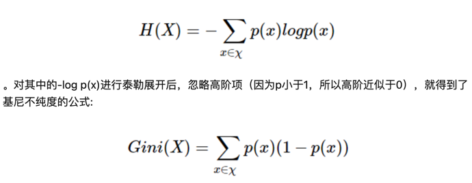
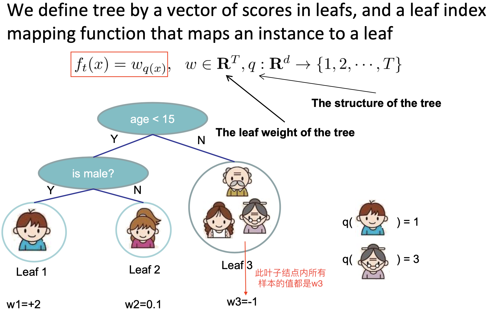
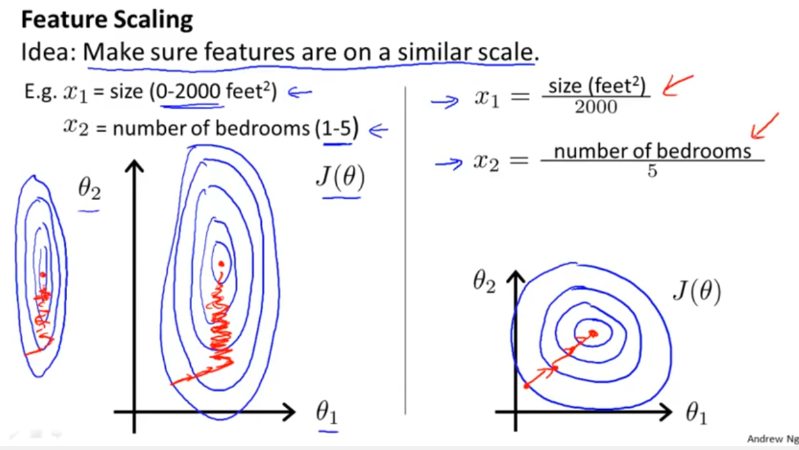
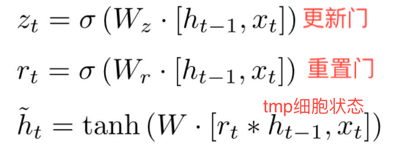

# 数学

## [泰勒展开](https://charlesliuyx.github.io/2018/02/16/%E3%80%90%E7%9B%B4%E8%A7%82%E8%AF%A6%E8%A7%A3%E3%80%91%E6%B3%B0%E5%8B%92%E7%BA%A7%E6%95%B0/)


## 假设检验

### H0/H1
```text
当我们的某个猜想难以直接验证的时候,我们通过证伪目标的互斥命题来间接达到目的.
比如,当我们想要验证新模型比旧模型效果更好,我们可以证伪新旧模型之间效果一致.
一般希望达成的目标称为备择假设H1, 与之对立的称为零假设H0. 
H0: 新旧模型效果一致.
H1: 新旧模型效果不一致.
```
### p-value
```text
当我们成功拒绝H0时,p-value是指多大概率我们做出了错误的决策,也称为第一类错误/假阳性.
如新冠肺炎每100个确诊的人里,有5个是被误诊的,那么假阳性率就是5%.
p-value越小,做出错误决策的概率越低.
```

## 基尼指数和熵


是在p(x)=1 处做泰勒展开


# 评估指标

## AUC

AUC是ROC曲线下的面积，反应的是模型对样本的排序能力，意义是从所有正样本随机抽取一个正样本，从所有负样本随机抽取一个负样本，当前score使得正样本排在负样本前面的概率。

1. ROC曲线
2. 


## GAUC

**动机**：传统的AUC反映的是整体样本间的一个排序能力，但是推荐领域要评估的是对于每个人的二分类结果的排序能力


# 机器学习

## 逻辑回归


> 称为对数几率回归的原因  


### 岭回归和Lasso


## 决策树

==树模型不需要归一化，归一化解决梯度下降过程中的等高线椭圆 导致迭代次数增多的问题，树模型不需要梯度下降==

离散值需要onehot

### 决策树生成

#### 信息增益（ID3）


>信息增益偏向于选出那些分叉多的特征

计算流程：

选择信息增益最大的特征，如最大信息增益小于事先制定的阈值，则返回叶子节点，类标记为多数样本的类标签。
否则，对此特征的**每一个取值**将数据切分成若干子集,即D_i是选出特征A=a_i时的样本集合。  
递归调用

#### 信息增益比（C4.5）

因为信息增益容易选取特征取值多的特征


### 决策树剪枝

#### 思想

剪枝通过极小化决策树的损失函数(等价于正则化的极大似然估计)  


> 其中C(T)表示模型对训练数据的拟合程度，|T|表示模型复杂度，\alpha是事先指定的值


> 其中|T|是叶子节点个数，N_t 是叶子t包含的样本数量，$ \alpha $>=0 为调节参数。
>
> ==物理意思为每个叶子结点的熵 + 叶子结点的个数。==

#### 剪枝流程（目标函数）

先建树再剪枝，剪枝由目标函数指导


### CART（二叉树）


#### 回归树(平方误差最小准则)


> ==切分变量和切分点(j,s)的求解一般选用启发式的算法==
>
> 每个节点的输出值是结点所有样本值的**均值**

#### 分类树（gini index）

基尼系数比熵的计算更加高效，不涉及log


> 二叉树，所以是否等于a，将数据集分割成两部分


#### CART剪枝


> 首先证明当alpha取g（t）  

==未完==


## Adaboost


Adaboost（Adaptive boosting）：改变训练样本权重来学习多个弱分类器并进行线性组合的过程

1. 在训练过程中如何改变训练样本的权重或者是概率分布
2. 如何将多个弱分类器组合成一个强分类器

## Random Forest（bagging）

### 特征重要性

思想：判断每个特征在随机森林中每个树上的贡献，最后取平均值，然后比较各特征贡献的大小，主要采用基尼指数、基于袋外数据

（1）基于基尼指数


（2）基于袋外数据

**思想：**用OOB（袋外数据做预测）：RF在重采样建立决策树时，会有一些样本没有被选中，利用这些样本去做交叉验证，或者不用做交叉验证，直接用oob_score去对模型性能做评估

**方法：**对每棵决策树，用OOB计算袋外数据误差，errOOB1；然后随机对OOB所有样本的**特征**加入**噪声干扰**，再次计算袋外数据误差，errOOB2；假设有N棵树，**特征i的重要性**为【sum（errOOB2-errOOB1）】/N

如果加入随机噪声后，袋外数据准确率大幅下降，说明这个特征对预测结果有很大的影响，说明他的重要性比较高

**【噪声干扰】：**随机改变第j列，其他列不变，对第j列进行随机的上下替换，E1-E2来刻画特征j的重要性

而该方法中涉及到的对数据进行打乱的方法通常有两种：

1）是使用uniform或者gaussian抽取随机值替换原特征；

2）是通过permutation的方式将原来的所有N个样本的第 i 个特征值重新打乱分布（相当于重新洗牌）


## GBDT（boosting）


## XGBoost（boosting）

1. XGB将回归和分类整合进了一套统一的目标函数

   

   > $l(y_i,\hat y_i)$ 可以是平方损失（回归），logistic loss（分类）

2. XGB通过拟合残差逼近目标值

   由于是tree模型，每轮的目标函数不能用SGD训练。训练采用 Additive Training (Boosting)


3. boosted方式概述（加入shrinkage抑制过拟合）

   

### 目标函数

#### **第`t`轮的原始目标函数**


#### **二阶泰勒展开**

注：相比GBDT基于`t-1`轮的预测值$y_{t-1}$处做一阶的泰勒展开，泰勒二阶近似比一阶近似更接近真实的Loss Fnction，优化的更彻底。


> $f(x) = l(y_i, \hat y^{(t-1)}) = (y_i - \hat y^{(t-1)})^2$

> $f(x+\Delta x) = l(y_i, \hat y^{(t-1)} + f_t(x_i)) = (y_i - (\hat y^{(t-1)} + f_t(x_i)))^2$

> Where： $x=\hat y^{(t-1)},  \Delta x = f_t(x_i)$

**去除常数项之后：**


#### **树的复杂度**

一些符号定义：

1. 每个叶子有一个打分**$w_j <==> f_f(x_i)$**, **如下图所示叶子三中的所有实例打分都为`-1`**
2. 一个将样本映射为叶子的mapping函数



**复杂度$\Omega$定义**


#### **第`t`轮的目标函数**


### 求解方法

#### 在树的结构固定时

优化此目标函数是一个二次函数求最值问题，最优解为$w_j^*=-G_j/(H_j+\lambda)$


#### 如何搜索树的结构

**定义增益指导分割**，在实践过程中增益还有**熵或基尼index**


线性扫描选择切分特征和分割点


### 关于剪枝


### [特征重要性](https://www.jianshu.com/p/2920c97e9e16)

xgboost实现中Booster类get_score方法输出特征重要性，其中*importance_type参数*支持三种特征重要性的计算方法：

- *importance_type=*weight，使用**特征在所有树中作为划分属性的次数**作为特征重要性度量。（默认值）

- *importance_type=*gain，    使用**特征在作为划分属性时loss平均的降低量**作为特征重要性度量。（常用）

  `gain = total_gain / weight`，

- *importance_type=*cover，  使用**特征在作为划分属性时对样本的覆盖度**作为特征重要性度量。

  `cover = total_cover / weight`，`total_cover`表示在所有树中，某特征在每次分裂节点时处理(覆盖)的所有样例的数量。

==注意区别随机森林特征重要性的计算==

### Q&A

#### **如何处理离散型特征**

One-hot之后直接拼到原始特征中，或统计后分桶再onehot或label encoding。

#### 为什么在稀疏特征上表现不好

1. 每次分裂Onehot特征时的选择不再是选择一个特征，而是一个特征的某一维。此时树的分割往往只考虑了少量特征，大部分特征用不到，少量的特征在多次重复用到，剩余的长尾基本用不到。模型容易过拟合。

2. GBDT容易因为训练集中个别样本的某个稀疏feature与y的偶然关系，拟合到噪声（用某一特征将训练集分至类别单一的叶子结点，无法再分），产生过拟合。

**和LR的比较**

LR每次随机选择batch个样本对w优化，特征=0（xi），则梯度=0，实则是用特征i不为0的样本对wi梯度下降。如果特征稀疏，则下降次数也少，不容易过度拟合。

⚠️注意：对于离散特征较多的情形（如用户的打车行为），xgb不太适合，但在分布稠密的数据集上，泛化能力和模型表达能力都很好。

#### **xgb的特征交叉体现在哪里**

多个子树分裂过程的特征选择可能不一致，后一个树在前一个树的基础上预测残差，相当于进行了特征交叉

#### **重复选择特征**

同一颗树多次分裂过程可以选择之前选过的特征

#### **[xgb的超参数](https://www.cnblogs.com/TimVerion/p/11436001.html)**


超参数是怎么选择的（超参数搜索）

Grid search、Random search

#### **关于并行计算**

xgboost的并行不是tree粒度的并行，xgboost的**并行是在每一层的分裂过程**上的，大致的过程是迭代叶子节点&特征，选择每个叶子结点的最有分裂特征和分裂节点，然后执行树的构建。

xgboost在训练之前，预先对特征的值进行排序，保存为block结构，后面的迭代中重复地使用这个结构，大大减小计算量。这个block结构也使得并行成为了可能，在进行节点的分裂时，需要计算每个特征的每个分割点对应的增益，最终选增益最大的那个特征去做分裂，**各个特征的增益计算可以开多线程进行**。

增益计算一般采用**贪心法枚举所有可能的分割点**，当数据无法一次载入内存或者在分布式情况下，贪心算法效率就会变得很低，所以xgboost还提出了一种**可并行的近似直方图算法**，用于高效地**生成候选的分割点**。

#### **Boosting和Bagging**

- Boosting能够提升弱分类器性能的原因是降低了偏差

  Boosting过程不断拟合残差，因此会降低偏差，另一方面，弱分类器之间是强相关的，缺乏独立性，并不会对降低方差有作用

- Bagging能够提高弱分类器性能的原因是降低了方差

  Bagging 是 Bootstrap Aggregating 的简称，意思就是再抽样，然后在每个样本上训练出来的模型取平均，此时模型是相互独立的，对*n*个独立不相关的模型的预测结果取平均， 方差是原来单个模型的1/*n*

#### **优点&缺点**

**优点**

- 可解释性和鲁棒性
- 能够自动发现特征间的高阶关系
- 不需要对数据进行特殊的预处理如归一 化

**缺点**

- 不适用高维稀疏的数据集
- 串行训练，只能在决策树内部采用一些局部并行的手段

#### XGB和GBDT的区别

1. 传统GBDT以CART作为基分类器，xgboost还支持线性分类器，这个时候xgboost相当于带L1和L2正则化项的逻辑斯蒂回归（分类问题）或者线性回归（回归问题）

2. 传统GBDT在优化时只用到一阶导数信息，xgboost则对代价函数进行了二阶泰勒展开，同时用到了一阶和二阶导数。xgboost工具支持自定义代价函数，只要函数可一阶和二阶求导。
3. 在使用CART作为基分类器时，XGBoost显式地加入了正则项来控制模 型的复杂度，有利于防止过拟合，从而提高模型的泛化能力。
4. 传统的GBDT在每轮迭代时使用全部的数据，XGBoost则采用了与随机 森林相似的策略，支持对数据进行采样。
5. xgboost在代价函数里加入了正则项，用于控制模型的复杂度
6. Shrinkage（缩减），相当于学习速率（xgboost中的eta）。xgboost在进行完一次迭代后，会将叶子节点的权重乘上该系数，主要是为了削弱每棵树的影响，让后面有更大的学习空间。
7. 列抽样（column subsampling）。xgboost借鉴了随机森林的做法，支持列抽样，不仅能降低过拟合，还能减少计算，这也是xgboost异于传统gbdt的一个特性。
8. 对缺失值的处理。对于特征的值有缺失的样本，xgboost可以自动学习出它的分裂方向。
9. 支持并行计算


# 深度学习

## [Batch-Normalization](https://www.cnblogs.com/shine-lee/p/11989612.html)

### [归一化](https://blog.csdn.net/blogshinelee/article/details/102875044)

#### 为什么要做特征归一化

1. 从距离计算考虑

   一个特征的变化范围可能是[ 1000 , 10000 ]，另一个特征的变化范围可能是[ − 0.1 , 0.2 ]，在进行距离有关的计算时，单位的不同会导致计算结果的不同，**尺度大的特征会起决定性作用，而尺度小的特征其作用可能会被忽略**，为了消除特征间单位和尺度差异的影响，以对每维特征同等看待，需要对特征进行归一化。

2. 从SGD过程考虑

   只要权重w与输入特征x 间是相乘关系，损失函数对w的偏导必然含有因子x，**w 的梯度下降速度就会受到特征x尺度的影响**，学习率不容易选择，下降过程也可能不稳定，通过scaling可对不同方向上的下降速度有所控制，使下降过程相对更稳定。
   以MSE为例，原始特征因尺度差异，其损失函数的等高线图可能是椭圆形，梯度方向垂直于等高线，下降会走 **zigzag** 路线，而不是指向local minimum。通过对特征进行zero-mean and unit-variance变换后，其损失函数的等高线图更接近圆形，梯度下降的方向震荡更小，收敛更快.



3. 从激活函数考虑

   采用sigmoid等有饱和区的激活函数，如果输入分布范围很广，参数初始化时没有适配好，很容易直接陷入饱和区，导致梯度消失，所以，需要对输入做Standardization或映射到[ 0 , 1 ] 、[ − 1 , 1 ] 配合参数初始化方法，对值域进行控制。

#### 归一化方法中的平移和尺度缩放

1. **减一个统计量**可以看成**选哪个值作为原点，是最小值还是均值，并将整个数据集平移到这个新的原点位置**。如果特征间偏置不同对后续过程有负面影响，则该操作是有益的，可以看成是某种**偏置无关操作**；如果原始特征值有特殊意义，比如稀疏性，该操作可能会破坏其稀疏性。

2. **除以一个统计量**可以看成在坐标轴方向上对特征进行缩放，用于降低特征尺度的影响，可以看成是某种**尺度无关操作**。缩放可以使用最大值最小值间的跨度，也可以使用标准差（到中心点的平均距离），前者对outliers敏感，outliers对后者影响与outliers数量和数据集大小有关，outliers越少数据集越大影响越小。

3. **除以自身模长**相当于把长度归一化，把所有样本映射到单位球上，可以看成是某种**长度无关操作**，比如，词频特征要移除文章长度的影响，图像处理中某些特征要移除光照强度的影响，以及方便计算余弦距离或内积相似度等。

#### 什么时候需要归一化

1. 涉及距离计算的算法

   比如K-means、KNN、PCA、SVM等。

   如PCA倾向于关注方差较大的特征所在的坐标轴方向，其他特征可能会被忽视，因此，在PCA前做Standardization效果可能更好。

2. 损失函数中含有**正则项**时

   正则项如$\lambda ||W||$, $\lambda$ 为超参数，**对每一个参数w施加同样的惩罚系数**，但对于某一维特征 $x_i$ 而言，其scale越大，系数 $w_i$ 越小，其在正则项中的比重就会变小，相当于其惩罚变小，即损失函数会相对忽视那些scale增大的特征，这并不合理，所以需要feature scaling，使损失函数平等看待每一维特征。

3. 涉及梯度下降的算法

   在梯度下降过程中，**所有参数维度共用同一个学习率**。收敛意味着在每个参数维度上都取得极小值，每个参数维度上的偏导数都为0，但是损失函数对w的偏导必然含有因子x，w 的梯度下降速度会受到特征x尺度的影响，为了每个维度上都能收敛，先将特征归一化，这样更容易选择到合适的学习率，使下降过程相对更稳定。（学习率可以取所有维度在当前位置合适步长中最小的那个（小学习率可以保证所有参数都收敛到local minimum）。


4. zero center与参数初始化相配合，缩短初始参数位置与local minimum间的距离，加快收敛。

   模型的最终参数是未知的，所以一般随机初始化，比如从0均值的均匀分布或高斯分布中采样得到，对线性模型而言，其分界面初始位置大致在原点附近，bias经常初始化为0，则分界面直接通过原点。同时，为了收敛，学习率不会很大。而每个数据集的特征分布是不一样的，如果其分布集中且距离原点较远，比如位于第一象限遥远的右上角，分界面可能需要花费很多步骤才能“爬到”数据集所在的位置。所以，无论什么数据集，先平移到原点，再配合参数初始化，可以保证分界面一定会穿过数据集。此外，outliers常分布在数据集的外围，与分界面从外部向内挪动相比，从中心区域开始挪动可能受outliers的影响更小。

#### 什么时候不需要归一化

与距离计算无关的模型，不需要feature scaling，比如Naive Bayes；决策树、随机森林等，树中节点的选择只关注当前特征在哪里切分对分类更好，即只在意特征内部的相对大小，而与特征间的相对大小无关。

### BN

#### 动机

以神经网络的某一层为考虑对象，其接受上一层的输入。在梯度下降的过程中，所有层的权重同时在不断更新，第一次backward过程中，调整此层的参数是在拟合上一层forward的输入，同时上一层的参数也会调整，然后在下一轮的forward的时候，由于上一层的参数进行了调整，其输出（后面一层的输入）相当于是一个新的分布，因此相当于后面这一层的激活层输入的分布会一直变化。在梯度下降的时候，每层权重的更新是在假定其他权重不变的情况下，向损失函数降低的方向调整自己，层之间缺乏默契，造成**Internal Covariate Shift** 现象，为了避免过于震荡，==学习率不得不设置得足够小，足够小就意味着学习缓慢==。为此，希望对每层输入的分布有所控制，于是就有了**Batch Normalization**。

**一个例子：**

假定当前输入𝑥1和𝑥2的分布如图中圆点所示，本次更新的方向是将直线H1更新成H2，本以为切分得不错，但是当前面层的权重更新完毕，当前层输入的分布换成了另外一番样子，直线相对输入分布的位置可能变成了H3，下一次更新又要根据新的分布重新调整。**直线调整了位置，输入分布又在发生变化，直线再调整位置，就像是直线和分布之间的“追逐游戏”。**


#### BN计算流程


> 无论𝑥𝑖原本的均值和方差是多少，通过BatchNorm后其均值和方差分别变为待学习的𝛽和𝛾

#### BN的反向传播


#### BN预测阶段使用的参数

在预测阶段，所有参数的取值是固定的，对BN层而言，意味着𝜇、𝜎、𝛾、𝛽都是固定值。其中𝜇、𝜎不用 批量预测数据的 𝜇、𝜎 的原因是因为：当只输入一个样本的时候，𝜎 无法确定。故**采用训练收敛最后几批mini batch的 𝜇和𝜎的期望，作为预测阶段的𝜇和𝜎**

#### BN添加的位置

对于**有饱和区域的激活函数**来说，其输入可能无法一直保持zero mean unit variance分布，有梯度消失和梯度爆炸的可能。对于此类激活函数，一般建议BN放在激活层之前


对于RELU，前后均可

#### BN的作用

- **可以使用更大的学习率**，训练过程更加稳定，极大提高了训练速度。（BN发表之前，为了减少震荡，选择小的lr）
- **可以将bias置为0**，因为Batch Normalization的Standardization过程相当于移除了偏置量，所以不再需要bias。
- **对权重初始化不再敏感**，通常权重采样自0均值某方差的高斯分布，以往对高斯分布的方差设置十分重要，有了Batch Normalization后，对与同一个输出节点相连的权重进行放缩，其标准差𝜎也会放缩同样的倍数，相除抵消。
- **对权重的尺度不再敏感**，理由同上，尺度统一由𝛾参数控制，在训练中决定。
- 深层网络可以使用sigmoid和tanh了，理由同上，BN抑制了梯度消失。
- **Batch Normalization具有某种正则作用，不需要太依赖dropout，减少过拟合**。

#### Scale and shift需要吗？

直觉上理解，**浅层模型中，只需要模型适应数据分布即可**。对深度神经网络，每层的输入分布和权重要相互协调，强制把分布限制在zero mean unit variance并不见得是最好的选择，加入参数𝛾和𝛽，对输入进行scale and shift，**有利于分布与权重的相互协调**，特别地，令𝛾=1,𝛽=0等价于只用Standardization，令𝛾=𝜎,𝛽=𝜇等价于没有BN层，scale and shift涵盖了这2种特殊情况，在训练过程中决定什么样的分布是适合的，所以使用scale and shift增强了网络的表达能力。


## 循环神经网络


### RNN


### [LSTM](https://zhuanlan.zhihu.com/p/199389873)


>**其中的*是元素积**
>
>遗忘门: 控制前一步记忆单元中的信息有多大程度被遗忘掉;
>
>输入门: 控制当前计算的新状态以多大程度**更新**到记忆单元;
>
>输出门: 控制当前的输出有多大程度上取决于当前的记忆单元。


### GRU





>重置门: 计算当前temp cell state的时候对前一个隐状态做一个过滤
>
>更新门: 调节当前temp cell state和前一个隐状态的tread off。
>
>如果我们将重置门设置为 1，更新门设置为 0，那么我们将再次获得标准 RNN 模型。

使用门控机制学习长期依赖关系的基本思想和 LSTM 一致，但还是有一些关键区别：

- GRU 有两个门（重置门与更新门），而 LSTM 有三个门（输入门、遗忘门和输出门）。
- GRU 并不会控制并保留内部记忆（c_t），且没有 LSTM 中的输出门。
- LSTM 中的输入与遗忘门对应于 GRU 的更新门，重置门直接作用于前面的隐藏状态。
- 在计算输出时并不应用二阶非线性。


## Attention and Transformer

### attention

### self-attention


### Transformer


## BERT

